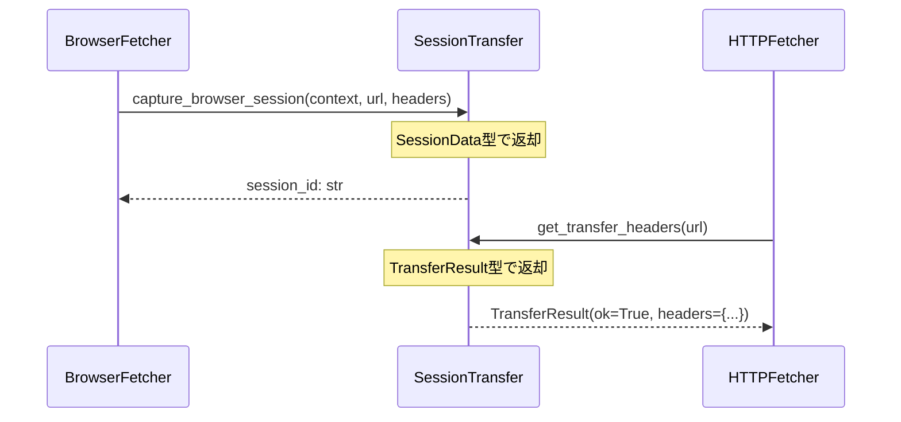

# モジュール間連動設計ルール

## 目的

バイブコーディングで生じる「モジュール間の連動ができておらず、全体として機能するプロダクトになっていない」問題を解決するため、以下の3ステップを必須とする。

## 実装前の必須確認事項

**重要**: 実装を開始する前に、以下の確認を必ず行うこと。

### 0.1. 仕様書の確認

1. **docs/requirements.mdの該当セクションを確認**
   - 実装対象機能に関連するセクションを特定
   - 仕様の要件を正確に理解する
   - 関連する非機能要件（セキュリティ、パフォーマンス等）も確認

2. **準拠性チェック**
   - 実装案が仕様書の要件を満たしているか確認
   - 仕様書に明記されていない動作を追加しない
   - 仕様書と矛盾する実装を避ける

### 0.2. コードベースの理解

1. **関連モジュールの調査**
   - 実装対象機能に関連する既存コードを調査
   - 類似機能の実装パターンを確認
   - 既存のインターフェースやデータ構造を理解

2. **依存関係の確認**
   - 使用するモジュールの依存関係を確認
   - 循環依存がないか確認
   - 既存のユーティリティ関数を活用できるか確認

3. **一貫性の確認**
   - 既存コードとの命名規則の一貫性
   - 既存コードとのエラーハンドリングパターンの一貫性
   - 既存コードとのログ出力形式の一貫性

### 0.3. コーディング規約の確認

1. **コメントの言語**
   - **コード中のコメントは英語で統一する**（`.cursor/rules/v5.mdc`に準拠）
   - 日本語コメントは禁止（docstringも英語）

2. **実装計画書の章番号**
   - コメントに実装計画書の章番号（`§X.X.X`形式）を含めない
   - 仕様書の参照が必要な場合は、機能名や要件の説明で代替

3. **docstringの形式**
   - GoogleスタイルまたはNumPyスタイルに準拠
   - 英語で記述
   - 引数・戻り値・例外を明記

## 3ステップ設計プロセス

### ステップ1: 「デバッグ前のシーケンス図」の作成

**目的**: バグの可視化。データの型と非同期処理を図に含める。

**作成内容**:
1. **対象モジュール間のシーケンス図**を作成
   - 呼び出し元 → 呼び出し先の時系列
   - データの受け渡し（引数・戻り値）
   - 非同期処理（`async`/`await`）の明示
   - エラーハンドリングの流れ

2. **データ型の明示**
   - 各データ受け渡しポイントで型を明記
   - `dict[str, Any]`のような曖昧な型は避ける
   - Pydanticモデルを使用する場合は明記

3. **保存場所**
   - `docs/sequences/` ディレクトリに保存
   - ファイル名: `{module1}_{module2}_flow.mmd` (Mermaid形式)
   - または `docs/sequences/{feature}_flow.md` (Markdown + Mermaid)

**例**:


### ステップ2: データ受け渡し部分の型定義（Pydantic）

**目的**: ルールの明確化。モジュール間の契約を型で定義する。

**作成内容**:
1. **Pydanticモデルの定義**
   - モジュール間で受け渡すデータ構造をPydanticモデルで定義
   - `src/{module}/schemas.py` または `src/{module}/models.py` に配置
   - 既存の`dataclass`は可能な限りPydanticモデルに移行

2. **必須フィールド**
   - `Field(..., description="...")` で説明を付与
   - バリデーションルールを明記
   - デフォルト値の明示

3. **型の一貫性**
   - 同じデータ構造は同じモデルを使用
   - モジュール間で型を共有（`from src.module.schemas import Model`）

**例**:
```python
from pydantic import BaseModel, Field
from typing import Optional

class SessionTransferRequest(BaseModel):
    """Request for session transfer between browser and HTTP client."""
    url: str = Field(..., description="Target URL")
    include_conditional: bool = Field(default=True, description="Include ETag/Last-Modified headers")
    
class TransferResult(BaseModel):
    """Result of session transfer operation."""
    ok: bool = Field(..., description="Whether transfer succeeded")
    session_id: Optional[str] = Field(None, description="Session ID if available")
    headers: dict[str, str] = Field(default_factory=dict, description="Transfer headers")
```

### ステップ3: デバッグ用一直線スクリプトの作成

**目的**: 各個撃破。エラーが出た箇所を一つずつ潰す。

**作成内容**:
1. **一直線スクリプトの作成**
   - `tests/scripts/debug_{feature}_flow.py` に配置
   - モジュール間のデータフローを一直線で実行
   - 各ステップでデータの型・内容を検証

2. **検証ポイント**
   - 各モジュール間のデータ受け渡しで型チェック
   - 非同期処理の完了確認
   - エラー時の詳細ログ出力

3. **実行方法**
   ```bash
   # デバッグスクリプト実行
   python tests/scripts/debug_{feature}_flow.py
   
   # エラーが出た箇所を特定し、修正
   # 修正後、再実行して次のエラーを確認
   ```

**例**:
```python
#!/usr/bin/env python3
"""
デバッグ用一直線スクリプト: セッション転送フロー

このスクリプトは、BrowserFetcher → SessionTransfer → HTTPFetcher の
データフローを一直線で実行し、各ステップでエラーを検出する。
"""

import asyncio
from src.crawler.fetcher import BrowserFetcher
from src.crawler.session_transfer import get_transfer_headers
from src.crawler.fetcher import HTTPFetcher

async def main():
    url = "https://example.com"
    
    # Step 1: BrowserFetcherで取得
    print(f"[Step 1] BrowserFetcher.fetch({url})")
    browser_fetcher = BrowserFetcher()
    browser_result = await browser_fetcher.fetch(url)
    
    # 型チェック
    assert hasattr(browser_result, 'ok'), "FetchResult should have 'ok' attribute"
    print(f"  ✓ BrowserFetcher returned: ok={browser_result.ok}")
    
    # Step 2: SessionTransferでセッション取得
    print(f"[Step 2] get_transfer_headers({url})")
    transfer_result = get_transfer_headers(url)
    
    # 型チェック
    assert hasattr(transfer_result, 'ok'), "TransferResult should have 'ok' attribute"
    assert isinstance(transfer_result.headers, dict), "headers should be dict"
    print(f"  ✓ SessionTransfer returned: ok={transfer_result.ok}, headers={len(transfer_result.headers)}")
    
    # Step 3: HTTPFetcherでセッション転送ヘッダー適用
    print(f"[Step 3] HTTPFetcher.fetch({url}) with transfer headers")
    http_fetcher = HTTPFetcher()
    http_result = await http_fetcher.fetch(url, headers=transfer_result.headers)
    
    # 型チェック
    assert hasattr(http_result, 'ok'), "FetchResult should have 'ok' attribute"
    print(f"  ✓ HTTPFetcher returned: ok={http_result.ok}")
    
    print("\n✓ All steps passed!")

if __name__ == "__main__":
    asyncio.run(main())
```

### ステップ4: 「デバッグ後のシーケンス図」の作成

**目的**: ドキュメントの整備。
**作成内容**: ステップ1と同様。

## チェックリスト

### 実装前チェック

- [ ] **仕様書確認**: `docs/requirements.md`の該当セクションを確認し、要件を理解した
- [ ] **コードベース理解**: 関連モジュールの既存実装を調査し、パターンを理解した
- [ ] **依存関係確認**: 使用するモジュールの依存関係を確認し、循環依存がないことを確認した
- [ ] **コーディング規約確認**: コメントは英語で統一、実装計画書の章番号を含めないことを確認した

### 設計・実装チェック

- [ ] **データフローシーケンス図**: `docs/sequences/`に保存した
- [ ] **Pydanticモデル**: `src/{module}/schemas.py`に定義した
- [ ] **デバッグスクリプト**: `tests/scripts/debug_{feature}_flow.py`を作成した
- [ ] **デバッグスクリプト実行**: エラーがないことを確認した
- [ ] **型チェック**: `mypy`で型チェックが通ることを確認した

### 実装後チェック

- [ ] **仕様準拠性**: 実装が`docs/requirements.md`の要件を満たしていることを確認した
- [ ] **コメント言語**: すべてのコメントが英語であることを確認した
- [ ] **章番号削除**: コメントから実装計画書の章番号（`§X.X.X`）を削除した
- [ ] **一貫性**: 既存コードとの命名規則・パターンが一貫していることを確認した
- [ ] **Lintエラー**: `read_lints`でエラーがないことを確認した

## 実装時の注意事項

### 仕様書準拠の徹底

- **実装前に必ず`docs/requirements.md`を確認**: 該当セクションを読み、要件を正確に理解する
- **仕様違反の早期発見**: 実装中に仕様書と矛盾する点を発見した場合は、実装を中断し確認する
- **準拠性の自己チェック**: 実装完了後、仕様書の要件を満たしているか再確認する

### コメントの品質

- **英語で統一**: すべてのコメント（インラインコメント、docstring）は英語で記述
- **実装計画書の章番号を含めない**: `§3.6.1`のような形式はコメントに含めない
- **仕様参照の代替**: 仕様書の参照が必要な場合は、機能名や要件の説明で代替
- **明確性**: コメントは「なぜ」を説明し、「何を」はコードから読み取れるようにする

### コードベース理解の重要性

- **既存パターンの活用**: 類似機能の実装パターンを調査し、一貫性を保つ
- **既存ユーティリティの活用**: 既存の関数やクラスを再利用し、重複を避ける
- **命名規則の一貫性**: 既存コードの命名規則に従う

## 関連ルール

- コード実行時: @.cursor/rules/code-execution.mdc
- リファクタ関連: @.cursor/rules/refactoring.mdc
- テスト関連: @.cursor/rules/test-strategy.mdc
- コーディング支援: @.cursor/rules/v5.mdc（コメントは英語で統一）
