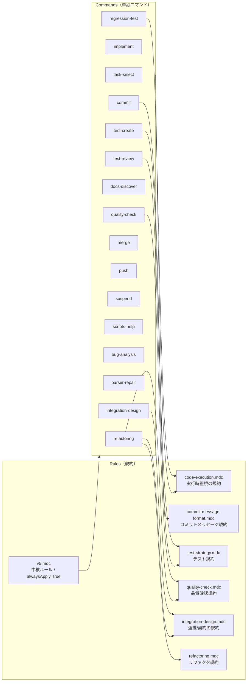

# Cursor Rules / Commands（体系図）

Lyra 開発で使用する Cursor カスタムコマンドと rules（規約）を **「規約 → 単独コマンド」**の二層で整理したドキュメント。

## 方針（規約と手順の分離）

- **rules（`@.cursor/rules/*.mdc`）**: 規約（ポリシー/禁止事項/完了条件/行動原則）
  - 原則として **日本語**
- **commands（`@.cursor/commands/*.md`）**: 手順（やること、出力物、推奨コマンド例）
  - 原則として **英語**

## 全体像（規約 - 単独コマンド）



> 注: 図は “依存/参照の関係性” を示す（コマンド間の自動遷移やマクロ実行を意味しない）。

## 単独コマンド（`@.cursor/commands/*.md`）

### 開発（推奨シーケンス）

> 注: これは「よくある順番」のメモ。自動で連続実行されるものではない。

| コマンド | 役割 | 主に参照する規約（rules） |
|---------|------|---------------------------|
| `/task-select` | タスク選定とブランチ作成 | `code-execution.mdc` |
| `/implement` | 実装（テストは別） | `code-execution.mdc`, `refactoring.mdc` |
| `/test-create` | テスト作成 | `test-strategy.mdc`, `code-execution.mdc` |
| `/test-review` | テスト品質レビュー | `test-strategy.mdc`, `code-execution.mdc` |
| `/quality-check` | lint/format/type の実行 | `quality-check.mdc`, `code-execution.mdc` |
| `/regression-test` | 全テスト実行 | `code-execution.mdc` |
| `/commit` | コミット（非対話型） | `commit-message-format.mdc` |
| `/merge` | mainマージ | （必要に応じて）`code-execution.mdc` |
| `/push` | main を origin/main へプッシュ | `code-execution.mdc` |
| `/suspend` | 中断＋WIPコミット | （必要に応じて）`commit-message-format.mdc` |

### デバッグ

| コマンド | 役割 | 主に参照する規約（rules） |
|---------|------|---------------------------|
| `/bug-analysis` | 一般的なバグ調査→修正→検証 | `code-execution.mdc`, `refactoring.mdc` |
| `/parser-repair` | パーサ/セレクタ修正 | `code-execution.mdc` |
| `/integration-design` | モジュール間連携（契約/型/フロー）設計と検証 | `integration-design.mdc`, `code-execution.mdc` |

### リファクタ

| コマンド | 役割 | 主に参照する規約（rules） |
|---------|------|---------------------------|
| `/refactoring` | 影響範囲→計画→適用→検証（Mode A/B） | `refactoring.mdc`, `quality-check.mdc`, `code-execution.mdc` |

### リファレンス

| コマンド | 役割 |
|---------|------|
| `/scripts-help` | `scripts/*.sh` の使い方 |
| `/docs-discover` | 関連ドキュメントの特定と更新（添付docsだけに限定しない） |

## ルール（規約 / `@.cursor/rules/*.mdc`）

| ルール | alwaysApply | 役割 | 主な参照元（commands） |
|-------|------------:|------|------------------------|
| `v5.mdc` | ✅ | 中核ルール（常時適用） | （暗黙に全体へ） |
| `code-execution.mdc` | ❌ | 実行時監視/長時間処理の扱い | 多数（実行系ほぼ全て） |
| `commit-message-format.mdc` | ❌ | コミットメッセージ規約 | `commit`, `suspend` |
| `test-strategy.mdc` | ❌ | テスト規約（観点表、G/W/T、異常系>=正常系など） | `test-create`, `test-review` |
| `quality-check.mdc` | ❌ | 品質確認規約（禁止事項/DoD） | `quality-check`, `refactoring` |
| `integration-design.mdc` | ❌ | 連携/契約/型/フローの規約 | `integration-design`, `refactoring` |
| `refactoring.mdc` | ❌ | リファクタ規約（DoD/禁止） | `refactoring`, `implement`, `bug-analysis` |

## 運用メモ

- **入口は単独コマンド**（`/task-select` など）を状況に応じて選ぶ。
- **よくある切り替え**:
  - デバッグが構造問題に見えてきたら `/refactoring` や `/integration-design` に寄せる。
  - 設計/整理の途中で再現・根拠が必要になったら `/bug-analysis` に戻る。
- **誤実行防止**: 本ドキュメント内の `/...` 実行例はコードブロックに置く。

## 使い方（例）

```bash
# 開発（例）
/task-select
/implement
/test-create
/test-review
/quality-check
/regression-test
/commit

# マージ
/merge
```
