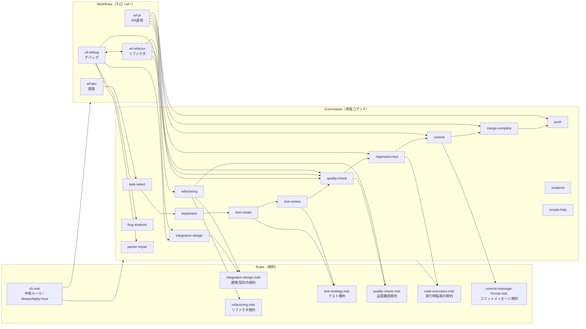

# Cursor Rules / Workflows / Commands（体系図）

Lyra 開発で使用する Cursor カスタムコマンドと rules（規約）を **「規約 → ワークフロー → 単独コマンド」**の三層で整理したドキュメント。

## 方針（規約と手順の分離）

- **rules（`@.cursor/rules/*.mdc`）**: 規約（ポリシー/禁止事項/完了条件/行動原則）
  - 原則として **日本語**
- **commands（`@.cursor/commands/*.md`）**: 手順（やること、出力物、推奨コマンド例）
  - 原則として **英語**
- **workflows（`wf-*.md`）**: 入口（オーケストレーター）。状況を分類し、Plan(To-do)を組み立てる。
  - **自動遷移しない**（実行提案は `NEXT_COMMAND: /...` として提示）

## 全体像（規約 - ワークフロー - 単独コマンド）



> 注: 図は “依存/参照の関係性” を示す。実際のワークフローでは状況に応じて To-do を組み替える。

## ワークフロー（入口 / wf-*）

| コマンド | 目的 | 主要な分岐/特徴 | 典型的な次アクション（提案） |
|---------|------|------------------|------------------------------|
| `/wf-dev` | 開発（タスク選定→実装→テスト→品質→回帰→コミット→マージ→プッシュ） | 標準パイプライン | `NEXT_COMMAND: /task-select` |
| `/wf-debug` | デバッグ（原因特定→修正→検証） | A/B/C分類（連携/一般バグ/パーサ）＋ **`wf-refactor` へのハンドオフ** | `NEXT_COMMAND: /bug-analysis` 等 / `NEXT_COMMAND: /wf-refactor` |
| `/wf-refactor` | リファクタ（構造改善） | Mode A/B（契約/境界の整理 vs 肥大化分割）＋ **`wf-debug` へのハンドオフ** | `NEXT_COMMAND: /refactoring` / `NEXT_COMMAND: /integration-design` |
| `/wf-pr` | PR運用（レビュー→品質/回帰→判断→（承認後）マージ/プッシュ） | Scenario A/B（未マージPR vs 既マージ未プッシュ） | `NEXT_COMMAND: /quality-check` |

## 単独コマンド（`@.cursor/commands/*.md`）

### 開発（`wf-dev` の部品）

| コマンド | 役割 | 主に参照する規約（rules） |
|---------|------|---------------------------|
| `/task-select` | タスク選定とブランチ作成 | `code-execution.mdc` |
| `/implement` | 実装（テストは別） | `code-execution.mdc`, `refactoring.mdc` |
| `/test-create` | テスト作成 | `test-strategy.mdc`, `code-execution.mdc` |
| `/test-review` | テスト品質レビュー | `test-strategy.mdc`, `code-execution.mdc` |
| `/quality-check` | lint/format/type の実行 | `quality-check.mdc`, `code-execution.mdc` |
| `/regression-test` | 全テスト実行 | `code-execution.mdc` |
| `/commit` | コミット（非対話型） | `commit-message-format.mdc` |
| `/merge-complete` | mainマージ＋完了報告（計画書更新含む） | （必要に応じて）`code-execution.mdc` |
| `/push` | main を origin/main へプッシュ | `code-execution.mdc` |
| `/suspend` | 中断＋WIPコミット | （必要に応じて）`commit-message-format.mdc` |

### デバッグ（`wf-debug` の部品）

| コマンド | 役割 | 主に参照する規約（rules） |
|---------|------|---------------------------|
| `/bug-analysis` | 一般的なバグ調査→修正→検証 | `code-execution.mdc`, `refactoring.mdc` |
| `/parser-repair` | パーサ/セレクタ修正 | `code-execution.mdc` |
| `/integration-design` | モジュール間連携（契約/型/フロー）設計と検証 | `integration-design.mdc`, `code-execution.mdc` |

### リファクタ（`wf-refactor` の部品）

| コマンド | 役割 | 主に参照する規約（rules） |
|---------|------|---------------------------|
| `/refactoring` | 影響範囲→計画→適用→検証（Mode A/B） | `refactoring.mdc`, `quality-check.mdc`, `code-execution.mdc` |

### リファレンス

| コマンド | 役割 |
|---------|------|
| `/scripts-help` | `scripts/*.sh` の使い方 |

## ルール（規約 / `@.cursor/rules/*.mdc`）

| ルール | alwaysApply | 役割 | 主な参照元（commands） |
|-------|------------:|------|------------------------|
| `v5.mdc` | ✅ | 中核ルール（常時適用） | （暗黙に全体へ） |
| `code-execution.mdc` | ❌ | 実行時監視/長時間処理の扱い | 多数（実行系ほぼ全て） |
| `commit-message-format.mdc` | ❌ | コミットメッセージ規約 | `commit`, `wf-dev`, `wf-pr` |
| `test-strategy.mdc` | ❌ | テスト規約（観点表、G/W/T、異常系>=正常系など） | `test-create`, `test-review`, `wf-dev`, `wf-pr` |
| `quality-check.mdc` | ❌ | 品質確認規約（禁止事項/DoD） | `quality-check`, `wf-refactor`, `refactoring` |
| `integration-design.mdc` | ❌ | 連携/契約/型/フローの規約 | `integration-design`, `wf-debug`, `wf-refactor`, `refactoring` |
| `refactoring.mdc` | ❌ | リファクタ規約（DoD/禁止） | `refactoring`, `wf-dev`, `wf-debug`, `wf-refactor`, `implement`, `bug-analysis` |

## 運用メモ

- **入口は wf-*** を推奨（状況整理→Plan(To-do)の作成が主目的）。
- **ハンドオフ**:
  - `wf-debug` → `wf-refactor`: 局所修正では再発しそう/境界が曖昧/分割が必要、など。
  - `wf-refactor` → `wf-debug`: 再現や根拠が薄く、まず原因特定が必要、など。
- **誤実行防止**: 本ドキュメント内の `/...` 実行例はコードブロックに置く。

## 使い方（例）

```bash
# 開発
/wf-dev

# デバッグ
/wf-debug

# リファクタ
/wf-refactor

# PR運用
/wf-pr
```
