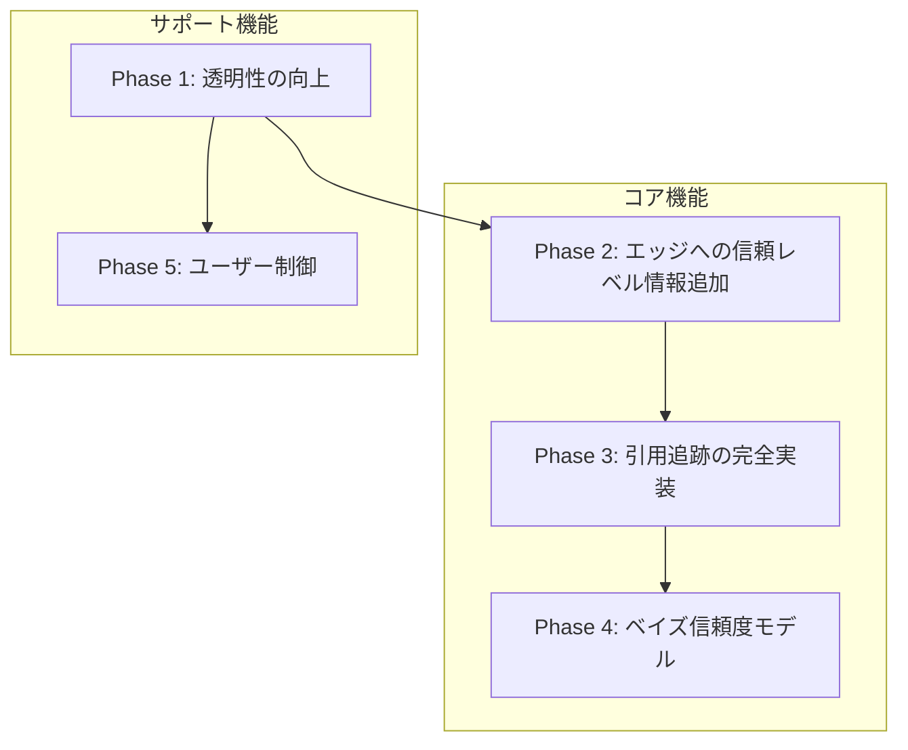

# Evidence System Design

このドキュメントでは、Lyraのエビデンスシステム（検索・評価・信頼度計算）の設計、現状、課題、および改善提案を記述する。

## 目次

1. [用語定義](#用語定義)
2. [現状の設計](#現状の設計)
3. [処理フロー（シーケンス図）](#処理フローシーケンス図)
4. [課題と問題点](#課題と問題点)
5. [関連する学術的フレームワーク](#関連する学術的フレームワーク)
6. [改善提案](#改善提案)
7. [実装ロードマップ](#実装ロードマップ)

---

## 用語定義

### 主要概念

| 用語 | 英語 | 定義 |
|------|------|------|
| **信頼度** | Confidence | 主張が正しい確率の期待値。ベイズ更新により計算。ドメイン分類に依存しない |
| **不確実性** | Uncertainty | 信頼度の不確実さ。エビデンス量が少ないと高い |
| **論争度** | Controversy | 支持と反論が拮抗している度合い |
| **ドメイン分類** | Trust Level | ソースドメインの事前分類（PRIMARY〜BLOCKED）。ランキングのみに使用 |

### エビデンスグラフ関連

| 用語 | 定義 |
|------|------|
| **主張 (Claim)** | 検証対象の事実的主張。エビデンスグラフのノード |
| **フラグメント (Fragment)** | ソースから抽出されたテキスト断片。エッジの起点 |
| **エッジ (Edge)** | 主張とフラグメント間の関係（SUPPORTS/REFUTES/NEUTRAL） |
| **エッジ信頼度** | NLIモデルが出力する関係の確信度（0.0-1.0） |
| **独立ソース数** | 主張を裏付けるユニークなソース（PAGE）の数 |

### ベイズ信頼度モデル（提案）

| 用語 | 定義 |
|------|------|
| **α (alpha)** | 支持エビデンスの累積。事前値1 + SUPPORTSエッジの重み付き合計 |
| **β (beta)** | 反論エビデンスの累積。事前値1 + REFUTESエッジの重み付き合計 |
| **事後分布** | Beta(α, β)。信頼度と不確実性を導出する確率分布 |

### 設計原則

```
信頼度 = f(エビデンス量, エビデンス質)
       ≠ f(ドメイン分類)

ドメイン分類 = ランキング調整のみに使用
             = 高推論AIへの参考情報（エッジに付与）
             ≠ 信頼度計算への入力
```

**根拠**: ドメインが何であれ誤った情報は存在する（再現性危機、論文撤回、ハゲタカジャーナル）。信頼度はエビデンスの量と質のみで決定すべき。

---

## 現状の設計

### Trust Level 定義

ソースのドメインに対して以下の信頼レベルを割り当てる（`src/utils/domain_policy.py`）:

| レベル | 説明 | 重み係数 |
|--------|------|:--------:|
| `PRIMARY` | 標準化団体・レジストリ (iso.org, ietf.org) | 1.0 |
| `GOVERNMENT` | 政府機関 (.go.jp, .gov) | 0.95 |
| `ACADEMIC` | 学術機関 (arxiv.org, pubmed.gov) | 0.90 |
| `TRUSTED` | 信頼メディア・ナレッジベース (専門誌等) | 0.75 |
| `LOW` | L6検証により昇格（UNVERIFIED→LOW）、または Wikipedia | 0.40 |
| `UNVERIFIED` | 未知のドメイン（デフォルト） | 0.30 |
| `BLOCKED` | 除外（矛盾検出/危険パターン） | 0.0 |

**注**: この重み係数は**ランキング時のスコア調整**に使用される（`ranking.py`）。主張の信頼度（confidence）計算には使用しない。信頼度はベイズ更新により計算する（§提案6、§決定7参照）。

### 割り当てフロー

```
┌─────────────────────────────────────────────────────────────┐
│ 1. config/domains.yaml (allowlist)                          │
│    → 事前定義されたドメインに固定レベルを付与                   │
└─────────────────────────────────────────────────────────────┘
                              ↓ 該当なし
┌─────────────────────────────────────────────────────────────┐
│ 2. デフォルト: UNVERIFIED                                    │
│    → 未知ドメインは暫定採用                                    │
└─────────────────────────────────────────────────────────────┘
                              ↓ L6検証
┌─────────────────────────────────────────────────────────────┐
│ 3. L6 Source Verification (src/filter/source_verification.py)│
│                                                              │
│    昇格条件: ≥2 独立ソースで裏付け → LOW                       │
│    降格条件:                                                  │
│      - 矛盾検出 (UNVERIFIED のみ) → BLOCKED                   │
│      - rejection_rate > 30% (UNVERIFIED/LOW) → BLOCKED       │
│                                                              │
│    TRUSTED以上: REJECTED マークのみ（自動降格なし）            │
└─────────────────────────────────────────────────────────────┘
```

### 現在の矛盾検出ロジック

`source_verification.py:294`:
```python
if has_contradictions or refuting_count > 0:
    if original_trust_level == TrustLevel.UNVERIFIED:
        return (REJECTED, BLOCKED, DEMOTED, "Contradiction detected")
```

**問題**: `refuting_count > 0` で即座にREJECTED/BLOCKEDとなる。

---

## 処理フロー（シーケンス図）

### 現状のフロー

```
┌─────────┐     ┌─────────┐     ┌──────────────┐     ┌─────────────┐     ┌──────────────┐     ┌──────────────┐
│Cursor AI│     │   MCP   │     │  Pipeline    │     │Academic API │     │   Browser    │     │  ML Server   │
│         │     │ Server  │     │              │     │(S2/OpenAlex)│     │  (Playwright)│     │(lyra-ml)     │
└────┬────┘     └────┬────┘     └──────┬───────┘     └──────┬──────┘     └──────┬───────┘     └──────┬───────┘
     │               │                  │                    │                   │                   │
     │ create_task   │                  │                    │                   │                   │
     │──────────────>│                  │                    │                   │                   │
     │   task_id     │                  │                    │                   │                   │
     │<──────────────│                  │                    │                   │                   │
     │               │                  │                    │                   │                   │
     │ search(query) │                  │                    │                   │                   │
     │──────────────>│                  │                    │                   │                   │
     │               │                  │                    │                   │                   │
     │               │ _is_academic_query()?                 │                   │                   │
     │               │─────────────────>│                    │                   │                   │
     │               │                  │                    │                   │                   │
     │               │    ┌─────────────┴─────────────┐      │                   │                   │
     │               │    │ アカデミック: Yes         │      │                   │                   │
     │               │    │  → 並列検索              │      │                   │                   │
     │               │    │ アカデミック: No          │      │                   │                   │
     │               │    │  → ブラウザのみ          │      │                   │                   │
     │               │    └─────────────┬─────────────┘      │                   │                   │
     │               │                  │                    │                   │                   │
     │               │  [アカデミッククエリの場合]            │                   │                   │
     │               │                  │ search(query)      │                   │                   │
     │               │                  │───────────────────>│                   │                   │
     │               │                  │                    │                   │                   │
     │               │                  │ search_serp(query) │                   │                   │
     │               │                  │───────────────────────────────────────>│                   │
     │               │                  │                    │                   │                   │
     │               │                  │    Papers[]        │                   │                   │
     │               │                  │<───────────────────│                   │                   │
     │               │                  │                    │   SERP items[]    │                   │
     │               │                  │<───────────────────────────────────────│                   │
     │               │                  │                    │                   │                   │
     │               │                  │ ┌──────────────────┴───────────────────┴───────────────────┐
     │               │                  │ │ Phase 2-4: 統合・重複排除                               │
     │               │                  │ │  - 識別子抽出 (DOI/PMID/ArXiv)                          │
     │               │                  │ │  - CanonicalPaperIndex で統合                           │
     │               │                  │ └──────────────────┬───────────────────────────────────────┘
     │               │                  │                    │                   │                   │
     │               │                  │ ┌──────────────────┴───────────────────┐                   │
     │               │                  │ │ Phase 5: Abstract Only               │                   │
     │               │                  │ │  - abstractあり → pages保存          │                   │
     │               │                  │ │  - abstractなし → 未処理 ⚠️          │                   │
     │               │                  │ └──────────────────┬───────────────────┘                   │
     │               │                  │                    │                   │                   │
     │               │                  │ ┌──────────────────┴───────────────────┐                   │
     │               │                  │ │ Phase 6: 引用グラフ (Top 5のみ) ⚠️   │                   │
     │               │                  │ │  - get_citation_graph (S2のみ)       │                   │
     │               │                  │ │  - related_papers はpagesに追加されない│                   │
     │               │                  │ │  - エッジがスキップされる             │                   │
     │               │                  │ └──────────────────┬───────────────────┘                   │
     │               │                  │                    │                   │                   │
     │               │                  │ ┌──────────────────────────────────────────────────────────┐
     │               │                  │ │ Ranking: 3段階ランキング (filter/ranking.py)           │
     │               │                  │ │  ┌──────────────────────────────────────────────────────┐│
     │               │                  │ │  │ Stage 1: BM25 (粗フィルタ)                          ││
     │               │                  │ │  │   → 全passagesをトークン化、スコア計算              ││
     │               │                  │ │  │   → 上位100件を抽出                                 ││
     │               │                  │ │  └──────────────────────────────────────────────────────┘│
     │               │                  │ │  ┌──────────────────────────────────────────────────────┐│
     │               │                  │ │  │ Stage 2: Embedding (セマンティック類似度)           ││
     │               │                  │ │  │   → query + docs をエンコード ─────────────────────>││────> ML Server
     │               │                  │ │  │   ← embeddings[] <───────────────────────────────────││<──── /embed
     │               │                  │ │  │   → cosine similarity 計算                          ││
     │               │                  │ │  │   → 0.3*BM25 + 0.7*Embed でスコア合成               ││
     │               │                  │ │  └──────────────────────────────────────────────────────┘│
     │               │                  │ │  ┌──────────────────────────────────────────────────────┐│
     │               │                  │ │  │ Stage 3: Reranker (最終精度向上)                    ││
     │               │                  │ │  │   → (query, doc) ペアを送信 ────────────────────────>││────> ML Server
     │               │                  │ │  │   ← scores[] <───────────────────────────────────────││<──── /rerank
     │               │                  │ │  │   → 上位top_k件を返却                               ││
     │               │                  │ │  └──────────────────────────────────────────────────────┘│
     │               │                  │ └──────────────────────────────────────────────────────────┘
     │               │                  │                    │                   │                   │
     │  SearchResult │<─────────────────│                    │                   │                   │
     │<──────────────│                  │                    │                   │                   │
     │               │                  │                    │                   │                   │
     │  [非アカデミッククエリの場合]     │                    │                   │                   │
     │               │                  │                    │                   │                   │
     │               │                  │ search_serp(query) │                   │                   │
     │               │                  │───────────────────────────────────────>│                   │
     │               │                  │                    │   SERP items[]    │                   │
     │               │                  │<───────────────────────────────────────│                   │
     │               │                  │                    │                   │                   │
     │               │                  │ ┌──────────────────────────────────────┐                   │
     │               │                  │ │ ⚠️ 問題点:                           │                   │
     │               │                  │ │  - 学術API補完なし                   │                   │
     │               │                  │ │  - 引用追跡なし                      │                   │
     │               │                  │ │  - ページ内DOI/学術リンク見逃し      │                   │
     │               │                  │ └──────────────────────────────────────┘                   │
     │               │                  │                    │                   │                   │
     │               │                  │ ┌──────────────────────────────────────────────────────────┐
     │               │                  │ │ Ranking: 同上（3段階ランキング）                        │
     │               │                  │ └──────────────────────────────────────────────────────────┘
     │               │                  │                    │                   │                   │
     │  SearchResult │<─────────────────│                    │                   │                   │
     │<──────────────│                  │                    │                   │                   │
```

### 現行のランキングパイプライン

| Stage | 手法 | 実装 | 目的 | 計算量 |
|:-----:|------|------|------|:------:|
| 1 | **BM25** | `rank_bm25` (SudachiPy) | 語彙マッチによる粗フィルタ | O(n) |
| 2 | **Embedding** | `sentence-transformers` | セマンティック類似度 | O(n) × O(d) |
| 3 | **Reranker** | `CrossEncoder` | クエリ-文書ペアの精密評価 | O(n) × O(d²) |

```python
# filter/ranking.py: rank_candidates()
# スコア合成: 0.3 * BM25 + 0.7 * Embedding → Rerankerで最終順位
```

**現状の使用箇所**:
- `main.py` Phase 4: 検索結果のランキング
- `scheduler/jobs.py`: JobKind.EMBED / JobKind.RERANK

### 現行のローカルLLM使用

| コンポーネント | モデル | 用途 | 実装 |
|---------------|--------|------|------|
| **Ollama** | `qwen2.5:3b` | Fact/Claim抽出、要約 | `filter/llm.py` |
| **Ollama** | `nomic-embed-text` | Embedding（代替） | `filter/ollama_provider.py` |

```python
# filter/ollama_provider.py
DEFAULT_MODEL = "qwen2.5:3b"      # Single model per §K.1
DEFAULT_EMBED_MODEL = "nomic-embed-text"
```

**現行の用途**:
- `extract_facts()`: ページからファクト抽出
- `extract_claims()`: フラグメントから主張抽出
- `summarize_content()`: コンテンツ要約

**⚠️ 現状の問題**: ローカルLLMは抽出・要約のみに使用され、**関連性評価には未活用**。

### 現状の問題点

| 箇所 | 問題 |
|------|------|
| アカデミック判定 | キーワードベースで偽陰性あり |
| 非アカデミック検索 | ブラウザのみ、学術リンクを見逃す |
| 引用追跡 | Top 5論文のみ、S2のみ |
| 引用先論文 | pagesに追加されない → エッジがスキップ |
| 新理論 | 引用先が追跡されず孤立ノードになる |

### 改善後のフロー

#### 設計原則

**`is_academic_query()` の役割を明確化する**:

| 項目 | 説明 |
|------|------|
| **役割** | **Phase 2（学術API検索）の発動条件**に過ぎない |
| **True の場合** | Phase 2 を実行（学術APIを最初から叩く） |
| **False の場合** | Phase 2 をスキップ（ブラウザ検索のみで開始） |
| **共通処理** | **Phase 3-7 はクエリ種別に関係なく実行** |

**核心**: アカデミッククエリかどうかは**「どこから探索を始めるか」の優先度調整**であり、**論文に出会った後の処理は完全に共通**である。非アカデミッククエリでも学術論文に出会えば学術APIを活用する。

#### 概念図：分岐と合流

```
search(query)
    │
    ├─ Phase 1: ブラウザ検索 ──────────────────────────── 常に実行
    │     └─ SERP取得 + 識別子抽出（DOI/PMID/ArXiv）
    │
    ├─ Phase 2: 学術API検索 ───── is_academic_query() ─── 条件付き
    │     └─ True → S2 + OpenAlex 並列検索               ★ここだけ分岐
    │     └─ False → スキップ
    │
    ├───────────────────────────────────────────────────── ここで合流
    │
    ├─ Phase 3: 学術識別子によるAPI補完 ──────────────── 常に実行
    │     └─ DOI/PMID/ArXiv発見 → メタデータ取得
    │
    ├─ Phase 4: pages登録 + ランキング ────────────────── 常に実行
    │     └─ 【ML Server】BM25 → Embedding → Reranker
    │
    ├─ Phase 5: 引用追跡 + 関連性評価 ─────────────────── 常に実行
    │     └─ 【ML Server】Embedding（粗フィルタ）
    │     └─ 【Ollama】LLM（精密評価）← Qwen2.5 3B
    │
    ├─ Phase 6: ブラウザfetch + コンテンツ処理 ─────────── 常に実行
    │     └─ ページ内DOI発見 → Phase 3 へループ
    │     └─ 【Ollama】Fact/Claim抽出、要約
    │
    └─ Phase 7: エビデンスグラフ構築 ─────────────────── 常に実行
          └─ 【ML Server】NLI → SUPPORTS/REFUTES判定
          └─ ベイズ更新 → confidence/uncertainty/controversy
```

**MLコンポーネントの配置**:
| Phase | ML Server | Ollama (LLM) |
|:-----:|:---------:|:------------:|
| 4 | Embedding, Reranker | - |
| 5 | Embedding（粗） | LLM（精密） |
| 6 | - | Fact/Claim抽出 |
| 7 | NLI | - |

**重要**: Phase 2 の分岐以外、すべての処理は共通パスを通る。

#### シーケンス図（MLコンポーネント統合）

```
┌─────────┐  ┌─────────┐  ┌──────────────┐  ┌─────────────┐  ┌──────────────┐  ┌──────────────┐  ┌──────────────┐
│Cursor AI│  │   MCP   │  │  Pipeline    │  │Academic API │  │   Browser    │  │  ML Server   │  │   Ollama     │
│         │  │ Server  │  │              │  │(S2+OpenAlex)│  │  (Playwright)│  │  (lyra-ml)   │  │ (Qwen2.5 3B) │
└────┬────┘  └────┬────┘  └──────┬───────┘  └──────┬──────┘  └──────┬───────┘  └──────┬───────┘  └──────┬───────┘
     │            │               │                 │                │                 │                 │
     │ create_task│               │                 │                │                 │                 │
     │───────────>│               │                 │                │                 │                 │
     │  task_id   │               │                 │                │                 │                 │
     │<───────────│               │                 │                │                 │                 │
     │            │               │                 │                │                 │                 │
     │ search(q)  │               │                 │                │                 │                 │
     │───────────>│               │                 │                │                 │                 │
     │            │               │                 │                │                 │                 │
     │            │ ┌─────────────┴─────────────────┴─────────────────┴─────────────────┴─────────────────┐
     │            │ │   Phase 1: ブラウザ検索 【常に実行】                                               │
     │            │ │  ┌───────────────────────────────────────────────────────────────────────────────┐│
     │            │ │  │ search_serp(query) ─────────────────────────> Browser                        ││
     │            │ │  │   ← SERP items                                                               ││
     │            │ │  │   → 識別子抽出 (DOI/PMID/ArXiv/URL)                                          ││
     │            │ │  └───────────────────────────────────────────────────────────────────────────────┘│
     │            │ └─────────────┬─────────────────────────────────────────────────────────────────────┘
     │            │               │
     │            │ ┌─────────────┴─────────────────────────────────────────────────────────────────────┐
     │            │ │   Phase 2: 学術API検索 【条件付き: is_academic_query】                            │
     │            │ │  ┌───────────────────────────────────────────────────────────────────────────────┐│
     │            │ │  │ if _is_academic_query(query):  ★唯一の分岐点                                 ││
     │            │ │  │   → S2 + OpenAlex 並列検索 ──────────────> Academic API                      ││
     │            │ │  │   ← Papers[]                                                                 ││
     │            │ │  │   → CanonicalIndex で重複排除                                                ││
     │            │ │  │ else: スキップ                                                               ││
     │            │ │  └───────────────────────────────────────────────────────────────────────────────┘│
     │            │ └─────────────┬─────────────────────────────────────────────────────────────────────┘
     │            │               │
     │            │   ════════════╪════════════════════════════════════════════════════════════════════
     │            │               │  ↑ ここで合流：以降は共通処理
     │            │   ════════════╪════════════════════════════════════════════════════════════════════
     │            │               │
     │            │ ┌─────────────┴─────────────────────────────────────────────────────────────────────┐
     │            │ │   Phase 3: 学術識別子によるAPI補完 【常に実行】                                   │
     │            │ │  ┌───────────────────────────────────────────────────────────────────────────────┐│
     │            │ │  │ SERP/API結果内のDOI/PMID/ArXiv付きエントリに対して:                           ││
     │            │ │  │   → S2/OpenAlex でメタデータ取得 ────────> Academic API                      ││
     │            │ │  │   ← abstract取得                                                             ││
     │            │ │  └───────────────────────────────────────────────────────────────────────────────┘│
     │            │ └─────────────┬─────────────────────────────────────────────────────────────────────┘
     │            │               │
     │            │ ┌─────────────┴─────────────────────────────────────────────────────────────────────┐
     │            │ │   Phase 4: pages登録 + ランキング 【常に実行】                                    │
     │            │ │  ┌───────────────────────────────────────────────────────────────────────────────┐│
     │            │ │  │ abstractあり → pages/fragments保存                                           ││
     │            │ │  │ abstractなし → ブラウザfetch候補に追加                                       ││
     │            │ │  │                                                                              ││
     │            │ │  │ 【ML Server】3段階ランキング:                                                ││
     │            │ │  │   → BM25 (粗フィルタ)                                                        ││
     │            │ │  │   → Embedding ──────────────────────────────> ML Server /embed              ││
     │            │ │  │   ← embeddings[]                                                             ││
     │            │ │  │   → Reranker ───────────────────────────────> ML Server /rerank             ││
     │            │ │  │   ← scores[]                                                                 ││
     │            │ │  └───────────────────────────────────────────────────────────────────────────────┘│
     │            │ └─────────────┬─────────────────────────────────────────────────────────────────────┘
     │            │               │
     │            │ ┌─────────────┴─────────────────────────────────────────────────────────────────────┐
     │            │ │   Phase 5: 引用追跡 + 関連性評価 【常に実行・全学術論文に対して】                 │
     │            │ │  ┌───────────────────────────────────────────────────────────────────────────────┐│
     │            │ │  │ 全papers（発見経路に関係なく）に対して:                                       ││
     │            │ │  │   1. get_citation_graph(depth=1) ────────> Academic API [S2 + OpenAlex]      ││
     │            │ │  │   2. related_papers のabstract取得                                           ││
     │            │ │  │                                                                              ││
     │            │ │  │ 【2段階フィルタリング】:                                                      ││
     │            │ │  │   Stage 1: 粗フィルタ（上位30件）                                            ││
     │            │ │  │     → is_influential (S2): 0.5                                              ││
     │            │ │  │     → Embedding similarity ──────────────> ML Server /embed                 ││
     │            │ │  │     ← embeddings[]                                                           ││
     │            │ │  │                                                                              ││
     │            │ │  │   Stage 2: 精密評価（上位10件）                                              ││
     │            │ │  │     → LLM関連性評価 ─────────────────────> Ollama /api/generate             ││
     │            │ │  │     ← relevance score (0-10)              (Qwen2.5 3B)                      ││
     │            │ │  │                                                                              ││
     │            │ │  │   3. 上位10件をpagesに追加                                                   ││
     │            │ │  │   4. CITESエッジ作成                                                         ││
     │            │ │  └───────────────────────────────────────────────────────────────────────────────┘│
     │            │ └─────────────┬─────────────────────────────────────────────────────────────────────┘
     │            │               │
     │            │ ┌─────────────┴─────────────────────────────────────────────────────────────────────┐
     │            │ │   Phase 6: ブラウザfetch + コンテンツ処理 【常に実行・必要な場合】                │
     │            │ │  ┌───────────────────────────────────────────────────────────────────────────────┐│
     │            │ │  │ abstractなしエントリ / 非学術URL:                                            ││
     │            │ │  │   → Playwright fetch ────────────────────> Browser                          ││
     │            │ │  │   ← HTML content                                                             ││
     │            │ │  │   → コンテンツ抽出                                                           ││
     │            │ │  │   → ページ内DOI/学術リンク抽出 → Phase 3へループ                             ││
     │            │ │  │                                                                              ││
     │            │ │  │ 【Ollama】Fact/Claim抽出:                                                    ││
     │            │ │  │   → extract_facts() ─────────────────────> Ollama /api/generate             ││
     │            │ │  │   ← facts[]                               (Qwen2.5 3B)                      ││
     │            │ │  │   → extract_claims()                                                         ││
     │            │ │  │   ← claims[]                                                                 ││
     │            │ │  └───────────────────────────────────────────────────────────────────────────────┘│
     │            │ └─────────────┬─────────────────────────────────────────────────────────────────────┘
     │            │               │
     │            │ ┌─────────────┴─────────────────────────────────────────────────────────────────────┐
     │            │ │   Phase 7: エビデンスグラフ構築 【常に実行】                                      │
     │            │ │  ┌───────────────────────────────────────────────────────────────────────────────┐│
     │            │ │  │ 【ML Server】NLI評価:                                                        ││
     │            │ │  │   → (premise, hypothesis) pairs ─────────> ML Server /nli                   ││
     │            │ │  │   ← labels[] (SUPPORTS/REFUTES/NEUTRAL)                                      ││
     │            │ │  │   → エッジ作成                                                               ││
     │            │ │  │   → source_trust_level/target_trust_level 付与                               ││
     │            │ │  │                                                                              ││
     │            │ │  │ ベイズ更新:                                                                  ││
     │            │ │  │   → claim_confidence計算（§提案6）                                           ││
     │            │ │  │   → confidence/uncertainty/controversy 算出                                  ││
     │            │ │  └───────────────────────────────────────────────────────────────────────────────┘│
     │            │ └─────────────┬─────────────────────────────────────────────────────────────────────┘
     │            │               │
     │ SearchResult│<─────────────┘
     │<───────────│
     │            │
     │ get_status │
     │───────────>│
     │   status   │
     │<───────────│
     │            │
     │ stop_task  │
     │───────────>│
     │            │
     │get_materials│
     │───────────>│
     │  materials │
     │<───────────│
```

### MLコンポーネントの役割（改善後）

改善後のフローでは、**ML Server（lyra-ml）** と **ローカルLLM（Ollama）** が役割分担する：

```
┌─────────────────────────────────────────────────────────────────────────────────────────────────┐
│                                   ML Server (lyra-ml)                                           │
│  ┌─────────────────┐  ┌─────────────────┐  ┌─────────────────┐                                 │
│  │    Embedding    │  │    Reranker     │  │      NLI        │                                 │
│  │ sentence-       │  │  CrossEncoder   │  │  NLI model      │                                 │
│  │ transformers    │  │                 │  │                 │                                 │
│  └────────┬────────┘  └────────┬────────┘  └────────┬────────┘                                 │
│           │                    │                    │                                          │
└───────────┼────────────────────┼────────────────────┼──────────────────────────────────────────┘
            │                    │                    │
   ┌────────┴────────┐  ┌────────┴────────┐  ┌────────┴────────┐
   │ 使用箇所        │  │ 使用箇所        │  │ 使用箇所        │
   │                 │  │                 │  │                 │
   │ 1. 検索ランキング│ │ 1. 検索ランキング│ │ 1. エビデンス   │
   │    (Stage 2)    │  │    (Stage 3)    │  │    グラフ構築   │
   │                 │  │                 │  │    (Phase 7)    │
   │ 2. 引用追跡     │  │ ─              │  │                 │
   │    粗フィルタ   │  │                 │  │ ※関連性評価    │
   │    (Phase 5)    │  │                 │  │   には使わない  │
   └─────────────────┘  └─────────────────┘  └─────────────────┘

┌─────────────────────────────────────────────────────────────────────────────────────────────────┐
│                                 ローカルLLM (Ollama)                                            │
│  ┌─────────────────────────────────────────────────────────────────────────────────────────┐   │
│  │                           qwen2.5:3b (§K.1 Single Model)                                │   │
│  └────────────────────────────────────────────┬────────────────────────────────────────────┘   │
│                                               │                                                │
└───────────────────────────────────────────────┼────────────────────────────────────────────────┘
                                                │
          ┌─────────────────────────────────────┼─────────────────────────────────────┐
          │                                     │                                     │
 ┌────────┴────────┐               ┌────────────┴────────────┐           ┌────────────┴────────────┐
 │ 使用箇所        │               │ 使用箇所                │           │ 使用箇所                │
 │                 │               │                         │           │                         │
 │ 1. Fact/Claim  │               │ 2. 引用追跡             │           │ 3. コンテンツ要約       │
 │    抽出        │               │    関連性評価 【新規】   │           │                         │
 │    (現行維持)   │               │    (Phase 5 精密評価)   │           │    (現行維持)           │
 └─────────────────┘               └─────────────────────────┘           └─────────────────────────┘
```

#### 用途別の使い分け

| 用途 | Embedding | Reranker | NLI | LLM (Qwen) | 備考 |
|------|:---------:|:--------:|:---:|:----------:|------|
| **検索結果ランキング** | Stage 2 | Stage 3 | - | - | 現行通り |
| **引用追跡の関連性フィルタ** | 粗フィルタ | - | - | **精密評価** | 2段階に変更 |
| **エビデンスグラフ構築** | - | - | ✓ | - | SUPPORTS/REFUTES判定 |
| **Fact/Claim抽出** | - | - | - | ✓ | 現行維持 |
| **コンテンツ要約** | - | - | - | ✓ | 現行維持 |

#### NLI vs LLM の使い分け

| 観点 | NLI | LLM (Qwen2.5 3B) |
|------|-----|------------------|
| **判定内容** | entailment/contradiction/neutral | 意味的関連性スコア (0-10) |
| **適切な用途** | 論理的含意関係の判定 | 関連性・重要度の評価 |
| **エビデンスグラフ** | ✓ **使用** | ✗ |
| **引用追跡の関連性** | ✗ **使用しない** | ✓ **使用** |

**設計判断**: NLIは「AはBを支持/反論するか」を判定するモデルであり、「AはBに関連があるか」の判定には**不適切**。関連性評価にはLLMを使用する。

#### 学術的根拠: Multi-Stage Retrieval

現行のランキングパイプライン（BM25 → Embedding → Reranker）は、情報検索分野で確立された **Multi-Stage Retrieval** パターンに基づく：

| Stage | 手法 | 計算量 | 精度 | 参考文献 |
|:-----:|------|:------:|:----:|----------|
| 1 | **Sparse Retrieval** (BM25) | O(n) | 低 | [Robertson+ 1994] |
| 2 | **Dense Retrieval** (Bi-Encoder) | O(n×d) | 中 | [Karpukhin+ 2020] |
| 3 | **Reranking** (Cross-Encoder) | O(n×d²) | 高 | [Nogueira+ 2019] |

**設計原則**: 精度と計算コストのトレードオフを段階的に最適化
- Stage 1: 高速・低精度で候補を絞り込み
- Stage 2: セマンティック類似度で候補を再順位付け
- Stage 3: 高精度・高コストで最終順位を決定

#### 改善後の最適配置

| Phase | 処理内容 | 使用モデル | 改善点 |
|:-----:|----------|------------|--------|
| **Ranking** | 検索結果ランキング | BM25 → Embed → Rerank | 現行維持 |
| **Phase 5** | 引用追跡の関連性評価 | Embed (粗) → **LLM (精密)** | **2段階に変更** |
| **Phase 7** | エビデンスグラフ構築 | NLI | 現行維持 |

**Phase 5 での2段階評価の根拠**:
- Stage 1 (Embedding): 高速に候補を30件程度に絞り込み
- Stage 2 (LLM): 意味的関連性を正確に評価、上位10件を選択
- is_influential (S2) との組み合わせで堅牢な判定

### 改善のポイント

#### `is_academic_query()` の役割変更

| 観点 | 現状 | 改善後 |
|------|------|--------|
| **役割** | 完全に別ルートへ分岐 | **Phase 2 の発動条件のみ** |
| **True時** | API＋ブラウザ並列 | Phase 2 実行（API検索を先に） |
| **False時** | ブラウザのみ（学術処理なし） | Phase 2 スキップ（**Phase 3以降は共通**） |
| **論文発見後** | ルートにより処理が異なる | **完全に共通パス** |

#### 各Phaseの変更

| 観点 | 現状 | 改善後 |
|------|------|--------|
| ブラウザ検索 | アカデミッククエリ時のみ並列 | 常に実行（Phase 1） |
| 学術API検索 | アカデミッククエリ時のみ | 同（Phase 2・条件付き） |
| 学術API補完 | アカデミッククエリ時のみ | **識別子発見で常に発動（Phase 3）** |
| 引用追跡 | Top 5論文、S2のみ、アカデミック時のみ | **全学術論文、S2 + OpenAlex、常に実行（Phase 5）** |
| 引用先論文 | pagesに追加されない | 関連性上位10件を追加 |
| 関連性判定 | なし | B+C hybrid |
| ページ内リンク | 無視 | DOI/学術リンク抽出 → Phase 3へループ |

#### 偽陰性への対策

現状の `is_academic_query()` はキーワードベースのため、以下のような偽陰性が発生しうる：

| クエリ例 | 現状判定 | 論文含有 | 改善後の対策 |
|----------|:--------:|:--------:|-------------|
| 「機械学習の最新動向」 | False | 高 | Phase 3で補完 |
| 「COVID-19 治療法」 | False | 高 | Phase 3で補完 |
| 「量子コンピュータ 実用化」 | False | 高 | Phase 3で補完 |

**対策の核心**: `is_academic_query()` の精度に依存しない設計。論文を発見した時点で自動的に学術処理パスに入る。

---

## 課題と問題点

### 課題1: 科学的論争と誤情報の混同

現在の設計は以下の2ケースを区別しない:

| ケース | 例 | 現在の処理 | あるべき処理 |
|--------|-----|-----------|-------------|
| **誤情報** | 怪しいブログが確立事実に矛盾 | BLOCKED | BLOCKED ✓ |
| **科学的論争** | PubMed論文AとBが対立する見解 | 片方がBLOCKED | 両方を保持、REFUTESエッジで対立関係を記録 |

**具体例**:
- 論文A (pubmed.gov): 「薬剤Xは有効」
- 論文B (pubmed.gov): 「薬剤Xに有意差なし」

両者ともACADEMIC信頼レベルであり、正当な科学的議論。
現状は後から発見された方が矛盾として処理されうる。
**あるべき姿**: 両者を保持し、REFUTESエッジ + 信頼レベル情報を記録。解釈は高推論AIに委ねる。

### 課題2: 対立関係の情報不足

現在のシステムでは:
- **Trust Level** (ドメインレベル): iso.org → PRIMARY
- **Confidence** (主張レベル): evidence_graph.get_claim_confidence()

しかし矛盾検出時に、対立関係の「出自」が記録されていない:
- REFUTESエッジに信頼レベル情報がない
- 高推論AIが「これは科学的論争か誤情報か」を判断する材料が不足

**注**: 信頼レベルはconfidence計算に使うべきではない（信頼度が主）。あくまで高推論AIへの参考情報としてエッジに付与する。

### 課題3: 引用追跡の不完全性

新理論が既存理論と対立した場合、引用文献がエビデンスグラフに含まれていないと「孤立ノード」となり、不当に低いconfidenceが算出される。

```
既存理論A (多くのエッジ、高confidence)
    │
    │ 対立
    ▼
新理論B (査読済み ACADEMIC)
    │
    └──引用──> C, D, E (Bの主張を支持する論文)
                ↓
          pagesテーブルになければスキップ
                ↓
          Bは孤立ノード → confidence低い
```

### 課題4: ユーザー制御の欠如

- ブロックされたドメインをユーザーが確認・復元できない
- エビデンスグラフ上でブロック理由が可視化されていない
- 手動での信頼レベル上書きができない

### 課題5: 透明性の不足

- なぜそのドメインがBLOCKEDになったか追跡困難
- 矛盾検出のログが不十分

---

## 関連する学術的フレームワーク

### NATO Admiralty Code

情報評価の標準フレームワーク。ソースの信頼性と情報の信憑性を分離して評価する。

| ソース信頼性 | 情報信憑性 |
|-------------|-----------|
| A: 完全に信頼できる | 1: 事実確認済み |
| B: 通常信頼できる | 2: おそらく真実 |
| C: かなり信頼できる | 3: 可能性あり |
| D: 通常信頼できない | 4: 疑わしい |
| E: 信頼できない | 5: 可能性低い |
| F: 判定不能 | 6: 判定不能 |

**参考**: [Kraven Security - Source Reliability](https://kravensecurity.com/source-reliability-and-information-credibility/)

### ~~GRADE Framework~~ [リジェクト]

> **リジェクト理由**: Lyraは学術論文に関してはアブストラクトのみを扱う設計（REQUIREMENTS.md §1.0「学術論文はAbstract Only」）であり、フルテキストを前提とするGRADEフレームワークとは相性が悪い。

### 統合信頼性モデル

信頼は層構造で形成される:
1. **Propensity to Trust**: 一般的な信頼傾向
2. **Medium Trust**: メディア（ウェブ、学術誌等）への信頼
3. **Source Trust**: 具体的なソースへの信頼
4. **Information Trust**: 個別情報への信頼

**参考**: [ACM - Propensity to Trust](https://dl.acm.org/doi/10.1177/0165551512459921)

### エビデンス統合

システマティックレビューでは、矛盾するエビデンスを **統合** して評価する:
- 矛盾の原因を分析（方法論、対象集団、測定方法の差異）
- 異質性（heterogeneity）を定量化
- メタ分析で効果サイズを統合

**参考**: [Cornell - Evidence Synthesis Guide](https://guides.library.cornell.edu/evidence-synthesis/intro)

---

## 改善提案

### 提案1: エッジへの信頼レベル情報追加

**設計原則**: 対立関係をエッジとして記録し、**解釈は高推論AIに委ねる**。

Lyraは「AがBを反論している」という**事実**をエッジで記録する。「これは科学的論争か誤情報か」という**解釈**は高推論AIの責務であり、Lyraは踏み込まない（Thinking-Working分離の原則）。

#### 1.1 スキーマ変更

```sql
-- migrations/003_add_trust_level_to_edges.sql
ALTER TABLE edges ADD COLUMN source_trust_level TEXT;
ALTER TABLE edges ADD COLUMN target_trust_level TEXT;

-- インデックス追加（対立関係の高速検索用）
CREATE INDEX IF NOT EXISTS idx_edges_trust_levels
    ON edges(relation, source_trust_level, target_trust_level);
```

#### 1.2 エッジ作成時の信頼レベル付与

```python
# evidence_graph.py: add_edge() の拡張
def add_edge(
    self,
    source_type: NodeType,
    source_id: str,
    target_type: NodeType,
    target_id: str,
    relation: RelationType,
    confidence: float | None = None,
    nli_label: str | None = None,
    nli_confidence: float | None = None,
    source_trust_level: str | None = None,  # 追加
    target_trust_level: str | None = None,  # 追加
    **attributes: Any,
) -> str:
    ...
```

#### 1.3 NLI評価時の呼び出し

```python
from src.utils.domain_policy import get_domain_trust_level

# REFUTESエッジ作成時に信頼レベルを付与
source_trust = get_domain_trust_level(source_domain)
target_trust = get_domain_trust_level(target_domain)

graph.add_edge(
    source_type=NodeType.FRAGMENT,
    source_id=fragment_id,
    target_type=NodeType.CLAIM,
    target_id=claim_id,
    relation=RelationType.REFUTES,
    nli_confidence=0.92,
    source_trust_level=source_trust.value,  # "academic"
    target_trust_level=target_trust.value,  # "unverified"
)
```

#### 1.4 高推論AIへの情報提供

エビデンスグラフのエクスポート時、高推論AIは以下の情報を受け取る：

```json
{
  "edges": [
    {
      "source": "fragment:abc123",
      "target": "claim:def456",
      "relation": "refutes",
      "nli_confidence": 0.92,
      "source_trust_level": "academic",
      "target_trust_level": "unverified"
    }
  ]
}
```

高推論AIはこれを見て：
- 両方 ACADEMIC → 「科学的論争」と判断
- ACADEMIC vs UNVERIFIED → 「誤情報の可能性」と判断

**Lyraは判断しない。事実を記録するのみ。**

#### 1.5 設計原則: 信頼度が主、ドメイン分類は従

**重要**: **信頼度（confidence）がエビデンス評価の主軸**。ドメイン分類は副次的。

| 概念 | 定義 | 重要度 |
|------|------|:------:|
| **confidence** (信頼度) | エビデンスの量・質に基づく主張の確からしさ | **主** |
| **TrustLevel** (ドメイン分類) | ドメインの事前分類 (PRIMARY〜BLOCKED) | 従 |

```python
# 信頼度計算（ベイズ更新: §提案6）
# 無情報事前分布 Beta(1,1) + NLI confidenceによる重み付け更新
confidence = alpha / (alpha + beta)  # Beta分布の期待値

# ドメイン分類は confidence 計算に寄与しない
# 高推論AIへの参考情報としてエッジに付与するのみ
```

#### 1.6 技術的根拠: なぜドメインを盲信しないか

**査読済み論文 ≠ 正しい情報**:

| 事実 | 含意 |
|------|------|
| 再現性危機（Replication Crisis） | 心理学研究の60%以上が再現不可能 |
| 論文撤回 | 年間数千件の査読済み論文が撤回 |
| プレプリント | arXiv等は査読なし |
| 低品質ジャーナル | ハゲタカジャーナル（predatory journals）の存在 |

**「ACADEMICドメインだから正しい」は技術的に誤り**。

```
単一エビデンス = 高uncertainty（分からない）
複数の独立エビデンスで裏付け = 低uncertainty（蓋然性が高い）
```

**設計への反映**:
- Nature論文でも単独 → 高uncertainty（正しい動作）
- 無名ブログでも5つの独立エビデンスで裏付け → 低uncertainty（正しい動作）
- ドメイン分類は「出自のヒント」であり、信頼性の保証ではない
- エッジの`source_trust_level`/`target_trust_level`は高推論AIの参考情報

### 提案2: データソース戦略

#### 2.1 学術API（完全実装対象）

| API | 検索 | 引用取得 | 実装状況 |
|-----|:----:|:-------:|:-------:|
| **Semantic Scholar** | ✓ | ✓ | 完了 |
| **OpenAlex** | ✓ | 要実装 | 検索のみ |

**OpenAlex引用追跡を実装する根拠**:

学術研究によるカバレッジ比較（2024-2025）:

| 指標 | OpenAlex | Semantic Scholar |
|------|:--------:|:----------------:|
| カバレッジ（PCOS Case Study） | **98.6%** | 98.3% |
| メタデータ精度 | **高い** | 中程度 |
| 社会科学・人文学 | **優れている** | 弱い |
| 地理的・言語的バイアス | **少ない** | あり |
| `isInfluential` フラグ | なし | **あり** |

- [Analysis of Publication and Document Types (arXiv 2024)](https://arxiv.org/abs/2406.15154)
- [PCOS Guidelines Coverage Study (2025)](https://www.sciencedirect.com/science/article/pii/S0895435625001222)

S2単独では社会科学・人文学・非英語圏の論文カバレッジが不足する。両者を併用し、DOIベースで重複排除することで最大カバレッジを達成する。

**OpenAlex引用取得の実装**:
```python
async def get_references(self, paper_id: str) -> list[tuple[Paper, bool]]:
    """referenced_works フィールドから引用先を取得"""
    paper_data = await self.get_paper_with_references(paper_id)
    referenced_ids = paper_data.get("referenced_works", [])

    results = []
    for ref_id in referenced_ids[:20]:  # 上位20件
        ref_paper = await self.get_paper(ref_id)
        if ref_paper and ref_paper.abstract:
            results.append((ref_paper, False))  # OpenAlexはinfluentialフラグなし
    return results

async def get_citations(self, paper_id: str) -> list[tuple[Paper, bool]]:
    """filter=cites:{work_id} で被引用論文を取得"""
    ...
```

#### 2.2 補助API → 削除（S2 + OpenAlexで代替）

現行の補助APIはすべて**S2/OpenAlexで代替可能**であり、削除を推奨する。後方互換性は不要。

| API | 現在の役割 | S2での代替 | OpenAlexでの代替 | 判定 |
|-----|-----------|-----------|-----------------|:----:|
| **Crossref** | PMID→DOI変換 | `externalIds`で取得可能 | `filter=pmid`で検索可能 | **削除** |
| **arXiv** | プレプリント検索 | `arXiv:{id}`で直接検索 | インデックス済み | **削除** |
| **Unpaywall** | OAリンク解決 | `openAccessPdf.url` | `open_access.oa_url` | **削除** |

**現状の実装分析**:

```python
# academic_provider.py
_default_apis = ["semantic_scholar", "openalex"]  # Crossref/arXiv/Unpaywallは未使用

# semantic_scholar.py - OA URL取得済み
oa_url=oa_pdf.get("url") if oa_pdf else None

# openalex.py - OA URL取得済み
oa_url=oa.get("oa_url")
```

**削除の利点**:
1. **複雑性削減**: 5 API → 2 API（設定・依存関係・テストが減少）
2. **メンテナンスコスト削減**: APIエンドポイント変更への追従が不要
3. **能力低下なし**: 実質未使用、または既に代替実装済み

**PMID→DOI変換の移行**:
- 現行: `id_resolver.py` で Crossref API を使用
- 移行先: S2 API `https://api.semanticscholar.org/graph/v1/paper/PMID:{pmid}` または OpenAlex `filter=pmid:{pmid}`

#### 2.3 PubMed対応戦略

医学・薬学領域ではPubMedが重要なソースだが、S2/OpenAlexとの役割分担を明確にする。

| 機能 | S2/OpenAlex | PubMed E-utilities | 対応方針 |
|------|:-----------:|:------------------:|----------|
| 論文検索 | ✓（大部分カバー） | ✓ | S2/OpenAlexで基本対応 |
| PMID解決 | ✓ | ✓ | S2 `PMID:{id}` で対応 |
| **MeSH検索** | ✗ | ✓ | **ブラウザ検索で補完** |
| **臨床試験フィルタ** | ✗ | ✓ | ブラウザ検索で補完 |
| 最新論文 | △（ラグあり） | ✓ | 許容（数日〜数週間） |

**設計判断**:
- **基本路線**: S2 + OpenAlex の2本柱を維持（PubMed論文の大部分をカバー）
- **MeSH検索が必要な場合**: ブラウザ経由でPubMed検索（`site:pubmed.ncbi.nlm.nih.gov`）
- **E-utilities API追加は見送り**: 複雑性増加に見合う価値がない（APIの不安定性も報告あり）

**根拠**:
1. S2/OpenAlexはPubMedをデータソースとして統合済み
2. MeSH検索はブラウザ経由で利用可能
3. Lyraは「Abstract Only」設計であり、PubMed本体のフルテキスト連携は不要
4. 最新論文のタイムラグ（数日〜数週間）は許容範囲

#### 2.4 ブラウザ補完

- PubMed → ブラウザ検索（MeSH対応）+ S2/OpenAlexでメタデータ補完
- Google Scholar → ブラウザ検索
- 一般Webサイト → ブラウザfetch → ページ内DOI抽出

### 提案3: 引用追跡の完全実装

#### 3.1 引用先論文の自動追加

```python
async def process_citation_graph(
    paper: Paper,
    query: str,
    paper_to_page_map: dict[str, str],
) -> None:
    """引用グラフを取得し、関連性の高い論文をpagesに追加"""

    # 1. S2 + OpenAlex から引用グラフ取得
    s2_refs = await s2_client.get_references(paper.id)
    oa_refs = await oa_client.get_references(paper.id)

    # 重複排除して統合
    all_refs = deduplicate_by_doi(s2_refs + oa_refs)

    # 2. 関連性フィルタリング
    relevant_papers = await filter_relevant_citations(
        source_paper=paper,
        related_papers=all_refs,
        query=query,
        max_count=10,
    )

    # 3. pagesに追加
    for ref_paper, relevance_score in relevant_papers:
        if ref_paper.id not in paper_to_page_map:
            page_id = await persist_abstract_as_fragment(ref_paper)
            paper_to_page_map[ref_paper.id] = page_id

    # 4. CITESエッジ作成
    await add_academic_page_with_citations(
        page_id=paper_to_page_map[paper.id],
        citations=relevant_papers,
        paper_to_page_map=paper_to_page_map,
    )
```

#### 3.2 関連性フィルタリング（2段階: Embedding → LLM）

**設計判断**: NLIは論理的含意関係の判定であり、関連性評価には**不適切**。ローカルLLM（Qwen2.5 3B）を使用する。

```python
async def filter_relevant_citations(
    source_paper: Paper,
    related_papers: list[tuple[Paper, bool]],
    query: str,
    max_count: int = 10,
) -> list[tuple[Paper, float]]:
    """
    2段階の関連性フィルタリング

    Stage 1: Embedding + is_influential で粗フィルタ（上位30件）
    Stage 2: LLM で精密評価（上位10件）
    """
    # ============================================
    # Stage 1: Embedding で粗フィルタ（高速）
    # ============================================
    embedding_scores = []

    for paper, is_influential in related_papers:
        if not paper.abstract:
            continue

        score = 0.0

        # A. is_influential (S2のみ、高い信頼性)
        if is_influential:
            score += 0.5

        # B. 埋め込み類似度
        embedding_sim = await compute_embedding_similarity(
            source_paper.abstract, paper.abstract
        )
        score += embedding_sim * 0.5

        embedding_scores.append((paper, score, is_influential))

    # 上位30件を抽出
    embedding_scores.sort(key=lambda x: x[1], reverse=True)
    candidates = embedding_scores[:30]

    # ============================================
    # Stage 2: LLM で精密評価（高精度）
    # ============================================
    llm_scores = []

    for paper, embed_score, is_influential in candidates:
        # LLMで関連性を評価
        llm_relevance = await evaluate_relevance_with_llm(
            query=query,
            source_abstract=source_paper.abstract,
            target_abstract=paper.abstract,
        )

        # 最終スコア: LLM 0.5 + Embedding 0.3 + is_influential 0.2
        final_score = (
            llm_relevance * 0.5 +
            embed_score * 0.3 +
            (0.2 if is_influential else 0.0)
        )
        llm_scores.append((paper, final_score))

    # スコア順にソート、上位max_count件
    llm_scores.sort(key=lambda x: x[1], reverse=True)
    return llm_scores[:max_count]


async def evaluate_relevance_with_llm(
    query: str,
    source_abstract: str,
    target_abstract: str,
) -> float:
    """
    ローカルLLM（Qwen2.5 3B）で関連性を0-1スコアで評価

    NLI（論理的含意）ではなく、意味的関連性を直接評価する。
    """
    from src.filter.ollama_provider import create_ollama_provider

    prompt = f"""以下の研究クエリと2つの論文アブストラクトを読んで、
引用先論文がクエリと元論文にどの程度関連するかを0-10で評価してください。

**クエリ**: {query}

**元論文アブストラクト**:
{source_abstract[:500]}

**引用先論文アブストラクト**:
{target_abstract[:500]}

**評価基準**:
- 10: クエリに直接答える、または元論文の主張を強く支持/反論
- 7-9: 密接に関連、重要な背景情報を提供
- 4-6: 部分的に関連
- 1-3: わずかに関連
- 0: 無関係

回答は数字のみ:"""

    provider = create_ollama_provider()
    try:
        response = await provider.generate(prompt)
        if response.status == "success":
            score = int(response.text.strip()) / 10.0
            return min(max(score, 0.0), 1.0)
    except Exception:
        pass
    finally:
        await provider.close()

    return 0.5  # パース失敗時はデフォルト
```

**設計根拠**:

| 観点 | NLI（旧設計） | LLM（新設計） |
|------|--------------|---------------|
| 判定内容 | entailment/contradiction/neutral | 関連性スコア (0-10) |
| 柔軟性 | 固定（3クラス分類） | プロンプトで調整可能 |
| 適性 | ✗ 論理的含意 ≠ 関連性 | ✓ 意味的関連性を直接評価 |
| コスト | 中（専用モデル） | 中（3Bモデル、バッチ不可） |

### 提案4: ユーザー制御インターフェース

#### 4.1 ブロック状態の可視化

既存MCPツール `get_status` を拡張:

```python
{
    ...
    "blocked_domains": [
        {
            "domain": "example.com",
            "blocked_at": "2024-01-15T10:30:00Z",
            "reason": "Contradiction with pubmed.gov (claim_id: abc123)",
            "contradicting_claims": ["claim:abc123"],
            "original_trust_level": "UNVERIFIED",
            "can_restore": true,
            "restore_via": "config/domains.yaml user_overrides"
        }
    ]
}
```

#### 4.2 信頼レベルのオーバーライド

`config/domains.yaml` に `user_overrides` セクション:

```yaml
user_overrides:
  - domain: "blocked-but-valid.org"
    trust_level: "low"
    reason: "Manual review completed - false positive"
    added_at: "2024-01-15"
```

**設計決定**: MCPツールは11ツール体制を維持。手動復元は設定ファイル編集で対応。

### 提案5: Wikipediaの扱い

**状態**: ✅ 実装済み

Wikipedia は `LOW` (0.40) として設定済み（`config/domains.yaml:108-113`）:

```yaml
- domain: "wikipedia.org"
  trust_level: "low"  # Downgraded: anyone can edit, quality varies by article
  qps: 0.5
  headful_ratio: 0
  max_requests_per_day: 500
  max_pages_per_day: 250
```

出典追跡機能は実装しない（通常ドメインとして扱う）。

### 提案6: ベイズ信頼度モデル

#### 6.1 設計思想

**無情報事前分布 + ベイズ更新**により、ドメイン分類に依存しない信頼度計算を実現する。

```
事前分布: Beta(1, 1) = 一様分布（「何も知らない」状態）
更新: エッジ（SUPPORTS/REFUTES）で逐次更新
事後分布: Beta(α, β) → confidence, uncertainty, controversy を導出
```

#### 6.2 計算アルゴリズム

```python
import math

def calculate_claim_confidence_bayesian(claim_id: str) -> dict:
    """ベイズ更新による信頼度計算

    無情報事前分布 Beta(1, 1) から開始し、
    各エッジのNLI信頼度で重み付けして更新する。
    """

    # 無情報事前分布: Beta(1, 1)
    alpha = 1.0  # 支持の擬似カウント
    beta = 1.0   # 反論の擬似カウント

    edges = get_edges_for_claim(claim_id)

    for edge in edges:
        weight = edge.nli_confidence  # NLIの確信度で重み付け

        if edge.relation == RelationType.SUPPORTS:
            alpha += weight
        elif edge.relation == RelationType.REFUTES:
            beta += weight
        # NEUTRAL は更新しない（情報なし）

    # 事後分布 Beta(α, β) から統計量を計算
    confidence = alpha / (alpha + beta)  # 期待値

    # 不確実性（標準偏差）
    variance = (alpha * beta) / ((alpha + beta)**2 * (alpha + beta + 1))
    uncertainty = math.sqrt(variance)

    # 論争度（αとβの両方が大きい場合に高い）
    total_evidence = alpha + beta - 2  # 事前分布を除いた実エビデンス量
    if total_evidence > 0:
        controversy = min(alpha - 1, beta - 1) / total_evidence
    else:
        controversy = 0.0

    return {
        "confidence": round(confidence, 3),
        "uncertainty": round(uncertainty, 3),
        "controversy": round(controversy, 3),
        "alpha": round(alpha, 2),
        "beta": round(beta, 2),
        "evidence_count": len(edges),
    }
```

#### 6.3 挙動の例

| 状態 | α | β | confidence | uncertainty | controversy | 解釈 |
|------|:-:|:-:|:----------:|:-----------:|:-----------:|------|
| エビデンスなし | 1.0 | 1.0 | 0.50 | 0.29 | 0.00 | 何も分からない |
| SUPPORTS ×1 (0.9) | 1.9 | 1.0 | 0.66 | 0.22 | 0.00 | やや支持寄り |
| SUPPORTS ×3 (0.9) | 3.7 | 1.0 | 0.79 | 0.13 | 0.00 | かなり支持 |
| SUPPORTS ×3, REFUTES ×1 | 3.7 | 1.9 | 0.66 | 0.14 | 0.24 | 支持だが論争あり |
| SUPPORTS ×5, REFUTES ×5 | 5.5 | 5.5 | 0.50 | 0.09 | 0.45 | 五分五分、論争的 |

#### 6.4 設計上の利点

| 観点 | 評価 |
|------|------|
| ドメイン分類に依存しない | ✓ 思想と完全に一貫 |
| エビデンス量が反映される | ✓ α+βの増加で uncertainty 低下 |
| 論争状態を表現できる | ✓ 両方大きいと controversy 高い |
| Lyraで計算可能 | ✓ NLI confidence とエッジ数のみ必要 |
| 数学的に厳密 | ✓ 再現性・検証可能 |
| 解釈が直感的 | ✓ 「50%で高uncertainty」=「分からない」 |

#### 6.5 現行実装との互換性

現行の `calculate_claim_confidence()` を置き換えるが、出力形式は互換性を維持：

```python
# 現行出力
{
    "confidence": 0.7,
    "supporting_count": 3,
    "refuting_count": 1,
    "verdict": "supported",
    "independent_sources": 2,
}

# 新出力（上位互換）
{
    "confidence": 0.66,           # ベイズ期待値
    "uncertainty": 0.14,          # 新規追加
    "controversy": 0.24,          # 新規追加
    "alpha": 3.7,                 # 新規追加
    "beta": 1.9,                  # 新規追加
    "supporting_count": 3,        # 互換性維持
    "refuting_count": 1,          # 互換性維持
    "verdict": "supported",       # 互換性維持
    "independent_sources": 2,     # 互換性維持
    "evidence_count": 4,          # 新規追加
}
```

---

## 実装ロードマップ

### フェーズ間の依存関係



**依存関係の説明**:
- Phase 2 は Phase 1 の `blocked_domains` 情報を前提とする
- Phase 3 は Phase 2 のエッジ信頼レベル情報を使って対立関係を記録
- Phase 4 は Phase 3 で充実したエビデンスグラフを前提とする
- Phase 5 は Phase 1 と並行可能（独立）

---

### Phase 1: 透明性の向上（低リスク・高価値）

**目的**: 判断根拠の可視化と監査可能性の確保

#### タスク一覧

| # | タスク | 実装ファイル | テストファイル |
|---|--------|-------------|---------------|
| 1.1 | `get_status` への `blocked_domains` 情報追加 | `src/mcp/server.py` | `tests/test_mcp_get_status.py` |
| 1.2 | ブロック理由のログ強化（`cause_id` 連携） | `src/filter/source_verification.py` | `tests/test_source_verification.py` |
| 1.3 | エビデンスグラフに矛盾関係を明示的に保存 | `src/filter/evidence_graph.py` | `tests/test_evidence_graph.py` |
| 1.4 | 不採用主張（`not_adopted`）のグラフ保持 | `src/filter/evidence_graph.py`, `src/storage/schema.sql` | `tests/test_evidence_graph.py` |

#### タスク詳細

**1.1 `get_status` への `blocked_domains` 情報追加**

`_handle_get_status()` で `SourceVerifier.get_blocked_domains()` を呼び出し、MCP応答に含める。

```python
# src/mcp/server.py: _handle_get_status()
from src.filter.source_verification import SourceVerifier

# タスクに紐づくSourceVerifierインスタンスを取得
verifier = await _get_source_verifier(task_id)

response = {
    ...
    "blocked_domains": [
        {
            "domain": domain,
            "blocked_at": state.blocked_at.isoformat() if state.blocked_at else None,
            "reason": state.block_reason,
            "original_trust_level": state.original_trust_level,
        }
        for domain in verifier.get_blocked_domains()
        if (state := verifier.get_domain_state(domain))
    ],
}
```

**1.2 ブロック理由のログ強化（`cause_id` 連携）**

ブロック時に `cause_id` を記録し、後からトレース可能にする。

```python
# src/filter/source_verification.py
def _queue_blocked_notification(self, domain: str, reason: str, task_id: str | None, cause_id: str | None = None):
    logger.warning(
        "Domain blocked",
        domain=domain,
        reason=reason,
        task_id=task_id,
        cause_id=cause_id,  # 追加
    )
```

**1.3 不採用主張（`not_adopted`）のグラフ保持**

検証で棄却された主張もグラフに残し、`adoption_status` で区別する。

```sql
-- migrations/004_add_adoption_status.sql
ALTER TABLE claims ADD COLUMN adoption_status TEXT DEFAULT 'pending';
-- 値: 'pending', 'adopted', 'not_adopted'
```

```python
# src/filter/evidence_graph.py
def set_claim_adoption_status(self, claim_id: str, status: str) -> None:
    """主張の採用状態を設定する。"""
    node_id = self._make_node_id(NodeType.CLAIM, claim_id)
    if node_id in self._graph:
        self._graph.nodes[node_id]["adoption_status"] = status
```

#### テストケース

```python
# tests/test_mcp_get_status.py
def test_get_status_includes_blocked_domains():
    """get_status応答にblocked_domainsが含まれることを検証"""

def test_blocked_domain_has_reason():
    """ブロックされたドメインに理由が含まれることを検証"""

# tests/test_evidence_graph.py
def test_not_adopted_claim_preserved():
    """棄却された主張がadoption_status='not_adopted'で保持されることを検証"""
```

### Phase 2: エッジへの信頼レベル情報追加（中リスク・高価値）【優先】

**目的**: 対立関係の解釈に必要な情報を高推論AIに提供する

> **重要**: 信頼レベル情報は**高推論AI向けの参考情報**であり、**ベイズ信頼度計算（Phase 4）には使用しない**。
> ベイズモデルは NLI confidence のみを使用する（§決定3、§決定7参照）。

**この Phase を先に実装する根拠**:
Phase 3（引用追跡）で追加される論文間の対立関係を、高推論AIが適切に解釈できるようにする。現行の`refuting_count > 0`で即BLOCKEDとなる問題も、エッジ情報に基づく判断基準の緩和で解決する。

#### タスク一覧

| # | タスク | 実装ファイル | テストファイル |
|---|--------|-------------|---------------|
| 2.1 | スキーマ変更 | `migrations/003_add_trust_level_to_edges.sql` | `tests/test_migrations.py` |
| 2.2 | `add_edge()` にパラメータ追加 | `src/filter/evidence_graph.py` | `tests/test_evidence_graph.py` |
| 2.3 | NLI評価時に信頼レベル付与 | `src/filter/nli.py` | `tests/test_nli.py` |
| 2.4 | 即時BLOCKEDを緩和 | `src/filter/source_verification.py` | `tests/test_source_verification.py` |
| 2.5 | `to_dict()` でエクスポート | `src/filter/evidence_graph.py` | `tests/test_evidence_graph.py` |

#### タスク詳細

**2.1 スキーマ変更**

```sql
-- migrations/003_add_trust_level_to_edges.sql
ALTER TABLE edges ADD COLUMN source_trust_level TEXT;
ALTER TABLE edges ADD COLUMN target_trust_level TEXT;

CREATE INDEX IF NOT EXISTS idx_edges_trust_levels
    ON edges(relation, source_trust_level, target_trust_level);
```

**2.2 `add_edge()` にパラメータ追加**

```python
# src/filter/evidence_graph.py
def add_edge(
    self,
    source_type: NodeType,
    source_id: str,
    target_type: NodeType,
    target_id: str,
    relation: RelationType,
    confidence: float | None = None,
    nli_label: str | None = None,
    nli_confidence: float | None = None,
    source_trust_level: str | None = None,  # 追加
    target_trust_level: str | None = None,  # 追加
    **attributes: Any,
) -> str:
```

**2.3 NLI評価時に信頼レベル付与**

```python
# src/filter/nli.py: nli_judge() の呼び出し元で
from src.utils.domain_policy import get_domain_trust_level

source_trust = get_domain_trust_level(source_domain)
target_trust = get_domain_trust_level(target_domain)

graph.add_edge(
    ...
    source_trust_level=source_trust.value,
    target_trust_level=target_trust.value,
)
```

**2.4 即時BLOCKEDを緩和**

```python
# src/filter/source_verification.py: _determine_verification_outcome()

# 変更前: refuting_count > 0 で即BLOCKED
# 変更後: 信頼レベルを考慮した判定

def _determine_verification_outcome(...) -> tuple[...]:
    # Case 1: ACADEMIC vs ACADEMIC の対立 → 両方保持、論争として記録
    if source_trust_level in (TrustLevel.PRIMARY, TrustLevel.ACADEMIC, TrustLevel.GOVERNMENT):
        if target_trust_level in (TrustLevel.PRIMARY, TrustLevel.ACADEMIC, TrustLevel.GOVERNMENT):
            return (VerificationStatus.PENDING, original_trust_level, PromotionResult.UNCHANGED, "Scientific controversy")

    # Case 2: 高信頼 vs 低信頼 の対立 → 低信頼側を REJECTED（BLOCKEDではない）
    # Case 3: 低信頼 vs 低信頼 の対立 → 両方 REJECTED
```

**2.5 `to_dict()` でエクスポート**

```python
# src/filter/evidence_graph.py
def to_dict(self) -> dict[str, Any]:
    ...
    for u, v, data in self._graph.edges(data=True):
        edges.append({
            ...
            "source_trust_level": data.get("source_trust_level"),
            "target_trust_level": data.get("target_trust_level"),
        })
```

#### テストケース

```python
# tests/test_evidence_graph.py
def test_edge_contains_trust_levels():
    """REFUTESエッジにsource/target信頼レベルが含まれることを検証"""

def test_evidence_graph_export_includes_trust():
    """to_dict()出力に信頼レベル情報が含まれることを検証"""

# tests/test_source_verification.py
def test_academic_refutes_academic_not_blocked():
    """ACADEMIC vs ACADEMIC 対立で両方が保持されることを検証"""

def test_academic_refutes_unverified_rejected_not_blocked():
    """ACADEMIC→UNVERIFIED反論でREJECTED（BLOCKEDではない）を検証"""

def test_scientific_controversy_marked():
    """科学的論争がPENDINGとして記録されることを検証"""
```

### Phase 3: 引用追跡の完全実装（中リスク・高価値）

**目的**: 孤立ノード問題を解決し、エビデンスグラフを充実

#### タスク一覧

| # | タスク | 実装ファイル | テストファイル |
|---|--------|-------------|---------------|
| 3.1 | OpenAlex `get_references()` / `get_citations()` 実装 | `src/search/apis/openalex.py` | `tests/test_openalex.py` |
| 3.2 | 引用先論文のpagesテーブル自動追加 | `src/search/academic_provider.py` | `tests/test_academic_provider.py` |
| 3.3 | 関連性フィルタリング（Embedding → LLM 2段階） | `src/search/citation_filter.py`（新規） | `tests/test_citation_filter.py` |
| 3.4 | S2/OpenAlex 引用グラフ統合 | `src/search/academic_provider.py` | `tests/test_academic_provider.py` |
| 3.5 | 非アカデミッククエリでも学術識別子発見時にAPI補完 | `src/research/pipeline.py` | `tests/test_pipeline_academic.py` |

#### タスク詳細

**3.1 OpenAlex `get_references()` / `get_citations()` 実装**

現在の `openalex.py` は「does not support detailed references」としてスタブのみ。
`referenced_works` フィールドを使って実装する。

```python
# src/search/apis/openalex.py
async def get_references(self, paper_id: str) -> list[tuple[Paper, bool]]:
    """Get references via referenced_works field."""
    session = await self._get_session()

    # 1. 論文のメタデータを取得
    paper_data = await self._get_work(paper_id)
    if not paper_data:
        return []

    # 2. referenced_works (Work ID のリスト) を取得
    referenced_ids = paper_data.get("referenced_works", [])

    # 3. 各 Work ID を Paper に変換（上位20件）
    results = []
    for work_id in referenced_ids[:20]:
        # work_id は "https://openalex.org/W1234567890" 形式
        ref_paper = await self.get_paper(work_id)
        if ref_paper and ref_paper.abstract:
            # OpenAlex は is_influential フラグを持たない → False
            results.append((ref_paper, False))

    return results

async def get_citations(self, paper_id: str) -> list[tuple[Paper, bool]]:
    """Get citing papers via filter=cites:{work_id}."""
    session = await self._get_session()

    async def _search() -> dict[str, Any]:
        response = await session.get(
            f"{self.base_url}/works",
            params={
                "filter": f"cites:{paper_id}",
                "per-page": 20,
                "select": "id,title,abstract_inverted_index,publication_year,authorships,doi",
            },
        )
        response.raise_for_status()
        return response.json()

    data = await retry_api_call(_search, ACADEMIC_API_POLICY)
    papers = [self._parse_paper(item) for item in data.get("results", [])]
    return [(p, False) for p in papers if p and p.abstract]
```

**3.3 関連性フィルタリング（Embedding → LLM 2段階）**

新規ファイル `src/search/citation_filter.py` を作成。

```python
# src/search/citation_filter.py
from src.filter.ollama_provider import create_ollama_provider
from src.ml_client import MLClient
from src.utils.prompt_manager import render_prompt

async def filter_relevant_citations(
    source_paper: Paper,
    related_papers: list[tuple[Paper, bool]],
    query: str,
    max_count: int = 10,
) -> list[tuple[Paper, float]]:
    """
    2段階の関連性フィルタリング

    Stage 1: Embedding + is_influential で粗フィルタ（上位30件）
    Stage 2: LLM で精密評価（上位10件）
    """
    ml_client = MLClient()

    # ============================================
    # Stage 1: Embedding で粗フィルタ（高速）
    # ============================================
    candidates = []

    # バッチで埋め込みを計算
    abstracts = [source_paper.abstract] + [p.abstract for p, _ in related_papers if p.abstract]
    embeddings = await ml_client.embed(abstracts)
    source_embedding = embeddings[0]

    for i, (paper, is_influential) in enumerate(related_papers):
        if not paper.abstract:
            continue

        # Embedding類似度
        embed_sim = _cosine_similarity(source_embedding, embeddings[i + 1])

        # スコア計算: is_influential 0.5 + embed_sim 0.5
        score = (0.5 if is_influential else 0.0) + embed_sim * 0.5
        candidates.append((paper, score, is_influential))

    # 上位30件を抽出
    candidates.sort(key=lambda x: x[1], reverse=True)
    candidates = candidates[:30]

    # ============================================
    # Stage 2: LLM で精密評価（高精度）
    # ============================================
    llm_scores = []
    provider = create_ollama_provider()

    try:
        for paper, embed_score, is_influential in candidates:
            llm_relevance = await _evaluate_relevance_with_llm(
                provider, query, source_paper.abstract, paper.abstract
            )

            # 最終スコア: LLM 0.5 + Embedding 0.3 + is_influential 0.2
            final_score = (
                llm_relevance * 0.5 +
                embed_score * 0.3 +
                (0.2 if is_influential else 0.0)
            )
            llm_scores.append((paper, final_score))
    finally:
        await provider.close()

    llm_scores.sort(key=lambda x: x[1], reverse=True)
    return llm_scores[:max_count]


async def _evaluate_relevance_with_llm(
    provider,
    query: str,
    source_abstract: str,
    target_abstract: str,
) -> float:
    """ローカルLLM（Qwen2.5 3B）で関連性を0-1スコアで評価"""
    prompt = render_prompt(
        "relevance_evaluation",  # 新規テンプレート
        query=query,
        source_abstract=source_abstract[:500],
        target_abstract=target_abstract[:500],
    )

    try:
        response = await provider.generate(prompt)
        if response.status == "success":
            score = int(response.text.strip()) / 10.0
            return min(max(score, 0.0), 1.0)
    except Exception:
        pass

    return 0.5  # パース失敗時はデフォルト
```

**プロンプトテンプレート（新規）**:

```jinja2
{# config/prompts/relevance_evaluation.j2 #}
以下の研究クエリと2つの論文アブストラクトを読んで、
引用先論文がクエリと元論文にどの程度関連するかを0-10で評価してください。

**クエリ**: {{ query }}

**元論文アブストラクト**:
{{ source_abstract }}

**引用先論文アブストラクト**:
{{ target_abstract }}

**評価基準**:
- 10: クエリに直接答える、または元論文の主張を強く支持/反論
- 7-9: 密接に関連、重要な背景情報を提供
- 4-6: 部分的に関連
- 1-3: わずかに関連
- 0: 無関係

回答は数字のみ:
```

#### テストケース

```python
# tests/test_openalex.py
def test_get_references_returns_papers():
    """referenced_worksから論文が取得できることを検証"""

def test_get_citations_returns_citing_papers():
    """被引用論文が取得できることを検証"""

# tests/test_citation_filter.py
def test_stage1_embedding_filter():
    """Embedding粗フィルタで上位30件が選択されることを検証"""

def test_stage2_llm_evaluation():
    """LLM精密評価が0-1スコアを返すことを検証"""

def test_relevance_filtering_top_10():
    """最終的に上位10件が選択されることを検証"""

def test_is_influential_boost():
    """is_influentialフラグがスコアを上げることを検証"""

# tests/test_academic_provider.py
def test_citation_tracking_adds_referenced_papers():
    """引用先論文がpagesに追加されることを検証"""

def test_new_theory_not_isolated():
    """新理論が孤立ノードにならないことを検証"""
```

### Phase 4: ベイズ信頼度モデル（中リスク・高価値）

**目的**: 数学的に厳密な信頼度計算を導入し、不確実性と論争度を明示化

> **重要設計決定**: ベイズモデルは **NLI confidence のみ** を使用する。
> - ドメイン分類（TrustLevel）は**使用しない**（§決定3、§決定7参照）
> - LLM関連性スコアは**使用しない**（Phase 3 の引用フィルタリングのみで使用）
>
> **理由**: ドメインが何であれ誤った情報は存在する（再現性危機、論文撤回、ハゲタカジャーナル）。
> 信頼度はエビデンスの量と質のみで決定すべき。

**この Phase を Phase 3 の後に実装する根拠**:
引用追跡（Phase 3）によりエビデンスグラフが充実した後にベイズモデルを導入することで、より正確なconfidence/uncertainty/controversy計算が可能になる。エビデンス量が少ない段階での導入は効果が限定的。

#### タスク一覧

| # | タスク | 実装ファイル | テストファイル |
|---|--------|-------------|---------------|
| 4.1 | `calculate_claim_confidence_bayesian()` 実装 | `src/filter/evidence_graph.py` | `tests/test_evidence_graph.py` |
| 4.2 | 現行との並行運用（フラグ切替） | `src/utils/config.py` | `tests/test_evidence_graph.py` |
| 4.3 | 出力スキーマ拡張 | `src/filter/evidence_graph.py` | `tests/test_evidence_graph.py` |
| 4.4 | MCPレスポンスへの反映 | `src/mcp/server.py` | `tests/test_mcp_get_materials.py` |
| 4.5 | 既存テスト更新 | - | `tests/test_evidence_graph.py` |

#### タスク詳細

**4.1 `calculate_claim_confidence_bayesian()` 実装**

```python
# src/filter/evidence_graph.py
import math

def calculate_claim_confidence_bayesian(self, claim_id: str) -> dict[str, Any]:
    """ベイズ更新による信頼度計算

    無情報事前分布 Beta(1, 1) から開始し、
    各エッジの NLI confidence で重み付けして更新する。

    注意: ドメイン分類（TrustLevel）は使用しない。
          LLM関連性スコアも使用しない。
          NLI confidence のみを使用する。
    """
    # 無情報事前分布: Beta(1, 1)
    alpha = 1.0  # 支持の擬似カウント
    beta = 1.0   # 反論の擬似カウント

    evidence = self.get_all_evidence(claim_id)

    for e in evidence["supports"]:
        weight = e.get("nli_confidence", 0.5)  # NLI confidence のみ使用
        alpha += weight

    for e in evidence["refutes"]:
        weight = e.get("nli_confidence", 0.5)  # NLI confidence のみ使用
        beta += weight

    # NEUTRAL は更新しない（情報なし）

    # 事後分布 Beta(α, β) から統計量を計算
    confidence = alpha / (alpha + beta)  # 期待値

    # 不確実性（標準偏差）
    variance = (alpha * beta) / ((alpha + beta)**2 * (alpha + beta + 1))
    uncertainty = math.sqrt(variance)

    # 論争度（αとβの両方が大きい場合に高い）
    total_evidence = alpha + beta - 2  # 事前分布を除いた実エビデンス量
    if total_evidence > 0:
        controversy = min(alpha - 1, beta - 1) / total_evidence
    else:
        controversy = 0.0

    return {
        "confidence": round(confidence, 3),
        "uncertainty": round(uncertainty, 3),
        "controversy": round(controversy, 3),
        "alpha": round(alpha, 2),
        "beta": round(beta, 2),
        # 後方互換性のため既存フィールドも維持
        "supporting_count": len(evidence["supports"]),
        "refuting_count": len(evidence["refutes"]),
        "neutral_count": len(evidence["neutral"]),
        "verdict": self._determine_verdict(confidence, controversy),
        "independent_sources": self._count_unique_sources(evidence),
        "evidence_count": sum(len(v) for v in evidence.values()),
    }

def _determine_verdict(self, confidence: float, controversy: float) -> str:
    """confidence と controversy からverdictを決定"""
    if controversy > 0.3:
        return "contested"
    if confidence >= 0.75:
        return "well_supported"
    if confidence >= 0.6:
        return "supported"
    if confidence <= 0.25:
        return "likely_false"
    return "unverified"
```

**4.2 現行との並行運用**

```python
# src/utils/config.py
class EvidenceGraphConfig:
    use_bayesian_confidence: bool = False  # フラグで切替可能

# src/filter/evidence_graph.py
def calculate_claim_confidence(self, claim_id: str) -> dict[str, Any]:
    """統一エントリポイント"""
    from src.utils.config import get_config
    config = get_config()

    if config.evidence_graph.use_bayesian_confidence:
        return self.calculate_claim_confidence_bayesian(claim_id)
    else:
        return self._calculate_claim_confidence_legacy(claim_id)
```

#### 挙動の例（再掲）

| 状態 | α | β | confidence | uncertainty | controversy | 解釈 |
|------|:-:|:-:|:----------:|:-----------:|:-----------:|------|
| エビデンスなし | 1.0 | 1.0 | 0.50 | 0.29 | 0.00 | 何も分からない |
| SUPPORTS ×1 (0.9) | 1.9 | 1.0 | 0.66 | 0.22 | 0.00 | やや支持寄り |
| SUPPORTS ×3 (0.9) | 3.7 | 1.0 | 0.79 | 0.13 | 0.00 | かなり支持 |
| SUPPORTS ×3, REFUTES ×1 | 3.7 | 1.9 | 0.66 | 0.14 | 0.24 | 支持だが論争あり |
| SUPPORTS ×5, REFUTES ×5 | 5.5 | 5.5 | 0.50 | 0.09 | 0.45 | 五分五分、論争的 |

#### テストケース

```python
# tests/test_evidence_graph.py
def test_uninformative_prior():
    """エビデンスなしでconfidence=0.5, uncertainty≈0.29を検証"""
    graph = EvidenceGraph()
    graph.add_node(NodeType.CLAIM, "c1")
    result = graph.calculate_claim_confidence_bayesian("c1")
    assert result["confidence"] == 0.5
    assert 0.28 <= result["uncertainty"] <= 0.30

def test_supports_increase_confidence():
    """SUPPORTSエッジ追加でconfidence上昇を検証"""

def test_refutes_decrease_confidence():
    """REFUTESエッジ追加でconfidence低下を検証"""

def test_controversy_detection():
    """SUPPORTS/REFUTES拮抗時にcontroversy上昇を検証"""

def test_uncertainty_decreases_with_evidence():
    """エビデンス増加でuncertainty低下を検証"""

def test_nli_confidence_weight():
    """NLI confidenceが重み付けに使用されることを検証"""

def test_domain_trust_not_used():
    """ドメイン分類がベイズ計算に使用されないことを検証"""

def test_backward_compatibility():
    """既存フィールド（supporting_count等）が維持されることを検証"""

def test_flag_switches_implementation():
    """use_bayesian_confidenceフラグで実装が切り替わることを検証"""
```

### Phase 5: ユーザー制御（中リスク・中価値）

**目的**: ブロック状態からの復活手段を提供

> **注**: Phase 5 は Phase 1〜4 と独立して実装可能。優先度は低い。

#### タスク一覧

| # | タスク | 実装ファイル | テストファイル |
|---|--------|-------------|---------------|
| 5.1 | `get_status` に `can_restore` フラグ追加 | `src/mcp/server.py` | `tests/test_mcp_get_status.py` |
| 5.2 | `user_overrides` セクション追加 | `config/domains.yaml`, `src/utils/domain_policy.py` | `tests/test_domain_policy.py` |
| 5.3 | hot-reload対応確認 | `src/utils/domain_policy.py` | `tests/test_domain_policy.py` |

#### タスク詳細

**5.1 `get_status` に `can_restore` フラグ追加**

```python
# src/mcp/server.py: _handle_get_status()
"blocked_domains": [
    {
        "domain": domain,
        "blocked_at": ...,
        "reason": ...,
        "original_trust_level": ...,
        "can_restore": True,  # 追加
        "restore_via": "config/domains.yaml user_overrides",  # 追加
    }
    ...
]
```

**5.2 `user_overrides` セクション追加**

```yaml
# config/domains.yaml
user_overrides:
  - domain: "blocked-but-valid.org"
    trust_level: "low"
    reason: "Manual review completed - false positive"
    added_at: "2024-01-15"
```

```python
# src/utils/domain_policy.py
def get_domain_trust_level(domain: str) -> TrustLevel:
    # 1. user_overrides を最優先でチェック
    overrides = _get_user_overrides()
    if domain in overrides:
        return TrustLevel(overrides[domain]["trust_level"])

    # 2. 通常のドメインリストをチェック
    ...
```

#### テストケース

```python
# tests/test_mcp_get_status.py
def test_blocked_domain_has_can_restore():
    """ブロックされたドメインにcan_restore=Trueが含まれることを検証"""

# tests/test_domain_policy.py
def test_user_override_takes_precedence():
    """user_overridesが通常のドメインリストより優先されることを検証"""

def test_user_override_restores_blocked():
    """user_overridesでBLOCKEDドメインを復活できることを検証"""
```

---

### テスト戦略（全Phase共通）

#### テスト種別

| 種別 | マーカー | 説明 | 実行環境 |
|------|----------|------|----------|
| Unit | `@pytest.mark.unit` | モック使用、外部依存なし | どこでも |
| Integration | `@pytest.mark.integration` | DB/ファイル使用、ネットワークなし | どこでも |
| E2E | `@pytest.mark.e2e` | 実サービス使用 | 開発環境 |

#### Phase別テスト戦略

| Phase | Unit | Integration | E2E |
|-------|:----:|:-----------:|:---:|
| 1 | MCP応答形式、ログ出力 | DB永続化、SourceVerifier統合 | - |
| 2 | add_edge()パラメータ、to_dict()出力 | NLI→エッジ信頼レベル付与 | MCP経由でグラフ取得 |
| 3 | OpenAlex API、関連性フィルタ | 引用追跡→pages追加 | 実際の論文で引用追跡 |
| 4 | ベイズ計算、verdict判定 | フラグ切替 | MCP経由でconfidence取得 |
| 5 | user_overrides解析 | hot-reload | - |

---

### ドキュメント更新（全Phase共通）

各Phaseの実装完了時に、以下のドキュメントを更新する必要がある:

| ドキュメント | 更新内容 |
|-------------|----------|
| `README.md` | 新機能の概要説明、出力例の更新 |
| `docs/REQUIREMENTS.md` | §4.4.1 L6フローの更新、新フィールド仕様 |
| `docs/MCP_TOOLS.md` | MCPレスポンススキーマの変更反映 |
| `docs/ARCHITECTURE.md` | ベイズモデル・エッジメタデータの設計説明 |

**Phase別の重点更新**:
- **Phase 1**: `get_status`の`blocked_domains`フィールド仕様
- **Phase 2**: エッジの信頼レベル情報（source_trust_level, target_trust_level）のスキーマ説明
- **Phase 3**: 引用追跡の動作説明、`relevance_evaluation.j2`プロンプト
- **Phase 4**: ベイズ信頼度モデル（confidence, uncertainty, controversy）の解説と出力例
- **Phase 5**: `user_overrides`の使用方法

---

### マイグレーション一覧

| Phase | マイグレーションファイル | 内容 |
|-------|------------------------|------|
| 2 | `migrations/003_add_trust_level_to_edges.sql` | edges に source_trust_level, target_trust_level 追加 |
| 1 | `migrations/004_add_adoption_status.sql` | claims に adoption_status 追加 |

**実行方法**:
```bash
python scripts/migrate.py up
```

---

## VerificationStatus について

**決定**: 現行の3値（PENDING/VERIFIED/REJECTED）を維持。拡張しない。

```python
class VerificationStatus(str, Enum):
    """検証ステータス（変更なし）"""
    PENDING = "pending"      # 検証待ち（エビデンス不足 / 高不確実性）
    VERIFIED = "verified"    # 検証済み（十分な裏付けあり）
    REJECTED = "rejected"    # 棄却（矛盾検出/危険パターン）
```

**CONTESTED を追加しない理由**:

1. **Thinking-Working分離の原則**: 「対立している」という解釈は高推論AIの責務
2. **エッジ情報で十分**: REFUTESエッジ + 信頼レベル情報があれば、高推論AIは判断可能
3. **シンプルさ**: 状態の増加は複雑性を増す

対立関係はエッジ（REFUTES）として記録し、そのメタデータ（source_trust_level, target_trust_level）を提供することで、高推論AIに判断材料を与える。

---

## 設計決定事項

### 決定1: MCPツール体制

**決定**: 11ツール体制を維持。

### 決定2: 対立関係の扱い

**決定**: Lyraは対立関係を**事実として記録**し、**解釈は高推論AIに委ねる**。

| 要素 | Lyraの責務 | 高推論AIの責務 |
|------|-----------|---------------|
| 対立の検出 | REFUTESエッジを作成 | - |
| 信頼レベル情報 | エッジに付与 | 参照して判断 |
| 「科学的論争か誤情報か」 | **判断しない** | 判断する |
| BLOCKEDの決定 | 危険パターン検出時のみ | 推奨可能 |

**ContradictionType enum は導入しない**:
- Lyraが「MISINFORMATION」「CONTESTED」とラベル付けすることは解釈行為
- エッジ情報（relation + trust_levels）があれば高推論AIは自ら判断可能

### 決定9: is_contradiction フラグの廃止

**決定**: `is_contradiction` フラグを廃止し、REFUTESエッジ + 信頼レベル情報による設計に一本化する。

**廃止理由**:

1. **DRY原則違反**: REFUTESエッジで既に同じ情報が表現されている。`is_contradiction` フラグは情報の重複に過ぎない。

2. **Thinking-Working分離原則との矛盾**: 「これは矛盾である」というフラグを立てる行為は解釈行為であり、決定2の設計思想に反する。Lyraは事実を記録し、解釈は高推論AIに委ねるべき。

3. **「矛盾」の定義が曖昧**: `find_contradictions()` は信頼レベルを考慮せず、REFUTESエッジがあれば一律に「矛盾」とマークする。ACADEMIC vs ACADEMIC の科学的論争と、ACADEMIC vs UNVERIFIED の誤情報を区別できない。

4. **Phase 2 で代替可能**: `source_trust_level` / `target_trust_level` をエッジに付与することで、高推論AIは適切に判断可能。

**削除対象**:
- `edges.is_contradiction` カラム
- `EvidenceGraph.mark_contradictions()` メソッド
- `EvidenceGraph.get_contradiction_edges()` メソッド
- 関連テストケース（`TestContradictionMarking` クラス）

**代替手段**: Phase 2 で導入する `source_trust_level` / `target_trust_level` により、高推論AIは以下のように判断可能：
- 両方ACADEMIC → 科学的論争
- ACADEMIC vs UNVERIFIED → 誤情報の可能性
- 同一ソース内の自己矛盾 → 論理的矛盾

### 決定3: 信頼度が主、ドメイン分類は従

**決定**: **信頼度（confidence）がエビデンス評価の主軸**。ドメイン分類（TrustLevel）は副次的な参考情報に過ぎない。

**根拠**: 査読済み論文 ≠ 正しい情報

- 再現性危機: 心理学研究の60%以上が再現不可能
- 年間数千件の論文が撤回される
- arXiv等のプレプリントは査読なし
- ハゲタカジャーナル（predatory journals）の存在

**「ACADEMICドメインだから正しい」は技術的に誤り。間違った論文・不正な論文はいくらでもある。**

```
# 信頼度 = ベイズ更新で計算（§提案6、§決定7）
confidence = alpha / (alpha + beta)  # Beta分布の期待値
uncertainty = sqrt(variance)          # 不確実性
controversy = ...                     # 論争度

# 単一エビデンス = 高uncertainty（分からない）
# 複数の独立エビデンスで裏付け = 低uncertainty（蓋然性が高い）
```

**設計への反映**:
- Nature論文でも単独 → 高uncertainty（信頼度は確定しない）
- 無名ブログでも5つの独立エビデンスで裏付け → 低uncertainty
- TrustLevelは「出自のヒント」であり、信頼性の保証ではない

### 決定4: Wikipedia

**状態**: ✅ 実装済み

`LOW` (0.40) として設定済み（`config/domains.yaml`）。

### 決定5: 引用追跡の関連性フィルタリング

**決定**: 2段階フィルタリング（Embedding → LLM）、上位10件

**Stage 1: Embedding + is_influential（粗フィルタ）**
| 要素 | 重み | 備考 |
|------|:----:|------|
| is_influential (S2) | 0.5 | S2のみ |
| embedding similarity | 0.5 | 高速、セマンティック類似度 |

→ 上位30件を抽出

**Stage 2: LLM（精密評価）**
| 要素 | 重み | 備考 |
|------|:----:|------|
| LLM relevance (Qwen2.5 3B) | 0.5 | 意味的関連性を直接評価 |
| embedding similarity | 0.3 | Stage 1のスコアを引き継ぎ |
| is_influential (S2) | 0.2 | S2のみ |

→ 上位10件を選択

**NLIを使用しない理由**:
- NLIは「AはBを支持/反論するか」（論理的含意関係）を判定するモデル
- 「AはBに関連があるか」の判定には**不適切**
- LLMはプロンプトで評価基準を柔軟に指定でき、関連性評価に適している

### 決定6: データソース戦略

**決定**: S2 + OpenAlex を完全実装、他はブラウザ補完

- アカデミッククエリかどうかは優先度の違い
- 非アカデミッククエリでも学術識別子発見時にAPI補完

### 決定7: ベイズ信頼度モデル

**決定**: 無情報事前分布 Beta(1, 1) + ベイズ更新による信頼度計算を採用

**設計原則**:
- 事前分布にドメイン分類を使用しない（純粋エビデンス主義）
- NLI confidence で重み付けしたベイズ更新
- confidence, uncertainty, controversy の3値を出力

**技術的根拠**:
- 数学的に厳密で再現可能
- 「分からない」状態（高uncertainty）を明示的に表現可能
- 論争状態（高controversy）を検出可能
- Lyraが取得する情報（NLI confidence, エッジ数）のみで計算可能

**実装タイミング**: Phase 4（引用追跡の後）

### 決定8: MLコンポーネントの使い分け

**決定**: 用途に応じてML Server（lyra-ml）とローカルLLM（Ollama）を使い分ける

| 用途 | Embedding | Reranker | NLI | LLM (Qwen) | 根拠 |
|------|:---------:|:--------:|:---:|:----------:|------|
| **検索結果ランキング** | Stage 2 | Stage 3 | - | - | 精度最大化 |
| **引用追跡の粗フィルタ** | ✓ | - | - | - | 高速処理 |
| **引用追跡の精密評価** | - | - | - | ✓ | 意味的関連性 |
| **エビデンスグラフ構築** | - | - | ✓ | - | 論理的含意関係 |
| **Fact/Claim抽出** | - | - | - | ✓ | 柔軟な抽出 |
| **コンテンツ要約** | - | - | - | ✓ | 自然言語生成 |

**NLI vs LLM の設計原則**:

| モデル | 判定内容 | 適切な用途 | 不適切な用途 |
|--------|----------|------------|--------------|
| **NLI** | entailment/contradiction/neutral | SUPPORTS/REFUTES判定 | 関連性評価 |
| **LLM** | 意味的関連性スコア (0-10) | 関連性評価、抽出、要約 | 大量バッチ処理 |

**技術的根拠**:
- NLIは3クラス分類モデルであり、「関連性」という連続的な概念を判定するには不適切
- LLMはプロンプトで評価基準を柔軟に指定でき、関連性の「程度」を評価可能
- Qwen2.5 3Bは§K.1に準拠した単一モデルであり、追加の依存関係は不要

---

## 関連ドキュメント

- [REQUIREMENTS.md §4.4.1](REQUIREMENTS.md) - L6 Source Verification Flow
- [REQUIREMENTS.md §3.1.3](REQUIREMENTS.md) - 学術API統合戦略
- `src/filter/source_verification.py` - 現行実装
- `src/filter/evidence_graph.py` - エビデンスグラフ
- `src/filter/ranking.py` - 3段階ランキング（BM25 → Embedding → Reranker）
- `src/filter/ollama_provider.py` - ローカルLLMプロバイダー（Qwen2.5 3B）
- `src/filter/llm.py` - LLM抽出機能（Fact/Claim抽出、要約）
- `src/ml_client.py` - ML Serverクライアント
- `src/ml_server/` - ML Serverモジュール（embedding, reranker, NLI）
- `src/search/academic_provider.py` - 学術API統合
- `src/research/pipeline.py` - 検索パイプライン

## 参考文献

### 信頼性評価

- [NATO Admiralty Code](https://kravensecurity.com/source-reliability-and-information-credibility/)
- [Cornell Evidence Synthesis Guide](https://guides.library.cornell.edu/evidence-synthesis/intro)
- [Unifying Framework of Credibility Assessment](https://deepblue.lib.umich.edu/bitstream/handle/2027.42/106422/Hilligoss_Rieh_IPM2008%20Developing%20a%20unifying.pdf)

### 情報検索・ランキング

- Robertson, S. E., et al. (1994). "Okapi at TREC-3." TREC. - BM25の原論文
- Karpukhin, V., et al. (2020). "Dense Passage Retrieval for Open-Domain Question Answering." EMNLP. - DPR/Dense Retrieval
- Nogueira, R., & Cho, K. (2019). "Passage Re-ranking with BERT." arXiv:1901.04085. - Cross-Encoder Reranking
- Thakur, N., et al. (2021). "BEIR: A Heterogeneous Benchmark for Zero-shot Evaluation of Information Retrieval Models." NeurIPS. - 多段階検索評価
