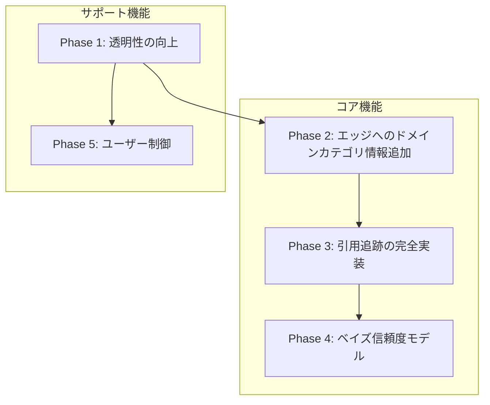

# Evidence System Design

このドキュメントでは、Lyraのエビデンスシステム（検索・評価・信頼度計算）の設計、現状、課題、および改善提案を記述する。

## 目次

1. [設計決定事項](#設計決定事項)
2. [用語定義](#用語定義)
3. [現状の設計](#現状の設計)
4. [処理フロー（シーケンス図）](#処理フローシーケンス図)
5. [課題と問題点](#課題と問題点)
6. [関連する学術的フレームワーク](#関連する学術的フレームワーク)
7. [改善提案](#改善提案)
8. [実装ロードマップ](#実装ロードマップ)

---

## 作業状況トラッカー（Progress）

**最終更新**: 2025-12-23（Phase 5 Task 5.1 完了: `domain_block_reason`/`domain_unblock_risk` 露出、BREAKING: `can_restore` 削除）

このセクションは、`docs/P_EVIDENCE_SYSTEM.md` の設計内容に対して「どこまで実装が進んでいるか」を追跡する。
更新ルール:
- Phaseの開始/完了、または仕様変更（破壊的変更を含む）を行ったタイミングで更新する
- 実装が一部のみの場合は、**どこまでが完了で、何が未完か**を明記する（誤認防止）

### タスク別ステータス

表記ルール:
- `Phase X / Task Y.Z` の粒度で状態を管理する
- 状態は `DONE | IN_PROGRESS | TODO | PLANNED | CANCELLED` のいずれか

#### Phase 1（透明性の向上）

| Phase / Task | 内容 | 状態 | 参照（主な実装箇所） | 備考 |
|---|---|---|---|---|
| Phase 1 / Task 1.0 | `trust_level` 概念を排除し、`domain_category` に統一（破壊的変更） | DONE | `src/utils/domain_policy.py`, `config/domains.yaml`, `docs/REQUIREMENTS.md` | 破壊的変更（移行レイヤなし） |
| Phase 1 / Task 1.1 | `get_status` に `blocked_domains`（＋`idle_seconds`）を追加 | DONE | `src/mcp/server.py`, `src/filter/source_verification.py`, `tests/test_mcp_get_status.py` | - |
| Phase 1 / Task 1.2 | ブロック理由のログ強化（`cause_id` 連携） | DONE | `src/filter/source_verification.py`, `tests/test_source_verification.py` | `verify_claim()` に `cause_id` パラメータ追加、ブロック時に伝播 |
| Phase 1 / Task 1.3 | エビデンスグラフに矛盾関係（REFUTES）を保存 | DONE | `src/filter/evidence_graph.py`, `src/storage/schema.sql` | - |
| Phase 1 / Task 1.4 | `claims.adoption_status` を追加し `pending/adopted/not_adopted` を保持（legacy。Phase 6で `claim_adoption_status` へリネーム＆デフォルト変更） | DONE | `src/storage/schema.sql`, `src/filter/evidence_graph.py` | - |
| Phase 1 / Task 1.5 | ドキュメント更新 | DONE | `README.md`, `docs/REQUIREMENTS.md`, `docs/P_EVIDENCE_SYSTEM.md` | 検証: ruff / mypy / tests PASS（ローカル回帰: 3225 passed） |

#### Phase 2（エッジへのドメイン分類情報追加）

| Phase / Task | 内容 | 状態 | 参照（主な実装箇所） | 備考 |
|---|---|---|---|---|
| Phase 2 / Task 2.1 | スキーマ変更（`edges.source_domain_category/target_domain_category`） | DONE | `src/storage/schema.sql` | - |
| Phase 2 / Task 2.2 | `EvidenceGraph.add_edge()` にパラメータ追加 | DONE | `src/filter/evidence_graph.py` | - |
| Phase 2 / Task 2.3 | エッジ生成時にドメインカテゴリ付与（実運用パスで常に付与） | DONE | `src/research/executor.py`, `src/research/refutation.py`, `src/filter/evidence_graph.py` | CITESは `add_academic_page_with_citations` 内で pages の `domain` から算出（見つからない場合は "academic" にフォールバック） |
| Phase 2 / Task 2.4 | 判定ロジックからカテゴリ依存を除去 | DONE | `src/filter/source_verification.py`, `tests/test_source_verification.py` | - |
| Phase 2 / Task 2.5 | `to_dict()` エクスポートにカテゴリ情報を含める | DONE | `src/filter/evidence_graph.py` | - |
| Phase 2 / Task 2.6 | 決定12: `is_influential` の完全削除 | DONE | `src/storage/schema.sql`, `src/search/apis/*.py`, `src/search/academic_provider.py`, `src/filter/evidence_graph.py` | 検証: `grep -r "\\bis_influential\\b" src/` 残骸ゼロ |
| Phase 2 / Task 2.7 | ドキュメント更新 | DONE | `docs/REQUIREMENTS.md`, `docs/P_EVIDENCE_SYSTEM.md` | 検証: ruff / mypy / tests PASS（3228 passed） |
| Phase 2 / Task 2.8 | 補助API（Crossref / arXiv / Unpaywall）の整理（削除/明確化） | DONE | `src/search/academic_provider.py`, `src/search/apis/{crossref,arxiv,unpaywall}.py`, `src/search/id_resolver.py`, `config/academic_apis.yaml` | 決定6に統合: 3つの補助APIを完全削除、PMID→DOI変換はS2 APIに移行、設定ファイル・テスト・ドキュメントを更新 |

#### Phase 3（引用追跡の完全実装）

| Phase / Task | 内容 | 状態 | 参照（主な実装箇所） | 備考 |
|---|---|---|---|---|
| Phase 3 / Task 3.1 | OpenAlex `get_references/get_citations` 実装（戻り値 `list[Paper]`） | DONE | `src/search/apis/openalex.py`, `tests/test_academic_provider.py` | - |
| Phase 3 / Task 3.2 | 引用先論文の pages 自動追加（Budgeted） | DONE | `src/research/pipeline.py`, `src/storage/schema.sql` | Abstract Onlyで pages/fragments に自動追加してから CITES を張る |
| Phase 3 / Task 3.3 | 関連性フィルタリング（Embedding → LLM） | DONE | `src/search/citation_filter.py`, `tests/test_citation_filter.py` | Stage 1: Embedding + impact_score（上位30） / Stage 2: LLM（上位10） |
| Phase 3 / Task 3.4 | S2/OpenAlex 引用グラフ統合（dedup / citation_pairs） | DONE | `src/search/academic_provider.py`, `tests/test_academic_provider.py` | - |
| Phase 3 / Task 3.5 | 非アカデミックでも識別子発見でAPI補完 | DONE | `src/research/pipeline.py`, `tests/test_pipeline_academic.py` | - |
| Phase 3 / Task 3.6 | 決定11: budget制約の設定反映 | DONE | `config/settings.yaml`, `src/research/pipeline.py` | - |
| Phase 3 / Task 3.7 | ドキュメント更新 | DONE | `README.md`, `docs/REQUIREMENTS.md`, `docs/P_EVIDENCE_SYSTEM.md` | 検証: ruff / mypy / tests PASS（統合: S2/OpenAlex統合、重複排除、エラーハンドリング、識別子補完を確認） |

#### Phase 3b（一般Web引用検出）

| Phase / Task | 内容 | 状態 | 参照（主な実装箇所） | 備考 |
|---|---|---|---|---|
| Phase 3b / Task 3b.1 | `is_academic` → `citation_source` リネーム | DONE | `src/storage/schema.sql`, `src/filter/evidence_graph.py`, `src/utils/schemas.py` | 値: `"semantic_scholar"` / `"openalex"` / `"extraction"`。記録用（フィルタリングには使用しない） |
| Phase 3b / Task 3b.2 | 引用検出プロンプト作成 | DONE | `config/prompts/detect_citation.j2` | LLM判定用プロンプト |
| Phase 3b / Task 3b.3 | 引用検出ロジック実装 | DONE | `src/extractor/citation_detector.py`, `tests/test_citation_detector.py` | LinkExtractor（本文内リンク）+ LLM判定 |
| Phase 3b / Task 3b.4 | CITESエッジ生成 | DONE | `src/research/executor.py` | `add_citation(citation_source="extraction")` 統合済み |
| Phase 3b / Task 3b.5 | ドキュメント更新 | DONE | `docs/P_EVIDENCE_SYSTEM.md` | - |

#### Phase 4（ベイズ信頼度モデル）

| Phase / Task | 内容 | 状態 | 参照（主な実装箇所） | 備考 |
|---|---|---|---|---|
| Phase 4 / Task 4.0 | **前提A**: Step 7（NLI）を通常検索パスに接続し、`edges.nli_confidence` を永続化 | DONE | `src/research/executor.py`, `src/filter/evidence_graph.py`, `src/filter/nli.py` | **Phase 4はこの前提が満たされるまで開始しない**（決定7/13の入力が揃わないため）。`edges.confidence` はLLM抽出等が混在し得るので、ベイズ更新には使用しない |
| Phase 4 / Task 4.1 | `calculate_claim_confidence_bayesian()` 実装 | DONE | `src/filter/evidence_graph.py` | `calculate_claim_confidence()` をベイズ実装に置換、`verdict` フィールド削除 |
| Phase 4 / Task 4.2 | 出力スキーマ確定（`confidence/uncertainty/controversy` + デバッグ統計） | DONE | `src/filter/evidence_graph.py` | `uncertainty`, `controversy`, `alpha`, `beta`, `evidence_count` を追加 |
| Phase 4 / Task 4.3 | Source Verification / MCPレスポンスへの反映 | DONE | `src/research/materials.py` | `get_materials_action()` の `claims[]` に `uncertainty/controversy` を追加 |
| Phase 4 / Task 4.4 | 既存テスト更新（破壊的変更前提で更新） | DONE | `tests/test_evidence_graph.py`, `tests/test_claim_timeline.py` | TestClaimConfidence 9件、claim_timeline 41件パス確認 |
| Phase 4 / Task 4.5 | 旧実装・切替スイッチ・旧フィールド（例: `verdict`）の掃除（旧実装を残さない） | DONE | `src/filter/evidence_graph.py`, `tests/test_source_verification.py`, `tests/conftest.py`, `tests/test_evidence_graph.py` | `verdict` フィールド削除確認済み（`src/` および `tests/` で grep残骸ゼロ） |
| Phase 4 / Task 4.6 | ドキュメント更新 | DONE | `docs/P_EVIDENCE_SYSTEM.md` | Phase 4 完了 |
| Phase 4 / Task 4.7 | claim_timeline統合（決定13）: `calculate_confidence_adjustment()` 廃止 | DONE | `src/filter/claim_timeline.py`, `tests/test_claim_timeline.py` | `calculate_confidence_adjustment()`, `_apply_confidence_adjustment()`, `RETRACTION_CONFIDENCE_PENALTY` 削除。timelineは監査ログに限定 |

#### Phase 4b（時間メタデータ露出）

| Phase / Task | 内容 | 状態 | 参照（主な実装箇所） | 備考 |
|---|---|---|---|---|
| Phase 4b / Task 4b.1 | `calculate_claim_confidence()` に `evidence` リストを追加 | DONE | `src/filter/evidence_graph.py` | 各エビデンスに `year`, `source_domain_category`, `nli_confidence`, `doi`, `venue` を含める |
| Phase 4b / Task 4b.2 | `evidence_years` サマリー（oldest/newest）を追加 | DONE | `src/filter/evidence_graph.py` | 高推論AIが時間的判断を行うための要約情報 |
| Phase 4b / Task 4b.3 | MCPレスポンスへの反映 | DONE | `src/research/materials.py` | `get_materials_action()` の `claims[]` に `evidence`/`evidence_years` を追加 |
| Phase 4b / Task 4b.4 | ドキュメント更新 | DONE | `docs/P_EVIDENCE_SYSTEM.md` | 決定15追加、Phase 4b完了 |

#### Phase 5（ユーザー制御）

| Phase / Task | 内容 | 状態 | 参照（主な実装箇所） | 備考 |
|---|---|---|---|---|
| Phase 5 / Task 5.0 | `get_status.blocked_domains[]` に `can_restore`/`restore_via` を追加（legacy） | DONE | `src/mcp/server.py`, `src/filter/source_verification.py`, `src/mcp/schemas/get_status.json`, `tests/test_mcp_get_status.py` | Task 5.1 で `can_restore` 削除、`domain_block_reason`/`domain_unblock_risk` に置換 |
| Phase 5 / Task 5.1 | ブロック理由のコード化（`domain_block_reason`）+ MCP露出 + `domain_unblock_risk`（High/Low） | DONE | `src/filter/source_verification.py`, `src/mcp/schemas/get_status.json`, `tests/test_mcp_get_status.py` | ブロック理由の混線を解消（dangerous_pattern vs high_rejection_rate等）。BREAKING CHANGE: `can_restore` 削除 |
| Phase 5 / Task 5.2 | `user_overrides` 導入（完全一致。**QPS/カテゴリ等のDomainPolicy上書き**。ブロック解除は扱わない） | DONE | `config/domains.yaml`, `src/utils/domain_policy.py`, `tests/test_domain_policy.py` | ブロック/解除は Phase 6 の DB override（決定20）で統一。user_overrides は allowlist/graylist より高優先 |
| Phase 5 / Task 5.3 | hot-reloadで `user_overrides` が即反映（DomainPolicyManager） | DONE | `src/utils/domain_policy.py` | DomainPolicyManager reload callback で反映（SourceVerifierの `_blocked_domains` とは切り離す） |
| Phase 5 / Task 5.4 | ドキュメント更新 | DONE | `docs/P_EVIDENCE_SYSTEM.md`, `docs/REQUIREMENTS.md`, `README.md` | Task 5.5完了後に実施 |
| Phase 5 / Task 5.5 | 棄却率パラメータ分離（`domain_claim_security_rejection_rate` / `domain_claim_manual_rejection_rate` / `domain_claim_combined_rejection_rate`） | DONE | `src/filter/source_verification.py` | 決定18参照。合算棄却率でブロック判定。Phase 6の `feedback` と連動。`rejected_claims`/`rejection_rate`を完全削除 |

#### Phase 6（フィードバック + スキーマ棚卸し）

| Phase / Task | 内容 | 状態 | 参照（主な実装箇所） | 備考 |
|---|---|---|---|---|
| Phase 6 / Task 6.1 | `feedback` MCPツール新設（3レベル + `domain_clear_override`） | PLANNED | `src/mcp/server.py`, `src/mcp/schemas/feedback.json` | 決定17/20参照。`calibration_metrics` は計測用として残す（入力は `feedback` に統一） |
| Phase 6 / Task 6.2 | Domain override 実装（DB永続化 + pattern制約 + 優先順位） | PLANNED | `src/mcp/server.py`, `src/filter/source_verification.py`, `src/utils/domain_policy.py`, `src/storage/schema.sql` | 決定20参照。`domain_block`/`domain_unblock`/`domain_clear_override` |
| Phase 6 / Task 6.3 | `claim_reject` / `claim_restore` 実装：claim採用状態操作 | PLANNED | `src/mcp/server.py`, `src/storage/schema.sql` | `claim_adoption_status` を `adopted` ↔ `not_adopted` に切替 |
| Phase 6 / Task 6.4 | `edge_correct` 実装：NLIラベル訂正（即時反映 + 校正サンプル蓄積） | PLANNED | `src/mcp/server.py`, `src/filter/evidence_graph.py` | 3クラス（supports/refutes/neutral）の正解ラベルを入力 |
| Phase 6 / Task 6.5 | スキーマ変更（命名規則統一 + 新規カラム追加） | PLANNED | `src/storage/schema.sql` | 決定19参照。`edge_*`, `claim_*` プレフィックス |
| Phase 6 / Task 6.6 | DBスキーマ棚卸し（dead fields 削除: `calibrated_score`, `is_verified`） | PLANNED | `src/storage/schema.sql` | "現状→改善後"の表で仕様と実装を一致させる |
| Phase 6 / Task 6.7 | NLI ground-truth サンプル蓄積（`nli_corrections`）+ 校正サンプル接続（計測のみ。推論への適用は Phase R） | PLANNED | `src/utils/calibration.py`, `src/storage/schema.sql` | Phase 6では蓄積と計測のみ（推論への適用はしない） |
| Phase 6 / Task 6.8 | `get_materials` に `claim_adoption_status` 露出 | PLANNED | `src/research/materials.py`, `src/mcp/schemas/get_materials.json` | 不採用claimのフィルタリングを高推論AIに委ねる |
| Phase 6 / Task 6.9 | ドキュメント更新 | PLANNED | `docs/P_EVIDENCE_SYSTEM.md`, `docs/REQUIREMENTS.md` | Phase 6の再編反映 |

---

## 設計決定事項

### 決定1: MCPツール体制

**決定**: 11ツール体制を維持。

### 決定2: 対立関係の扱い

**決定**: Lyraは対立関係を**事実として記録**し、**解釈は高推論AIに委ねる**。

| 要素 | Lyraの責務 | 高推論AIの責務 |
|------|-----------|---------------|
| 対立の検出 | REFUTESエッジを作成 | - |
| ドメイン分類情報 | エッジに付与 | 参照して判断 |
| 「科学的論争か誤情報か」 | **判断しない** | 判断する |
| BLOCKEDの決定 | 危険パターン検出時のみ | 推奨可能 |

**ContradictionType enum は導入しない**:
- Lyraが「MISINFORMATION」「CONTESTED」とラベル付けすることは解釈行為
- エッジ情報（relation + domain_categories）があれば高推論AIは自ら判断可能

### 決定3: 信頼度が主、ドメインカテゴリは従

**決定**: **信頼度（confidence）がエビデンス評価の主軸**。ドメインカテゴリ（DomainCategory）は副次的な参考情報に過ぎない。

**根拠**: 査読済み論文 ≠ 正しい情報

- 再現性危機: 心理学研究の60%以上が再現不可能
- 年間数千件の論文が撤回される
- arXiv等のプレプリントは査読なし
- ハゲタカジャーナル（predatory journals）の存在

**「ACADEMICドメインだから正しい」は技術的に誤り。間違った論文・不正な論文はいくらでもある。**

```
# 信頼度 = ベイズ更新で計算（§提案6、§決定7）
confidence = alpha / (alpha + beta)  # Beta分布の期待値
uncertainty = sqrt(variance)          # 不確実性
controversy = ...                     # 論争度

# 単一エビデンス = 高uncertainty（分からない）
# 複数の独立エビデンスで裏付け = 低uncertainty（蓋然性が高い）
```

**設計への反映**:
- Nature論文でも単独 → 高uncertainty（信頼度は確定しない）
- 無名ブログでも5つの独立エビデンスで裏付け → 低uncertainty
- DomainCategoryは「出自のヒント」であり、信頼性の保証ではない
- DomainCategoryはランキング調整（category_weight）にのみ使用
- DomainCategoryは検証判定（VERIFIED/REJECTED）には使用しない（決定10）

### 決定4: Wikipedia

**状態**: ✅ 実装済み

`LOW` (0.40) として設定済み（`config/domains.yaml`）。

### 決定5: 引用追跡の関連性フィルタリング

**決定**: 2段階フィルタリング（Embedding → LLM）、上位10件

**設計更新（重要）**:
- 関連性フィルタリングでは、ソース非依存で利用可能な `Paper.citation_count` を用いた **impact_score（ローカル正規化）**を採用する。
- Semantic Scholar の `is_influential` フラグは **一切使用しない**（決定12参照）。

**実装メモ**（仕様のブレ防止）:
- `impact_score` は **候補集合内でのローカル正規化**とし、`citation_count` の歪みを抑えるため `log1p` 変換後に **percentile-rank（0..1）**を用いる（外れ値耐性）。
- 候補が1件しかない場合の `impact_score` は 0.5 とする（比較不能なので中立）。
- Stage 1/2 の重み・上限件数（30→10）は設定（`search.citation_filter.*`）で管理し、コードに埋め込まない。

**Stage 1: Embedding + impact_score（粗フィルタ）**
| 要素 | 重み | 備考 |
|------|:----:|------|
| impact_score (citation_count) | 0.5 | S2/OpenAlex 共通（ローカル正規化） |
| embedding similarity | 0.5 | 高速、セマンティック類似度 |

→ 上位30件を抽出

**Stage 2: LLM（精密評価）**
| 要素 | 重み | 備考 |
|------|:----:|------|
| LLM relevance (Qwen2.5 3B) | 0.5 | 意味的関連性を直接評価 |
| embedding similarity | 0.3 | Stage 1のスコアを引き継ぎ |
| impact_score (citation_count) | 0.2 | S2/OpenAlex 共通（ローカル正規化） |

→ 上位10件を選択

**NLIを使用しない理由**:
- NLIは「AはBを支持/反論するか」（論理的含意関係）を判定するモデル
- 「AはBに関連があるか」の判定には**不適切**
- LLMはプロンプトで評価基準を柔軟に指定でき、関連性評価に適している

### 決定6: データソース戦略

**決定**: S2 + OpenAlex の2本柱。補助API（Crossref / arXiv / Unpaywall）は**完全削除**（移行レイヤなし）。

**学術API体制**:
| API | 役割 | 状態 |
|-----|------|:----:|
| **Semantic Scholar** | 検索・引用追跡・識別子解決 | 使用 |
| **OpenAlex** | 検索・引用追跡 | 使用 |
| Crossref | - | **削除** |
| arXiv | - | **削除** |
| Unpaywall | - | **削除** |

**削除理由**:
- Crossref: PMID→DOI は S2 `paper/PMID:{pmid}` で代替可能、検索は abstract なしで品質低
- arXiv: 論文は S2/OpenAlex でインデックス済み、arXiv ID→DOI は既に S2 API 使用
- Unpaywall: OA URL は S2 `openAccessPdf.url` / OpenAlex `open_access.oa_url` で取得可能

**設計判断**:
- アカデミッククエリかどうかは優先度の違い
- 非アカデミッククエリでも学術識別子発見時にAPI補完

### 決定7: ベイズ信頼度モデル

**決定**: 無情報事前分布 Beta(1, 1) + ベイズ更新による信頼度計算を採用

**設計原則**:
- 事前分布にドメイン分類を使用しない（純粋エビデンス主義）
- NLI confidence で重み付けしたベイズ更新
- confidence, uncertainty, controversy の3値を出力

**技術的根拠**:
- 数学的に厳密で再現可能
- 「分からない」状態（高uncertainty）を明示的に表現可能
- 論争状態（高controversy）を検出可能
- Lyraが取得する情報（NLI confidence, エッジ数）のみで計算可能

**実装タイミング**: Phase 4（引用追跡の後）

### 決定8: MLコンポーネントの使い分け

**決定**: 用途に応じてML Server（lyra-ml）とローカルLLM（Ollama）を使い分ける

| 用途 | Embedding | Reranker | NLI | LLM (Qwen) | 根拠 |
|------|:---------:|:--------:|:---:|:----------:|------|
| **検索結果ランキング** | Stage 2 | Stage 3 | - | - | 精度最大化 |
| **引用追跡の粗フィルタ** | ✓ | - | - | - | 高速処理 |
| **引用追跡の精密評価** | - | - | - | ✓ | 意味的関連性 |
| **エビデンスグラフ構築** | - | - | ✓ | - | 論理的含意関係 |
| **Fact/Claim抽出** | - | - | - | ✓ | 柔軟な抽出 |
| **コンテンツ要約** | - | - | - | ✓ | 自然言語生成 |

**NLI vs LLM の設計原則**:

| モデル | 判定内容 | 適切な用途 | 不適切な用途 |
|--------|----------|------------|--------------|
| **NLI** | entailment/contradiction/neutral | SUPPORTS/REFUTES判定 | 関連性評価 |
| **LLM** | 意味的関連性スコア (0-10) | 関連性評価、抽出、要約 | 大量バッチ処理 |

**技術的根拠**:
- NLIは3クラス分類モデルであり、「関連性」という連続的な概念を判定するには不適切
- LLMはプロンプトで評価基準を柔軟に指定でき、関連性の「程度」を評価可能
- Qwen2.5 3Bは§K.1に準拠した単一モデルであり、追加の依存関係は不要

**関連性評価 vs 含意関係判定の責務分離**:

| 処理 | 責務 | 判定内容 | 使用モデル | Phase |
|------|------|----------|------------|:-----:|
| 引用フィルタリング | 関連性評価 | 主題的な近さ | LLM | 3 |
| エビデンスグラフ構築 | 含意関係判定 | SUPPORTS/REFUTES | NLI | 4 |

関連性評価のプロンプトには「支持/反論」の判断を含めない（有用性＝“証拠になりうる/背景として重要”まで）。
これらは責務が異なり、混同は設計の一貫性を損なう。

### 決定9: is_contradiction フラグの廃止

**決定**: `is_contradiction` フラグを廃止し、REFUTESエッジ + ドメイン分類情報による設計に一本化する。

**廃止理由**:

1. **DRY原則違反**: REFUTESエッジで既に同じ情報が表現されている。`is_contradiction` フラグは情報の重複に過ぎない。

2. **Thinking-Working分離原則との矛盾**: 「これは矛盾である」というフラグを立てる行為は解釈行為であり、決定2の設計思想に反する。Lyraは事実を記録し、解釈は高推論AIに委ねるべき。

3. **「矛盾」の定義が曖昧**: `find_contradictions()` はドメインカテゴリを考慮せず、REFUTESエッジがあれば一律に「矛盾」とマークする。ACADEMIC vs ACADEMIC の科学的論争と、ACADEMIC vs UNVERIFIED の誤情報を区別できない。

4. **Phase 2 で代替可能**: `source_domain_category` / `target_domain_category` をエッジに付与することで、高推論AIは適切に判断可能。

**削除対象**:
- `edges.is_contradiction` カラム
- `EvidenceGraph.mark_contradictions()` メソッド
- `EvidenceGraph.get_contradiction_edges()` メソッド
- 関連テストケース（`TestContradictionMarking` クラス）

**代替手段**: Phase 2 で導入する `source_domain_category` / `target_domain_category` により、高推論AIは以下のように判断可能：
- 両方ACADEMIC → 科学的論争
- ACADEMIC vs UNVERIFIED → 誤情報の可能性
- 同一ソース内の自己矛盾 → 論理的矛盾

### 決定10: ReasonCode は事実のみ記述

**決定**: `_determine_verification_outcome()` の reason は解釈を含まない `ReasonCode` enum とする。

| コード | 意味（事実） | Lyra が判断しないこと |
|--------|-------------|---------------------|
| `conflicting_evidence` | 対立エビデンスが存在 | 「科学的論争である」「誤情報である」 |
| `well_supported` | 複数の独立ソースで裏付け | 「正しい」 |
| `insufficient_evidence` | エビデンス不足 | 「信頼できない」 |
| `dangerous_pattern` | L2/L4 で危険パターン検出 | -（セキュリティ判断） |

**根拠**:
- 決定2: Lyra は事実を記録し、解釈は高推論 AI に委ねる
- 決定9: `is_contradiction` フラグ廃止と同じ理由
- ドメインカテゴリは判定に使用しない（決定3）

高推論 AI はエッジの `source_domain_category` / `target_domain_category` を参照し、文脈に応じて「科学的論争」「誤情報」等の解釈を行う。Lyra は `ReasonCode` で事実のみを記述する。


### 決定11: 引用追跡は Budgeted Citation Expansion（TopXサンプリング）とする

**決定**: 引用追跡（Step 5 / Phase 3）は「全引用文献を完全にグラフ化する」ことを目的としない。**Abstract Only** 制約と計算予算（API/LLM）を前提に、**"有用なエビデンスまたは重要な背景"になり得る上位X件だけを pages（ノード）として取り込む**。

**ポイント（質問への回答）**: Lyraはフルテキストを持たないため「重要引用を完全に判定」することはできないが、**TopXの選抜は"真偽判定"ではなく"検索・関連性・有用性の近似"**であり、Abstract（＋メタデータ）だけでも十分に実用的な近似が可能。

**TopX を絞れる根拠（Abstract Onlyで可能な情報）**:
- **主題的近さ**: クエリ／元論文アブストラクトと引用先アブストラクトのセマンティック類似度（Embedding）
- **影響度の近似**: `Paper.citation_count` からの `impact_score`（ローカル正規化）
- **"評価に使えるか"**: LLMによる有用性スコア（支持/反論の判定は禁止）

#### 高速処理のための3段階パイプライン

```
Stage 0 (即時, 0ms)     Stage 1 (高速, ~100ms)     Stage 2 (精密, ~30-60sec)
API応答のメタデータ  →  Embedding + impact     →  LLM有用性評価
━━━━━━━━━━━━━━━━━━━━━━━━━━━━━━━━━━━━━━━━━━━━━━━━━━━━━━━━━━━━━━━━━━━━━
候補: 50-100件          候補: 30件                 最終: 10件
```

**Stage 0: メタデータによる即時フィルタ（APIレスポンス時点）**

| 条件 | 処理 | 理由 |
|-----|------|------|
| `abstract` が空 | **除外** | Embedding/LLM評価が不可能 |
| `citation_count < 閾値` | 除外候補 | 影響度が極端に低い論文を除外（設定可能） |
| 重複（DOI一致） | **マージ** | S2/OpenAlex統合時のdedup |

**Stage 1: Embedding + impact_score（バッチ処理可能）**

- **利用情報**: `abstract`（Embedding用）、`citation_count`（impact_score用）
- **処理**: 1回のバッチAPIで全candidateのembeddingを取得 → cosine similarity計算
- **計算量**: O(n) embedding + O(n) similarity（高速）
- **出力**: 上位30件（設定: `stage1_top_k`）

**Stage 2: LLM有用性評価（逐次処理・高コスト）**

- **利用情報**: `abstract`（プロンプト入力）
- **処理**: 逐次LLM呼び出し（バッチ不可）
- **計算量**: O(n) × ~2sec/件（**ボトルネック**）
- **出力**: 上位10件（設定: `stage2_top_k`）

#### API制約とデータ取得コスト

| API | 引用取得 | abstract取得 | 制約 |
|-----|---------|-------------|------|
| S2 `/paper/{id}/references` | 1回で全件 | **含む** | ~100 req/5min (no key) |
| S2 `/paper/{id}/citations` | 1回で全件 | **含む** | 同上 |
| OpenAlex `referenced_works` | IDリストのみ | **個別取得必要（N+1）** | ~10 req/sec |
| OpenAlex `filter=cites:{id}` | 1回で全件 | **含む** | 同上 |

**OpenAlex N+1問題の回避**:
1. **citations API優先**: `filter=cites:{id}`は1回で複数論文のメタデータを返す
2. **references取得時の制限**: 最大20件に制限（現行実装）し、Stage 0で即時カット
3. **S2優先統合**: S2で取れる論文はS2から取得（abstract付き）、OpenAlexは補完用

#### 設定パラメータ

```yaml
# config/settings.yaml
search:
  # 引用追跡対象の論文数（Step 5で処理する元論文の上限）
  citation_graph_top_n_papers: 5
  citation_graph_depth: 1
  citation_graph_direction: "both"  # references | citations | both

  citation_filter:
    # Stage 0: メタデータフィルタ（将来拡張用）
    min_citation_count: 0          # 0 = 制限なし

    # Stage 1: embedding + impact
    stage1_top_k: 30
    stage1_weight_embedding: 0.5
    stage1_weight_impact: 0.5

    # Stage 2: LLM
    stage2_top_k: 10
    stage2_weight_llm: 0.5
    stage2_weight_embedding: 0.3
    stage2_weight_impact: 0.2
```

#### 透明性（ログ出力）

```python
logger.info(
    "Citation filter completed",
    source_paper=source_paper.id,
    candidates_total=len(candidate_papers),
    after_stage0=len(with_abstract),      # abstract有りの件数
    after_stage1=len(stage1_results),     # embedding+impactフィルタ後
    final_count=len(final_results),       # LLM評価後
    llm_calls=len(stage1_results),        # 実際のLLM呼び出し回数
)
```

### 決定12: `is_influential` は使用しない（S2専用フラグの排除）

**決定**: Semantic Scholar の `isInfluential` フラグは**一切使用しない**。メタデータとしても保存せず、コードから完全に削除する。

**理由**:
1. **ソース非対称性**: OpenAlexには同等のフラグが存在しない。S2専用フラグに依存すると、S2/OpenAlex統合時に非対称性が生じる
2. **ブラックボックス**: S2がどのような基準で `isInfluential` を判定しているか不明。Lyraの設計原則（透明性・再現可能性）に反する
3. **代替手段の存在**: `Paper.citation_count` から算出する `impact_score` で影響度の近似は可能（決定5、決定11）
4. **複雑性削減**: API戻り値の型、スキーマ、関数シグネチャがすべて単純化される

**削除対象**:
- `edges.is_influential` カラム（`src/storage/schema.sql`）
- `get_references()` / `get_citations()` の戻り値型を `list[tuple[Paper, bool]]` → `list[Paper]` に変更
- `add_cites_edge()` / `add_academic_page_with_citations()` の `is_influential` パラメータ
- `Citation.is_influential` フィールド

**実装タイミング**: Phase 2（エッジへのドメインカテゴリ情報追加と同時）

### 決定13: エビデンスグラフ成長モデルと信頼度計算の統一

**決定**: 信頼度計算はすべてエッジ経由のベイズ更新で統一する。claim_timelineは監査ログとして残し、信頼度計算には直接関与しない。

**エビデンスグラフ成長モデル**:
```
task_id = "task-123"
├─ Search #1
│   → pages追加 (DOI/URLで重複排除)
│   → fragments追加 (text_hashで重複排除)
│   → NLI → edges追加
│   → claims confidence = ベイズ計算(全エッジ)
│
├─ Search #2 (同じtask_id)
│   → 新規pages追加 (既存DOI/URLはスキップ)
│   → 新規fragments追加
│   → NLI → 新規edges追加 (既存ペアはスキップ)
│   → claims confidence = ベイズ再計算(全エッジ)
│
└─ Search #N → グラフ成長 → uncertainty低下 → confidence収束
```

**重複排除ルール**:
| 対象 | 重複判定キー | 重複時の挙動 |
|------|-------------|-------------|
| PAGE | URL または DOI | スキップ（上書きなし） |
| FRAGMENT | text_hash | スキップ |
| EDGE | (source_id, target_id, relation) | スキップ |

**信頼度計算方針**:
| 項目 | 方針 |
|------|------|
| 計算タイミング | オンデマンド（`get_materials`呼び出し時） |
| α/β保存 | しない（エッジから毎回計算） |
| claims.claim_confidence（legacy名: claims.confidence_score） | 導出値（DBキャッシュは任意） |
| キャッシュ制御点 | **`src/research/materials.py:get_materials_action()`**（呼び出し元: `src/mcp/server.py:_handle_get_materials`）。返却値はエッジから導出した値を正とし、必要ならDBへ書き戻す（最適化）。`EvidenceGraph`自体にDB更新の責務を持たせない（副作用境界の明確化）。 |

**前提（重要）**:
- ベイズ更新の入力は **`edges.nli_confidence`（NLIの確信度）** のみとする（決定7/13）。
- したがって、通常検索パスで Step 7（NLI）を実行し、`SUPPORTS/REFUTES/NEUTRAL` エッジに `nli_confidence` を永続化できていることが必須（Phase 4 / Task 4.0）。

**claim_timelineの位置づけ**:
- 監査ログ（いつ何が起きたか）として保持
- 撤回記事発見 → REFUTESエッジ生成のトリガー → 自動的にβ増加
- `calculate_confidence_adjustment()` は廃止（Phase 4タスク）
- **α/βを直接操作しない**（エッジ経由で統一）

**実装タイミング**: Phase 4

### 決定14: MCPスキーマのベイズフィールド拡張

**決定**: `get_materials` の `claims[]` にフラットな形式で `uncertainty` / `controversy` を追加する。

**スキーマ**:
```json
{
  "claims": [{
    "confidence": 0.75,
    "uncertainty": 0.12,
    "controversy": 0.08,
    ...
  }]
}
```

**根拠**:
1. **MCPクライアントからのアクセス容易性**: ネストよりフラットの方が参照しやすい
2. **既存フィールドとの一貫性**: `confidence` が既にトップレベルに存在

**実装タイミング**: Phase 4

### 決定15: 時間メタデータの露出

**決定**: `get_materials` の `claims[]` に各エビデンスの時間情報を含め、高推論AIが時間的判断を行えるようにする。

**スキーマ**:
```json
{
  "claims": [{
    "confidence": 0.75,
    "uncertainty": 0.12,
    "controversy": 0.08,
    "evidence": [
      {
        "relation": "supports",
        "source_id": "page_abc123",
        "year": 2023,
        "nli_confidence": 0.9,
        "source_domain_category": "academic",
        "doi": "10.1234/example",
        "venue": "Nature"
      },
      {
        "relation": "refutes",
        "source_id": "page_def456",
        "year": 2024,
        "nli_confidence": 0.85,
        "source_domain_category": "academic"
      }
    ],
    "evidence_years": {
      "oldest": 2023,
      "newest": 2024
    }
  }]
}
```

**設計原則**:
- **Thinking-Working分離の維持**: Lyraは時間情報（事実）を渡すのみ。「2024年の反論が2023年の支持より新しいので最新の知見では否定的」といった解釈は高推論AIが行う
- **判断を行わない**: 時間的な重み付けやトレンド分析はLyraが行わない
- **透明性**: 高推論AIが独自に時間的判断を行えるよう、生データを提供

**高推論AIの活用例**:
- 「すべてのエビデンスが2020年以前 → 最新研究の確認が必要」
- 「2024年に反論が集中 → 最新の知見では否定的傾向」
- 「支持エビデンスは2023年、反論は2018年 → 最新研究が支持」

**実装タイミング**: Phase 4b

### 決定16: ブロック理由のコード化と解除リスク露出

**決定**: `get_status.blocked_domains[]` には、ブロック状態の「事実」を機械可読に伝えるため `domain_block_reason` と `domain_unblock_risk` を含める。

- `domain_block_reason` は **ブロックが発生した規則/原因のコード**（事実）
- `domain_unblock_risk` は **解除（= user_overrides または `feedback(domain_unblock)`）を行う際のリスク区分**（High/Low）
- 「復元すべき/非推奨」といった **指示・推奨の文言は出さない**（受け手が "何をrestore？" で迷うため）。代わりに `domain_unblock_risk` を露出する

**フィールド**:
- `domain_block_reason`: `"dangerous_pattern" | "high_rejection_rate" | "denylist" | "manual" | "unknown"`
- `domain_unblock_risk`: `"high" | "low"`

**MCPスキーマ例（get_status）**:
```json
{
  "blocked_domains": [
    {
      "domain": "example.com",
      "blocked_at": "2025-12-22T12:00:00Z",
      "domain_block_reason": "dangerous_pattern",
      "domain_unblock_risk": "high",
      "reason": "Dangerous pattern detected (L2/L4)",
      "cause_id": "abc123",
      "original_domain_category": "unverified",
      "restore_via": "config/domains.yaml user_overrides or feedback(domain_unblock)"
    }
  ]
}
```

**`domain_block_reason` → `domain_unblock_risk` マッピング**:

| `domain_block_reason` | `domain_unblock_risk` | 理由 |
|-----------------------|----------------------|------|
| `dangerous_pattern` | **high** | セキュリティリスク（L2/L4検出） |
| `high_rejection_rate` | **low** | 統計的判断（誤検知あり得る） |
| `denylist` | **low** | 設定で明示的に追加 → 設定で解除すべき |
| `manual` | **low** | 人が `feedback` で判断 → 人が解除できる |
| `unknown` | **high** | 原因不明は安全側に倒す |

**注（重要）**: MCP応答はスキーマでallowlistサニタイズされる（`additionalProperties: false`）ため、フィールド追加/改名は `src/mcp/schemas/get_status.json` の更新が必須。

### 決定17: `feedback` ツールによるHuman-in-the-loop入力

**決定**: Domain/Claim/Edge の3レベルで Human-in-the-loop 入力を行う `feedback` MCPツールを新設する。

**設計原則**:
- **恣意性排除**: 「パラメータを直接いじる」のではなく「正解を教える」形でのみ入力を受け付ける
- **即時反映**: 訂正されたラベル/状態は即座に反映される（ベイズ再計算は `get_materials` 時）
- **監査可能**: 訂正/棄却には `reason` を記録し、後から追跡可能にする
- **3レベル対応**: Domain（glob対応）、Claim（1件ずつ）、Edge（1件ずつ）

**アクション一覧**:

| レベル | action | 目的 | 入力 |
|--------|--------|------|------|
| Domain | `domain_block` | ドメインをブロック | `domain_pattern`, `reason` |
| Domain | `domain_unblock` | ブロック解除（overrideで許可） | `domain_pattern`, `reason` |
| Domain | `domain_clear_override` | ドメインoverrideを解除（ベースラインへ戻す） | `domain_pattern`, `reason` |
| Claim | `claim_reject` | claimを不採用に | `claim_id`, `reason` |
| Claim | `claim_restore` | 不採用を撤回 | `claim_id` |
| Edge | `edge_correct` | NLIラベル訂正 | `edge_id`, `correct_relation`, `reason?` |

**パラメータ詳細**:

```typescript
// Domain レベル（suffix/prefix対応）
{ action: "domain_block", domain_pattern: "*.example.com", reason: "..." }
{ action: "domain_unblock", domain_pattern: "*.example.com", reason: "..." }
{ action: "domain_clear_override", domain_pattern: "*.example.com", reason: "..." }

// Claim レベル（1件ずつ）
{ action: "claim_reject", claim_id: "claim_abc123", reason: "..." }
{ action: "claim_restore", claim_id: "claim_abc123" }

// Edge レベル（1件ずつ）
{ action: "edge_correct", edge_id: "edge_xyz", correct_relation: "refutes", reason: "..." }
```

**`calibration_metrics` ツールとの関係**:
- `calibration_metrics`: 評価・統計・履歴参照用（計測系。入力は受け付けない）
- `feedback`: Human-in-the-loop 入力用（訂正・棄却・ブロック）
- 両者は責務が異なり、併存する

**`calibration_metrics` の最小actionセット（必要十分）**:
- `get_stats`: source別の統計（サンプル数、最新version、最新Brier等）
- `evaluate`: DBに蓄積されたサンプルから評価を実行し、結果を履歴として保存（外部から predictions/labels を渡さない）
- `get_evaluations`: 評価履歴の取得（reliability diagram用のbinsを含むため、diagram専用actionは置かない）
- 破壊操作は `calibration_rollback`（別ツール）に分離する

**3クラス対応**:
- `correct_relation` は `"supports"` / `"refutes"` / `"neutral"` の3値
- `edge_correct` は **NLIのground-truth入力**として扱い、訂正の有無に関わらずサンプルを蓄積する（`correct_relation` が現状と同じでもサンプルは保存する）
- 訂正サンプルは `nli_corrections` としてDBに蓄積（LoRA学習の入力。詳細は `docs/R_LORA.md`）
- 校正（確率のズレ補正）は **計測→適用の順**で進め、推論への適用はサンプルが十分蓄積されてから（Phase R）

**実装タイミング**: Phase 6

---

### 決定18: 棄却率パラメータの分離と合算

**決定**: 棄却率を「自動棄却（セキュリティ検出）」と「手動棄却（`feedback`）」に明確に分離し、ブロック判定には合算棄却率を使用する。

**パラメータ分離**:

| パラメータ | 意味 |
|-----------|------|
| `security_rejected_claims` | L2/L4検出による自動棄却claim |
| `manual_rejected_claims` | `feedback(claim_reject)` による手動棄却claim |
| `domain_claim_security_rejection_rate` | 自動棄却率（ドメイン単位・claimベース） |
| `domain_claim_manual_rejection_rate` | 手動棄却率（ドメイン単位・claimベース） |
| `domain_claim_combined_rejection_rate` | 合算棄却率（ブロック判定用） |

**合算計算**:
```
分子 = security_rejected_claims ∪ manual_rejected_claims（重複排除）
分母 = verified ∪ pending ∪ security_rejected ∪ manual_rejected（ユニーク数）
domain_claim_combined_rejection_rate = len(分子) / len(分母)
```

**重複排除の理由**: 同じclaimがL2/L4検出と人の判断の両方で棄却される可能性があり、二重カウントを防ぐ。

**使い分け**:
- **診断・監査**: 個別の棄却率（`domain_claim_security_rejection_rate`, `domain_claim_manual_rejection_rate`）で原因を特定
- **ブロック判定**: `domain_claim_combined_rejection_rate` で閾値判定（`high_rejection_rate_threshold`）

**実装タイミング**: Phase 5（Task 5.5/5.6）で棄却率分離、Phase 6（`feedback`）で手動棄却が有効化

---

### 決定19: パラメータ命名規則の統一

**決定**: DB カラム名と MCP 出力フィールド名を統一し、「何を操作しているか」を明確にする命名規則を採用する。

**命名規則**:
```
{対象}_{属性}
```

| 対象プレフィックス | 意味 | 例 |
|-------------------|------|-----|
| `domain_` | ドメイン関連 | `domain_block_reason`, `domain_unblock_risk` |
| `claim_` | Claim関連 | `claim_confidence`, `claim_adoption_status` |
| `edge_` | Edge関連 | `edge_human_corrected`, `edge_correction_reason` |
| `source_` | ソース検証関連 | `source_verification_status` |
| `nli_` | NLIモデル出力 | `nli_label`, `nli_confidence` |

**変更一覧（DB + MCP）**:

| 分類 | 旧 | 新 | 備考 |
|------|-----|-----|------|
| **Claims** | `confidence_score` | `claim_confidence` | 何の信頼度か明確に |
| | `adoption_status` | `claim_adoption_status` | 何を採用するか明確に |
| | `calibrated_score` | (削除) | dead field |
| | `is_verified` | (削除) | `source_verification_status` に統一 |
| | `rejection_reason` | `claim_rejection_reason` | 新規追加 |
| | `rejected_at` | `claim_rejected_at` | 新規追加 |
| **Edges** | `human_corrected` | `edge_human_corrected` | 新規追加 |
| | `correction_reason` | `edge_correction_reason` | 新規追加 |
| | `corrected_at` | `edge_corrected_at` | 新規追加 |
| **Domains** | `block_reason_code` | `domain_block_reason` | コード→理由 |
| | `manual_override_risk` | `domain_unblock_risk` | 何のリスクか明確に |
| **棄却率** | `rejected_claims` | `security_rejected_claims` / `manual_rejected_claims` | 決定18参照 |
| | `rejection_rate` | `domain_claim_*_rejection_rate` | 対象を明確に |

**破壊的変更**:
- DB スキーマ変更（Phase 6 で実施）
- MCP スキーマ変更（`get_status`, `get_materials` 等）
- テスト更新必須

**実装タイミング**: Phase 6（DBスキーマ棚卸しと同時）

---

## 追加決定（未決事項の解消）

### 決定20: Domainレベルfeedbackの永続化・優先順位・pattern制約

**決定**:
- Domainレベルの `feedback(domain_block/domain_unblock)` は **DBに永続化**する（source of truth）。
- `feedback(domain_unblock)` は **denylistと同列に扱い、denylist/動的ブロック（危険パターン）も解除できる**。
- `domain_pattern` は **危険なパターンを禁止**し、事故（広範囲の解除/ブロック）を防ぐ。

#### 1) DB永続化（source of truth）

- `feedback(domain_block/domain_unblock)` の履歴は DB に保存し、再起動後も効く。
- `get_status` で「現在のブロック状態」と「上書き（override）の存在」が追跡できるようにする（監査可能性）。

**決定（実装仕様）**: 「現在有効なルール」と「監査ログ」を分ける。

```sql
-- Domain override rules (source of truth)
CREATE TABLE IF NOT EXISTS domain_override_rules (
  id TEXT PRIMARY KEY,
  domain_pattern TEXT NOT NULL,                 -- "example.com" or "*.example.com"
  decision TEXT NOT NULL,                       -- "block" | "unblock"
  reason TEXT NOT NULL,                         -- required
  created_at DATETIME DEFAULT CURRENT_TIMESTAMP,
  updated_at DATETIME DEFAULT CURRENT_TIMESTAMP,
  is_active BOOLEAN DEFAULT 1,
  created_by TEXT DEFAULT "feedback"            -- audit
);
CREATE INDEX IF NOT EXISTS idx_domain_override_rules_active
  ON domain_override_rules(is_active, decision, updated_at);

-- Append-only audit log
CREATE TABLE IF NOT EXISTS domain_override_events (
  id TEXT PRIMARY KEY,
  rule_id TEXT,
  action TEXT NOT NULL,                         -- "domain_block" | "domain_unblock" | "domain_clear_override"
  domain_pattern TEXT NOT NULL,
  decision TEXT NOT NULL,                       -- "block" | "unblock" | "clear"
  reason TEXT,
  created_at DATETIME DEFAULT CURRENT_TIMESTAMP,
  created_by TEXT DEFAULT "feedback"
);
CREATE INDEX IF NOT EXISTS idx_domain_override_events_created_at
  ON domain_override_events(created_at);
```

**決定**: `domain_clear_override`（= ベースラインに戻す）を追加する。解除/ブロックが「永続的な上書き」として残り続ける運用事故を防ぐ。

#### 2) 優先順位（override可能・denylistと同列）

**方針**: 判定は「まずoverride（allow/deny）」→「次にdenylist/危険パターン等の自動判定」という順序で統一する。

- `feedback(domain_unblock)` は以下を解除できる:
  - `domain_block_reason="denylist"`
  - `domain_block_reason="dangerous_pattern"`
  - `domain_block_reason="high_rejection_rate"`
- 解除は高リスクになり得るため、`domain_unblock_risk` は **dangerous_pattern由来の場合は high** のまま保持し、監査ログに必ず残す。

**決定（衝突解決ルール）**: 同一ドメインに複数ルールがマッチした場合は、以下の順で決める。
- **最優先**: `domain_pattern` が完全一致（`example.com`）
- **次点**: suffix glob（`*.example.com`）のうち **suffixが長い**もの（より具体的）
- **同一優先度**: `updated_at` が新しいもの（最後に人が決めたもの）

#### 2.1 `get_status` での露出（監査可能性の必須要件）

**決定（MCP露出）**:
- `get_status.domain_overrides[]`: 有効な `domain_override_rules` をそのまま露出（pattern/decision/reason/updated_at）
- `get_status.blocked_domains[]`: 「ブロック信号」を露出しつつ、overrideで無効化されている場合も分かるようにする

最小フィールド案:
```json
{
  "blocked_domains": [{
    "domain": "example.com",
    "domain_block_reason": "dangerous_pattern",
    "domain_unblock_risk": "high",
    "blocked_at": "2025-12-22T12:00:00Z",
    "cause_id": "abc123",
    "override": {
      "is_overridden": true,
      "decision": "unblock",
      "matched_pattern": "*.example.com",
      "rule_id": "dor_...",
      "reason": "Manual review ...",
      "updated_at": "2025-12-22T12:30:00Z"
    }
  }],
  "domain_overrides": [{
    "rule_id": "dor_...",
    "domain_pattern": "*.example.com",
    "decision": "unblock",
    "reason": "Manual review ...",
    "updated_at": "2025-12-22T12:30:00Z"
  }]
}
```

#### 2.2 判定ロジックの配置（単一責務）

**決定**: 「最終的にブロック/スキップを決める場所」に集約する。
- denylist（DomainPolicyManager）: fetch前のスキップ判定
- dangerous_pattern / high_rejection_rate（SourceVerifier）: 動的ブロック判定
- override（DB）: 両者に先行して適用（unblockは denylist / dangerous_pattern を含めて解除可能）

実装では `DomainOverrideStore`（DB読み取り）と「ドメイン判定関数（single entrypoint）」を作り、`DomainPolicyManager` と `SourceVerifier` の両方から同じロジックを使う（重複排除）。

#### 3) `domain_pattern` の危険パターン禁止（ガードレール）

**許可する形式（最小）**:
- `example.com`（完全一致）
- `*.example.com`（suffix globのみ）

**禁止（危険パターン）**:
- `*` 単体（全ドメインにマッチ）
- `*.*` 等の広範囲パターン
- `*.com` / `*.net` / `*.co.jp` 等の **TLD/公共サフィックス全体**
- `ex*ample.com` のような **中間ワイルドカード**（事故りやすい）

（注）公共サフィックス判定は実装で扱う（例: public suffix list）。単独運用では「最低でも `*.com` 相当は禁止」から開始してよい。

## 用語定義

### 主要概念

| 用語 | 英語 | 定義 |
|------|------|------|
| **信頼度** | Confidence | 主張が正しい確率の期待値。ベイズ更新により計算。ドメインカテゴリに依存しない |
| **不確実性** | Uncertainty | 信頼度の不確実さ。エビデンス量が少ないと高い |
| **論争度** | Controversy | 支持と反論が拮抗している度合い |
| **ドメインカテゴリ** | Domain Category | ソースドメインの事前分類（PRIMARY〜BLOCKED）。ランキング調整のみに使用。信頼度計算には使用しない |

### 用語の混線防止（重要）

- **Phase**: 実装ロードマップ上のフェーズ（Phase 1〜5）。「どの機能がいつ実装されるか」の管理単位。
- **Step**: 検索パイプラインの処理ステップ（Step 1〜7）。「実行時にどの順序で処理されるか」の処理単位。
- **参照ルール**: 両方を併記する必要がある場合は `Phase X / Step Y` と書き、片方だけの記述にしない。

### エビデンスグラフ関連

| 用語 | 定義 |
|------|------|
| **主張 (Claim)** | 検証対象の事実的主張。エビデンスグラフのノード |
| **フラグメント (Fragment)** | ソースから抽出されたテキスト断片。エッジの起点 |
| **エッジ (Edge)** | 主張とフラグメント間の関係（SUPPORTS/REFUTES/NEUTRAL） |
| **エッジ信頼度** | NLIモデルが出力する関係の確信度（0.0-1.0） |
| **独立ソース数** | 主張を裏付けるユニークなソース（PAGE）の数 |

### 引用追跡関連

| 用語 | 定義 |
|------|------|
| **impact_score** | `Paper.citation_count` からローカル正規化（`log1p` + percentile-rank）で算出した影響度指標（0.0-1.0）。S2/OpenAlex共通で使用可能。S2専用の `isInfluential` フラグの代替（決定12参照） |
| **Stage 0/1/2** | 引用追跡の3段階フィルタリング（決定11）: Stage 0=メタデータ即時フィルタ、Stage 1=Embedding+impact粗フィルタ、Stage 2=LLM精密評価 |

### ベイズ信頼度モデル（提案）

| 用語 | 定義 |
|------|------|
| **α (alpha)** | 支持エビデンスの累積。事前値1 + SUPPORTSエッジの重み付き合計 |
| **β (beta)** | 反論エビデンスの累積。事前値1 + REFUTESエッジの重み付き合計 |
| **事後分布** | Beta(α, β)。信頼度と不確実性を導出する確率分布 |

### 設計原則

```
信頼度 = f(エビデンス量, エビデンス質)
       ≠ f(ドメインカテゴリ)

ドメインカテゴリ = ランキング調整のみに使用（category_weight）
                 = 高推論AIへの参考情報（エッジに付与）
                 ≠ 信頼度計算への入力
                 ≠ 検証判定への入力
```

**根拠**: ドメインが何であれ誤った情報は存在する（再現性危機、論文撤回、ハゲタカジャーナル）。信頼度はエビデンスの量と質のみで決定すべき。

---

## 現状の設計

### Domain Category 定義

ソースのドメインに対して以下のドメインカテゴリを割り当てる（`src/utils/domain_policy.py`）:

| レベル | 説明 | 重み係数 |
|--------|------|:--------:|
| `PRIMARY` | 標準化団体・レジストリ (iso.org, ietf.org) | 1.0 |
| `GOVERNMENT` | 政府機関 (.go.jp, .gov) | 0.95 |
| `ACADEMIC` | 学術機関 (arxiv.org, pubmed.gov) | 0.90 |
| `TRUSTED` | 信頼メディア・ナレッジベース (専門誌等) | 0.75 |
| `LOW` | L6検証により昇格（UNVERIFIED→LOW）、または Wikipedia | 0.40 |
| `UNVERIFIED` | 未知のドメイン（デフォルト） | 0.30 |
| `BLOCKED` | 除外（矛盾検出/危険パターン） | 0.0 |

**注**: この重み係数（`category_weight`）は**ランキング時のスコア調整**に使用される（`ranking.py`）。主張の信頼度（confidence）計算には使用しない。信頼度はベイズ更新により計算する（§提案6、§決定7参照）。また、検証判定（VERIFIED/REJECTED）にも使用しない（§決定10参照）。

### 割り当てフロー

```
┌─────────────────────────────────────────────────────────────┐
│ 1. config/domains.yaml (allowlist)                          │
│    → 事前定義されたドメインに固定レベルを付与                   │
└─────────────────────────────────────────────────────────────┘
                              ↓ 該当なし
┌─────────────────────────────────────────────────────────────┐
│ 2. デフォルト: UNVERIFIED                                    │
│    → 未知ドメインは暫定採用                                    │
└─────────────────────────────────────────────────────────────┘
                              ↓ L6検証
┌─────────────────────────────────────────────────────────────┐
│ 3. L6 Source Verification (src/filter/source_verification.py)│
│                                                              │
│    昇格条件: ≥2 独立ソースで裏付け → LOW                       │
│    降格条件:                                                  │
│      - 反証エビデンス検出 (REFUTES) → PENDING（自動BLOCKしない） │
│      - domain_claim_combined_rejection_rate > 30% (UNVERIFIED/LOW) → BLOCKED       │
│                                                              │
│    TRUSTED以上: REJECTED マークのみ（自動降格なし）            │
└─────────────────────────────────────────────────────────────┘
```

### 現在の矛盾検出ロジック

（旧ロジック例。Phase 1 リファクタで修正済み）:
```python
if refuting_count > 0:
    # Single-user refactor: "contradiction" == "refuting evidence exists"
    # Do not auto-block based on evidence alone; keep PENDING for high-inference AI.
    return (PENDING, original_domain_category, UNCHANGED, "Refuting evidence exists")
```

**解決**: `refuting_count > 0` は **PENDING**（高推論AIに委譲）に統一。

---

## 処理フロー（シーケンス図）

### 現状のフロー

```
┌─────────┐     ┌─────────┐     ┌──────────────┐     ┌─────────────┐     ┌──────────────┐     ┌──────────────┐
│Cursor AI│     │   MCP   │     │  Pipeline    │     │Academic API │     │   Browser    │     │  ML Server   │
│         │     │ Server  │     │              │     │(S2/OpenAlex)│     │  (Playwright)│     │(lyra-ml)     │
└────┬────┘     └────┬────┘     └──────┬───────┘     └──────┬──────┘     └──────┬───────┘     └──────┬───────┘
     │               │                  │                    │                   │                   │
     │ create_task   │                  │                    │                   │                   │
     │──────────────>│                  │                    │                   │                   │
     │   task_id     │                  │                    │                   │                   │
     │<──────────────│                  │                    │                   │                   │
     │               │                  │                    │                   │                   │
     │ search(query) │                  │                    │                   │                   │
     │──────────────>│                  │                    │                   │                   │
     │               │                  │                    │                   │                   │
     │               │ _is_academic_query()?                 │                   │                   │
     │               │─────────────────>│                    │                   │                   │
     │               │                  │                    │                   │                   │
     │               │    ┌─────────────┴─────────────┐      │                   │                   │
     │               │    │ アカデミック: Yes         │      │                   │                   │
     │               │    │  → 並列検索              │      │                   │                   │
     │               │    │ アカデミック: No          │      │                   │                   │
     │               │    │  → ブラウザのみ          │      │                   │                   │
     │               │    └─────────────┬─────────────┘      │                   │                   │
     │               │                  │                    │                   │                   │
     │               │  [アカデミッククエリの場合]            │                   │                   │
     │               │                  │ search(query)      │                   │                   │
     │               │                  │───────────────────>│                   │                   │
     │               │                  │                    │                   │                   │
     │               │                  │ search_serp(query) │                   │                   │
     │               │                  │───────────────────────────────────────>│                   │
     │               │                  │                    │                   │                   │
     │               │                  │    Papers[]        │                   │                   │
     │               │                  │<───────────────────│                   │                   │
     │               │                  │                    │   SERP items[]    │                   │
     │               │                  │<───────────────────────────────────────│                   │
     │               │                  │                    │                   │                   │
     │               │                  │ ┌──────────────────┴───────────────────┴───────────────────┐
     │               │                  │ │ Step 2-4: 統合・重複排除                                │
     │               │                  │ │  - 識別子抽出 (DOI/PMID/ArXiv)                          │
     │               │                  │ │  - CanonicalPaperIndex で統合                           │
     │               │                  │ └──────────────────┬───────────────────────────────────────┘
     │               │                  │                    │                   │                   │
     │               │                  │ ┌──────────────────┴───────────────────┐                   │
     │               │                  │ │ Step 5: Abstract Only                │                   │
     │               │                  │ │  - abstractあり → pages保存          │                   │
     │               │                  │ │  - abstractなし → 未処理 ⚠️          │                   │
     │               │                  │ └──────────────────┬───────────────────┘                   │
     │               │                  │                    │                   │                   │
     │               │                  │ ┌──────────────────┴───────────────────┐                   │
     │               │                  │ │ Step 6: 引用グラフ (Top 5のみ) ⚠️    │                   │
     │               │                  │ │  - get_citation_graph (S2のみ)       │                   │
     │               │                  │ │  - related_papers はpagesに追加されない│                   │
     │               │                  │ │  - エッジがスキップされる             │                   │
     │               │                  │ └──────────────────┬───────────────────┘                   │
     │               │                  │                    │                   │                   │
     │               │                  │ ┌──────────────────────────────────────────────────────────┐
     │               │                  │ │ Ranking: 3段階ランキング (filter/ranking.py)           │
     │               │                  │ │  ┌──────────────────────────────────────────────────────┐│
     │               │                  │ │  │ Stage 1: BM25 (粗フィルタ)                          ││
     │               │                  │ │  │   → 全passagesをトークン化、スコア計算              ││
     │               │                  │ │  │   → 上位100件を抽出                                 ││
     │               │                  │ │  └──────────────────────────────────────────────────────┘│
     │               │                  │ │  ┌──────────────────────────────────────────────────────┐│
     │               │                  │ │  │ Stage 2: Embedding (セマンティック類似度)           ││
     │               │                  │ │  │   → query + docs をエンコード ─────────────────────>││────> ML Server
     │               │                  │ │  │   ← embeddings[] <───────────────────────────────────││<──── /embed
     │               │                  │ │  │   → cosine similarity 計算                          ││
     │               │                  │ │  │   → 0.3*BM25 + 0.7*Embed でスコア合成               ││
     │               │                  │ │  └──────────────────────────────────────────────────────┘│
     │               │                  │ │  ┌──────────────────────────────────────────────────────┐│
     │               │                  │ │  │ Stage 3: Reranker (最終精度向上)                    ││
     │               │                  │ │  │   → (query, doc) ペアを送信 ────────────────────────>││────> ML Server
     │               │                  │ │  │   ← scores[] <───────────────────────────────────────││<──── /rerank
     │               │                  │ │  │   → 上位top_k件を返却                               ││
     │               │                  │ │  └──────────────────────────────────────────────────────┘│
     │               │                  │ └──────────────────────────────────────────────────────────┘
     │               │                  │                    │                   │                   │
     │  SearchResult │<─────────────────│                    │                   │                   │
     │<──────────────│                  │                    │                   │                   │
     │               │                  │                    │                   │                   │
     │  [非アカデミッククエリの場合]     │                    │                   │                   │
     │               │                  │                    │                   │                   │
     │               │                  │ search_serp(query) │                   │                   │
     │               │                  │───────────────────────────────────────>│                   │
     │               │                  │                    │   SERP items[]    │                   │
     │               │                  │<───────────────────────────────────────│                   │
     │               │                  │                    │                   │                   │
     │               │                  │ ┌──────────────────────────────────────┐                   │
     │               │                  │ │ ⚠️ 問題点:                           │                   │
     │               │                  │ │  - 学術API補完なし                   │                   │
     │               │                  │ │  - 引用追跡なし                      │                   │
     │               │                  │ │  - ページ内DOI/学術リンク見逃し      │                   │
     │               │                  │ └──────────────────────────────────────┘                   │
     │               │                  │                    │                   │                   │
     │               │                  │ ┌──────────────────────────────────────────────────────────┐
     │               │                  │ │ Ranking: 同上（3段階ランキング）                        │
     │               │                  │ └──────────────────────────────────────────────────────────┘
     │               │                  │                    │                   │                   │
     │  SearchResult │<─────────────────│                    │                   │                   │
     │<──────────────│                  │                    │                   │                   │
```

### 現行のランキングパイプライン

| Stage | 手法 | 実装 | 目的 | 計算量 |
|:-----:|------|------|------|:------:|
| 1 | **BM25** | `rank_bm25` (SudachiPy) | 語彙マッチによる粗フィルタ | O(n) |
| 2 | **Embedding** | `sentence-transformers` | セマンティック類似度 | O(n) × O(d) |
| 3 | **Reranker** | `CrossEncoder` | クエリ-文書ペアの精密評価 | O(n) × O(d²) |

```python
# filter/ranking.py: rank_candidates()
# スコア合成: 0.3 * BM25 + 0.7 * Embedding → Rerankerで最終順位
```

**現状の使用箇所**:
- `main.py` Step 4: 検索結果のランキング
- `scheduler/jobs.py`: JobKind.EMBED / JobKind.RERANK

### 現行のローカルLLM使用

| コンポーネント | モデル | 用途 | 実装 |
|---------------|--------|------|------|
| **Ollama** | `qwen2.5:3b` | Fact/Claim抽出、要約 | `filter/llm.py` |
| **Ollama** | `nomic-embed-text` | Embedding（代替） | `filter/ollama_provider.py` |

```python
# filter/ollama_provider.py
DEFAULT_MODEL = "qwen2.5:3b"      # Single model per §K.1
DEFAULT_EMBED_MODEL = "nomic-embed-text"
```

**現行の用途**:
- `extract_facts()`: ページからファクト抽出
- `extract_claims()`: フラグメントから主張抽出
- `summarize_content()`: コンテンツ要約

**⚠️ 現状の問題**: ローカルLLMは抽出・要約のみに使用され、**関連性評価には未活用**。

### 現状の問題点

| 箇所 | 問題 |
|------|------|
| アカデミック判定 | キーワードベースで偽陰性あり |
| 非アカデミック検索 | ブラウザのみ、学術リンクを見逃す |
| 引用追跡 | Top 5論文のみ、S2のみ |
| 引用先論文 | pagesに追加されない → エッジがスキップ |
| 新理論 | 引用先が追跡されず孤立ノードになる |

### 改善後のフロー

#### 設計原則

**`is_academic_query()` の役割を明確化する**:

| 項目 | 説明 |
|------|------|
| **役割** | **Step 2（学術API検索）の発動条件**に過ぎない |
| **True の場合** | Step 2 を実行（学術APIを最初から叩く） |
| **False の場合** | Step 2 をスキップ（ブラウザ検索のみで開始） |
| **共通処理** | **Step 3-7 はクエリ種別に関係なく実行** |

**核心**: アカデミッククエリかどうかは**「どこから探索を始めるか」の優先度調整**であり、**論文に出会った後の処理は完全に共通**である。非アカデミッククエリでも学術論文に出会えば学術APIを活用する。

#### 概念図：分岐と合流

```
search(query)
    │
    ├─ Step 1: ブラウザ検索 ───────────────────────────── 常に実行
    │     └─ SERP取得 + 識別子抽出（DOI/PMID/ArXiv）
    │
    ├─ Step 2: 学術API検索 ───── is_academic_query() ──── 条件付き
    │     └─ True → S2 + OpenAlex 並列検索               ★ここだけ分岐
    │     └─ False → スキップ
    │
    ├───────────────────────────────────────────────────── ここで合流
    │
    ├─ Step 3: 学術識別子によるAPI補完 ───────────────── 常に実行
    │     └─ DOI/PMID/ArXiv発見 → メタデータ取得
    │
    ├─ Step 4: pages登録 + ランキング ─────────────────── 常に実行
    │     └─ 【ML Server】BM25 → Embedding → Reranker
    │
    ├─ Step 5: 引用追跡 + 関連性評価 ──────────────────── 常に実行（決定11: budget制約あり）
    │     └─ 【ML Server】Embedding（粗フィルタ）
    │     └─ 【Ollama】LLM（精密評価）← Qwen2.5 3B
    │
    ├─ Step 6: ブラウザfetch + コンテンツ処理 ──────────── 常に実行
    │     └─ ページ内DOI発見 → Step 3 へループ
    │     └─ 【Ollama】Fact/Claim抽出、要約
    │     └─ 【Phase 3b】一般Web引用検出
    │           └─ LinkExtractor（本文内リンク）
    │           └─ 【Ollama】LLM判定 → CITESエッジ（citation_source="extraction"）
    │
    └─ Step 7: エビデンスグラフ構築 ───────────────────── 常に実行
          └─ 【ML Server】NLI → SUPPORTS/REFUTES判定
          └─ edges追加（グラフ成長 / DB永続化）
          └─ （Phase 4 / 決定13）`confidence/uncertainty/controversy` は `get_materials` 呼び出し時にオンデマンド導出

get_materials(task_id)
    └─ Step 8: Materials Export（オンデマンド導出） ─────── 任意のタイミングで呼び出し可能
          └─ edges（SUPPORTS/REFUTES + nli_confidence）から confidence/uncertainty/controversy を導出して返す
```

#### エビデンスグラフ成長モデル（決定13の組み込み）

改善後のフローは「1回のsearchで完結」ではなく、**同一 `task_id` に対してsearchを複数回実行してグラフを成長させる**設計である。
成長（pages/fragments/edgesの追加）はsearch実行ごとに起き、`get_materials` はその時点の**全エッジ**からベイズ統計量を導出して返す。

```
task_id = "task-123"
├─ search #1
│   → pages追加 (DOI/URLで重複排除)
│   → fragments追加 (text_hashで重複排除)
│   → NLI → edges追加
│
├─ search #2 (同じtask_id)
│   → 新規pages/fragments/edgesのみ追加（既存はスキップ）
│
└─ ... search #N → グラフ成長 → uncertainty低下 → confidence収束

get_materials(task_id)
  → EvidenceGraph をDBからロード
  → SUPPORTS/REFUTES + nli_confidence の全エッジから confidence/uncertainty/controversy をオンデマンド導出
  → （任意）DBへ書き戻し = キャッシュ（制御点: get_materials_action）
```

**MLコンポーネントの配置**:
| Step | ML Server | Ollama (LLM) |
|:-----:|:---------:|:------------:|
| 4 | Embedding, Reranker | - |
| 5 | Embedding（粗） | LLM（精密） |
| 6 | - | Fact/Claim抽出, **引用検出** |
| 7 | NLI | - |
| 8 | - | - |

**重要**: Step 2 の分岐以外、すべての処理は共通パスを通る。

#### シーケンス図（MLコンポーネント統合）

```
┌─────────┐  ┌─────────┐  ┌──────────────┐  ┌─────────────┐  ┌──────────────┐  ┌──────────────┐  ┌──────────────┐
│Cursor AI│  │   MCP   │  │  Pipeline    │  │Academic API │  │   Browser    │  │  ML Server   │  │   Ollama     │
│         │  │ Server  │  │              │  │(S2+OpenAlex)│  │  (Playwright)│  │  (lyra-ml)   │  │ (Qwen2.5 3B) │
└────┬────┘  └────┬────┘  └──────┬───────┘  └──────┬──────┘  └──────┬───────┘  └──────┬───────┘  └──────┬───────┘
     │            │               │                 │                │                 │                 │
     │ create_task│               │                 │                │                 │                 │
     │───────────>│               │                 │                │                 │                 │
     │  task_id   │               │                 │                │                 │                 │
     │<───────────│               │                 │                │                 │                 │
     │            │               │                 │                │                 │                 │
     │ search(q)  │               │                 │                │                 │                 │
     │───────────>│               │                 │                │                 │                 │
     │            │               │                 │                │                 │                 │
     │            │ ┌─────────────┴─────────────────┴─────────────────┴─────────────────┴─────────────────┐
     │            │ │   Step 1: ブラウザ検索 【常に実行】                                                │
     │            │ │  ┌───────────────────────────────────────────────────────────────────────────────┐│
     │            │ │  │ search_serp(query) ─────────────────────────> Browser                        ││
     │            │ │  │   ← SERP items                                                               ││
     │            │ │  │   → 識別子抽出 (DOI/PMID/ArXiv/URL)                                          ││
     │            │ │  └───────────────────────────────────────────────────────────────────────────────┘│
     │            │ └─────────────┬─────────────────────────────────────────────────────────────────────┘
     │            │               │
     │            │ ┌─────────────┴─────────────────────────────────────────────────────────────────────┐
     │            │ │   Step 2: 学術API検索 【条件付き: is_academic_query】                             │
     │            │ │  ┌───────────────────────────────────────────────────────────────────────────────┐│
     │            │ │  │ if _is_academic_query(query):  ★唯一の分岐点                                 ││
     │            │ │  │   → S2 + OpenAlex 並列検索 ──────────────> Academic API                      ││
     │            │ │  │   ← Papers[]                                                                 ││
     │            │ │  │   → CanonicalIndex で重複排除                                                ││
     │            │ │  │ else: スキップ                                                               ││
     │            │ │  └───────────────────────────────────────────────────────────────────────────────┘│
     │            │ └─────────────┬─────────────────────────────────────────────────────────────────────┘
     │            │               │
     │            │   ════════════╪════════════════════════════════════════════════════════════════════
     │            │               │  ↑ ここで合流：以降は共通処理
     │            │   ════════════╪════════════════════════════════════════════════════════════════════
     │            │               │
     │            │ ┌─────────────┴─────────────────────────────────────────────────────────────────────┐
     │            │ │   Step 3: 学術識別子によるAPI補完 【常に実行】                                    │
     │            │ │  ┌───────────────────────────────────────────────────────────────────────────────┐│
     │            │ │  │ SERP/API結果内のDOI/PMID/ArXiv付きエントリに対して:                           ││
     │            │ │  │   → S2/OpenAlex でメタデータ取得 ────────> Academic API                      ││
     │            │ │  │   ← abstract取得                                                             ││
     │            │ │  └───────────────────────────────────────────────────────────────────────────────┘│
     │            │ └─────────────┬─────────────────────────────────────────────────────────────────────┘
     │            │               │
     │            │ ┌─────────────┴─────────────────────────────────────────────────────────────────────┐
     │            │ │   Step 4: pages登録 + ランキング 【常に実行】                                     │
     │            │ │  ┌───────────────────────────────────────────────────────────────────────────────┐│
     │            │ │  │ abstractあり → pages/fragments保存                                           ││
     │            │ │  │ abstractなし → ブラウザfetch候補に追加                                       ││
     │            │ │  │                                                                              ││
     │            │ │  │ 【ML Server】3段階ランキング:                                                ││
     │            │ │  │   → BM25 (粗フィルタ)                                                        ││
     │            │ │  │   → Embedding ──────────────────────────────> ML Server /embed              ││
     │            │ │  │   ← embeddings[]                                                             ││
     │            │ │  │   → Reranker ───────────────────────────────> ML Server /rerank             ││
     │            │ │  │   ← scores[]                                                                 ││
     │            │ │  └───────────────────────────────────────────────────────────────────────────────┘│
     │            │ └─────────────┬─────────────────────────────────────────────────────────────────────┘
     │            │               │
     │            │ ┌─────────────┴─────────────────────────────────────────────────────────────────────┐
     │            │ │   Step 5: 引用追跡 + 関連性評価 【常に実行（決定11: 上位N元論文のみ）】           │
     │            │ │  ┌───────────────────────────────────────────────────────────────────────────────┐│
     │            │ │  │ 対象: pagesに追加された学術論文のうち上位N件（`citation_graph_top_n_papers`）: ││
     │            │ │  │   1. references/citations 取得（depth=1, direction設定）                     ││
     │            │ │  │      ────────────────> Academic API [S2 + OpenAlex]                           ││
     │            │ │  │   2. related_papers のabstract取得（重複排除後）                              ││
     │            │ │  │                                                                              ││
     │            │ │  │ 【3段階（Stage 0/1/2）フィルタリング: 決定11】:                               ││
     │            │ │  │   Stage 0: メタデータ即時フィルタ（abstract無し除外/DOI重複マージ等）          ││
     │            │ │  │   Stage 1: 粗フィルタ（上位30件）                                            ││
     │            │ │  │     → impact_score (citation_count, ローカル正規化): 0.5                    ││
     │            │ │  │     → Embedding similarity ──────────────> ML Server /embed                 ││
     │            │ │  │     ← embeddings[]                                                           ││
     │            │ │  │                                                                              ││
     │            │ │  │   Stage 2: 精密評価（上位10件）                                              ││
     │            │ │  │     → LLM関連性評価 ─────────────────────> Ollama /api/generate             ││
     │            │ │  │     ← relevance score (0-10)              (Qwen2.5 3B)                      ││
     │            │ │  │                                                                              ││
     │            │ │  │   3. 上位X件（`citation_filter.stage2_top_k`）をpagesに追加                  ││
     │            │ │  │   4. CITESエッジ作成                                                         ││
     │            │ │  └───────────────────────────────────────────────────────────────────────────────┘│
     │            │ └─────────────┬─────────────────────────────────────────────────────────────────────┘
     │            │               │
     │            │ ┌─────────────┴─────────────────────────────────────────────────────────────────────┐
    │            │ │   Step 6: ブラウザfetch + コンテンツ処理 【常に実行・必要な場合】                 │
    │            │ │  ┌───────────────────────────────────────────────────────────────────────────────┐│
    │            │ │  │ abstractなしエントリ / 非学術URL:                                            ││
    │            │ │  │   → Playwright fetch ────────────────────> Browser                          ││
    │            │ │  │   ← HTML content                                                             ││
    │            │ │  │   → コンテンツ抽出                                                           ││
    │            │ │  │   → ページ内DOI/学術リンク抽出 → Step 3へループ                              ││
    │            │ │  │                                                                              ││
    │            │ │  │ 【Phase 3b】一般Web引用検出:                                                 ││
    │            │ │  │   → LinkExtractor（本文内リンク抽出）                                        ││
    │            │ │  │   → detect_citation() ───────────────────> Ollama /api/generate             ││
    │            │ │  │   ← YES/NO                                (Qwen2.5 3B)                      ││
    │            │ │  │   → CITESエッジ生成（citation_source="extraction"）                         ││
    │            │ │  │                                                                              ││
    │            │ │  │ 【Ollama】Fact/Claim抽出:                                                    ││
    │            │ │  │   → extract_facts() ─────────────────────> Ollama /api/generate             ││
    │            │ │  │   ← facts[]                               (Qwen2.5 3B)                      ││
    │            │ │  │   → extract_claims()                                                         ││
    │            │ │  │   ← claims[]                                                                 ││
    │            │ │  └───────────────────────────────────────────────────────────────────────────────┘│
    │            │ └─────────────┬─────────────────────────────────────────────────────────────────────┘
     │            │               │
     │            │ ┌─────────────┴─────────────────────────────────────────────────────────────────────┐
     │            │ │   Step 7: エビデンスグラフ構築 【常に実行】                                       │
     │            │ │  ┌───────────────────────────────────────────────────────────────────────────────┐│
     │            │ │  │ 【ML Server】NLI評価:                                                        ││
     │            │ │  │   → (premise, hypothesis) pairs ─────────> ML Server /nli                   ││
     │            │ │  │   ← labels[] (SUPPORTS/REFUTES/NEUTRAL)                                      ││
     │            │ │  │   → エッジ作成                                                               ││
     │            │ │  │   → source_domain_category/target_domain_category 付与                       ││
    │            │ │  │                                                                              ││
    │            │ │  │ ベイズ統計量はここでは確定させず、`get_materials` 時にオンデマンド導出            ││
     │            │ │  └───────────────────────────────────────────────────────────────────────────────┘│
     │            │ └─────────────┬─────────────────────────────────────────────────────────────────────┘
     │            │               │
     │ SearchResult│<─────────────┘
     │<───────────│
     │            │
     │ get_status │
     │───────────>│
     │   status   │
     │<───────────│
     │            │
     │ stop_task  │
     │───────────>│
     │            │
     │get_materials│
     │───────────>│
    │  materials │  Step:8 edgesから confidence/uncertainty/controversy を導出して返却
     │<───────────│
```

### MLコンポーネントの役割（改善後）

改善後のフローでは、**ML Server（lyra-ml）** と **ローカルLLM（Ollama）** が役割分担する：

```
┌─────────────────────────────────────────────────────────────────────────────────────────────────┐
│                                   ML Server (lyra-ml)                                           │
│  ┌─────────────────┐  ┌─────────────────┐  ┌─────────────────┐                                 │
│  │    Embedding    │  │    Reranker     │  │      NLI        │                                 │
│  │ sentence-       │  │  CrossEncoder   │  │  NLI model      │                                 │
│  │ transformers    │  │                 │  │                 │                                 │
│  └────────┬────────┘  └────────┬────────┘  └────────┬────────┘                                 │
│           │                    │                    │                                          │
└───────────┼────────────────────┼────────────────────┼──────────────────────────────────────────┘
            │                    │                    │
   ┌────────┴────────┐  ┌────────┴────────┐  ┌────────┴────────┐
   │ 使用箇所        │  │ 使用箇所        │  │ 使用箇所        │
   │                 │  │                 │  │                 │
   │ 1. 検索ランキング│ │ 1. 検索ランキング│ │ 1. エビデンス   │
   │    (Stage 2)    │  │    (Stage 3)    │  │    グラフ構築   │
   │                 │  │                 │  │    (Step 7)     │
   │ 2. 引用追跡     │  │ ─              │  │                 │
   │    粗フィルタ   │  │                 │  │ ※関連性評価    │
   │    (Step 5)     │  │                 │  │   には使わない  │
   └─────────────────┘  └─────────────────┘  └─────────────────┘

┌─────────────────────────────────────────────────────────────────────────────────────────────────┐
│                                 ローカルLLM (Ollama)                                            │
│  ┌─────────────────────────────────────────────────────────────────────────────────────────┐   │
│  │                           qwen2.5:3b (§K.1 Single Model)                                │   │
│  └────────────────────────────────────────────┬────────────────────────────────────────────┘   │
│                                               │                                                │
└───────────────────────────────────────────────┼────────────────────────────────────────────────┘
                                                │
          ┌─────────────────────────────────────┼─────────────────────────────────────┐
          │                                     │                                     │
 ┌────────┴────────┐               ┌────────────┴────────────┐           ┌────────────┴────────────┐
 │ 使用箇所        │               │ 使用箇所                │           │ 使用箇所                │
 │                 │               │                         │           │                         │
 │ 1. Fact/Claim  │               │ 2. 引用追跡             │           │ 3. コンテンツ要約       │
 │    抽出        │               │    関連性評価 【新規】   │           │                         │
 │    (現行維持)   │               │    (Step 5 精密評価)    │           │    (現行維持)           │
 └─────────────────┘               └─────────────────────────┘           └─────────────────────────┘
```

#### 用途別の使い分け

| 用途 | Embedding | Reranker | NLI | LLM (Qwen) | 備考 |
|------|:---------:|:--------:|:---:|:----------:|------|
| **検索結果ランキング** | Stage 2 | Stage 3 | - | - | 現行通り |
| **引用追跡の関連性フィルタ** | 粗フィルタ | - | - | **精密評価** | 2段階に変更 |
| **エビデンスグラフ構築** | - | - | ✓ | - | SUPPORTS/REFUTES判定 |
| **Fact/Claim抽出** | - | - | - | ✓ | 現行維持 |
| **コンテンツ要約** | - | - | - | ✓ | 現行維持 |

#### NLI vs LLM の使い分け

| 観点 | NLI | LLM (Qwen2.5 3B) |
|------|-----|------------------|
| **判定内容** | entailment/contradiction/neutral | 意味的関連性スコア (0-10) |
| **適切な用途** | 論理的含意関係の判定 | 関連性・重要度の評価 |
| **エビデンスグラフ** | ✓ **使用** | ✗ |
| **引用追跡の関連性** | ✗ **使用しない** | ✓ **使用** |

**設計判断**: NLIは「AはBを支持/反論するか」を判定するモデルであり、「AはBに関連があるか」の判定には**不適切**。関連性評価にはLLMを使用する。

#### 学術的根拠: Multi-Stage Retrieval

現行のランキングパイプライン（BM25 → Embedding → Reranker）は、情報検索分野で確立された **Multi-Stage Retrieval** パターンに基づく：

| Stage | 手法 | 計算量 | 精度 | 参考文献 |
|:-----:|------|:------:|:----:|----------|
| 1 | **Sparse Retrieval** (BM25) | O(n) | 低 | [Robertson+ 1994] |
| 2 | **Dense Retrieval** (Bi-Encoder) | O(n×d) | 中 | [Karpukhin+ 2020] |
| 3 | **Reranking** (Cross-Encoder) | O(n×d²) | 高 | [Nogueira+ 2019] |

**設計原則**: 精度と計算コストのトレードオフを段階的に最適化
- Stage 1: 高速・低精度で候補を絞り込み
- Stage 2: セマンティック類似度で候補を再順位付け
- Stage 3: 高精度・高コストで最終順位を決定

#### 改善後の最適配置

| Step | 処理内容 | 使用モデル | 改善点 |
|:-----:|----------|------------|--------|
| **Ranking** | 検索結果ランキング | BM25 → Embed → Rerank | 現行維持 |
| **Step 5** | 引用追跡の関連性評価 | Embed (粗) → **LLM (精密)** | **2段階に変更** |
| **Step 7** | エビデンスグラフ構築 | NLI | 現行維持 |

**Step 5 での2段階評価の根拠**:
- Stage 1 (Embedding): 高速に候補を30件程度に絞り込み
- Stage 2 (LLM): “有用なエビデンス/重要な背景になり得るか”を精密評価し、上位10件を選択
- impact_score（`Paper.citation_count` のローカル正規化）を併用し、S2/OpenAlexの非対称性を避けつつ頑健化

### 改善のポイント

#### `is_academic_query()` の役割変更

| 観点 | 現状 | 改善後 |
|------|------|--------|
| **役割** | 完全に別ルートへ分岐 | **Step 2 の発動条件のみ** |
| **True時** | API＋ブラウザ並列 | Step 2 実行（API検索を先に） |
| **False時** | ブラウザのみ（学術処理なし） | Step 2 スキップ（**Step 3以降は共通**） |
| **論文発見後** | ルートにより処理が異なる | **完全に共通パス** |

#### 各Stepの変更

| 観点 | 現状 | 改善後 |
|------|------|--------|
| ブラウザ検索 | アカデミッククエリ時のみ並列 | 常に実行（Step 1） |
| 学術API検索 | アカデミッククエリ時のみ | 同（Step 2・条件付き） |
| 学術API補完 | アカデミッククエリ時のみ | **識別子発見で常に発動（Step 3）** |
| 引用追跡 | Top 5論文、S2のみ、アカデミック時のみ | **決定11: 上位N元論文のみ（`citation_graph_top_n_papers`）を対象に、S2 + OpenAlex で引用追跡（Step 5）** |
| 引用先論文 | pagesに追加されない | 関連性上位X件（設定）を pages に追加 |
| 関連性判定 | なし | B+C hybrid |
| ページ内リンク | 無視 | DOI/学術リンク抽出 → Step 3へループ |

#### 偽陰性への対策

現状の `is_academic_query()` はキーワードベースのため、以下のような偽陰性が発生しうる：

| クエリ例 | 現状判定 | 論文含有 | 改善後の対策 |
|----------|:--------:|:--------:|-------------|
| 「機械学習の最新動向」 | False | 高 | Step 3で補完 |
| 「COVID-19 治療法」 | False | 高 | Step 3で補完 |
| 「量子コンピュータ 実用化」 | False | 高 | Step 3で補完 |

**対策の核心**: `is_academic_query()` の精度に依存しない設計。論文を発見した時点で自動的に学術処理パスに入る。

---

## 課題と問題点

### 課題1: 科学的論争と誤情報の混同

現在の設計は以下の2ケースを区別しない:

| ケース | 例 | 現在の処理 | あるべき処理 |
|--------|-----|-----------|-------------|
| **誤情報** | 怪しいブログが確立事実に矛盾 | BLOCKED | BLOCKED ✓ |
| **科学的論争** | PubMed論文AとBが対立する見解 | 片方がBLOCKED | 両方を保持、REFUTESエッジで対立関係を記録 |

**具体例**:
- 論文A (pubmed.gov): 「薬剤Xは有効」
- 論文B (pubmed.gov): 「薬剤Xに有意差なし」

両者ともACADEMICドメインカテゴリであり、正当な科学的議論。
現状は後から発見された方が矛盾として処理されうる。
**あるべき姿**: 両者を保持し、REFUTESエッジ + ドメインカテゴリ情報（`source_domain_category` / `target_domain_category`）を記録。解釈は高推論AIに委ねる。

### 課題2: 対立関係の情報不足

現在のシステムでは:
- **Domain Category** (ドメイン): iso.org → PRIMARY
- **Confidence** (主張レベル): evidence_graph.get_claim_confidence()

しかし矛盾検出時に、対立関係の「出自」が記録されていない:
- REFUTESエッジにドメインカテゴリ情報（`source_domain_category` / `target_domain_category`）がない
- 高推論AIが「これは科学的論争か誤情報か」を判断する材料が不足

**注**: ドメインカテゴリはconfidence計算に使うべきではない（信頼度が主）。あくまで高推論AIへの参考情報としてエッジに付与する。

### 課題3: 引用追跡の不完全性

新理論が既存理論と対立した場合、引用文献がエビデンスグラフに含まれていないと「孤立ノード」となり、不当に低いconfidenceが算出される。

```
既存理論A (多くのエッジ、高confidence)
    │
    │ 対立
    ▼
新理論B (査読済み ACADEMIC)
    │
    └──引用──> C, D, E (Bの主張を支持する論文)
                ↓
          pagesテーブルになければスキップ
                ↓
          Bは孤立ノード → confidence低い
```

### 課題4: ユーザー制御の欠如

- ブロックされたドメインをユーザーが確認・復元できない
- エビデンスグラフ上でブロック理由が可視化されていない
- 手動でのドメインカテゴリ上書きができない

### 課題5: 透明性の不足

- なぜそのドメインがBLOCKEDになったか追跡困難
- 矛盾検出のログが不十分

---

## 関連する学術的フレームワーク

### NATO Admiralty Code

情報評価の標準フレームワーク。ソースの信頼性と情報の信憑性を分離して評価する。

| ソース信頼性 | 情報信憑性 |
|-------------|-----------|
| A: 完全に信頼できる | 1: 事実確認済み |
| B: 通常信頼できる | 2: おそらく真実 |
| C: かなり信頼できる | 3: 可能性あり |
| D: 通常信頼できない | 4: 疑わしい |
| E: 信頼できない | 5: 可能性低い |
| F: 判定不能 | 6: 判定不能 |

**参考**: [Kraven Security - Source Reliability](https://kravensecurity.com/source-reliability-and-information-credibility/)

### ~~GRADE Framework~~ [リジェクト]

> **リジェクト理由**: Lyraは学術論文に関してはアブストラクトのみを扱う設計（REQUIREMENTS.md §1.0「学術論文はAbstract Only」）であり、フルテキストを前提とするGRADEフレームワークとは相性が悪い。

### 統合信頼性モデル

信頼は層構造で形成される:
1. **Propensity to Trust**: 一般的な信頼傾向
2. **Medium Trust**: メディア（ウェブ、学術誌等）への信頼
3. **Source Trust**: 具体的なソースへの信頼
4. **Information Trust**: 個別情報への信頼

**参考**: [ACM - Propensity to Trust](https://dl.acm.org/doi/10.1177/0165551512459921)

### エビデンス統合

システマティックレビューでは、矛盾するエビデンスを **統合** して評価する:
- 矛盾の原因を分析（方法論、対象集団、測定方法の差異）
- 異質性（heterogeneity）を定量化
- メタ分析で効果サイズを統合

**参考**: [Cornell - Evidence Synthesis Guide](https://guides.library.cornell.edu/evidence-synthesis/intro)

---

## 改善提案

### 提案1: エッジへのドメイン分類情報追加

**設計原則**: 対立関係をエッジとして記録し、**解釈は高推論AIに委ねる**。

Lyraは「AがBを反論している」という**事実**をエッジで記録する。「これは科学的論争か誤情報か」という**解釈**は高推論AIの責務であり、Lyraは踏み込まない（Thinking-Working分離の原則）。

#### 1.1 スキーマ変更

```sql
-- Single-user mode policy:
-- - `src/storage/schema.sql` is the source of truth (we edit it directly).
-- - The migrations mechanism is kept, but `migrations/` may be empty.
-- - If you already have an existing DB file, note that `CREATE TABLE IF NOT EXISTS`
--   will NOT add new columns. Recreate the DB (or later add a migration file) when
--   you add new columns.
--
-- Example (edges table columns in `src/storage/schema.sql`):
-- source_domain_category TEXT;
-- target_domain_category TEXT;

-- インデックス追加（対立関係の高速検索用）
CREATE INDEX IF NOT EXISTS idx_edges_domain_categories
    ON edges(relation, source_domain_category, target_domain_category);
```

#### 1.2 エッジ作成時のドメインカテゴリ付与

```python
# evidence_graph.py: add_edge() の拡張
def add_edge(
    self,
    source_type: NodeType,
    source_id: str,
    target_type: NodeType,
    target_id: str,
    relation: RelationType,
    confidence: float | None = None,
    nli_label: str | None = None,
    nli_confidence: float | None = None,
    source_domain_category: str | None = None,  # 追加
    target_domain_category: str | None = None,  # 追加
    **attributes: Any,
) -> str:
    ...
```

#### 1.3 NLI評価時の呼び出し

```python
from src.utils.domain_policy import get_domain_category

# REFUTESエッジ作成時にドメイン分類を付与
source_cat = get_domain_category(source_domain)
target_cat = get_domain_category(target_domain)

graph.add_edge(
    source_type=NodeType.FRAGMENT,
    source_id=fragment_id,
    target_type=NodeType.CLAIM,
    target_id=claim_id,
    relation=RelationType.REFUTES,
    nli_confidence=0.92,
    source_domain_category=source_cat.value,  # "academic"
    target_domain_category=target_cat.value,  # "unverified"
)
```

#### 1.4 高推論AIへの情報提供

エビデンスグラフのエクスポート時、高推論AIは以下の情報を受け取る：

```json
{
  "edges": [
    {
      "source": "fragment:abc123",
      "target": "claim:def456",
      "relation": "refutes",
      "nli_confidence": 0.92,
      "source_domain_category": "academic",
      "target_domain_category": "unverified"
    }
  ]
}
```

高推論AIはこれを見て：
- 両方 ACADEMIC → 「科学的論争」と判断
- ACADEMIC vs UNVERIFIED → 「誤情報の可能性」と判断

**Lyraは判断しない。事実を記録するのみ。**

#### 1.5 設計原則: 信頼度が主、ドメイン分類は従

**重要**: **信頼度（confidence）がエビデンス評価の主軸**。ドメイン分類は副次的。

| 概念 | 定義 | 重要度 |
|------|------|:------:|
| **confidence** (信頼度) | エビデンスの量・質に基づく主張の確からしさ | **主** |
| **DomainCategory** (ドメイン分類) | ドメインの事前分類 (PRIMARY〜BLOCKED) | 従 |

```python
# 信頼度計算（ベイズ更新: §提案6）
# 無情報事前分布 Beta(1,1) + NLI confidenceによる重み付け更新
confidence = alpha / (alpha + beta)  # Beta分布の期待値

# ドメイン分類は confidence 計算に寄与しない
# 高推論AIへの参考情報としてエッジに付与するのみ
```

#### 1.6 技術的根拠: なぜドメインを盲信しないか

**査読済み論文 ≠ 正しい情報**:

| 事実 | 含意 |
|------|------|
| 再現性危機（Replication Crisis） | 心理学研究の60%以上が再現不可能 |
| 論文撤回 | 年間数千件の査読済み論文が撤回 |
| プレプリント | arXiv等は査読なし |
| 低品質ジャーナル | ハゲタカジャーナル（predatory journals）の存在 |

**「ACADEMICドメインだから正しい」は技術的に誤り**。

```
単一エビデンス = 高uncertainty（分からない）
複数の独立エビデンスで裏付け = 低uncertainty（蓋然性が高い）
```

**設計への反映**:
- Nature論文でも単独 → 高uncertainty（正しい動作）
- 無名ブログでも5つの独立エビデンスで裏付け → 低uncertainty（正しい動作）
- ドメイン分類は「出自のヒント」であり、信頼性の保証ではない
- エッジの`source_domain_category`/`target_domain_category`は高推論AIの参考情報

### 提案2: データソース戦略

#### 2.1 学術API（完全実装対象）

| API | 検索 | 引用取得 | 実装状況 |
|-----|:----:|:-------:|:-------:|
| **Semantic Scholar** | ✓ | ✓ | 完了 |
| **OpenAlex** | ✓ | 要実装 | 検索のみ |

**OpenAlex引用追跡を実装する根拠**:

学術研究によるカバレッジ比較（2024-2025）:

| 指標 | OpenAlex | Semantic Scholar |
|------|:--------:|:----------------:|
| カバレッジ（PCOS Case Study） | **98.6%** | 98.3% |
| メタデータ精度 | **高い** | 中程度 |
| 社会科学・人文学 | **優れている** | 弱い |
| 地理的・言語的バイアス | **少ない** | あり |
| `isInfluential` フラグ | なし | あり（決定12により**使用しない**） |

- [Analysis of Publication and Document Types (arXiv 2024)](https://arxiv.org/abs/2406.15154)
- [PCOS Guidelines Coverage Study (2025)](https://www.sciencedirect.com/science/article/pii/S0895435625001222)

S2単独では社会科学・人文学・非英語圏の論文カバレッジが不足する。両者を併用し、DOIベースで重複排除することで最大カバレッジを達成する。

**OpenAlex引用取得の実装**:
```python
async def get_references(self, paper_id: str) -> list[Paper]:
    """referenced_works フィールドから引用先を取得"""
    paper_data = await self.get_paper_with_references(paper_id)
    referenced_ids = paper_data.get("referenced_works", [])

    results = []
    for ref_id in referenced_ids[:20]:  # 上位20件
        ref_paper = await self.get_paper(ref_id)
        if ref_paper and ref_paper.abstract:
            results.append(ref_paper)
    return results

async def get_citations(self, paper_id: str) -> list[Paper]:
    """filter=cites:{work_id} で被引用論文を取得"""
    ...
```

#### 2.2 補助API → 削除（S2 + OpenAlexで代替）

現行の補助APIはすべて**S2/OpenAlexで代替可能**であり、削除を推奨する。移行レイヤは作らない。

| API | 現在の役割 | S2での代替 | OpenAlexでの代替 | 判定 |
|-----|-----------|-----------|-----------------|:----:|
| **Crossref** | PMID→DOI変換 | `externalIds`で取得可能 | `filter=pmid`で検索可能 | **削除** |
| **arXiv** | プレプリント検索 | `arXiv:{id}`で直接検索 | インデックス済み | **削除** |
| **Unpaywall** | OAリンク解決 | `openAccessPdf.url` | `open_access.oa_url` | **削除** |

**現状の実装分析**:

```python
# academic_provider.py
_default_apis = ["semantic_scholar", "openalex"]  # Crossref/arXiv/Unpaywallは未使用

# semantic_scholar.py - OA URL取得済み
oa_url=oa_pdf.get("url") if oa_pdf else None

# openalex.py - OA URL取得済み
oa_url=oa.get("oa_url")
```

**削除の利点**:
1. **複雑性削減**: 5 API → 2 API（設定・依存関係・テストが減少）
2. **メンテナンスコスト削減**: APIエンドポイント変更への追従が不要
3. **能力低下なし**: 実質未使用、または既に代替実装済み

**PMID→DOI変換の移行**:
- 現行: `id_resolver.py` で Crossref API を使用
- 移行先: S2 API `https://api.semanticscholar.org/graph/v1/paper/PMID:{pmid}` または OpenAlex `filter=pmid:{pmid}`

#### 2.3 PubMed対応戦略

医学・薬学領域ではPubMedが重要なソースだが、S2/OpenAlexとの役割分担を明確にする。

| 機能 | S2/OpenAlex | PubMed E-utilities | 対応方針 |
|------|:-----------:|:------------------:|----------|
| 論文検索 | ✓（大部分カバー） | ✓ | S2/OpenAlexで基本対応 |
| PMID解決 | ✓ | ✓ | S2 `PMID:{id}` で対応 |
| **MeSH検索** | ✗ | ✓ | **ブラウザ検索で補完** |
| **臨床試験フィルタ** | ✗ | ✓ | ブラウザ検索で補完 |
| 最新論文 | △（ラグあり） | ✓ | 許容（数日〜数週間） |

**設計判断**:
- **基本路線**: S2 + OpenAlex の2本柱を維持（PubMed論文の大部分をカバー）
- **MeSH検索が必要な場合**: ブラウザ経由でPubMed検索（`site:pubmed.ncbi.nlm.nih.gov`）
- **E-utilities API追加は見送り**: 複雑性増加に見合う価値がない（APIの不安定性も報告あり）

**根拠**:
1. S2/OpenAlexはPubMedをデータソースとして統合済み
2. MeSH検索はブラウザ経由で利用可能
3. Lyraは「Abstract Only」設計であり、PubMed本体のフルテキスト連携は不要
4. 最新論文のタイムラグ（数日〜数週間）は許容範囲

#### 2.4 ブラウザ補完

- PubMed → ブラウザ検索（MeSH対応）+ S2/OpenAlexでメタデータ補完
- Google Scholar → ブラウザ検索
- 一般Webサイト → ブラウザfetch → ページ内DOI抽出

### 提案3: 引用追跡の完全実装

#### 3.1 引用先論文の自動追加

```python
async def process_citation_graph(
    paper: Paper,
    query: str,
    paper_to_page_map: dict[str, str],
) -> None:
    """引用グラフを取得し、関連性の高い論文をpagesに追加"""

    # 1. S2 + OpenAlex から引用グラフ取得
    s2_refs = await s2_client.get_references(paper.id)
    oa_refs = await oa_client.get_references(paper.id)

    # 重複排除して統合
    all_refs = deduplicate_by_doi(s2_refs + oa_refs)

    # 2. 関連性フィルタリング
    relevant_papers = await filter_relevant_citations(
        source_paper=paper,
        related_papers=all_refs,
        query=query,
        max_count=10,
    )

    # 3. pagesに追加
    for ref_paper, relevance_score in relevant_papers:
        if ref_paper.id not in paper_to_page_map:
            page_id = await persist_abstract_as_fragment(ref_paper)
            paper_to_page_map[ref_paper.id] = page_id

    # 4. CITESエッジ作成
    await add_academic_page_with_citations(
        page_id=paper_to_page_map[paper.id],
        citations=relevant_papers,
        paper_to_page_map=paper_to_page_map,
    )
```

#### 3.2 関連性フィルタリング（2段階: Embedding → LLM）

**設計判断**: NLIは論理的含意関係の判定であり、関連性評価には**不適切**。ローカルLLM（Qwen2.5 3B）を使用する。

```python
async def filter_relevant_citations(
    source_paper: Paper,
    related_papers: list[Paper],
    query: str,
    max_count: int = 10,
) -> list[tuple[Paper, float]]:
    """
    2段階の関連性フィルタリング（Stage 1 / Stage 2）

    **前提**: Stage 0（メタデータフィルタ: abstract無し除外、DOI重複マージ等）は
    呼び出し元で適用済み。related_papers は既にStage 0通過済みの候補。

    Stage 1: Embedding + impact_score で粗フィルタ（上位30件）
    Stage 2: LLM で精密評価（上位10件）
    """
    # ============================================
    # Stage 1: Embedding + impact_score で粗フィルタ（高速）
    # ============================================
    embedding_scores = []

    # impact_score は Paper.citation_count からソース非依存で作る（ローカル正規化）
    impact_scores = local_impact_scores(related_papers)  # 0.0-1.0

    for paper in related_papers:
        if not paper.abstract:
            continue

        # A. 埋め込み類似度
        embedding_sim = await compute_embedding_similarity(
            source_paper.abstract, paper.abstract
        )
        # B. impact_score（citation_count由来）
        impact = impact_scores.get(paper.id, 0.0)

        # Stage 1 score: Embedding 0.5 + impact_score 0.5
        score = embedding_sim * 0.5 + impact * 0.5

        embedding_scores.append((paper, score, embedding_sim, impact))

    # 上位30件を抽出
    embedding_scores.sort(key=lambda x: x[1], reverse=True)
    candidates = embedding_scores[:30]

    # ============================================
    # Stage 2: LLM で精密評価（高精度）
    # ============================================
    llm_scores = []

    for paper, _stage1_score, embedding_sim, impact in candidates:
        # LLMで関連性（“有用なエビデンス/重要な背景になり得るか”）を評価
        llm_relevance = await evaluate_relevance_with_llm(
            query=query,
            source_abstract=source_paper.abstract,
            target_abstract=paper.abstract,
        )

        # 最終スコア: LLM 0.5 + Embedding 0.3 + impact_score 0.2
        final_score = (
            llm_relevance * 0.5 +
            embedding_sim * 0.3 +
            impact * 0.2
        )
        llm_scores.append((paper, final_score))

    # スコア順にソート、上位max_count件
    llm_scores.sort(key=lambda x: x[1], reverse=True)
    return llm_scores[:max_count]


async def evaluate_relevance_with_llm(
    query: str,
    source_abstract: str,
    target_abstract: str,
) -> float:
    """
    ローカルLLM（Qwen2.5 3B）で関連性を0-1スコアで評価

    NLI（論理的含意）ではなく、意味的関連性を直接評価する。
    """
    from src.filter.ollama_provider import create_ollama_provider

    prompt = f"""以下の研究クエリと2つの論文アブストラクトを読んで、
引用先論文がクエリと元論文にどの程度関連するかを0-10で評価してください。

**クエリ**: {query}

**元論文アブストラクト**:
{source_abstract[:500]}

**引用先論文アブストラクト**:
{target_abstract[:500]}

**評価基準**:
- 10: クエリの中心に直接関係し、検証・比較・根拠付けに使える（同じ問い・アウトカム・仮説・主要変数・データ/手法）
- 7-9: 近接領域で重要な背景・関連研究・方法論として有用
- 4-6: ある程度関連するが間接的
- 1-3: わずかに関連
- 0: 無関係

**注意**:
- 支持/反論（SUPPORTS/REFUTES）の判定はしないでください。
- “主題的な近さ”だけでなく、「評価の材料として使えるか」という観点で有用性を判断してください。

回答は数字のみ:"""

    provider = create_ollama_provider()
    try:
        response = await provider.generate(prompt)
        if response.status == "success":
            score = int(response.text.strip()) / 10.0
            return min(max(score, 0.0), 1.0)
    except Exception:
        pass
    finally:
        await provider.close()

    return 0.5  # パース失敗時はデフォルト
```

**設計根拠**:

| 観点 | NLI（旧設計） | LLM（新設計） |
|------|--------------|---------------|
| 判定内容 | entailment/contradiction/neutral | 関連性スコア (0-10) |
| 柔軟性 | 固定（3クラス分類） | プロンプトで調整可能 |
| 適性 | ✗ 論理的含意 ≠ 関連性 | ✓ 意味的関連性を直接評価 |
| コスト | 中（専用モデル） | 中（3Bモデル、バッチ不可） |

### 提案4: ユーザー制御インターフェース

#### 4.1 ブロック状態の可視化

既存MCPツール `get_status` を拡張:

```python
{
    ...
    "blocked_domains": [
        {
            "domain": "example.com",
            "blocked_at": "2024-01-15T10:30:00Z",
            "reason": "Dangerous pattern / high rejection rate (cause_id: abc123)",
            "cause_id": "abc123",
            "original_domain_category": "UNVERIFIED",
            "restore_via": "config/domains.yaml user_overrides"
        }
    ]
}
```

#### 4.2 ドメイン分類のオーバーライド

`config/domains.yaml` に `user_overrides` セクション:

```yaml
user_overrides:
  - domain: "blocked-but-valid.org"
    domain_category: "low"
    reason: "Manual review completed - false positive"
    added_at: "2024-01-15"
```

**設計決定**: MCPツールは11ツール体制を維持。手動復元は設定ファイル編集で対応。

### 提案5: Wikipediaの扱い

**状態**: ✅ 実装済み

Wikipedia は `LOW` (0.40) として設定済み（`config/domains.yaml:108-113`）:

```yaml
- domain: "wikipedia.org"
  domain_category: "low"  # Downgraded: anyone can edit, quality varies by article
  qps: 0.5
  headful_ratio: 0
  max_requests_per_day: 500
  max_pages_per_day: 250
```

出典追跡機能は実装しない（通常ドメインとして扱う）。

### 提案6: ベイズ信頼度モデル

#### 6.1 設計思想

**無情報事前分布 + ベイズ更新**により、ドメイン分類に依存しない信頼度計算を実現する。

```
事前分布: Beta(1, 1) = 一様分布（「何も知らない」状態）
更新: エッジ（SUPPORTS/REFUTES）で逐次更新
事後分布: Beta(α, β) → confidence, uncertainty, controversy を導出
```

#### 6.2 計算アルゴリズム

```python
import math

def calculate_claim_confidence_bayesian(claim_id: str) -> dict:
    """ベイズ更新による信頼度計算

    無情報事前分布 Beta(1, 1) から開始し、
    各エッジのNLI信頼度で重み付けして更新する。
    """

    # 無情報事前分布: Beta(1, 1)
    alpha = 1.0  # 支持の擬似カウント
    beta = 1.0   # 反論の擬似カウント

    edges = get_edges_for_claim(claim_id)

    for edge in edges:
        weight = edge.nli_confidence  # NLIの確信度で重み付け

        if edge.relation == RelationType.SUPPORTS:
            alpha += weight
        elif edge.relation == RelationType.REFUTES:
            beta += weight
        # NEUTRAL は更新しない（情報なし）

    # 事後分布 Beta(α, β) から統計量を計算
    confidence = alpha / (alpha + beta)  # 期待値

    # 不確実性（標準偏差）
    variance = (alpha * beta) / ((alpha + beta)**2 * (alpha + beta + 1))
    uncertainty = math.sqrt(variance)

    # 論争度（αとβの両方が大きい場合に高い）
    total_evidence = alpha + beta - 2  # 事前分布を除いた実エビデンス量
    if total_evidence > 0:
        controversy = min(alpha - 1, beta - 1) / total_evidence
    else:
        controversy = 0.0

    return {
        "confidence": round(confidence, 3),
        "uncertainty": round(uncertainty, 3),
        "controversy": round(controversy, 3),
        "alpha": round(alpha, 2),
        "beta": round(beta, 2),
        "evidence_count": len(edges),
    }
```

#### 6.3 挙動の例

| 状態 | α | β | confidence | uncertainty | controversy | 解釈 |
|------|:-:|:-:|:----------:|:-----------:|:-----------:|------|
| エビデンスなし | 1.0 | 1.0 | 0.50 | 0.29 | 0.00 | 何も分からない |
| SUPPORTS ×1 (0.9) | 1.9 | 1.0 | 0.66 | 0.22 | 0.00 | やや支持寄り |
| SUPPORTS ×3 (0.9) | 3.7 | 1.0 | 0.79 | 0.13 | 0.00 | かなり支持 |
| SUPPORTS ×3, REFUTES ×1 | 3.7 | 1.9 | 0.66 | 0.14 | 0.24 | 支持だが論争あり |
| SUPPORTS ×5, REFUTES ×5 | 5.5 | 5.5 | 0.50 | 0.09 | 0.45 | 五分五分、論争的 |

#### 6.4 設計上の利点

| 観点 | 評価 |
|------|------|
| ドメイン分類に依存しない | ✓ 思想と完全に一貫 |
| エビデンス量が反映される | ✓ α+βの増加で uncertainty 低下 |
| 論争状態を表現できる | ✓ 両方大きいと controversy 高い |
| Lyraで計算可能 | ✓ NLI confidence とエッジ数のみ必要 |
| 数学的に厳密 | ✓ 再現性・検証可能 |
| 解釈が直感的 | ✓ 「50%で高uncertainty」=「分からない」 |

#### 6.5 破壊的変更の方針（移行レイヤなし）

現段階では公開前であり、破壊的変更を前提とする。
そのため `calculate_claim_confidence()` の出力は、必要に応じて破壊的に変更してよい
（テストとMCPスキーマを同時に更新して整合性を保つ）。移行レイヤは作らない。

---

## 実装ロードマップ

### フェーズ間の依存関係



**依存関係の説明**:
- Phase 2 は Phase 1 の `blocked_domains` 情報を前提とする
- Phase 3 は Phase 2 のエッジ・ドメインカテゴリ情報を使って対立関係を記録
- Phase 4 は Phase 3 で充実したエビデンスグラフを前提とする
- Phase 5 は Phase 1 と並行可能（独立）

---

### Phase 1: 透明性の向上（低リスク・高価値）

**目的**: 判断根拠の可視化と監査可能性の確保

#### タスク一覧

| # | タスク | 実装ファイル | テストファイル |
|---|--------|-------------|---------------|
| 1.1 | `get_status` への `blocked_domains` 情報追加 | `src/mcp/server.py` | `tests/test_mcp_get_status.py` |
| 1.2 | ブロック理由のログ強化（`cause_id` 連携） | `src/filter/source_verification.py` | `tests/test_source_verification.py` |
| 1.3 | エビデンスグラフに矛盾関係を明示的に保存 | `src/filter/evidence_graph.py` | `tests/test_evidence_graph.py` |
| 1.4 | 不採用主張（`not_adopted`）のグラフ保持 | `src/filter/evidence_graph.py`, `src/storage/schema.sql` | `tests/test_evidence_graph.py` |
| 1.5 | **ドキュメント更新** | `README.md`, `docs/REQUIREMENTS.md` | - |

**1.5 ドキュメント更新（実施済み）**

| 対象 | 更新内容 |
|------|----------|
| `README.md` | `get_status` 出力例に `blocked_domains`, `idle_seconds` 追加 |
| `docs/REQUIREMENTS.md` | L5に `adoption_status` 仕様追加、`get_status` 応答仕様明記 |
| `docs/P_EVIDENCE_SYSTEM.md` | 進捗トラッカー更新（Phase 1 → DONE） |

#### タスク詳細

**1.1 `get_status` への `blocked_domains` 情報追加**

`_handle_get_status()` で `SourceVerifier.get_blocked_domains()` を呼び出し、MCP応答に含める。

```python
# src/mcp/server.py: _handle_get_status()
from src.filter.source_verification import get_source_verifier

# Single-user mode: global verifier (breaking changes are allowed)
verifier = get_source_verifier()

response = {
    ...
    "blocked_domains": verifier.get_blocked_domains_info(),
}
```

**1.2 ブロック理由のログ強化（`cause_id` 連携）**

ブロック時に `cause_id` を記録し、後からトレース可能にする。

```python
# src/filter/source_verification.py
def verify_claim(
    self,
    claim_id: str,
    domain: str,
    evidence_graph: EvidenceGraph,
    has_dangerous_pattern: bool = False,
    cause_id: str | None = None,  # 追加
) -> VerificationResult:
    """Verify a claim using EvidenceGraph.

    Args:
        ...
        cause_id: Causal trace ID for logging/auditing (optional).
    """
    # ブロック時に cause_id を伝播
    if has_dangerous_pattern:
        self._mark_domain_blocked(domain, "...", cause_id=cause_id)
        self._queue_blocked_notification(domain, "...", task_id=None, cause_id=cause_id)
    # high rejection rate によるブロック時も同様に伝播
```

**実装完了**: `verify_claim()` に `cause_id` パラメータ追加、ブロック時に `_mark_domain_blocked()` / `_queue_blocked_notification()` へ伝播。テスト追加済み（TC-P1-1.2-N-05 〜 TC-P1-1.2-B-03）。

**1.3 エビデンスグラフに矛盾関係を明示的に保存**

矛盾（REFUTES）は「解釈」ではなく「関係（エッジ）」として保存する。
`is_contradiction` のような重複フラグは持たず、REFUTESエッジ + メタデータで表現する
（Thinking-Working分離の原則）。

- REFUTESエッジをDBへ永続化（`edges`）
- 可能ならエッジに監査用の `cause_id` を付与

**1.4 不採用主張（`not_adopted`）のグラフ保持**

（重要）`claim_adoption_status`（**legacy名**: `adoption_status`）は **真偽判定ではなく**、「この主張を最終的に採用（出力・材料として使う）するか」を表す**運用フラグ**である。

**基本方針（単独運用）**:
- デフォルトは **採用（`adopted`）**（= “全部を入力しないといけない” という運用にはしない）
- 例外として、明確な理由があるものだけ **不採用（`not_adopted`）** に落とす（= manual rejection）
- 不採用になっても **グラフ/DBから削除しない**（監査・再検討・再評価のために保持）

`claim_adoption_status` は “採用/不採用” を表すだけで、`verification_status`（pending/verified/rejected）や `confidence/uncertainty` とは別物。
たとえば `verification_status="pending"` でも `claim_adoption_status="adopted"` はあり得る（= まだ検証が十分でないが、暫定で材料として保持する）。

注: 現行実装は claim 作成時に `adoption_status="pending"`（legacy）を保存しているが、これは暫定実装であり、Phase 6で **`claim_adoption_status` へリネーム**しつつ「デフォルト採用（`adopted`）+ manual rejection（`not_adopted`）」へ仕様を確定して接続する（破壊的変更）。

```sql
-- Single-user mode: update `src/storage/schema.sql` directly.
-- Note: If you already have an existing DB, recreate it to pick up the new column.
--
-- claims.adoption_status TEXT DEFAULT 'pending'
-- 値: 'pending', 'adopted', 'not_adopted'
--
-- Phase 6: claims.claim_adoption_status TEXT DEFAULT 'adopted'（リネーム＋デフォルト変更）
```

```python
# src/filter/evidence_graph.py
def set_claim_adoption_status(self, claim_id: str, status: str) -> None:
    """主張の採用状態を設定する。"""
    node_id = self._make_node_id(NodeType.CLAIM, claim_id)
    if node_id in self._graph:
        self._graph.nodes[node_id]["claim_adoption_status"] = status
```

#### テストケース

```python
# tests/test_mcp_get_status.py
def test_get_status_includes_blocked_domains():
    """get_status応答にblocked_domainsが含まれることを検証"""

def test_blocked_domain_has_reason():
    """ブロックされたドメインに理由が含まれることを検証"""

# tests/test_evidence_graph.py
def test_not_adopted_claim_preserved():
    """棄却された主張がclaim_adoption_status='not_adopted'で保持されることを検証"""
```

### Phase 2: エッジへのドメインカテゴリ情報追加（中リスク・高価値）【優先】

**目的**: 対立関係の解釈に必要な情報を高推論AIに提供する

> **重要**: ドメインカテゴリ情報は**高推論AI向けの参考情報**であり、**ベイズ信頼度計算（Phase 4で実装）には使用しない**。
> ベイズモデルは NLI confidence のみを使用する（§決定3、§決定7参照）。
> また、**検証判定（VERIFIED/REJECTED）にも使用しない**。

**この Phase を先に実装する根拠**:
Phase 3（引用追跡）で追加される論文間の対立関係を、高推論AIが適切に解釈できるようにする。
現行の`refuting_count > 0`で即BLOCKEDとなる問題も、エッジ情報に基づく判断基準の緩和で解決する。

#### タスク一覧

| # | タスク | 実装ファイル | テストファイル |
|---|--------|-------------|---------------|
| 2.1 | スキーマ変更 | `src/storage/schema.sql`（単独運用ではここを直接更新） | `tests/test_migrations.py` |
| 2.2 | `add_edge()` にパラメータ追加 | `src/filter/evidence_graph.py` | `tests/test_evidence_graph.py` |
| 2.3 | NLI評価時にドメインカテゴリ付与 | `src/filter/nli.py` | `tests/test_nli.py` |
| 2.4 | 判定ロジックからカテゴリ依存を除去 | `src/filter/source_verification.py` | `tests/test_source_verification.py` |
| 2.5 | `to_dict()` でエクスポート | `src/filter/evidence_graph.py` | `tests/test_evidence_graph.py` |
| 2.6 | `is_influential` の完全削除（決定12） | 複数ファイル（下記参照） | `tests/test_evidence_graph.py`, `tests/test_academic_provider.py` |
| 2.7 | **ドキュメント更新** | `docs/REQUIREMENTS.md`, `docs/P_EVIDENCE_SYSTEM.md` | - |

**2.7 ドキュメント更新**

| 対象 | 更新内容 | 理由 |
|------|----------|------|
| `docs/REQUIREMENTS.md` | L5 MCPメタデータに `source_domain_category`/`target_domain_category` 説明追加 | エッジ情報が高推論AI向けに公開される |
| `docs/P_EVIDENCE_SYSTEM.md` | 進捗トラッカー更新（Phase 2 → DONE） | 完了記録 |

**注**: README.md は更新不要（ユーザー向けAPIに直接影響しないため）。

#### タスク詳細

**2.1 スキーマ変更**

```sql
-- Single-user mode: update `src/storage/schema.sql` directly.
-- If you already have an existing DB, recreate it to pick up the new columns.
--
-- (Optional future: create a migration file under `migrations/` and apply via
-- `python scripts/migrate.py up` if/when we start needing incremental migrations.)

CREATE INDEX IF NOT EXISTS idx_edges_domain_categories
    ON edges(relation, source_domain_category, target_domain_category);
```

**2.2 `add_edge()` にパラメータ追加**

```python
# src/filter/evidence_graph.py
def add_edge(
    self,
    source_type: NodeType,
    source_id: str,
    target_type: NodeType,
    target_id: str,
    relation: RelationType,
    confidence: float | None = None,
    nli_label: str | None = None,
    nli_confidence: float | None = None,
    source_domain_category: str | None = None,  # 追加（ランキング調整用）
    target_domain_category: str | None = None,  # 追加（ランキング調整用）
    **attributes: Any,
) -> str:
```

**2.3 NLI評価時にドメインカテゴリ付与**

```python
# src/filter/nli.py: nli_judge() の呼び出し元で
from src.utils.domain_policy import get_domain_category

source_category = get_domain_category(source_domain)
target_category = get_domain_category(target_domain)

graph.add_edge(
    ...
    source_domain_category=source_category.value,
    target_domain_category=target_category.value,
)
```

**2.4 判定ロジックからカテゴリ依存を除去**

```python
# src/filter/source_verification.py: _determine_verification_outcome()

# 変更前: DomainCategory で判定分岐（設計原則違反）
# 変更後: エビデンスのみで判定

class ReasonCode(str, Enum):
    """事実ベースの理由コード（カテゴリ判定を含まない）"""
    CONFLICTING_EVIDENCE = "conflicting_evidence"
    WELL_SUPPORTED = "well_supported"
    INSUFFICIENT_EVIDENCE = "insufficient_evidence"
    DANGEROUS_PATTERN = "dangerous_pattern"
    ALREADY_BLOCKED = "already_blocked"

def _determine_verification_outcome(...) -> tuple[...]:
    """エビデンスのみで判定。DomainCategory は使用しない。"""

    if has_dangerous_pattern:
        return (REJECTED, BLOCKED, DEMOTED, ReasonCode.DANGEROUS_PATTERN)

    if independent_sources < MIN_THRESHOLD:
        return (PENDING, original, UNCHANGED, ReasonCode.INSUFFICIENT_EVIDENCE)

    if independent_sources >= MIN_THRESHOLD and refuting_count == 0:
        return (VERIFIED, ..., ReasonCode.WELL_SUPPORTED)

    # 対立あり → PENDING（自動 BLOCKED しない）
    if refuting_count > 0:
        return (PENDING, original, UNCHANGED, ReasonCode.CONFLICTING_EVIDENCE)
```

**2.5 `to_dict()` でエクスポート**

```python
# src/filter/evidence_graph.py
def to_dict(self) -> dict[str, Any]:
    ...
    for u, v, data in self._graph.edges(data=True):
        edges.append({
            ...
            "source_domain_category": data.get("source_domain_category"),
            "target_domain_category": data.get("target_domain_category"),
        })
```

**2.6 `is_influential` の完全削除（決定12）**

S2専用の `isInfluential` フラグを完全に削除し、ソース非依存の設計を徹底する。

| 対象 | 変更内容 |
|-----|---------|
| `src/storage/schema.sql` | `edges.is_influential` カラム削除 |
| `src/utils/schemas.py` | `Citation.is_influential` フィールド削除 |
| `src/search/apis/semantic_scholar.py` | `get_references()` / `get_citations()` の戻り値を `list[Paper]` に変更 |
| `src/search/apis/openalex.py` | 同上（既にFalse固定だが型を揃える） |
| `src/search/apis/base.py` | 抽象メソッドの型定義更新 |
| `src/search/academic_provider.py` | `Citation` 作成時の `is_influential` 削除 |
| `src/filter/evidence_graph.py` | `add_cites_edge()` / `add_academic_page_with_citations()` から `is_influential` パラメータ削除 |

```python
# 変更前: src/search/apis/semantic_scholar.py
async def get_references(self, paper_id: str) -> list[tuple[Paper, bool]]:
    ...
    results.append((paper, is_influential))
    return results

# 変更後
async def get_references(self, paper_id: str) -> list[Paper]:
    ...
    results.append(paper)
    return results
```

#### テストケース

```python
# tests/test_evidence_graph.py
def test_edge_contains_domain_categories():
    """REFUTESエッジにsource/targetドメインカテゴリが含まれることを検証"""

def test_evidence_graph_export_includes_category():
    """to_dict()出力にドメインカテゴリ情報が含まれることを検証"""

def test_cites_edge_has_no_is_influential():
    """CITESエッジにis_influentialフィールドが存在しないことを検証（決定12）"""

# tests/test_source_verification.py
def test_verification_ignores_domain_category():
    """検証判定がDomainCategoryに依存しないことを検証"""

def test_conflicting_evidence_returns_pending():
    """対立検出時はPENDINGを返し、自動BLOCKEDしないことを検証"""

def test_reason_code_is_factual():
    """ReasonCodeが事実ベース（解釈を含まない）であることを検証"""

# tests/test_academic_provider.py
def test_get_references_returns_papers_only():
    """get_references()がlist[Paper]を返すことを検証（is_influentialなし）"""

def test_get_citations_returns_papers_only():
    """get_citations()がlist[Paper]を返すことを検証（is_influentialなし）"""
```

### Phase 3: 引用追跡の完全実装（中リスク・高価値）

**目的**: 孤立ノード問題を解決し、エビデンスグラフを充実

#### タスク一覧

| # | タスク | 実装ファイル | テストファイル |
|---|--------|-------------|---------------|
| 3.1 | OpenAlex `get_references()` / `get_citations()` 実装 | `src/search/apis/openalex.py` | `tests/test_openalex_client.py`（新規） |
| 3.2 | 引用先論文のpagesテーブル自動追加 | `src/search/academic_provider.py` | `tests/test_academic_provider.py` |
| 3.3 | 関連性フィルタリング（Embedding → LLM 2段階） | `src/search/citation_filter.py`（新規） | `tests/test_citation_filter.py` |
| 3.4 | S2/OpenAlex 引用グラフ統合 | `src/search/academic_provider.py` | `tests/test_academic_provider.py` |
| 3.5 | 非アカデミッククエリでも学術識別子発見時にAPI補完 | `src/research/pipeline.py` | `tests/test_pipeline_academic.py` |
| 3.6 | 決定11（Budgeted Citation Expansion）の実装反映（top-N / レート制限 / LLM比率） | `config/settings.yaml`, `src/research/pipeline.py` | `tests/test_pipeline_academic.py` |
| 3.7 | **ドキュメント更新** | `README.md`, `docs/REQUIREMENTS.md`, `docs/P_EVIDENCE_SYSTEM.md` | - |

**3.7 ドキュメント更新**

| 対象 | 更新内容 | 理由 |
|------|----------|------|
| `README.md` | Key Modules に `citation_filter.py` 追加、Configuration に `search.citation_filter.*` 設定追加 | 新モジュール・設定の追加 |
| `docs/REQUIREMENTS.md` | Step 5 の詳細説明（3段階フィルタリング: Stage 0/1/2）、`config/settings.yaml` の新設定仕様 | 処理フローの変更 |
| `docs/P_EVIDENCE_SYSTEM.md` | 進捗トラッカー更新（Phase 3 → DONE） | 完了記録 |

#### タスク詳細

**3.1 OpenAlex `get_references()` / `get_citations()` 実装**

`OpenAlexClient.get_references()` / `get_citations()` を実装し、テストで担保する。
- OpenAlexの参照文献は `referenced_works`（Work ID配列）から取得する
- 被引用（citing works）は `works?filter=cites:{work_id}` で取得する
- `abstract` が取れる論文のみを対象にする
- 戻り値は `list[Paper]`（`is_influential` は使用しない、決定12参照）

**注**: 単独のOpenAlexユニットテストは `tests/test_openalex_client.py` を新規作成するか、既存の `tests/test_pipeline_academic.py` に追加する（どちらかに統一して"テストの所在"をブレさせない）。

**3.3 関連性フィルタリング（Embedding → LLM 2段階）**

新規ファイル `src/search/citation_filter.py` を作成。
- Stage 1（粗フィルタ）: Embedding類似度＋impact指標で候補を圧縮（例: 上位30件）
- Stage 2（精密評価）: ローカルLLM（Qwen2.5 3B）で「有用なエビデンス/重要な背景になり得るか」を数値評価し、上位（例: 10件）を選抜
- LLM評価は **SUPPORTS/REFUTESの判断を含めない**（決定8の責務分離）

**3.4 S2/OpenAlex 引用グラフ統合（技術的な要点）**

- `get_citation_graph()` は **S2だけに依存しない**（決定6）。S2/OpenAlex から references/citations を取得し、**統合してから**関連性フィルタへ渡す。
- 統合時は DOI を優先して重複排除する（DOI無しは title/author/year のフォールバック）。実装では `CanonicalPaperIndex`（または同等のdedup）を使う。
- `is_influential` は**使用しない**（決定12）。影響度は `Paper.citation_count` から算出する `impact_score` で代替する。

**3.6 決定11の実装反映（重要）**

- 「どの論文をcitation expansion対象にするか」（top-N）と、「各論文から何件取り込むか」（TopX）を設定で制御する。
- 設計意図（決定11）どおり、TopXの選抜は **有用性（関連性）**で行い、SUPPORTS/REFUTESの判定はしない。
- `citation_graph_top_n_papers / depth / direction` と `search.citation_filter.*` を設定で管理し、将来の調整点をコード分岐にしない。

**プロンプトテンプレート（新規）**:

```jinja2
{# config/prompts/relevance_evaluation.j2 #}
以下の研究クエリと2つの論文アブストラクトを読んで、
「引用先論文が、クエリに答えるため／主張を評価するための**有用なエビデンスまたは重要な背景**になり得るか」を
0-10で評価してください。

**クエリ**:
{{ query }}

**元論文アブストラクト**:
{{ source_abstract }}

**引用先論文アブストラクト**:
{{ target_abstract }}

**評価基準（“有用性”）**:
- 10: クエリの中心に直接関係し、検証・比較・根拠付けに使える
- 7-9: 近接領域で重要な背景・関連研究・方法論として有用
- 4-6: ある程度関連するが間接的
- 1-3: わずかに関連
- 0: 無関係

**注意（重要）**:
- 支持/反論（SUPPORTS/REFUTES）の判定はしないでください。方向づけは不要です。
- “主題的な近さ”だけでなく、「評価の材料として使えるか」という観点で有用性を判断してください。
- 回答は半角数字のみ（0〜10）で返してください。
```

#### テストケース

- OpenAlexの参照取得（references）と被引用取得（citations）が動作すること
- Stage 1の粗フィルタが候補数を上限（例: 30件）に圧縮できること
- Stage 2のLLM評価が期待するスコア範囲（0〜1 または 0〜10）を返すこと
- 最終的に上位N件（例: 10件）が選抜されること
- 引用追跡で引用先論文が pages に追加され、新理論が孤立ノードにならないこと

**3.7 ドキュメント更新**

- `README.md`
  - Key Modules に `src/search/citation_filter.py` を追加
  - Configuration に `search.citation_filter.*` を追加
- `docs/REQUIREMENTS.md`
  - Step 5（引用追跡）の Stage 0/1/2（メタデータ即時フィルタ / Embedding粗 / LLM精密）を明文化
  - `config/settings.yaml` の関連設定（`citation_graph_*`, `search.citation_filter.*`）の説明を追加
- `docs/P_EVIDENCE_SYSTEM.md`
  - Progress（タスク表）を更新し、実装済みタスクとPLANNEDを厳密に追跡できるようにする

### Phase 3b: 一般Web引用検出（低リスク・中価値）

**目的**: 一般WebページからLLMで引用を検出し、CITESエッジ（`citation_source="extraction"`）を生成

**背景**:
- Phase 3 では学術API（S2/OpenAlex）由来のCITESエッジのみを生成
- 一般Webページ内の引用リンク（例: ブログ→元記事）は未検出
- `is_academic` フラグは曖昧なため、`citation_source` にリネーム

**設計決定**:
- `citation_source` フラグは**記録用**（トレーサビリティ）であり、フィルタリングには使用しない
- スコープ切替機能は不要（全CITESエッジを同等に扱う）
- 信頼度計算、検索フロー、ノード選定には影響しない

#### 用語定義

| フラグ値 | 意味 | 生成元 |
|---------|------|--------|
| `"semantic_scholar"` | Semantic Scholar APIから取得した引用関係 | S2 API |
| `"openalex"` | OpenAlex APIから取得した引用関係 | OpenAlex API |
| `"extraction"` | Webページから抽出した引用関係（LLM判定） | LinkExtractor + LLM |

#### タスク一覧

| # | タスク | 実装ファイル | テストファイル |
|---|--------|-------------|---------------|
| 3b.1 | `is_academic` → `citation_source` リネーム | `src/storage/schema.sql`, `src/filter/evidence_graph.py`, `src/research/pipeline.py` | `tests/test_evidence_graph.py`, `tests/test_pipeline_academic.py` |
| 3b.2 | 引用検出プロンプト作成 | `config/prompts/detect_citation.j2` | - |
| 3b.3 | 引用検出ロジック実装 | `src/extractor/citation_detector.py`（新規） | `tests/test_citation_detector.py`（新規） |
| 3b.4 | CITESエッジ生成 | `src/filter/evidence_graph.py`, `src/extractor/content.py` | `tests/test_evidence_graph.py` |
| 3b.5 | ドキュメント更新 | `docs/P_EVIDENCE_SYSTEM.md`, `docs/REQUIREMENTS.md` | - |

#### タスク詳細

**3b.1 `is_academic` → `citation_source` リネーム**

- スキーマ変更: `edges.is_academic BOOLEAN` → `edges.citation_source TEXT`
- 値: `"semantic_scholar"` / `"openalex"` / `"extraction"`
- **スコープ注意**: ここでリネームするのは **`edges.is_academic`（CITESエッジの由来フラグ）**のみ。`pages.paper_metadata` に含まれる「論文ページかどうか」等のメタ情報（例: ノード属性 `is_academic`）とは別物であり、混同しない。
- **学術API由来のCITES**（Step 5）: `citation_source` は「その引用関係（citing→cited）を最初に観測したAPI」を記録する。現行の統合順は **Semantic Scholar → OpenAlex** なので、重複するペアは `citation_source="semantic_scholar"` として記録される（記録用でありフィルタリングには使用しない）。
- マイグレーション（必要な場合）: 既存の `is_academic=1` エッジは、可能なら **`pages.paper_metadata`（JSON）内の `source_api`**（= `Paper.source_api`）から埋める。単独運用なので、スキーマ変更はDB再作成でよい（`CREATE TABLE IF NOT EXISTS` は既存DBに列追加しないため）。
- 影響範囲: `evidence_graph.py`, `pipeline.py`, 各種テスト
- **注**: フラグは記録用（トレーサビリティ/デバッグ）であり、フィルタリングには使用しない
- **実装メモ**: `citation_source` は **その引用ペアを返したAPI**（S2なら `"semantic_scholar"`, OpenAlexなら `"openalex"`）を入れる。`Paper.source_api`（論文メタデータの取得元）とは一致しない場合があるため、**代用しない**。S2/OpenAlex統合で同一ペアが両方から観測された場合は、上記の方針どおり **`"semantic_scholar"` を優先**して記録する。

**3b.2 引用検出プロンプト作成**

```jinja2
{# config/prompts/detect_citation.j2 #}
以下のテキストとリンクを見て、このリンクが「情報源への引用」かどうかを判定してください。

テキスト（リンク周辺）:
{{ context }}

リンクURL: {{ url }}
リンクテキスト: {{ link_text }}

「情報源への引用」とは：
- 主張の根拠として参照されている
- 「〜によると」「出典：」「参考：」などの文脈
- 単なるナビゲーション、関連記事、広告ではない

回答: YES または NO のみ
```

**3b.3 引用検出ロジック実装**

```python
# src/extractor/citation_detector.py（新規）
class CitationDetector:
    """一般Webページから引用リンクを検出"""
    
    async def detect_citations(
        self,
        html: str,
        base_url: str,
    ) -> list[DetectedCitation]:
        """
        1. LinkExtractor で本文内リンク（link_type="content"）を抽出
        2. 各リンクに対してLLM判定（detect_citation.j2）
        3. 引用と判定されたリンクを返す
        """
```

**3b.4 CITESエッジ生成**

- `add_citation(citation_source="extraction")` を呼び出し
- フラグメント抽出パイプライン（`src/extractor/content.py`）に統合

#### テストケース

- リネーム後も既存の学術API由来CITESエッジが正常に動作すること（`citation_source` は `"semantic_scholar"` / `"openalex"`）
- `citation_source="extraction"` のCITESエッジが生成されること
- LLM引用検出が「引用」と「非引用」を適切に判定すること

#### アーキテクチャ図

```
┌─────────────────────────────────────────────────────────────┐
│                     フラグメント抽出パイプライン                    │
├─────────────────────────────────────────────────────────────┤
│  HTML取得 → trafilatura → フラグメント生成 → DB保存           │
│                              ↓                               │
│                    ┌─────────────────┐                      │
│                    │ CitationDetector │                      │
│                    └────────┬────────┘                      │
│                              ↓                               │
│  LinkExtractor → content links → LLM判定 → add_citation()   │
│  (既存)           (link_type=                 (citation_source=│
│                    "content")                  "extraction")  │
└─────────────────────────────────────────────────────────────┘
```

### Phase 4: ベイズ信頼度モデル（中リスク・高価値）

**目的**: 数学的に厳密な信頼度計算を導入し、不確実性と論争度を明示化

**方針（重要）**: 旧来のヒューリスティックな信頼度計算は廃止し、`calculate_claim_confidence()` はベイズ実装に置換する（旧実装の並行運用はしない）。

> **重要設計決定**: ベイズモデルは **NLI confidence のみ** を使用する。
> - ドメイン分類（DomainCategory）は**使用しない**（§決定3、§決定7参照）
> - LLM関連性スコアは**使用しない**（Phase 3 で実装する引用フィルタリングのみで使用）
>
> **理由**: ドメインが何であれ誤った情報は存在する（再現性危機、論文撤回、ハゲタカジャーナル）。
> 信頼度はエビデンスの量と質のみで決定すべき。

**この Phase を Phase 3 の後に実装する根拠**:
引用追跡（Phase 3）によりエビデンスグラフが充実した後にベイズモデルを導入することで、より正確なconfidence/uncertainty/controversy計算が可能になる。エビデンス量が少ない段階での導入は効果が限定的。

**開始条件（重要）**:
- Phase 4 / Task 4.0（前提A: 通常検索パスで Step 7（NLI）を接続し、`edges.nli_confidence` を永続化）が完了していること。
- これが未完の状態でベイズ計算を入れると、入力が欠損し「confidence/uncertainty/controversy」が恣意的なフォールバックだらけになるため、設計原則（透明性・再現性）に反する。

#### タスク一覧

| # | タスク | 実装ファイル | テストファイル |
|---|--------|-------------|---------------|
| 4.0 | **前提A**: Step 7（NLI）を通常検索パスに接続し、`edges.nli_confidence` を永続化 | `src/research/executor.py`, `src/filter/evidence_graph.py`, `src/filter/nli.py` | `tests/test_executor_nli_edges.py` |
| 4.1 | `calculate_claim_confidence_bayesian()` 実装 | `src/filter/evidence_graph.py` | `tests/test_evidence_graph.py` |
| 4.2 | 出力スキーマ確定（`confidence/uncertainty/controversy` + デバッグ統計） | `src/filter/evidence_graph.py` | `tests/test_evidence_graph.py` |
| 4.3 | Source Verification / MCPレスポンスへの反映 | `src/filter/source_verification.py`, `src/mcp/server.py` | `tests/test_source_verification.py`, `tests/test_mcp_get_materials.py` |
| 4.4 | 既存テスト更新（破壊的変更前提で更新） | - | `tests/test_evidence_graph.py` |
| 4.5 | 旧実装・切替スイッチ・旧フィールド（例: `verdict`）の掃除（旧実装を残さない） | `src/filter/evidence_graph.py`, `src/filter/source_verification.py` | `tests/test_evidence_graph.py`, `tests/test_source_verification.py` |
| 4.6 | **ドキュメント更新** | `README.md`, `docs/REQUIREMENTS.md`, `docs/P_EVIDENCE_SYSTEM.md` | - |
| 4.7 | claim_timeline統合（決定13）: `calculate_confidence_adjustment()` 廃止 | `src/filter/claim_timeline.py` | `tests/test_claim_timeline.py` |

**4.6 ドキュメント更新**

| 対象 | 更新内容 | 理由 |
|------|----------|------|
| `README.md` | `get_materials` 出力例に `confidence/uncertainty/controversy` 追加、Evidence Graph セクションにベイズモデル概要追加 | MCP応答スキーマ変更 |
| `docs/REQUIREMENTS.md` | L5/L6 に信頼度計算（ベイズ更新）の説明追加、MCP応答スキーマに `confidence/uncertainty/controversy` 追加 | 信頼度計算方式の変更 |
| `docs/P_EVIDENCE_SYSTEM.md` | 進捗トラッカー更新（Phase 4 → DONE） | 完了記録 |

#### タスク詳細

**4.0 前提A: Step 7（NLI）エッジ生成の通常パス接続**

- 目的: Phase 4（決定7/13）の入力データ（`edges.nli_confidence`）を揃える。
- 要件:
  - claim と fragment のペアに対して NLI を実行し、`relation`（supports/refutes/neutral）と `nli_confidence` を `edges` に永続化する。
  - `edges.confidence` はベイズ更新に使わない（LLM抽出のconfidence等が混在し得るため）。
- 完了条件（最小）:
  - 通常検索パスで作られる claim-evidence エッジに `nli_confidence` が埋まっている。
  - `SourceVerifier` が `calculate_claim_confidence()` を呼んだとき、NLI由来の統計量を計算できる（フォールバックに依存しない）。

**4.1 `calculate_claim_confidence_bayesian()` 実装**

- 無情報事前分布 Beta(1, 1) から開始し、`SUPPORTS/REFUTES` エッジの **NLI confidence** でベイズ更新する
- 出力は `confidence/uncertainty/controversy`（＋デバッグ用に `alpha/beta`）を想定
- **DomainCategory / LLM関連性スコアは計算に使用しない**（決定3・決定7）

**4.2 出力スキーマ確定**

- `calculate_claim_confidence()` の戻り値はベイズ由来の統計量を返す（少なくとも `confidence/uncertainty/controversy`）
- デバッグ・監査用に `alpha/beta`（および必要なら evidence_count 等）を含める
- `NEUTRAL` は更新に含めない（α/βを増やさない）

**4.3 Source Verification / MCPレスポンスへの反映**

- `SourceVerifier` は `VerificationStatus` の3値（PENDING/VERIFIED/REJECTED）を維持し、**ベイズ値は表示・説明・優先度付けに使う**（自動ブロック等の行動分岐には使わない）
- MCPの出力に `confidence/uncertainty/controversy` を反映する（Phase 4 の目標どおり）

**4.4 既存テスト更新（破壊的変更前提）**

- 旧スキーマ/旧フィールド（旧verdict等）に依存するテスト期待値を削除・更新する

**4.5 旧実装の掃除（旧実装を残さない）**

- 旧来のヒューリスティック実装（Phase 4以前の `calculate_claim_confidence()` 相当）を削除する
- 旧フィールド（例: `verdict`）を **残さない**（保持すると旧仕様が存続していると誤解を再発させる）
- 旧/新を切り替える設定フラグ（例: `use_bayesian_confidence` のようなもの）は **導入しない**。存在する場合は削除する

**4.7 claim_timeline統合（決定13）**

- `claim_timeline.py` の `calculate_confidence_adjustment()` を廃止
- claim_timelineは監査ログ（時系列記録）として残す
- 撤回イベント発見時は REFUTESエッジ生成を促す（α/βを直接操作しない）
- 信頼度計算はすべてエッジ経由のベイズ更新で統一

#### 挙動の例（再掲）

| 状態 | α | β | confidence | uncertainty | controversy | 解釈 |
|------|:-:|:-:|:----------:|:-----------:|:-----------:|------|
| エビデンスなし | 1.0 | 1.0 | 0.50 | 0.29 | 0.00 | 何も分からない |
| SUPPORTS ×1 (0.9) | 1.9 | 1.0 | 0.66 | 0.22 | 0.00 | やや支持寄り |
| SUPPORTS ×3 (0.9) | 3.7 | 1.0 | 0.79 | 0.13 | 0.00 | かなり支持 |
| SUPPORTS ×3, REFUTES ×1 | 3.7 | 1.9 | 0.66 | 0.14 | 0.24 | 支持だが論争あり |
| SUPPORTS ×5, REFUTES ×5 | 5.5 | 5.5 | 0.50 | 0.09 | 0.45 | 五分五分、論争的 |

#### テストケース

- ベイズ更新（SUPPORTS/REFUTESの追加）で `confidence` が期待通りに変化すること
- エビデンス量の増加で `uncertainty` が低下すること
- 拮抗時に `controversy` が上昇すること
- **DomainCategoryが計算に混入しない**こと（設計決定の担保）
- 旧実装（フラグ切替/並行運用）前提の記述・テストが残っていないこと

### Phase 4b: 時間メタデータ露出（低リスク・中価値）

**目的**: 高推論AIが時間的判断（新旧・トレンド・最新知見の優先など）を行えるよう、Lyraが保持している「年」等の**時間メタデータを解釈せずに露出**する。

**方針（重要）**:
- Lyraは **判断しない**（時間的重み付け・トレンド分析・「最新が正しい」等の解釈はしない）
- 時間情報が取得できないエビデンス（一般Web由来のノード等）は **`year=None`** として表現し、欠損を隠さない（透明性）

#### タスク一覧

| # | タスク | 実装ファイル | テストファイル |
|---|--------|-------------|---------------|
| 4b.1 | `calculate_claim_confidence()` に `evidence` リストを追加（時間メタデータ露出） | `src/filter/evidence_graph.py` | `tests/test_evidence_graph.py` |
| 4b.2 | `evidence_years` サマリー（oldest/newest）を追加 | `src/filter/evidence_graph.py` | `tests/test_evidence_graph.py` |
| 4b.3 | MCPレスポンス（`get_materials`）への反映 | `src/research/materials.py` | `tests/test_evidence_graph.py`（ユニット） |
| 4b.4 | **ドキュメント更新**（決定15の追加・完了記録） | `docs/P_EVIDENCE_SYSTEM.md` | - |

#### 完了条件（最小）

- `get_materials` の `claims[]` に `evidence` / `evidence_years` が含まれる
- `evidence[].year` が無い場合でも **`None`** で表現され、`evidence_years.oldest/newest` が **`None`** になり得る（欠損を許容）
- `tests/test_evidence_graph.py` で `evidence` / `evidence_years` の返却と欠損ケースが担保されている

**参照**: 詳細なスキーマは §決定15 を参照（Phase 4bの設計決定）。

### Phase 5: ユーザー制御（中リスク・中価値）

**目的**: ブロック状態の透明性を上げ、ブロック理由の混線を解消した上で、設定（`user_overrides`）により**単独運用で安全に復活**できる手段を提供する。

> **注**: Phase 5 は Phase 1〜4 と独立して実装可能。優先度は低い。

#### タスク一覧

| # | タスク | 実装ファイル | テストファイル |
|---|--------|-------------|---------------|
| 5.0 | （現状）`get_status` の `blocked_domains` 詳細露出（legacy: `can_restore`/`restore_via`） | `src/mcp/server.py`, `src/filter/source_verification.py`, `src/mcp/schemas/get_status.json` | `tests/test_mcp_get_status.py` |
| 5.1 | `blocked_domains` のブロック理由コード化: `domain_block_reason` + `domain_unblock_risk` を露出（破壊的変更） | `src/filter/source_verification.py`, `src/mcp/schemas/get_status.json`, `src/mcp/server.py` | `tests/test_mcp_get_status.py` |
| 5.2 | `user_overrides` セクション追加（完全一致。DomainPolicyの上書き）**DONE** | `config/domains.yaml`, `src/utils/domain_policy.py` | `tests/test_domain_policy.py` |
| 5.3 | hot-reloadで `user_overrides` を即時反映（DomainPolicyManager）**DONE** | `src/utils/domain_policy.py` | `tests/test_domain_policy.py` |
| 5.4 | hot-reload対応確認（override即反映） | `src/utils/domain_policy.py` | `tests/test_domain_policy.py` |
| 5.5 | **ドキュメント更新** | `README.md`, `docs/REQUIREMENTS.md`, `docs/P_EVIDENCE_SYSTEM.md` | - |
| 5.6 | **棄却率パラメータ分離** | `src/filter/source_verification.py` | `tests/test_source_verification.py` |

**5.5 ドキュメント更新**

| 対象 | 更新内容 | 理由 |
|------|----------|------|
| `README.md` | Configuration に `user_overrides` 説明追加、`get_status` 出力例を `domain_block_reason`/`domain_unblock_risk` に更新 | 新フィールドの説明 |
| `docs/REQUIREMENTS.md` | L6 にドメイン復元フロー追加（`user_overrides` による手動上書き）、`blocked_domains[]` の新フィールド説明追加 | 復元手段と透明性の仕様追加 |
| `docs/P_EVIDENCE_SYSTEM.md` | 進捗トラッカー更新、決定16/18の追加/更新 | 完了記録 |

#### タスク詳細

**5.1 `blocked_domains` のブロック理由コード化（破壊的変更）**

- `get_status.blocked_domains[]` の `can_restore` を廃止し、以下を露出する:
  - `domain_block_reason`
  - `domain_unblock_risk`（High/Low）
  - `restore_via`（設定ファイルへの導線。文字列で十分）
- 目的は「復元可否を決める」ことではなく、**解除（manual override）する際のリスクを事実として示す**こと。
- MCP応答はスキーマでフィールドが落ちるため、`src/mcp/schemas/get_status.json` とテストを同時更新すること。

**5.2 `user_overrides` セクション追加**

- `config/domains.yaml` に `user_overrides` を追加する（**完全一致のみ**）
- `user_overrides` は **DomainPolicyの上書き**（例: `domain_category`, `qps`, `max_pages_per_day` 等）に限定する
- **ブロック/解除（denylist・危険パターン含む）は Phase 6のDB override（決定20）で統一**する

例:
```yaml
user_overrides:
  - domain: "example.com"          # 完全一致（suffix/patternは不可）
    domain_category: "low"
    reason: "Manual review: false positive"
    added_at: "2025-12-22"
```

**5.3 hot-reload（`user_overrides` 即反映）**

- `user_overrides` が追加/更新されたら、DomainPolicyManager の hot-reload と callback を利用し、再起動なしで反映する（5.4）
- SourceVerifier の動的ブロック解除は `feedback(domain_unblock)`（決定20）で行う

#### テストケース

- `get_status.blocked_domains[]` に `domain_block_reason` / `domain_unblock_risk` / `restore_via` が含まれること（スキーマサニタイズを含む）
- `user_overrides` がDomainPolicyに反映されること（完全一致）
- `feedback(domain_unblock)` により `dangerous_pattern` を含むブロックが解除できること（決定20）

**5.6 棄却率パラメータ分離** ✅ DONE

`rejected_claims` / `rejection_rate` を完全削除し、自動棄却（L2/L4検出）と手動棄却（`feedback` による `claim_reject`）を明確に分離。ブロック判定には合算棄却率を使用。

**パラメータ変更**:

| 削除 | 追加 | 意味 |
|------|------|------|
| ~~`rejected_claims`~~ | `security_rejected_claims` | L2/L4検出による自動棄却 |
| - | `manual_rejected_claims` | `feedback(claim_reject)` による手動棄却 |
| ~~`rejection_rate`~~ | `domain_claim_security_rejection_rate` | ドメイン単位の自動棄却率（claimベース） |
| - | `domain_claim_manual_rejection_rate` | ドメイン単位の手動棄却率（claimベース） |
| - | `domain_claim_combined_rejection_rate` | **合算棄却率**（ブロック判定に使用、重複排除） |

**計算式**:

```python
class DomainVerificationState:
    security_rejected_claims: list[str]  # L2/L4検出
    manual_rejected_claims: list[str]    # feedback(claim_reject)

    @property
    def total_claims(self) -> int:
        """全claim数（分母、重複排除）"""
        combined_rejected = set(self.security_rejected_claims) | set(self.manual_rejected_claims)
        return len(self.verified_claims) + len(combined_rejected) + len(self.pending_claims)

    @property
    def domain_claim_security_rejection_rate(self) -> float:
        """自動棄却率 = security_rejected_claims数 / total_claims"""
        if self.total_claims == 0:
            return 0.0
        return len(self.security_rejected_claims) / self.total_claims

    @property
    def domain_claim_manual_rejection_rate(self) -> float:
        """手動棄却率 = manual_rejected_claims数 / total_claims"""
        if self.total_claims == 0:
            return 0.0
        return len(self.manual_rejected_claims) / self.total_claims

    @property
    def domain_claim_combined_rejection_rate(self) -> float:
        """合算棄却率（ブロック判定用、重複排除）"""
        if self.total_claims == 0:
            return 0.0
        combined = set(self.security_rejected_claims) | set(self.manual_rejected_claims)
        return len(combined) / self.total_claims
```

**重複排除の理由**: 同じclaimがL2/L4検出（security）と人の判断（manual）の両方で棄却される可能性がある。合算時はユニーク数で計算する。

**テストケース**:
- `domain_claim_security_rejection_rate` と `domain_claim_manual_rejection_rate` が独立して計算されること
- `domain_claim_combined_rejection_rate` が両方の棄却を重複排除して計算すること
- 同一claimが両方で棄却された場合、合算時に1回としてカウントされること

---

### Phase 6: フィードバック + スキーマ棚卸し（中リスク・高価値）

**目的**:
- `feedback` MCPツールを新設し、Human-in-the-loop の入力を**恣意的にならない形**で取り込む
- "入力/観測の無いフィールド（dead fields）" を排除し、DBスキーマを **現実の運用に一致**させる
- NLI訂正履歴を蓄積し、将来の校正接続に備える

#### 6.0 クリーン実装ゲート（Phase 1-5 完了事項の徹底確認）

Phase 6 に入る前に、Phase 1-5 の**破壊的変更が徹底されており、旧仕様の残骸（ゴミコード）が残っていない**ことを機械的に確認する。

**対象（Phase 1-5 の完了済み・破壊的変更タスク）**:
- Phase 1 / Task 1.0: `trust_level` 概念の完全削除（`domain_category` に統一）
- Phase 2 / Task 2.6（決定12）: `is_influential` の完全削除
- 決定9: `is_contradiction` フラグの廃止（重複フラグを残さない）
- Phase 4 / Task 4.5: 旧信頼度計算・旧フィールド（例: `verdict`）の掃除（旧実装の並行運用をしない）
- Phase 5 / Task 5.1: `can_restore` の削除（`domain_block_reason` / `domain_unblock_risk` に置換）
- Phase 5 / Task 5.5/5.6（決定18）: `rejected_claims` / `rejection_rate` の完全削除（棄却率分離へ移行）

**合格条件（機械検証）**:
- `src/` で旧フィールド/旧概念が **0件**（実装に残さない）:
  - `trust_level`, `is_influential`, `is_contradiction`, `can_restore`, `rejected_claims`, `rejection_rate`
- `tests/` は「削除済みフィールドが**存在しないこと**」の否定テスト（例: `assert "can_restore" not in ...`）としての言及は許容するが、キーアクセス（例: `["can_restore"]` / `"can_restore":`）は残さない
- 実装・テストに「互換レイヤを残す」意図を示すコメント/命名が残っていない（例: `compatibility` という語を含む説明）

**推奨コマンド（例）**:
```bash
rg -n "\\b(trust_level|is_influential|is_contradiction|can_restore|rejected_claims|rejection_rate)\\b" src/
rg -n "\\[\"can_restore\"\\]|\"can_restore\"\\s*:" tests/
rg -n "\\bcompatibility\\b" src/ tests/
```

（注）`verdict` は一般語として出現し得るため、旧フィールドの検証は `edges.verdict` 等の**具体的な参照**に限定して確認する（例: `rg -n "\\bedges\\.verdict\\b|\"verdict\"\\s*:" src/ tests/`）。

#### 6.1 `feedback` ツールの設計（決定17, 決定19）

**思想**: 「パラメータを直接いじる」恣意性を排除し、「正解を教える」形でのみ入力を受け付ける。

**3レベル対応**:

| レベル | 対象 | 操作単位 |
|--------|------|----------|
| Domain | ドメイン | glob対応（`*.example.com`） |
| Claim | 個別claim | 1件ずつ |
| Edge | NLIエッジ | 1件ずつ |

**アクション一覧**:

| レベル | action | 目的 | 入力 | 挙動 |
|--------|--------|------|------|------|
| Domain | `domain_block` | ドメインをブロック | `domain_pattern`, `reason` | `domain_block_reason = "manual"` |
| Domain | `domain_unblock` | ブロック解除 | `domain_pattern` | 動的ブロックから削除 |
| Claim | `claim_reject` | claimを不採用に | `claim_id`, `reason` | `claim_adoption_status = "not_adopted"` |
| Claim | `claim_restore` | 不採用を撤回 | `claim_id` | `claim_adoption_status = "adopted"` |
| Edge | `edge_correct` | NLIラベル訂正 | `edge_id`, `correct_relation`, `reason?` | 即時反映 + 校正サンプル蓄積 |

**MCPスキーマ**:
```json
{
  "name": "feedback",
  "description": "Human-in-the-loop feedback for domain/claim/edge management",
  "inputSchema": {
    "type": "object",
    "properties": {
      "action": {
        "type": "string",
        "enum": ["domain_block", "domain_unblock", "claim_reject", "claim_restore", "edge_correct"]
      },
      "domain_pattern": { "type": "string", "description": "For domain_block/domain_unblock. Glob pattern (e.g., *.example.com)" },
      "claim_id": { "type": "string", "description": "For claim_reject/claim_restore" },
      "edge_id": { "type": "string", "description": "For edge_correct" },
      "correct_relation": { "type": "string", "enum": ["supports", "refutes", "neutral"], "description": "For edge_correct" },
      "reason": { "type": "string", "description": "Required for domain_block, claim_reject. Optional for edge_correct" }
    },
    "required": ["action"]
  }
}
```

**`edge_correct` の処理フロー**:

```
1. 既存エッジ取得（edge_id）
2. ground-truth サンプル蓄積（DB: `nli_corrections`。premise/hypothesis/予測/正解/理由を保存）
3. エッジ即時更新（relation, nli_label, edge_human_corrected=True, edge_correction_reason, edge_corrected_at）
4. ベイズ再計算は get_materials 時にオンデマンド（変更不要）
```

**`domain_block` の処理フロー**:

```
1. パターン検証（glob構文）
2. 動的ブロックリストに追加（domain_block_reason = "manual"）
3. 該当ドメインのソースを以降スキップ
```

**`calibration_metrics` ツールとの関係**:
- `calibration_metrics` は**評価・統計・履歴参照用**として残す（計測系。入力は `feedback` に統一）
- `feedback` は**Human-in-the-loop 入力用**（訂正・棄却・ブロック）
- 両者は責務が異なる（計測 vs 入力）

#### 6.2 スキーマ変更（決定19: 命名規則統一）

```sql
-- edges テーブル（訂正履歴）
ALTER TABLE edges ADD COLUMN edge_human_corrected BOOLEAN DEFAULT 0;
ALTER TABLE edges ADD COLUMN edge_correction_reason TEXT;
ALTER TABLE edges ADD COLUMN edge_corrected_at TEXT;

-- claims テーブル（採用状態・棄却履歴）
ALTER TABLE claims RENAME COLUMN confidence_score TO claim_confidence;
ALTER TABLE claims RENAME COLUMN adoption_status TO claim_adoption_status;
ALTER TABLE claims ADD COLUMN claim_rejection_reason TEXT;
ALTER TABLE claims ADD COLUMN claim_rejected_at TEXT;
ALTER TABLE claims DROP COLUMN calibrated_score;  -- dead field
ALTER TABLE claims DROP COLUMN is_verified;       -- verification_status に統一
```

#### 6.3 訂正履歴の蓄積と将来のモデル改善

**Phase 6での方針**:
- `edge_correct` で入力された訂正は**履歴としてDBに蓄積**する
- 訂正されたエッジは `nli_confidence=1.0` に固定（人が確信を持って訂正したため）
- NLIモデル自体の改善（ファインチューニング）は**Phase R**で検討

**蓄積形式（DBテーブル）**:

```sql
-- nli_corrections テーブル（新規）
CREATE TABLE IF NOT EXISTS nli_corrections (
    id TEXT PRIMARY KEY,
    edge_id TEXT NOT NULL,
    task_id TEXT,
    premise TEXT NOT NULL,               -- NLI premise snapshot (for training reproducibility)
    hypothesis TEXT NOT NULL,            -- NLI hypothesis snapshot (for training reproducibility)
    predicted_label TEXT NOT NULL,       -- 元のNLI判定
    predicted_confidence REAL NOT NULL,  -- 元の確信度
    correct_label TEXT NOT NULL,         -- 人が入力した正解
    reason TEXT,                         -- 訂正理由（監査用）
    corrected_at TEXT NOT NULL,
    FOREIGN KEY (edge_id) REFERENCES edges(id)
);
```

**将来のモデル改善（Phase 7以降）**:
- 訂正サンプルが十分蓄積されたら（目安: 数百件）、ファインチューニングを検討
- 方式は LoRA（軽量アダプタ）を推奨（詳細は別途検討）
- 訂正が少ない段階では、エッジ訂正 → ベイズ反映で即時効果を得る

**注（重要）**: 確率キャリブレーション（Temperature Scaling等）は「確率のズレ」を補正するものであり、「ラベルの間違い」を直すものではない。ラベル改善にはファインチューニングが必要。

#### 6.4 `high_rejection_rate` の定義

`domain_block_reason="high_rejection_rate"` は、`feedback(action="claim_reject")` が運用可能になってから有効化する。

**方針（Phase 5-6連動）**:
- ドメイン単位で「**合算棄却率**（`domain_claim_combined_rejection_rate`）」と「棄却件数」を計測
- 閾値超でブロック（`domain_block_reason="high_rejection_rate"`）
- `dangerous_pattern`（L2/L4）は別系統で即ブロック

**棄却率の種類（Phase 5 Task 5.5/5.6 で整備）**:

| パラメータ | 内容 | 用途 |
|-----------|------|------|
| `domain_claim_security_rejection_rate` | L2/L4検出による自動棄却率 | 診断・監査 |
| `domain_claim_manual_rejection_rate` | `feedback(claim_reject)` による手動棄却率 | 診断・監査 |
| `domain_claim_combined_rejection_rate` | 合算棄却率（重複排除） | **ブロック判定に使用** |

**計算式**:
```
domain_claim_combined_rejection_rate = len(security_rejected ∪ manual_rejected) / len(all_claims)
```

**閾値（設定で管理）**:
```yaml
# config/settings.yaml
source_verification:
  high_rejection_rate_threshold: 0.3  # 30%（domain_claim_combined_rejection_rate に適用）
  high_rejection_min_samples: 5       # 最低5件のclaimが必要
```

**閾値の根拠**:
- 30%: 3件に1件以上が棄却されるドメインは信頼性に問題がある可能性が高い
- 最低5件: サンプル数が少ない段階での誤判定を防ぐ（1件棄却で100%になることを回避）

#### 6.5 DBスキーマ棚卸し（現状→改善後）

| テーブル.列 | 現状 | 問題 | Phase 6後 |
|---|---|---|---|
| `claims.confidence_score` | 使用中 | 命名不明確 | **リネーム** → `claim_confidence` |
| `claims.adoption_status` | 生成時に `'pending'` 固定 | MCP入力/露出なし（dead） | **リネーム** → `claim_adoption_status`、`feedback` で更新 + `get_materials` で露出 + デフォルト `'adopted'` へ変更 |
| `claims.calibrated_score` | 使用箇所なし | dead | **削除** |
| `claims.is_verified` | report で参照 | `source_verification_status` と重複 | **削除** |
| `edges.edge_human_corrected` | 新規 | - | `feedback(edge_correct)` で `True` に設定 |
| `edges.edge_correction_reason` | 新規 | - | 訂正理由（監査用） |
| `edges.edge_corrected_at` | 新規 | - | 訂正日時 |
| `claims.claim_rejection_reason` | 新規 | - | 棄却理由（監査用） |
| `claims.claim_rejected_at` | 新規 | - | 棄却日時 |

#### 6.6 タスク一覧

| # | タスク | 実装ファイル | テストファイル |
|---|--------|-------------|---------------|
| 6.1 | `feedback` MCPツール新設（3レベル） | `src/mcp/server.py`, `src/mcp/schemas/feedback.json` | `tests/test_mcp_feedback.py` |
| 6.2 | `domain_block` / `domain_unblock` 実装 | `src/mcp/server.py`, `src/filter/source_verification.py` | `tests/test_mcp_feedback.py` |
| 6.3 | `claim_reject` / `claim_restore` 実装 | `src/mcp/server.py` | `tests/test_mcp_feedback.py` |
| 6.4 | `edge_correct` 実装 | `src/mcp/server.py`, `src/filter/evidence_graph.py` | `tests/test_mcp_feedback.py` |
| 6.5 | スキーマ変更（命名規則統一 + 新規カラム） | `src/storage/schema.sql` | `tests/test_migrations.py` |
| 6.6 | スキーマ棚卸し（dead fields 削除） | `src/storage/schema.sql` | - |
| 6.7 | `NLICorrectionSample` 蓄積機構 | `src/utils/calibration.py` | `tests/test_calibration.py` |
| 6.8 | `get_materials` に `claim_adoption_status` 露出 | `src/research/materials.py` | `tests/test_mcp_get_materials.py` |
| 6.9 | ドキュメント更新 | `docs/P_EVIDENCE_SYSTEM.md`, `docs/REQUIREMENTS.md` | - |

#### テストケース

- `feedback(edge_correct)` でエッジの `relation` が即時更新されること
- `feedback(edge_correct)` で `edge_human_corrected=True` が設定されること
- 訂正サンプルが `NLICorrectionSample` として蓄積されること
- `feedback(claim_reject)` で `claim_adoption_status="not_adopted"` になること
- `feedback(claim_restore)` で `claim_adoption_status="adopted"` に戻ること
- `feedback(domain_block)` でドメインがブロックリストに追加されること
- `feedback(domain_unblock)` でドメインがブロックリストから削除されること
- `get_materials` の `claims[]` に `claim_adoption_status` が含まれること

### テスト戦略（全Phase共通）

#### テスト種別

| 種別 | マーカー | 説明 | 実行環境 |
|------|----------|------|----------|
| Unit | `@pytest.mark.unit` | モック使用、外部依存なし | どこでも |
| Integration | `@pytest.mark.integration` | DB/ファイル使用、ネットワークなし | どこでも |
| E2E | `@pytest.mark.e2e` | 実サービス使用 | 開発環境 |

#### Phase別テスト戦略

| Phase | Unit | Integration | E2E |
|-------|:----:|:-----------:|:---:|
| 1 | MCP応答形式、ログ出力 | DB永続化、SourceVerifier統合 | - |
| 2 | add_edge()パラメータ、to_dict()出力 | NLI→エッジへドメインカテゴリ付与 | MCP経由でグラフ取得 |
| 3 | OpenAlex API、関連性フィルタ | 引用追跡→pages追加 | 実際の論文で引用追跡 |
| 4 | ベイズ計算（confidence/uncertainty/controversy） | SourceVerifier/MCP統合 | MCP経由でconfidence取得 |
| 5 | user_overrides解析 | hot-reload | - |
| 6 | feedback アクション、NLICorrectionSample | エッジ即時更新、adoption_status操作 | MCP経由でfeedback→get_materials |

---

### ドキュメント更新（全Phase共通）

各Phaseの実装完了時に、以下のドキュメントを更新する必要がある:

| ドキュメント | 更新内容 |
|-------------|----------|
| `README.md` | 新機能の概要説明、出力例の更新 |
| `docs/REQUIREMENTS.md` | §4.4.1 L5/L6フローの更新、新フィールド仕様 |
| `docs/P_EVIDENCE_SYSTEM.md` | 本ドキュメント（設計決定・進捗トラッカー更新） |

**注**: `docs/MCP_TOOLS.md` および `docs/ARCHITECTURE.md` は現時点で存在しない。MCPスキーマは `docs/REQUIREMENTS.md` §4.4.1 L5 に、アーキテクチャ概要は `README.md` に統合されている。必要に応じて分離を検討する。

**Phase別の詳細は各Phaseのタスク一覧を参照**:
- **Phase 1**: タスク 1.5（実施済み）
- **Phase 2**: タスク 2.7
- **Phase 3**: タスク 3.7
- **Phase 4**: タスク 4.6
- **Phase 5**: タスク 5.5
- **Phase 6**: タスク 6.8

---

### マイグレーション一覧

**方針（単独運用）**:
- `src/storage/schema.sql` を正（source of truth）として直接更新する
- マイグレーション機構（`scripts/migrate.py` / `Database.run_migrations()`）は将来のために残す
- `migrations/` は空でもよい（この場合、既存DBは自動更新されないため、スキーマ変更時はDB再作成が必要）

| Phase | マイグレーションファイル | 内容 |
|-------|------------------------|------|
| - | （現状なし / 任意） | 必要になった時点で `scripts/migrate.py create ...` で追加 |

**実行方法**:
- `python scripts/migrate.py up`

---

## VerificationStatus について

**決定**: 現行の3値（PENDING/VERIFIED/REJECTED）を維持。拡張しない。
- `pending`: 検証待ち（エビデンス不足 / 高不確実性）
- `verified`: 検証済み（十分な裏付けあり）
- `rejected`: 棄却（矛盾検出/危険パターン）

**`contested` を追加しない理由**:

1. **Thinking-Working分離の原則**: 「対立している」という解釈は高推論AIの責務
2. **エッジ情報で十分**: REFUTESエッジ + ドメイン分類情報があれば、高推論AIは判断可能
3. **シンプルさ**: 状態の増加は複雑性を増す

対立関係はエッジ（REFUTES）として記録し、そのメタデータ（source_domain_category, target_domain_category）を提供することで、高推論AIに判断材料を与える。

---

## 関連ドキュメント

- [REQUIREMENTS.md §4.4.1](REQUIREMENTS.md) - L6 Source Verification Flow
- [REQUIREMENTS.md §3.1.3](REQUIREMENTS.md) - 学術API統合戦略
- `src/filter/source_verification.py` - 現行実装
- `src/filter/evidence_graph.py` - エビデンスグラフ
- `src/filter/ranking.py` - 3段階ランキング（BM25 → Embedding → Reranker）
- `src/filter/ollama_provider.py` - ローカルLLMプロバイダー（Qwen2.5 3B）
- `src/filter/llm.py` - LLM抽出機能（Fact/Claim抽出、要約）
- `src/ml_client.py` - ML Serverクライアント
- `src/ml_server/` - ML Serverモジュール（embedding, reranker, NLI）
- `src/search/academic_provider.py` - 学術API統合
- `src/research/pipeline.py` - 検索パイプライン

## 参考文献

### 信頼性評価

- [NATO Admiralty Code](https://kravensecurity.com/source-reliability-and-information-credibility/)
- [Cornell Evidence Synthesis Guide](https://guides.library.cornell.edu/evidence-synthesis/intro)
- [Unifying Framework of Credibility Assessment](https://deepblue.lib.umich.edu/bitstream/handle/2027.42/106422/Hilligoss_Rieh_IPM2008%20Developing%20a%20unifying.pdf)

### 情報検索・ランキング

- Robertson, S. E., et al. (1994). "Okapi at TREC-3." TREC. - BM25の原論文
- Karpukhin, V., et al. (2020). "Dense Passage Retrieval for Open-Domain Question Answering." EMNLP. - DPR/Dense Retrieval
- Nogueira, R., & Cho, K. (2019). "Passage Re-ranking with BERT." arXiv:1901.04085. - Cross-Encoder Reranking
- Thakur, N., et al. (2021). "BEIR: A Heterogeneous Benchmark for Zero-shot Evaluation of Information Retrieval Models." NeurIPS. - 多段階検索評価
