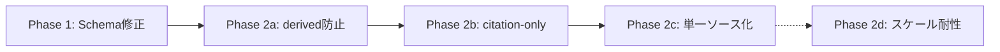

# Sb_CITATION_NETWORK: 引用ネットワーク統合

> **Status**: ALL-PHASES-COMPLETE（Phase 1-4実装完了、10.4 推奨タスク全完了）
>
> **Phase 1 Implementation (2024-12-31)**:
> - `RelationType.EVIDENCE_SOURCE` enum追加
> - `load_from_db(task_id)` 拡張: page→page citesエッジのtaskスコープ読み込み
> - `get_materials.json` スキーマ更新: evidence_graph.edges詳細定義
>
> **Phase 2 Implementation (2024-12-31)**:
> - `load_from_db(task_id)` 拡張: derived EVIDENCE_SOURCE (Claim→Page) エッジをin-memoryで構築
> - fragment→claim + fragments.page_id から (claim_id, page_id) ペアを派生
> - 同一ペアは1本のエッジに正規化（重複排除）
> - DB永続化なし（in-memory only）
> - フルトラバーサル可能: Claim → Page → Cited Page
>
> **Phase 3 Implementation (2024-12-31)**:
> - `get_materials` MCP ツールに `include_citations` オプション追加
> - `_collect_citation_network` 関数でタスクスコープの引用ネットワークを収集
> - `citation_network` オブジェクト: `source_pages`, `citations`, `hub_pages`
> - `hub_pages` は被引用数上位10ページ（ハブ分析用）
>
> **Phase 4 Implementation (2024-12-31)**:
> - `EvidenceGraph.calculate_pagerank()`: ノードの重要度スコア（PageRankアルゴリズム）
> - `EvidenceGraph.calculate_betweenness_centrality()`: ノードの媒介中心性（ブリッジノード特定）
> - `EvidenceGraph.get_citation_hub_pages()`: 被引用数上位ページの取得
> - node_type_filterオプションでPAGEノードのみに絞り込み可能
>
> **Related ADRs**:
> - [ADR-0005: Evidence Graph Structure](adr/0005-evidence-graph-structure.md) - エビデンスグラフ設計
> - [ADR-0008: Academic Data Source Strategy](adr/0008-academic-data-source-strategy.md) - 学術API戦略
>
> **Related Debug Sessions**:
> - [DEBUG_E2E_02](debug/DEBUG_E2E_02.md) - 引用ネットワーク課題の特定
> - [DEBUG_E2E_03](debug/DEBUG_E2E_03.md) - Claim抽出パイプライン分析

---

## 1. 背景と課題

### 1.1 現状のデータ構造

DEBUG_E2E_02/03のセッションで、以下のデータ状態が確認された：

| エッジ種別 | 件数 | 用途 |
|-----------|------|------|
| cites | 179 | 学術論文間の引用関係（page→page） |
| neutral | 111 | Claim-Fragment関係（NLI判定） |
| supports | 18 | Claim-Fragment関係（NLI判定） |
| refutes | 2 | Claim-Fragment関係（NLI判定） |

**引用ネットワークの規模**:
- 引用元ページ（citing）: 32
- 被引用ページ（cited）: 68
- ユニークページ総数: 92
- データソース: Semantic Scholar (120件), OpenAlex (59件)

### 1.2 特定された問題

#### 問題1: CITESエッジがNetworkXグラフに読み込まれない

`src/filter/evidence_graph.py:EvidenceGraph.load_from_db` の現在の実装：

```python
# Filter by task via claims
edges = await db.fetch_all(
    """
    SELECT e.* FROM edges e
    WHERE e.source_type = 'claim' AND e.source_id IN (
        SELECT id FROM claims WHERE task_id = ?
    )
    OR e.target_type = 'claim' AND e.target_id IN (
        SELECT id FROM claims WHERE task_id = ?
    )
    """,
    (task_id, task_id),
)
```

**問題**: `cites` エッジは `page→page` であり、上記クエリの条件に該当しないため読み込まれない。

> **重要（実装上の現実）**:
> - `page→page` の `cites` は **すでにDBに永続化されている**（例: `src/research/pipeline.py` が学術APIの citation graph を取り込み、`edges` に保存）。
> - 欠けているのは「生成」ではなく **taskスコープでの `load_from_db` 読み込み条件**である。

#### 問題2: Claim→Pageの経路が暗黙的

現在の経路：
```
Claim ←─(edge)─ Fragment ─(page_id FK)→ Page ─(cites edge)→ Cited Page
```

- `Fragment.page_id` はリレーショナルな外部キーであり、NetworkXグラフのエッジではない
- グラフアルゴリズム（PageRank, 中心性分析）がClaim起点で使えない

#### 問題3: get_materialsに引用情報がない

`get_materials` MCPツールは以下を返却：
- claims
- fragments
- evidence_graph（fragment→claimエッジのみ）

**欠落**: 引用ネットワーク（page→pageのcitesエッジ）

---

## 2. 目標

| 目標 | 説明 |
|------|------|
| **NetworkXグラフでのフルトラバーサル** | Claim→Fragment→Page→Cited Pageを一貫してグラフ操作で辿れる |
| **PageRank/中心性分析** | 高被引用論文の特定、影響力分析が可能 |
| **get_materialsでの引用情報返却** | MCPツールとして完結した情報提供 |
| **グラフ可視化対応** | NetworkX構造をD3.js等に直接渡せる |

---

## 2.1 スコープ（実装者が迷わないための決定）

このドキュメントは「迷わず実装できる仕様」を固定する。

- **Phase 1**: task_idスコープで `page→page` の `cites` を EvidenceGraph に読み込む
  - `get_materials(options.include_graph=true)` の `evidence_graph` に citation network が含まれる
- **Phase 2**: Claim起点で `Claim → Page → Cited Page` を辿れるように、**Claim→Page の明示エッジ**をグラフ上に持つ
- **Phase 3**: `get_materials(options.include_citations=true)` で `citation_network`（source_pages/citations/hub_pages）を返す
- **Phase 4**: PageRank / 中心性分析メソッドを `EvidenceGraph` に追加する

非ゴール:（やらない）
- DBスキーマに `task_id` を追加して `edges/pages/fragments` をタスク所有に寄せる（ADR-0005の方針に反する）
- `load_from_db` で citation network のトランジティブ・クローズ（無制限の多段展開）を自動計算する

## 3. 設計

### 3.1 新エッジ種別: EVIDENCE_SOURCE

**定義**: Claimがこのページのエビデンスに基づくことを示す明示的なエッジ

```
Claim ──(EVIDENCE_SOURCE)──▶ Page
```

**生成ロジック（決定）**: 既存の `fragment→claim` エッジと `fragments.page_id` から **派生（derived）** して作る。

- **Phase 2のデフォルト**: `EVIDENCE_SOURCE` は **DBには永続化しない（in-memory derived edge）**
  - 理由: `edges` は task_id を持たないグローバル共有で、claim数×page数の増殖を起こしやすい
  - `get_materials(include_graph=true)` のためには、NetworkX上に存在すれば十分
- **スコープ外（DB永続化）**: 本Phaseでは in-memory のみ。将来DB永続が必要になった場合は (claim_id, page_id) で安定ID + upsert で増殖を防ぐ

派生の具体:
- 入力: `edges(source_type='fragment', target_type='claim')`（relation = supports/refutes/neutral）
- 参照: `fragments.id → fragments.page_id`
- 出力: `claim_id → page_id` の `EVIDENCE_SOURCE`（重複は1本に正規化）

**コード更新**:

```python
# src/filter/evidence_graph.py
class RelationType(str, Enum):
    SUPPORTS = "supports"
    REFUTES = "refutes"
    CITES = "cites"
    NEUTRAL = "neutral"
    EVIDENCE_SOURCE = "evidence_source"  # NEW
```

### 3.2 load_from_db拡張

#### 3.2.1 要求仕様（MUST）

`EvidenceGraph.load_from_db(task_id=...)` は taskのclaim起点で作る “サブグラフ” として、最低限次を満たす。

- **Claim関連エッジ（既存）**: claimに接続する edges（fragment→claim など）は現状どおり読み込む
- **CITES（page→page）**: taskの根拠ページ（source pages）から出る `cites` を読み込む
- **EVIDENCE_SOURCE（Claim→Page, derived）**: Claim→Page をグラフ上に追加し、Claim起点で citation network に到達できるようにする

#### 3.2.2 taskスコープの切り方（global data を “slice” する）

Phase 1の source pages 定義（決定）:

- `source_page_ids` = タスクのclaimsに接続している fragments を辿り、`fragments.page_id` をDISTINCTで集めたもの

具体（概念）:

- task_claim_ids: `SELECT id FROM claims WHERE task_id = ?`
- fragment_ids: `SELECT DISTINCT e.source_id FROM edges e WHERE e.source_type='fragment' AND e.target_type='claim' AND e.target_id IN (task_claim_ids)`
- source_page_ids: `SELECT DISTINCT f.page_id FROM fragments f WHERE f.id IN (fragment_ids) AND f.page_id IS NOT NULL`

#### 3.2.3 `cites` の読み込み範囲（決定）

- `edges.relation='cites'` かつ **page→page のみ**（`source_type='page' AND target_type='page'`）
- Phase 1は **出辺のみ**（`source_id IN source_page_ids`）
  - “Claim→根拠Page→被引用Page” の 1-hop を確実にするため

#### 3.2.4 擬似コード（実装ポイント固定）

```python
async def load_from_db(self, task_id: str | None = None) -> None:
    if task_id:
        # A) Claim関連エッジ（既存）
        # NOTE: OR は必ず括弧で囲み、意図しないスコープ拡大を防ぐ
        claim_edges = await db.fetch_all(
            """
            SELECT e.* FROM edges e
            WHERE (
                e.source_type = 'claim' AND e.source_id IN (
                    SELECT id FROM claims WHERE task_id = ?
                )
            ) OR (
                e.target_type = 'claim' AND e.target_id IN (
                    SELECT id FROM claims WHERE task_id = ?
                )
            )
            """,
            (task_id, task_id),
        )
        edges = claim_edges
        
        # B) source_page_ids（taskのclaimsに接続した fragments の page_id）
        page_ids = await db.fetch_all(
            """
            SELECT DISTINCT f.page_id
            FROM fragments f
            JOIN edges e ON e.source_id = f.id AND e.source_type = 'fragment'
            JOIN claims c ON e.target_id = c.id AND e.target_type = 'claim'
            WHERE c.task_id = ?
              AND f.page_id IS NOT NULL
            """,
            (task_id,),
        )
        
        # C) これらのPageからの page->page cites を読み込み
        if page_ids:
            cites_edges = await db.fetch_all(
                f"""
                SELECT e.* FROM edges e
                WHERE e.relation = 'cites'
                  AND e.source_type = 'page' AND e.target_type = 'page'
                  AND e.source_id IN ({','.join('?' * len(page_ids))})
                """,
                tuple(p["page_id"] for p in page_ids),
            )
            edges = edges + cites_edges

        # D) derived EVIDENCE_SOURCE（Claim->Page）
        # - fragment->claim edges + fragments.page_id から (claim_id, page_id) を正規化して追加する
        # - Phase 2ではDBへ永続化しない（in-memoryのみ）
```

> 注意:
> - placeholder生成は必ずパラメータバインドで行い、値は文字列連結しない
> - `page_ids` は list[Row] なので `p["page_id"]` を取り出す（NULLは除外済み）

### 3.3 get_materials拡張

#### 新オプション: include_citations

> 実装メモ（wiringの落とし穴）:
> - MCPの `get_materials` は引数が `options` ネストになっている（`options.include_graph` が現行）
> - したがって `include_citations` を追加する場合も `options.include_citations` として追加し、
>   `src/mcp/server.py` → `src/research/materials.py:get_materials_action` に渡す必要がある

```python
async def get_materials_action(
    task_id: str,
    include_graph: bool = False,
    include_citations: bool = False,  # NEW
    format: str = "structured",
) -> dict[str, Any]:
```

#### 新レスポンス構造: citation_network

```python
async def _collect_citation_network(db: Any, task_id: str) -> dict[str, Any]:
    """Collect citation network reachable from task's claims."""
    
    # タスクに関連するページを取得
    source_pages = await db.fetch_all("""
        SELECT DISTINCT p.id, p.title, p.url, p.domain,
               json_extract(p.paper_metadata, '$.citation_count') as citation_count,
               json_extract(p.paper_metadata, '$.year') as year
        FROM pages p
        JOIN fragments f ON f.page_id = p.id
        JOIN edges e ON e.source_id = f.id AND e.source_type = 'fragment'
        JOIN claims c ON e.target_id = c.id AND e.target_type = 'claim'
        WHERE c.task_id = ?
    """, (task_id,))
    
    page_ids = [p["id"] for p in source_pages]
    
    # 引用エッジを取得
    citations = []
    if page_ids:
        citations = await db.fetch_all("""
            SELECT 
                e.id as edge_id,
                e.source_id as citing_page_id,
                e.target_id as cited_page_id,
                e.citation_source,
                p.title as cited_title
            FROM edges e
            JOIN pages p ON e.target_id = p.id
            WHERE e.relation = 'cites'
              AND e.source_type = 'page' AND e.target_type = 'page'
              AND e.source_id IN ({placeholders})
        """.format(placeholders=','.join('?' * len(page_ids))), tuple(page_ids))
    
    # ハブページ（被引用数トップ）を計算（taskスコープ: source pages からの出辺のみで集計）
    hub_pages = await db.fetch_all("""
        SELECT 
            e.target_id as page_id,
            p.title,
            COUNT(*) as cited_by_count
        FROM edges e
        JOIN pages p ON e.target_id = p.id
        WHERE e.relation = 'cites'
          AND e.source_type = 'page' AND e.target_type = 'page'
          AND e.source_id IN ({placeholders})
        GROUP BY e.target_id
        ORDER BY cited_by_count DESC
        LIMIT 10
    """.format(placeholders=','.join('?' * len(page_ids))), tuple(page_ids))
    
    return {
        "source_pages": [dict(p) for p in source_pages],
        "citations": [dict(c) for c in citations],
        "hub_pages": [dict(h) for h in hub_pages],
    }
```

#### レスポンススキーマ更新

`src/mcp/schemas/get_materials.json` に追加：

```json
{
  "citation_network": {
    "type": ["object", "null"],
    "description": "Citation network reachable from task's claims. Only included when include_citations=true.",
    "properties": {
      "source_pages": {
        "type": "array",
        "description": "Pages that are evidence sources for this task's claims",
        "items": {
          "type": "object",
          "properties": {
            "id": {"type": "string"},
            "title": {"type": "string"},
            "url": {"type": "string"},
            "citation_count": {"type": ["integer", "null"]},
            "year": {"type": ["integer", "null"]}
          }
        }
      },
      "citations": {
        "type": "array",
        "description": "Citation edges from source pages",
        "items": {
          "type": "object",
          "properties": {
            "edge_id": {"type": "string"},
            "citing_page_id": {"type": "string"},
            "cited_page_id": {"type": "string"},
            "cited_title": {"type": "string"},
            "citation_source": {"type": "string", "enum": ["semantic_scholar", "openalex", "extraction"]}
          }
        }
      },
      "hub_pages": {
        "type": "array",
        "description": "Highly-cited pages in this network",
        "items": {
          "type": "object",
          "properties": {
            "page_id": {"type": "string"},
            "title": {"type": "string"},
            "cited_by_count": {"type": "integer"}
          }
        }
      }
    }
  }
}
```

### 3.4 グラフ分析機能

補足:
- 現行の `src/filter/evidence_graph.py` には citation network の健全性分析（loops / round-trips / integrity report）が既にある。
- PageRank/中心性は **用途が明確になったタイミングで追加**し、既存指標と重複しない形で導入する。

追加する場合は `src/filter/evidence_graph.py` に実装する：

```python
def calculate_pagerank(self, alpha: float = 0.85) -> dict[str, float]:
    """Calculate PageRank for all page nodes.
    
    Args:
        alpha: Damping factor (default 0.85).
        
    Returns:
        Dict mapping page_id to PageRank score.
    """
    # CITESエッジのみのサブグラフを抽出
    page_nodes = [
        n for n in self._graph.nodes()
        if self._graph.nodes[n].get("node_type") == NodeType.PAGE.value
    ]
    citation_subgraph = self._graph.subgraph(page_nodes).copy()
    
    # PageRankを計算
    pagerank = nx.pagerank(citation_subgraph, alpha=alpha)
    
    # obj_idにマッピング
    return {
        self._parse_node_id(node_id)[1]: score
        for node_id, score in pagerank.items()
    }

def calculate_betweenness_centrality(self) -> dict[str, float]:
    """Calculate betweenness centrality for all page nodes.
    
    Returns:
        Dict mapping page_id to centrality score.
    """
    page_nodes = [
        n for n in self._graph.nodes()
        if self._graph.nodes[n].get("node_type") == NodeType.PAGE.value
    ]
    citation_subgraph = self._graph.subgraph(page_nodes).copy()
    
    centrality = nx.betweenness_centrality(citation_subgraph)
    
    return {
        self._parse_node_id(node_id)[1]: score
        for node_id, score in centrality.items()
    }

def get_citation_hub_pages(self, top_n: int = 10) -> list[dict[str, Any]]:
    """Get pages with highest citation influence.
    
    Combines PageRank and in-degree for ranking.
    
    Args:
        top_n: Number of top pages to return.
        
    Returns:
        List of page dicts with influence metrics.
    """
    pagerank = self.calculate_pagerank()
    
    results = []
    for node_id in self._graph.nodes():
        node_data = self._graph.nodes[node_id]
        if node_data.get("node_type") != NodeType.PAGE.value:
            continue
            
        _, page_id = self._parse_node_id(node_id)
        in_degree = self._graph.in_degree(node_id)
        
        results.append({
            "page_id": page_id,
            "pagerank": pagerank.get(page_id, 0.0),
            "cited_by_count": in_degree,
            "title": node_data.get("title", ""),
            "year": node_data.get("year"),
        })
    
    # PageRankでソート
    results.sort(key=lambda x: x["pagerank"], reverse=True)
    return results[:top_n]
```

---

## 4. 実装計画

### Phase 1: EvidenceGraph 読み込み修正

| タスク | ファイル | 内容 |
|--------|---------|------|
| 1.1 | `src/filter/evidence_graph.py` | `RelationType.EVIDENCE_SOURCE` 追加（Phase 2の前倒しで入れてOK） |
| 1.2 | `src/filter/evidence_graph.py` | `load_from_db(task_id)` を拡張し、taskスコープの `page→page cites` を読み込む |
| 1.3 | `src/mcp/server.py` / `src/mcp/schemas/get_materials.json` | `evidence_graph.edges[].relation` のenumに `evidence_source` を追加（Phase 2までに必須） |

### Phase 2: Claim→Page の明示（EVIDENCE_SOURCE, derived）

| タスク | ファイル | 内容 |
|--------|---------|------|
| 2.1 | `src/filter/evidence_graph.py` | `load_from_db(task_id)` 内で `fragment→claim + fragments.page_id` から derived `EVIDENCE_SOURCE` を構築（in-memory, DB非永続） |

### Phase 3: get_materials拡張

| タスク | ファイル | 内容 |
|--------|---------|------|
| 3.1 | `src/research/materials.py` | `include_citations` オプション追加 |
| 3.2 | `src/research/materials.py` | `_collect_citation_network` 関数追加 |
| 3.3 | `src/mcp/schemas/get_materials.json` | スキーマ更新 |
| 3.4 | `src/mcp/server.py` | ハンドラー更新 |

### Phase 4: グラフ分析機能

| タスク | ファイル | 内容 |
|--------|---------|------|
| 4.1 | `src/filter/evidence_graph.py` | `calculate_pagerank` 追加 |
| 4.2 | `src/filter/evidence_graph.py` | `calculate_betweenness_centrality` 追加 |
| 4.3 | `src/filter/evidence_graph.py` | `get_citation_hub_pages` 追加 |
| 4.4 | テスト | グラフ分析のユニットテスト |

---

## 5. データフロー図

### 現状 vs 提案

```
【現状】
Claim ←──(supports/refutes/neutral)── Fragment
                                         │
                                      page_id (FK)
                                         │
                                         ▼
                                       Page ──(cites)──▶ Cited Page
                                                            ↑
                                                   NetworkXに読み込まれない

【提案】
Claim ←──(supports/refutes/neutral)── Fragment
  │                                       │
  │                                    page_id (FK)
  │                                       │
  └──(EVIDENCE_SOURCE)──────────────────▶ Page ──(cites)──▶ Cited Page
                                                              ↑
                                                   NetworkXに読み込まれる
```

### MCPツールフロー

```
get_materials(task_id, options={include_graph=true, include_citations=true})
    │
    ├─▶ _collect_claims()        → claims[]
    ├─▶ _collect_fragments()     → fragments[]
    ├─▶ _build_evidence_graph()  → evidence_graph{}
    │       └── 含む: supports/refutes/neutral + EVIDENCE_SOURCE + cites
    └─▶ _collect_citation_network() → citation_network{}  【NEW】
            ├── source_pages[]
            ├── citations[]
            └── hub_pages[]
```

---

## 6. 期待される効果

| 効果 | 説明 |
|------|------|
| **グラフ一貫性** | Claim起点でPage→Cited Pageまで一貫したトラバーサル |
| **影響力分析** | PageRankにより高影響力論文を特定、レポート品質向上 |
| **可視化対応** | NetworkX構造をそのままD3.js/Graphvizに渡せる |
| **MCPツール完結** | `get_materials` のみで引用情報も取得可能 |

---

## 7. モジュール間の伝播（Wiring）チェックリスト（実装者向け）

「値を追加したが下流に渡っていない」を防ぐため、変更が必要な境界を固定する。

### 7.1 DB → EvidenceGraph（load）

- **入力（DB）**:
  - `claims.task_id`（taskスライスの起点）
  - `edges`（fragment→claim / page→page cites）
  - `fragments.page_id`（fragment→page の暗黙リンク）
  - `pages.paper_metadata`（year/doi/venue/source_api 等）
- **変換（EvidenceGraph）**:
  - `load_from_db(task_id)` で claim_edges + cites_edges を読み込む
  - derived `EVIDENCE_SOURCE`（Claim→Page）を構築する（Phase 2）
- **出力（NetworkX / to_dict）**:
  - `to_dict()` の `edges` に `cites` と `evidence_source` が混在する

### 7.2 EvidenceGraph → get_materials（materials_action）

- `src/research/materials.py:_build_evidence_graph` は `EvidenceGraph.load_from_db` → `to_dict()` を返す
- したがって citation network を `get_materials(include_graph=true)` に載せる最短ルートは **`load_from_db` を直すこと**

### 7.3 get_materials → MCP schema（server / json schema）

追加フィールド/新relationがある場合は、必ず両方更新する。

- `src/mcp/server.py`
  - `Tool(name="get_materials")` の `inputSchema` / `outputSchema`
  - `_handle_get_materials` の引数伝播（`options.include_*` → `get_materials_action`）
- `src/mcp/schemas/get_materials.json`
  - レスポンススキーマ（外部/テスト/ドキュメント用途）

---

## 8. 受け入れ条件（Doneの定義）

Phase 1:
- `get_materials(options.include_graph=true)` の `evidence_graph.edges` に `relation='cites'` の **page→page** エッジが含まれる
- 引用データが存在するタスクで `evidence_graph.stats.edge_counts.cites > 0` になる

Phase 2:
- `evidence_graph.edges` に `relation='evidence_source'` が含まれる（Claim→Page）
- Claim起点に `Claim → Page → Cited Page` がグラフ経由で辿れる（フルトラバーサル）

Phase 3:
- `get_materials(options.include_citations=true)` で `citation_network.source_pages/citations/hub_pages` が返る

Phase 4:
- `EvidenceGraph.calculate_pagerank()` / `calculate_betweenness_centrality()` / `get_citation_hub_pages()` が動作する

---

## 9. 参照

| ドキュメント | 用途 |
|-------------|------|
| [ADR-0005: Evidence Graph Structure](adr/0005-evidence-graph-structure.md) | グラフ構造定義 |
| [ADR-0008: Academic Data Source Strategy](adr/0008-academic-data-source-strategy.md) | 学術APIからの引用取得 |
| [DEBUG_E2E_02](debug/DEBUG_E2E_02.md) | 課題特定セッション |
| [DEBUG_E2E_03](debug/DEBUG_E2E_03.md) | Claim抽出分析 |
| `src/filter/evidence_graph.py` | 現在のグラフ実装 |
| `src/research/materials.py` | get_materials実装 |

---

## 10. 実装レビュー（静的レビュー結果 / 2025-12-31）

本セクションは **実装が「実際に機能する状態」になっているか**を、コードとスキーマの整合・スコープ設計・永続化方針（ADR-0005）に照らしてレビューした結果をまとめる。
（実装修正は本ドキュメントのスコープ外だが、**ベストな解決方針**を提案として明記する。）

### 10.1 期待どおりに動作している点（Phase 1〜3の配線）

- **Phase 1（CITES読み込み）**: `EvidenceGraph.load_from_db(task_id)` が task の claims → fragments → `fragments.page_id` を起点に、`page→page` の `cites`（出辺のみ）を読み込む。
- **Phase 2（derived EVIDENCE_SOURCE）**: `fragment→claim`（supports/refutes/neutral）と `fragments.page_id` から `Claim→Page` の `evidence_source` を **重複排除して in-memory 生成**する。
  - これは ADR-0005 の「EVIDENCE_SOURCE はDB非永続（derived）」と整合する。
- **Phase 3（get_materials include_citations）**: `get_materials_action(include_citations=true)` が `citation_network`（`source_pages/citations/hub_pages`）を返す。
- **テスト**: 上記の wiring/effect を `tests/test_evidence_graph.py` / `tests/test_materials_citations.py` がカバーしている（配線抜け事故の予防に有効）。

### 10.2 重大リスク: MCPツールスキーマの不整合（実害になり得る）

実装はデータを返していても、**MCPツール定義の schema と不整合**だと「クライアント側で受け取れない / バリデーションで落ちる / UIに出ない」可能性がある。

#### 10.2.1 `get_materials` の outputSchema（`src/mcp/server.py`）と実際のレスポンスがズレている

- **`citation_network` が outputSchema に存在しない**:
  - `src/research/materials.py` は `include_citations=true` で `citation_network` を返すが、
    `src/mcp/server.py` の `Tool(name="get_materials")` outputSchema に `citation_network` が定義されていない。
- **`evidence_graph.edges[].relation` の enum に `evidence_source` が無い**:
  - Phase 2で `evidence_source` を返し得るのに、`server.py` 側の enum が `supports/refutes/neutral/cites` のままになり得る。
- **`evidence_graph.nodes[]` の形が厳しすぎる**:
  - `EvidenceGraph.to_dict()` の node は `{id, node_type, obj_id, ...}` 系だが、`server.py` は `{id, type, label}` を期待する形になり得る。
  - この不整合は「グラフは生成されているのに、MCP境界で破綻する」典型パターン。

> 重要:
> - `src/mcp/schemas/get_materials.json` はドキュメント/外部用途に有用だが、**実運用の境界は `src/mcp/server.py` の Tool schema**である。
> - したがって “両方を更新する” だけでなく、**ズレが構造的に起きない仕組み**が必要になる（10.4参照）。

### 10.3 設計上の注意点（機能は動くが、意図とズレやすい）

#### 10.3.1 Phase 4のグラフ分析が「citation network」ではなく「全グラフ」に混ざる可能性

仕様意図は「citation network の影響力分析（page→page cites を中心）」である。
しかし実装が `nx.pagerank(self._graph)` / `nx.betweenness_centrality(self._graph)` のように **全ノード・全エッジ**で計算してからフィルタする場合、
Claim/Fragment の構造が Page のスコアに混ざり、解釈が難しくなる。

#### 10.3.2 derived edge（EVIDENCE_SOURCE）がDBへ永続化され得る

ADR-0005 の方針は「EVIDENCE_SOURCE は derived（DB非永続）」である。
`load_from_db()` が in-memory で `evidence_source` を追加する以上、もし `save_to_db()` が呼ばれると **派生エッジまで保存される**経路が生まれる。
（現時点で必ず起きるとは限らないが、設計上の事故ポイント。）

#### 10.3.3 スケール時のSQLite `IN (...)` のパラメータ上限

`source_page_ids` / `page_ids` が増えた場合、SQLite の変数上限（典型: 999）に達しうる。
E2E規模では問題にならなくても、将来的なタスク規模で地雷化しやすい。

#### 10.3.4 `json_extract(p.paper_metadata, ...)` の堅牢性

`paper_metadata` が NULL/JSON以外の値を含む場合、SQLiteのJSON関数が失敗する可能性がある。
`include_citations=true` が `get_materials` 全体の失敗原因になり得るため、境界での耐障害性が重要。

### 10.4 推奨: 実装タスク（フェーズ分解）

10.4.2 を4つの独立したフェーズに分解。優先度順に実装し、最小修正で実害を止めてから構造改善に進む。



- **Phase 1 → Phase 2a → Phase 2b** は依存なし、並列実装可
- **Phase 2c** は Phase 1 完了後に着手（Phase 1 の修正が JSON に反映される前提）
- **Phase 2d** は将来タスクとして後回し可

---

#### 10.4.1 Phase 1: MCPスキーマ不整合の修正（最小修正） ✅ COMPLETED

**目的**: `get_materials` の outputSchema を実装実態に合わせ、スキーマバリデーション落ち/クライアント非表示を防ぐ。

**対象ファイル**: `src/mcp/server.py` L620-760付近

**実装完了 (2025-12-31)**:
- `evidence_graph.edges[].relation` enum に `"evidence_source"` を追加
- `evidence_graph.nodes[]` を `EvidenceGraph.to_dict()` 形式（`node_type`, `obj_id`）に修正
- `evidence_graph.stats` プロパティを追加
- `evidence_graph.edges[]` に optional フィールド（`edge_id`, `citation_source`, `citation_context`, `source_domain_category`, `target_domain_category`）を追加
- `citation_network` プロパティを追加（`source_pages`, `citations`, `hub_pages`）
- nullable フィールド（`citation_count`, `year`, `cited_title` 等）で耐障害性を確保
- テスト: `tests/test_mcp_get_materials_schema.py` で配線検証

---

#### 10.4.2 Phase 2a: derived edge 永続化防止 ✅ COMPLETED

**目的**: ADR-0005 の「EVIDENCE_SOURCE は DB 非永続」を保証し、将来の事故を防止。

**対象ファイル**: `src/filter/evidence_graph.py` L1086-1125

**実装完了 (2025-12-31)**:
- `save_to_db()` の for ループ先頭に `evidence_source` スキップ条件を追加
- スキップしたエッジ数をログ出力（`skipped_derived_count`）
- docstring に ADR-0005 への参照を追加
- テスト: `tests/test_evidence_graph.py::TestSaveToDbDerivedEdgeSkip` で 6 ケースをカバー

**備考**: 現在 `save_to_db()` はどこからも呼ばれていないが、将来の呼び出し追加時の事故防止として入れる。

---

#### 10.4.3 Phase 2b: citation-only 分析（PageRank/Betweenness の対象修正） ✅ COMPLETED

**目的**: グラフ分析が「citation network（PAGE + CITES）」を対象にするようにし、Claim/Fragment の構造が混ざらないようにする。

**対象ファイル**: `src/filter/evidence_graph.py` L963-1034

**変更内容**:
`calculate_pagerank()` / `calculate_betweenness_centrality()` に `citation_only: bool = True` パラメータを追加し、デフォルトで PAGE ノード + CITES エッジのサブグラフを抽出してから計算する。

```python
def calculate_pagerank(
    self,
    node_type_filter: NodeType | None = None,
    alpha: float = 0.85,
    citation_only: bool = True,  # NEW: default True
) -> dict[str, float]:
    if self._graph.number_of_nodes() == 0:
        return {}

    # Extract citation subgraph if requested
    if citation_only:
        page_nodes = [
            n for n in self._graph.nodes()
            if self._graph.nodes[n].get("node_type") == NodeType.PAGE.value
        ]
        subgraph = self._graph.subgraph(page_nodes).copy()
        # Further filter to CITES edges only
        edges_to_remove = [
            (u, v) for u, v, d in subgraph.edges(data=True)
            if d.get("relation") != RelationType.CITES.value
        ]
        subgraph.remove_edges_from(edges_to_remove)
        target_graph = subgraph
    else:
        target_graph = self._graph

    scores = nx.pagerank(target_graph, alpha=alpha)
    # ... rest of filtering logic ...
```

**所要時間**: 1時間（テスト含む）

---

#### 10.4.4 Phase 2c: MCPスキーマ単一ソース化 ✅ COMPLETED

**目的**: `server.py` と `schemas/*.json` の二重管理を解消し、ズレの再発を構造的に防止。

**対象ファイル**:
- `src/mcp/server.py`
- `src/mcp/schemas/*.json`

**設計選択肢**:

| 案 | 実装方法 | メリット | デメリット |
|---|---|---|---|
| **A（採用）** | `server.py` が起動時に `schemas/*.json` を読み込み、Tool の outputSchema に使う | 最小変更、既存 JSON 活用 | 起動時I/O |
| B | pydantic モデルから JSON Schema を生成 | 型安全 | 大規模リファクタ |

**実装完了 (2026-01-01)**:

全10ツールが `_load_schema()` を使用:

| ツール | `_load_schema()` 使用 |
|--------|:--------------------:|
| `create_task` | ✅ |
| `get_status` | ✅ |
| `queue_searches` | ✅ |
| `stop_task` | ✅ |
| `get_materials` | ✅ |
| `calibration_metrics` | ✅ |
| `calibration_rollback` | ✅ |
| `get_auth_queue` | ✅ |
| `resolve_auth` | ✅ |
| `feedback` | ✅ |

**⚠️ Cursor MCP 非互換: `oneOf`/`anyOf`/`allOf`**

実装中に発見: Cursor の MCP クライアントは JSON Schema の `oneOf`/`anyOf`/`allOf` をサポートしていない。
これらを使用すると `Found 0 tools` となりツールが認識されない。

**対処**: 該当スキーマ（`calibration_metrics`, `feedback`, `get_auth_queue`, `resolve_auth`）を
シンプルな `type: object` + `properties` 形式にフラット化した。

**実装済みコード**:

```python
# server.py
def _load_schema(name: str) -> dict[str, Any]:
    path = Path(__file__).parent / "schemas" / f"{name}.json"
    with open(path) as f:
        return cast(dict[str, Any], json.load(f))

# 全10ツールに適用
Tool(name="create_task", ..., outputSchema=_load_schema("create_task")),
Tool(name="get_status", ..., outputSchema=_load_schema("get_status")),
# ... 以下同様
```

---

#### 10.4.5 Phase 2d: スケール耐性（後回し可） ✅ COMPLETED

**目的**: IN句の上限と json_extract の堅牢性を改善。

**対象ファイル**:
- `src/filter/evidence_graph.py` L1166-1174, L1222-1238
- `src/research/materials.py` L418-458

**変更内容**:
1. IN句を CHUNK_SIZE（例: 500）でバッチ処理
2. `json_extract` の失敗を try/except でハンドルし、`citation_network` を部分欠損で返す

**備考**: E2E 規模（source_page_ids が数百程度）では問題にならないため、後回し可能。

**所要時間**: 1〜2時間

