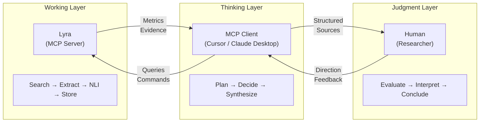

# ADR-0002: Thinking-Working Separation

## Date
2025-11-01 (Updated: 2026-01-03)

## Context

AI-powered research support tools have two broad approaches:

1. **Single AI Model**: One high-performance model handles both planning and execution
2. **Separated Architecture**: Thinking (planning/judgment) and Working (execution) are separated

Problems with the single-model approach:

| Problem | Details |
|---------|---------|
| Cost | Continuous use of GPT-5/Claude 4.5 class models is expensive |
| Latency | Large models respond slowly |
| Local Execution Difficulty | 70B+ models don't run on typical GPUs |

Meanwhile, local small models (3B-7B):
- Can perform mechanical tasks (extraction, classification) with high accuracy
- Struggle with complex reasoning and planning

### Three-Layer Collaboration Model

This architecture extends to a three-layer collaboration model encompassing Lyra, AI, and human researchers:



**Key principle**: Lyra is a *navigation tool*, not a reading tool. It identifies and organizes relevant sources; detailed analysis of primary sources is part of the researcher's tool-assisted workflow. Unlike disposable answer generators, Lyra's evidence graph persists and accumulates value across sessions (see ADR-0001).

## Decision

**Clearly separate "Thinking" and "Working", assigning optimal components to each.**

### Responsibility Matrix

**Important**: Search query "design" is exclusively performed by the MCP client. Lyra does not "suggest candidates."

| Responsibility | MCP Client (Thinking) | Lyra (Working) |
|----------------|----------------------|----------------|
| Query Decomposition | ✅ Query design and prioritization | ❌ Not involved in design |
| Query Generation | ✅ All query design and specification | Mechanical expansion only (synonyms, mirror queries) |
| Exploration Planning | ✅ Plan formulation and decisions | Plan execution and progress reporting |
| Exploration Control | ✅ Next action decisions | Metrics calculation and reporting only |
| Refutation Search | ✅ Refutation query design | Mechanical pattern application (suffix addition, etc.) |
| Stop Decision | ✅ Exploration termination instruction | Stop condition satisfaction reporting |
| Report Structure | ✅ Logical structure and writing decisions | Material provision (fragments, citations) |

### Lyra's Processing Scope

Lyra executes the following **based on MCP client instructions** (does not advance exploration without instructions):

**What it does**:
- Mechanical expansion: Synonym expansion, cross-language mirror queries, operator addition for specified queries
- Retrieval/Extraction pipeline: Search → Fetch → Extract → Rank → NLI
- Metrics calculation: Harvest rate, novelty, sufficiency, duplication rate
- Exception handling: CAPTCHA/block detection, authentication queue addition

**What it does NOT do**:
- Query design or candidate suggestions
- Exploration strategy decisions
- "What should be done next" recommendations

### Interaction Flow

Exploration proceeds in an MCP client-driven loop:

```
1. create_task(hypothesis)
   └─ Lyra: Creates task with central hypothesis (ADR-0017), returns task_id

2. MCP Client: Designs search queries (this judgment is MCP client only)

3. queue_searches(task_id, queries)
   └─ Lyra: Queues searches, returns immediately (ADR-0010)

4. get_status(task_id)
   └─ Lyra: Returns metrics only (no recommendations)
     - Query state (satisfied/partially satisfied/unsatisfied)
     - Novelty score progression
     - Remaining budget

5. MCP Client: Evaluates situation, designs next query (repeats 3-4)

6. queue_searches(task_id, queries_for_refutation)
   └─ Lyra: Queues refutation searches

7. stop_task(task_id)
   └─ Lyra: Records final state to DB

8. query_sql(sql="SELECT * FROM v_contradictions ...") / vector_search(query="...", target="claims")
   └─ Lyra: Provides granular access to evidence graph via SQL and semantic search (per ADR-0016)
   └─ MCP Client: Explores graph iteratively, structures and writes report

**Note**: Per ADR-0017, the task's `hypothesis` is used as context for claim extraction, providing focus for relevant claims. Search queries are designed by the MCP client to find evidence supporting or refuting this hypothesis.
```

### Concrete Example

```
User: "Research the impact of climate change on agricultural productivity"

MCP Client (Thinking):
  1. Instructs search with "climate change agriculture productivity"
  2. Checks metrics via get_status, identifies key papers
  3. Designs and instructs additional query "crop yield climate impact"
  4. Instructs refutation query "climate agriculture productivity criticism"
  5. Synthesizes collected evidence into report

Lyra (Working):
  1. Executes search query, fetches pages
  2. Extracts text, performs NLI judgment
  3. Reports metrics (harvest rate, novelty)
  4. Provides final materials
```

## Consequences

### Positive
- **Cost Optimization**: High-cost models for thinking only, work done locally
- **Quality Assurance**: Each component focuses on its strengths
- **Flexibility**: MCP client can be freely chosen
- **Local Execution**: Aligned with ADR-0001 Zero OpEx principle

### Negative
- **Client Dependency**: Overall quality depends on MCP client quality
- **Communication Overhead**: MCP protocol exchanges occur
- **Design Complexity**: Responsibility boundary design required

## Alternatives Considered

| Alternative | Pros | Cons | Decision |
|-------------|------|------|----------|
| Single Local LLM | Simple | Low reasoning quality | Rejected |
| Single Cloud API | High quality | High cost, Zero OpEx violation | Rejected |
| Agent Framework (LangChain, etc.) | Flexible | Over-abstraction, MCP incompatible | Rejected |

## Related

- [ADR-0001: Local-First / Zero OpEx](0001-local-first-zero-opex.md) - Foundation for local execution and cost constraints
- [ADR-0017: Task Hypothesis-First Architecture](0017-task-hypothesis-first.md) - Hypothesis-driven exploration; researchers formulate hypotheses, Lyra finds evidence
- [System Architecture](../architecture.md) - Detailed component diagram
- MCP Specification: https://modelcontextprotocol.io
