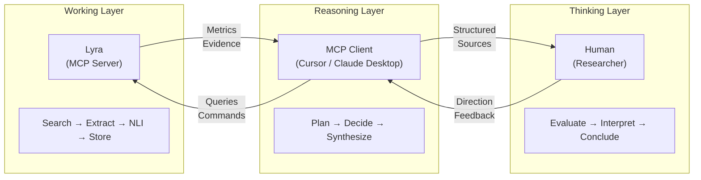
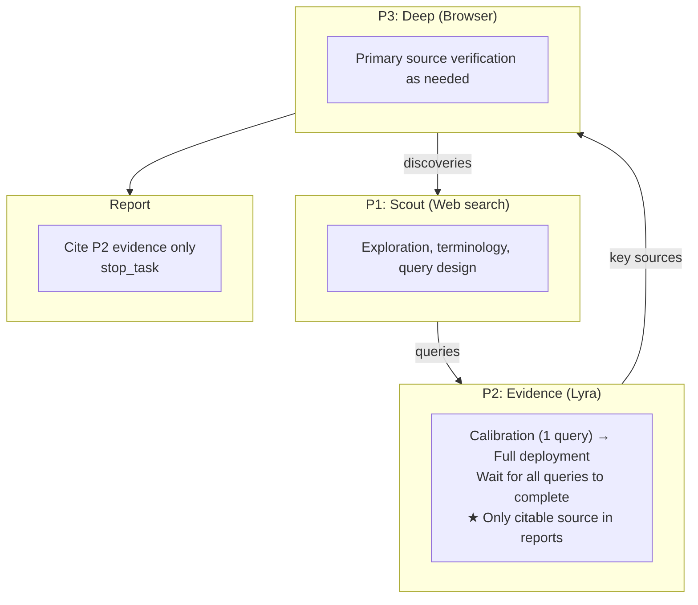
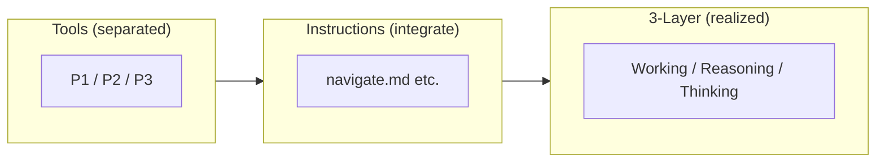

# ADR-0002: Three-Layer Collaboration Model

## Date
2025-11-01 (Updated: 2026-01-07)

## Context

AI-powered research support tools have two broad approaches:

1. **Single AI Model**: One high-performance model handles both planning and execution
2. **Separated Architecture**: Thinking (planning/judgment) and Working (execution) are separated

Problems with the single-model approach:

| Problem | Details |
|---------|---------|
| Cost | Continuous use of GPT-5/Claude 4.5 class models is expensive |
| Latency | Large models respond slowly |
| Local Execution Difficulty | 70B+ models don't run on typical GPUs |

Meanwhile, local small models (3B-7B):
- Can perform mechanical tasks (extraction, classification) with high accuracy
- Struggle with complex reasoning and planning

### Three-Layer Collaboration Model

This architecture extends to a three-layer collaboration model encompassing Lyra, AI, and human researchers:



**Key principle**: Lyra is a *navigation tool*, not a reading tool. It identifies and organizes relevant sources; detailed analysis of primary sources is part of the researcher's tool-assisted workflow. Unlike disposable answer generators, Lyra's evidence graph persists and accumulates value across sessions (see ADR-0001).

## Decision

**Clearly separate "Thinking" and "Working", assigning optimal components to each.**

### Responsibility Matrix

**Important**: Search query "design" is exclusively performed by the MCP client. Lyra does not "suggest candidates."

| Responsibility | MCP Client (Reasoning) | Lyra (Working) |
|----------------|----------------------|----------------|
| Query Decomposition | ✅ Query design and prioritization | ❌ Not involved in design |
| Query Generation | ✅ All query design and specification | Mechanical expansion only (synonyms, mirror queries) |
| Exploration Planning | ✅ Plan formulation and decisions | Plan execution and progress reporting |
| Exploration Control | ✅ Next action decisions | Metrics calculation and reporting only |
| Refutation Search | ✅ Refutation query design | Mechanical pattern application (suffix addition, etc.) |
| Stop Decision | ✅ Exploration termination instruction | Stop condition satisfaction reporting |
| Report Structure | ✅ Logical structure and writing decisions | Material provision (fragments, citations) |

### Lyra's Processing Scope

Lyra executes the following **based on MCP client instructions** (does not advance exploration without instructions):

**What it does**:
- Mechanical expansion: Synonym expansion, cross-language mirror queries, operator addition for specified queries
- Retrieval/Extraction pipeline: Search → Fetch → Extract → Rank → NLI
- Metrics calculation: Harvest rate, novelty, sufficiency, duplication rate
- Exception handling: CAPTCHA/block detection, authentication queue addition

**What it does NOT do**:
- Query design or candidate suggestions
- Exploration strategy decisions
- "What should be done next" recommendations

### Interaction Flow

Exploration proceeds in an MCP client-driven loop:

```
1. create_task(hypothesis)
   └─ Lyra: Creates task with central hypothesis (ADR-0017), returns task_id

2. MCP Client: Designs search queries (this judgment is MCP client only)

3. queue_searches(task_id, queries)
   └─ Lyra: Queues searches, returns immediately (ADR-0010)

4. get_status(task_id)
   └─ Lyra: Returns metrics only (no recommendations)
     - Query state (satisfied/partially satisfied/unsatisfied)
     - Novelty score progression
     - Remaining budget

5. MCP Client: Evaluates situation, designs next query (repeats 3-4)

6. queue_searches(task_id, queries_for_refutation)
   └─ Lyra: Queues refutation searches

7. stop_task(task_id)
   └─ Lyra: Records final state to DB

8. query_sql(sql="SELECT * FROM v_contradictions ...") / vector_search(query="...", target="claims")
   └─ Lyra: Provides granular access to evidence graph via SQL and semantic search (per ADR-0016)
   └─ MCP Client: Explores graph iteratively, structures and writes report

**Note**: Per ADR-0017, the task's `hypothesis` is used as context for claim extraction, providing focus for relevant claims. Search queries are designed by the MCP client to find evidence supporting or refuting this hypothesis.
```

### Concrete Example

```
User: "Research the impact of climate change on agricultural productivity"

MCP Client (Reasoning):
  1. Instructs search with "climate change agriculture productivity"
  2. Checks metrics via get_status, identifies key papers
  3. Designs and instructs additional query "crop yield climate impact"
  4. Instructs refutation query "climate agriculture productivity criticism"
  5. Synthesizes collected evidence into report

Lyra (Working):
  1. Executes search query, fetches pages
  2. Extracts text, performs NLI judgment
  3. Reports metrics (harvest rate, novelty)
  4. Provides final materials
```

## Custom Instructions as Integration Layer

The three-layer collaboration model defines the separation of Thinking and Working layers. However, MCP clients have access to multiple context sources beyond Lyra:

- **Lyra MCP tools**: Systematic evidence collection (traceable)
- **Web search**: Exploratory research (non-traceable)
- **Browser**: Primary source analysis (manual)
- **File I/O**: Report persistence

These tools are *separated* at the context level, but must be *integrated* at the behavioral level to realize the 3-layer collaboration model.

### Role of Custom Instructions

Custom instructions (e.g., prompt templates, Cursor commands, Claude skills) provide:

| Function | Description | Example |
|----------|-------------|---------|
| **Context Separation** | Define each tool's purpose | "Web search for query design, Lyra for traceable claims" |
| **Flow Control** | Specify operation order and termination | "P1→P2→P3 flow, exit when claims stabilize" |
| **Integration Rules** | How to combine outputs | "Convert P3 findings to P1 queries, then to P2 evidence" |
| **Hard Constraints** | Non-negotiable rules | "Every claim must trace to URL via P2" |

### Search Phases

Custom instructions orchestrate multiple context sources as distinct **Search Phases**:



| Phase | Tool | Purpose | Citability |
|-------|------|---------|------------|
| **P1: Scout** | Web search | Exploration, terminology, query design | ❌ Ephemeral |
| **P2: Evidence** | Lyra MCP | Systematic collection, traceable claims | ✅ **Only citable** |
| **P3: Deep** | Browser | Primary source verification, methodology review | ❌ Convert to P2 |

### P2 Deployment Strategy

1. **Calibration**: Single query to assess harvest rate and result quality
2. **Full deployment**: Queue remaining queries based on calibration results

### Citability Rule (Hard)

Every claim in the final report **MUST** trace to a URL via P2 (Lyra evidence graph).

P1 and P3 outputs inform the research process but are never directly cited. If P1 or P3 reveals an important finding not yet captured in P2, design new queries to retrieve it via Lyra—this is the "convert to P2" pattern.

### Relationship to 3-Layer Collaboration



Custom instructions are the "glue" that makes separation meaningful by defining how separated components work together.

## Consequences

### Positive
- **Cost Optimization**: High-cost models for thinking only, work done locally
- **Quality Assurance**: Each component focuses on its strengths
- **Flexibility**: MCP client can be freely chosen
- **Local Execution**: Aligned with ADR-0001 Zero OpEx principle
- **Behavioral Control**: Custom instructions enable consistent, reproducible research workflows

### Negative
- **Client Dependency**: Overall quality depends on MCP client quality
- **Communication Overhead**: MCP protocol exchanges occur
- **Design Complexity**: Responsibility boundary design required
- **Instruction Maintenance**: Custom instructions require updates as tools evolve

## Alternatives Considered

| Alternative | Pros | Cons | Decision |
|-------------|------|------|----------|
| Single Local LLM | Simple | Low reasoning quality | Rejected |
| Single Cloud API | High quality | High cost, Zero OpEx violation | Rejected |
| Agent Framework (LangChain, etc.) | Flexible | Over-abstraction, MCP incompatible | Rejected |

## Related

- [ADR-0001: Local-First / Zero OpEx](0001-local-first-zero-opex.md) - Foundation for local execution and cost constraints
- [ADR-0017: Task Hypothesis-First Architecture](0017-task-hypothesis-first.md) - Hypothesis-driven exploration; researchers formulate hypotheses, Lyra finds evidence
- [System Architecture](../architecture.md) - Detailed component diagram
- MCP Specification: https://modelcontextprotocol.io
- [navigate.md.example](../case_study/navigate.md.example) - Custom instruction implementing Search Phases and 3-layer collaboration
