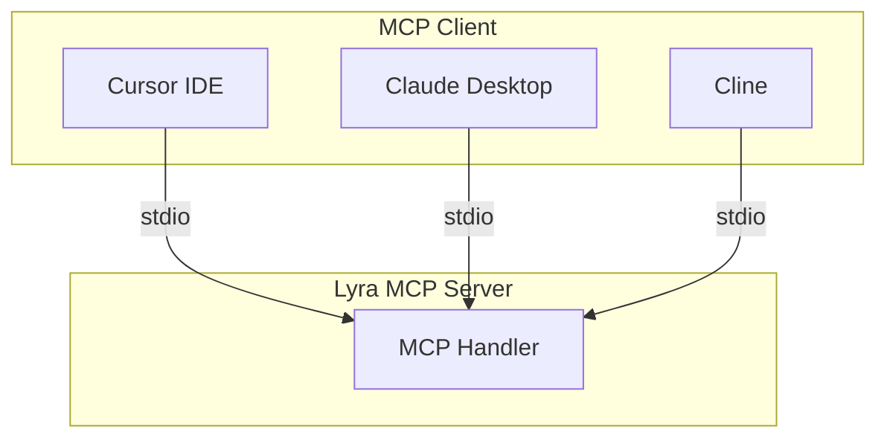

# ADR-0003: MCP over CLI / REST API

## Date
2025-11-05

## Context

Options for exposing Lyra's functionality to external consumers:

| Method | Overview |
|--------|----------|
| CLI | Provided as command-line tool |
| REST API | Provided as HTTP server |
| MCP | Provided as Model Context Protocol server |
| Python Library | Provided as importable library |

Comparison of each method:

| Aspect | CLI | REST | MCP | Library |
|--------|-----|------|-----|---------|
| LLM Integration | Difficult | Possible | Native | Difficult |
| Setup | Easy | Medium | Easy | Easy |
| Stateful | Difficult | Requires implementation | Standard support | Possible |
| Tool Invocation | None | Requires definition | Standardized | None |
| Type Safety | None | OpenAPI | JSON Schema | Python types |

## Decision

**Implement as an MCP server, used from MCP clients (Claude Desktop, etc.).**

### Reasons for Choosing MCP

1. **LLM Native**: Designed with AI assistant integration in mind
2. **Standardized Tool Definition**: Strict parameter definition via inputSchema
3. **Stateful Communication**: Natural support for long-running research tasks
4. **Ecosystem**: Compatible with Claude Desktop, Cline, Cursor, etc.

### Tool Categories

| Category | Description |
|----------|-------------|
| Task Management | Create/stop research tasks, get status |
| Research Execution | Queue search queries for background processing |
| Evidence Graph Exploration | SQL queries, semantic vector search, predefined views |
| Authentication Queue | Handle CAPTCHA/auth challenges |
| Feedback | Human-in-the-loop corrections for quality improvement |
| Calibration | NLI model calibration metrics and rollback (admin) |

Tool definitions use JSON Schema for parameter validation via MCP's `inputSchema`.

### Communication Method

- **stdio**: Optimal for local execution, no additional ports required
- Inter-process communication overhead is negligible

## Consequences

### Positive
- **Immediate LLM Integration**: Works directly with Claude Desktop
- **Standardized Interface**: No need to reinvent tool definitions
- **Type-safe Parameters**: Validation via JSON Schema
- **Async Support**: Natural support for long-running tasks

### Negative
- **Client Limitation**: Requires MCP-compatible client
- **Debugging Difficulty**: Tracing stdio communication is cumbersome
- **Protocol Constraints**: Bound by MCP specification

## Alternatives Considered

| Alternative | Pros | Cons | Decision |
|-------------|------|------|----------|
| REST API | High versatility | Requires custom LLM integration | Rejected |
| CLI | Simple | Difficult LLM integration | Rejected |
| GraphQL | Flexible queries | Excessive, no LLM integration | Rejected |
| gRPC | High performance | Complex, no LLM integration | Rejected |

## Related

- [ADR-0002: Thinking-Working Separation](0002-thinking-working-separation.md) - Defines role separation between MCP client and server
- `src/mcp/server.py` - MCP server implementation
- MCP Specification: https://modelcontextprotocol.io
