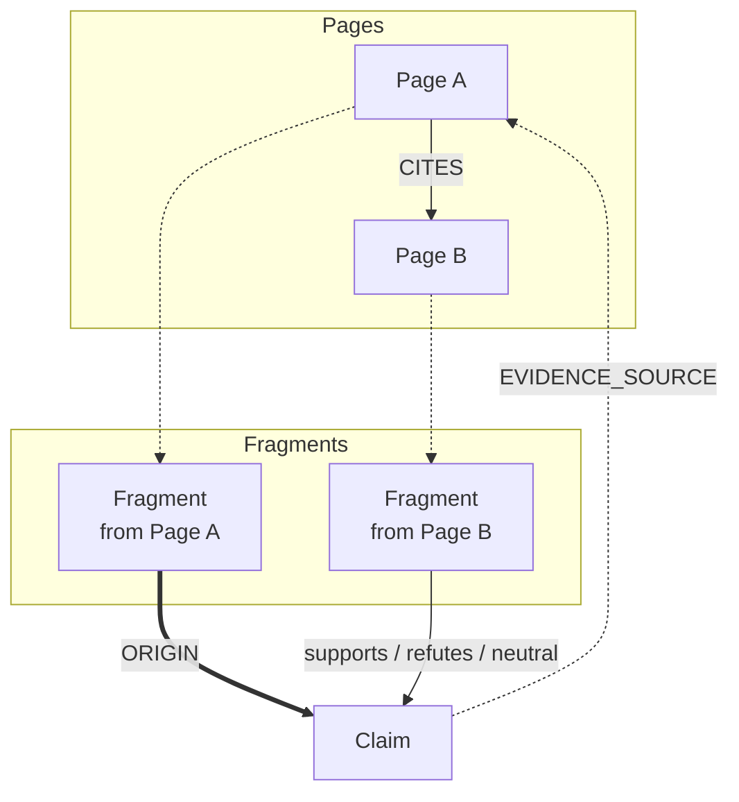

# ADR-0005: Evidence Graph Structure

## Date
2025-11-15 (Updated: 2025-12-27)

## Context

Academic research requires integrating evidence from multiple sources to evaluate hypothesis confidence.

Traditional approaches:

| Approach | Problem |
|----------|---------|
| Flat List | Relationships between evidence unclear |
| Simple Scoring | Difficult to handle contradicting evidence |
| Manual Evaluation Only | Doesn't scale |

Required capabilities:
- Represent relationships between hypotheses and evidence
- Track both supporting and refuting evidence
- Represent citation relationships between evidence
- Automatic confidence calculation

## Decision

**Adopt an evidence graph structure with Claim as root, using NLI-based exploration score calculation.**


### Data Ownership & Scope (Global / Task-scoped Boundary)

The "Evidence Graph" in this ADR does not have `task_id` column on all persisted data. In Lyra, **task-scoped** and **global (reusable)** data coexist, and task-specific materials are assembled by **"slicing" via task_id**.

#### Basic Scope Principles

- **Task-scoped**
  - `claims` has `task_id` and represents task outputs (claim nodes).
  - A task's Evidence Graph is principally sliced **starting from claims of that task**.
- **Global / Reusable (cross-task reuse possible)**
  - `pages` has `url UNIQUE` with no `task_id`; same URL can be shared across tasks (cache/reuse design).
  - `fragments` also has no `task_id` and hangs off `page_id → pages.id`, so task-specific ownership is weak.
  - `edges` also has no `task_id`; **filter by claims** to construct task subgraph.

#### Implementation Scoping (Important)

- Evidence Graph load specifies `task_id` and reads **only edges connected to claims(task_id=...)**.
  - This allows task-specific material slicing even though `edges/pages/fragments` exist globally.

#### Rediscovery of Same Resource (Different Query/Context)

Behavior when the same paper (DOI/URL) is **rediscovered from different query or context**:

| Layer | Behavior | Reason |
|-------|----------|--------|
| `pages` | Returns existing `page_id` on subsequent finds (no insert) | UNIQUE on URL, stored once as global resource |
| `fragments` | Returns existing `fragment_id` on subsequent finds | Global resource tied to `page_id` |
| `claims` | **New creation** | Task-specific; different queries/contexts are different Claims |
| `edges` | **New creation** (Fragment → new Claim) | Same Fragment can support/refute multiple Claims |

Implementation workflow:

1. **On resource discovery**: Check DOI/URL in `resource_index`
2. **If exists**: Get and return existing `page_id` and `fragment_id`
3. **Caller**: Creates new `claims` and `edges` using retrieved `fragment_id`

This enables:
- **Storage efficiency**: Same paper data stored once
- **Context preservation**: Evaluable as query-specific Claims
- **Citation tracking**: Expressed via edges from same Fragment to multiple Claims

### Cleanup Policy (Soft / Hard)

Due to this ADR's scope design, stop/delete cleanup is safe as two stages.

#### Soft Cleanup (Safe, Default)

Purpose: Logically hide task materials **without touching data that could affect other tasks (pages/fragments, etc.)**.

- Delete/invalidate **task-scoped** items (e.g., `tasks`, `claims`, `queries`, `serp_items`, `task_metrics`, `decisions`, `jobs`, `event_log`, `intervention_queue`).
- From Evidence Graph perspective, target at minimum:
  - **claims**: `claims.task_id = ?`
  - **edges**: Those where source/target reference this task's claims
    - `edges` lacks FK protection, so edges referencing deleted claims dirty the DB if left.
    - However, claim IDs are task-specific, so deleting relevant edges rarely ripples to other tasks.

After Soft cleanup:
- `pages/fragments/edges(non-claim-referencing)` may remain in DB, but are unreachable via `task_id`-based material collection (logically invisible).

#### Hard Cleanup (Careful)

Purpose: Reclaim storage by deleting **shareable data** only when "safety conditions are met."

Hard cleanup **must compute set reachable from task_id and verify "not referenced by other tasks"** before deletion.

Recommended: Hard cleanup should be **hard(orphans_only)**.

- After Soft cleanup, additionally delete the following "orphans":
  - **orphan edges**: Edges whose source_id/target_id reference non-existent (or deleted) nodes
  - **orphan fragments**: Fragments not referenced by any edges
  - **orphan pages**: Pages not referenced by any fragments and not referenced by edges
- `pages` has file path columns (html/warc/screenshot), so page deletion should also delete corresponding files (best-effort).

Note:
- "Zero intermediate state (strong atomicity)" is impractical given async I/O + incremental persistence characteristics.

### Graph Structure



| Edge | Direction | Usage | Persisted | Score Update |
|------|-----------|-------|-----------|--------------|
| `ORIGIN` | Fragment → Claim | Provenance: which fragment a claim was extracted from | Yes | No (NLI not performed) |
| `supports` / `refutes` / `neutral` | Fragment → Claim | Cross-source verification via NLI model | Yes | Yes (`nli_edge_confidence`) |
| `CITES` | Page → Page | Citation relationship (academic papers) | Yes | No |
| `EVIDENCE_SOURCE` | Claim → Page | Derived from ORIGIN + NLI edges | **No** (in-memory only) | N/A |

> **Note**: Domain is reference information stored as edge metadata (`source_domain_category`) and in the `domains` table, NOT as a graph node.

### Node Types

| Node | Description | Key Attributes |
|------|-------------|----------------|
| Claim | User's assertion/hypothesis | text, confidence |
| Fragment | Excerpt extracted from page | text_content, extraction_method |
| Page | Crawled web page | url, title, crawled_at |
| Domain | Domain (reference info) | domain_name |

**Implementation note**:
- `Domain` is not currently represented as a first-class node type in the persisted graph.
  Domain category is stored as edge metadata (for audit/UI) and separately in the `domains` table.

### Edge Types

| Edge | From | To | Description |
|------|------|-----|-------------|
| ORIGIN | Fragment | Claim | Provenance: which fragment a claim was extracted from |
| SUPPORTS | Fragment | Claim | Fragment supports claim (cross-source verification) |
| REFUTES | Fragment | Claim | Fragment contradicts claim (cross-source verification) |
| NEUTRAL | Fragment | Claim | Relationship unclear (cross-source verification) |
| CITES | Page | Page | Citation relationship between sources (deferred job) |
| EVIDENCE_SOURCE | Claim | Page | Claim is based on evidence from this page (derived) |

**Implementation note**:
- `ORIGIN` is persisted to DB when a claim is extracted from a fragment. It tracks provenance (where did this claim come from?), NOT whether the claim is true. Origin edges have `nli_label=NULL` and `nli_edge_confidence=NULL` since no NLI judgment is performed.
- `SUPPORTS/REFUTES/NEUTRAL` are created when a *different* source is found that relates to the claim. These edges carry NLI model output (`nli_hypothesis=claim_text`, per ADR-0017). **Automatic creation**: When a `target_queue` job completes, Lyra automatically enqueues a `VERIFY_NLI` job that:
  1. Uses vector search to find candidate fragments from other domains
  2. Excludes fragments from the claim's origin domain (no self-referencing)
  3. Runs NLI to determine stance
  4. Persists edges with `INSERT OR IGNORE` (see "Duplicate Prevention" below)
- `EXTRACTED_FROM (Fragment → Page)` is represented implicitly by the relational link `fragments.page_id → pages.id`, not as an explicit `edges` record.
- `CITES` is persisted as `edges` rows with `source_type='page'` and `target_type='page'`. **Generation**: CITES edges are created by a deferred `CITATION_GRAPH` job (per ADR-0015), NOT during the search pipeline. This ensures web page fetching is prioritized over citation graph processing.
- `EVIDENCE_SOURCE` is derived in-memory by `load_from_db()` from `origin` + NLI fragment→claim edges + `fragment.page_id` (not persisted to DB).

### Duplicate Prevention (NLI Edges)

The same `(fragment_id, claim_id)` pair is evaluated **only once** for NLI. Re-evaluation is prevented by:

1. **DB Constraint**: A partial unique index on `edges`:
   ```sql
   CREATE UNIQUE INDEX idx_edges_nli_unique
     ON edges(source_type, source_id, target_type, target_id)
     WHERE source_type = 'fragment'
       AND target_type = 'claim'
       AND relation IN ('supports', 'refutes', 'neutral');
   ```
2. **Application-Level Check**: Before running NLI, existing edges are queried to skip already-evaluated pairs.
3. **INSERT OR IGNORE**: Edge insertion uses `INSERT OR IGNORE` to gracefully handle race conditions.

This ensures:
- No duplicate NLI work for the same fragment-claim pair
- `origin` edges are unaffected (different relation type)
- Task resumption (`paused` → `exploring`) doesn't re-evaluate existing pairs

### nli_claim_support_ratio (Exploration Score)

Lyra aggregates fragment→claim NLI evidence edges into a **claim-level exploration score**:
`nli_claim_support_ratio` (0..1).

Semantics:
- Evidence edges carry `edges.nli_edge_confidence` (NLI model output).
- For a claim, all incoming evidence edges of type `supports/refutes/neutral` are collected.
- Only `supports/refutes` contribute to the ratio; `neutral` is treated as “no directional signal”.
- **`origin` edges are NOT used** - they track provenance only.
- A newly extracted claim defaults to **0.5** (uninformative baseline) until cross-source evidence is found.

Computation (implemented in `v_claim_evidence_summary`):

```text
support_weight = Σ nli_edge_confidence(e) for e in SUPPORTS edges
refute_weight  = Σ nli_edge_confidence(e) for e in REFUTES edges

nli_claim_support_ratio =
  (1 + support_weight) / ((1 + support_weight) + (1 + refute_weight))
```

Important notes:
- This ratio is **not a hypothesis verdict**.
- This ratio is **not a statistically rigorous probability of truth**; treat it as a navigation/ranking aid.
- `claims.llm_claim_confidence` stores LLM's self-reported extraction quality (NOT used here).

### Domain Category (Reference Only)

**Important**: Domain categories are reference information and are **NOT used** in confidence calculation.

Reasons:
- Article quality varies within the same domain
- Domain-based weighting introduces bias
- Fragment-level evaluation is essential

**Principle**: Confidence calculation uses only Fragment-level features, not domain-based weighting, to avoid bias.

## Consequences

### Positive
- **Transparency**: Traceable why a confidence level was assigned
- **Contradiction Visibility**: Support and refutation displayed in parallel
- **Extensibility**: New edge types can be added
- **Citation Tracking**: Academic paper citation relationships expressible

### Negative
- **Computation Cost**: Graph traversal required
- **Complexity**: More difficult to understand than simple list
- **Maintenance**: Graph consistency maintenance required

## Alternatives Considered

| Alternative | Pros | Cons | Decision |
|-------------|------|------|----------|
| Flat List | Simple | Cannot express relationships | Rejected |
| Knowledge Graph (RDF) | Standardized | Overly complex | Rejected |
| Vector DB Only | Fast similarity search | Weak relationships | Supplementary adoption |
| Score Only | Lightweight | Opaque rationale | Rejected |

## Related

- `src/storage/schema.sql` - Graph schema (edges, claims, fragments, works, work_authors, work_identifiers tables)
- `src/filter/evidence_graph.py` - Evidence graph implementation (NetworkX + SQLite)
- `src/storage/works.py` - Bibliographic metadata persistence (works/work_authors/work_identifiers)
- `src/report/evidence_pack.py` - Evidence pack generation (report/dashboard input facts)
- `src/report/validator.py` - Report validation against evidence pack constraints

### Bibliographic Metadata (Academic Papers)

Academic paper metadata is stored in normalized tables linked via `pages.canonical_id`:

| Table | Purpose |
|-------|---------|
| `works` | Canonical work metadata (title, year, venue, doi, citation_count) |
| `work_authors` | Authors with position (name, affiliation, orcid) |
| `work_identifiers` | Provider IDs (s2:xxx, openalex:Wxxx) → canonical_id mapping |

SQL views (`v_evidence_chain`, `v_claim_origins`) join these tables to provide `author_display` (e.g., "Smith, John et al.") for reports.