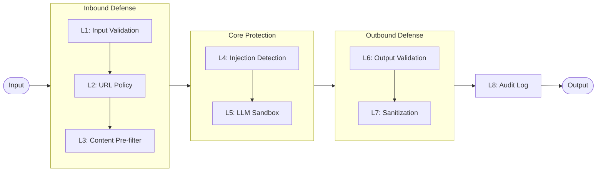

# ADR-0006: Eight-Layer Security Model

## Date
2025-11-18

## Context

LLM-based systems have unique security risks:

| Risk | Details |
|------|---------|
| Prompt Injection | Malicious web pages manipulate LLM behavior |
| Data Exfiltration | Unintended leakage of collected data |
| Jailbreak | Bypassing LLM safety features |
| Output Pollution | Malicious content reaching users |

A single defense layer is insufficient. Even if an attacker breaches one layer, breaching multiple layers simultaneously is difficult.

## Decision

**Adopt an 8-layer defense-in-depth model with independent security checks at each layer.**

## Implementation Notes (Lyra)

This ADR describes the defense-in-depth principle. In the current Lyra codebase, the *layer naming/numbering* used in comments and documentation may differ from the illustrative L1-L8 table below.

Practical integration points (current):

| Area | Implementation | Notes |
|---|---|---|
| Input sanitization | `src/filter/llm_security.py:sanitize_llm_input()` | Removes zero-width chars, control chars, dangerous patterns, and strips LYRA-style tags from user-provided text. |
| Session tags (default ON) | `src/filter/llm_security.py:generate_session_tag()` + `build_secure_prompt()` / `LLMSecurityContext` | Provides an in-band wrapper using a random `<LYRA-...>` tag to enclose INPUT DATA and create a hard boundary. Enabled by default and can be disabled via `LYRA_LLM__SESSION_TAGS_ENABLED=false`. The wrapper text is English-only. |
| Output validation / leakage detection | `src/filter/llm_security.py:validate_llm_output()` | Detects URLs/IPs and prompt leakage (including LYRA tag patterns); supports masking. |
| Structured output safety | `src/filter/llm_output.py:parse_and_validate()` | Extracts JSON, validates with Pydantic, retries once, records failures to DB (`llm_extraction_errors`). |

The session-tag wrapper exists as a defense-in-depth tool, but prompt-building integration depends on which caller uses `build_secure_prompt()` / `LLMSecurityContext`. Even when not used, the tag patterns are still handled in sanitization/leakage detection.

### 8-Layer Model

### Layer Responsibilities

| Layer | Function | Key Checks |
|-------|----------|------------|
| L1: Input Validation | Validate MCP request format | Schema, length limits, character types |
| L2: URL Allowlist/Blocklist | Control URL access | Domain blocklist, user-defined patterns |
| L3: Content Pre-filter | Filter HTML before processing | Remove script/style tags, size limits |
| L4: Prompt Injection Detection | Detect malicious prompts | Pattern matching (e.g., "ignore instructions") |
| L5: LLM Sandbox | Limit LLM capabilities | Token limits, tool prohibition |
| L6: Output Validation | Verify LLM output | Valid NLI relation, confidence range |
| L7: Response Sanitization | Neutralize before returning | Remove internal fields, HTML escape |
| L8: Audit Logging | Record security events | Append-only log with timestamps |

## Consequences

### Positive
- **Defense in Depth**: Remaining layers defend even if one is breached
- **Independence**: Each layer can be tested independently
- **Visibility**: Clear which layer detected the threat
- **Extensibility**: Easy to add new layers

### Negative
- **Performance**: Overhead of passing through all 8 layers
- **Complexity**: Inter-layer consistency maintenance required
- **False Positives**: Overly strict rules may block legitimate content

## Alternatives Considered

| Alternative | Pros | Cons | Decision |
|-------------|------|------|----------|
| Single Filter | Simple | Game over if breached | Rejected |
| External WAF | Specialized | Unsuitable for local execution | Rejected |
| LLM Self-defense Only | Easy | Insufficient reliability | Rejected |

## Related

| Layer | Module | Description |
|-------|--------|-------------|
| L1 | `src/mcp/schemas.py` | JSON Schema validation for MCP requests |
| L2 | `src/utils/domain_policy.py` | Domain allowlist/blocklist, DomainPolicyManager |
| L3 | `src/extractor/content.py`, `src/extractor/quality_analyzer.py` | HTML pre-filtering (trafilatura, script/style removal) |
| L4 | `src/filter/llm_security.py` | Prompt injection detection (DANGEROUS_PATTERNS) |
| L5 | `src/filter/llm_security.py` | LLM sandbox (session tags, length limits) |
| L6 | `src/filter/llm_security.py`, `src/filter/source_verification.py` | Output validation, NLI verification |
| L7 | `src/mcp/response_sanitizer.py` | MCP response sanitization |
| L8 | `src/utils/secure_logging.py`, `src/storage/schema.sql` | Audit logging (AuditLogger, event_log table) |

- OWASP LLM Top 10: https://owasp.org/www-project-top-10-for-large-language-model-applications/
