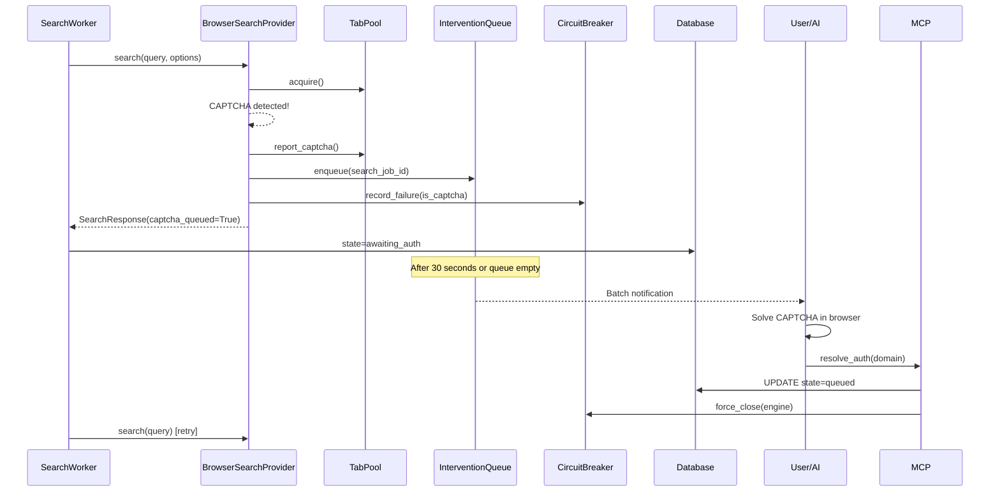

# ADR-0007: Human-in-the-Loop Authentication

## Date
2025-11-25 (Updated: 2025-12-25)

## Context

Many academic resources require authentication:

| Resource | Authentication Method | Automation Difficulty |
|----------|----------------------|----------------------|
| University Libraries | SSO/Shibboleth | Very difficult |
| IEEE/ACM | Institutional or personal auth | Difficult |
| General Websites | Cookie/Session | Moderate |
| CAPTCHA-protected Sites | Image/behavioral auth | Very difficult |

Problems with automated authentication bypass:

| Problem | Details |
|---------|---------|
| Legal Risk | Terms of service violation, unauthorized access |
| Ethical Issues | CAPTCHAs exist to verify humans |
| Technical Difficulty | Modern CAPTCHAs are hard to bypass |
| Cost | Solving services are paid (ADR-0001 violation) |

Additionally, ADR-0001 (Zero OpEx) constraints prohibit paid CAPTCHA solving services.

## Decision

**Delegate authentication to the user and reuse authenticated sessions (Human-in-the-Loop approach).**

### Architecture (Phase 4 Integrated Version)



### Component Integration

| Component | Role | ADR |
|-----------|------|-----|
| TabPool | Tab management, auto-backoff | ADR-0014, ADR-0015 |
| InterventionQueue | CAPTCHA wait queue | ADR-0007 |
| CircuitBreaker | Engine availability management | - |
| BatchNotificationManager | Batch notifications | ADR-0007 |

### Authentication Queue Design

```python
# intervention_queue table
CREATE TABLE intervention_queue (
    id TEXT PRIMARY KEY,
    task_id TEXT NOT NULL,
    url TEXT NOT NULL,
    domain TEXT NOT NULL,
    auth_type TEXT NOT NULL,
    priority TEXT DEFAULT 'medium',
    status TEXT DEFAULT 'pending',
    queued_at DATETIME,
    expires_at DATETIME,  -- Queue item expiration (default: 3 hours from queued_at)
    search_job_id TEXT,  -- Related search job ID
    FOREIGN KEY (search_job_id) REFERENCES jobs(id)
);
```

**expires_at Specification**:
- Default: 3 hours after `queued_at` (configurable via `TaskLimitsConfig.auth_queue_ttl_hours`)
- Expiration handling: `cleanup_expired()` updates `status='expired'` (periodic execution not implemented; run manually as needed)

### User Workflow

1. **Search Queue Execution**: Multiple searches run in parallel in the background
2. **CAPTCHA Detection**: When CAPTCHA is detected:
   - `TabPool.report_captcha()` for auto-backoff
   - `InterventionQueue.enqueue()` to add to queue
   - Set job to `awaiting_auth` state
   - **Other domain searches continue**
3. **Batch Notification**: Notify after 30 seconds or when search queue is empty
4. **Manual Authentication**: User solves CAPTCHAs in batch
5. **resolve_auth**: When user tells AI "solved":
   - `resolve_auth(domain)` or `resolve_auth(task_id=..., target=task)` is called
   - Related jobs return to `queued` state
   - CircuitBreaker resets
6. **Automatic Retry**: SearchWorker re-executes jobs
7. **Task Stop**: When `stop_task` is called:
   - Auth wait items in `pending`/`in_progress` state for that task are automatically set to `cancelled`
   - Executed simultaneously with search job cancellation

### Notification Timing (Hybrid Approach)

```python
# BatchNotificationManager
class BatchNotificationManager:
    BATCH_TIMEOUT_SECONDS = 30

    async def on_captcha_queued(self, queue_id, domain):
        # Start timer (notify after 30 seconds)
        ...

    async def on_search_queue_empty(self):
        # Notify immediately when queue is empty
        ...
```

| Trigger | Condition | Benefit |
|---------|-----------|---------|
| Timeout | 30 seconds after first CAPTCHA | Prevents accumulation |
| Queue Empty | Search queue becomes empty | Efficient batch processing |

### CAPTCHA Handling

| Situation | Response |
|-----------|----------|
| CAPTCHA Detected | Add to queue, backoff, continue other domains |
| Repeated on Same Domain | Temporarily suspend via CircuitBreaker |
| After resolve_auth | Automatic requeue, CircuitBreaker reset |
| On stop_task | Update task's auth wait items to `cancelled` |

### resolve_auth Granularity

The `resolve_auth` MCP tool supports 3 granularity levels:

| target | Required Parameter | Effect |
|--------|-------------------|--------|
| `item` | `queue_id` | Complete/skip single item |
| `domain` | `domain` | Batch process same domain across all tasks |
| `task` | `task_id` | Process only specific task's auth waits |

**Use Case Examples**:
- `target=item`: Process just one item
- `target=domain`: Batch process by domain (across multiple tasks)
- `target=task`: Process only a specific task's auth waits (e.g., skip auth waits while task continues)

### Implementation Files

| File | Changes |
|------|---------|
| `src/storage/schema.sql` | `intervention_queue.search_job_id`, `expires_at` added |
| `src/scheduler/jobs.py` | `JobState.AWAITING_AUTH` added |
| `src/utils/config.py` | `TaskLimitsConfig.auth_queue_ttl_hours` added (default 3 hours) |
| `src/utils/notification.py` | `BatchNotificationManager`, `enqueue()` extension, `skip()` status parameter |
| `src/search/browser_search_provider.py` | Queue registration on CAPTCHA |
| `src/scheduler/search_worker.py` | `awaiting_auth` state processing |
| `src/mcp/server.py` | `resolve_auth` auto-requeue, `target=task` added, `stop_task` auth queue cancel, `get_status` pending_auth |
| `src/search/provider.py` | `SearchOptions.task_id/search_job_id` added |

## Consequences

### Positive
- **Legal Safety**: No automated bypass
- **Zero OpEx**: No paid services used
- **Reliability**: Human solving is reliable
- **Transparency**: Users know what they're accessing
- **Parallelism Maintained**: Other domains continue during CAPTCHA
- **Batch Processing**: Multiple CAPTCHAs can be solved at once

### Negative
- **Wait Time**: Domain paused until user action
- **UX Burden**: Authentication work falls on user
- **Not Fully Automated**: Human intervention required

## Alternatives Considered

| Alternative | Pros | Cons | Decision |
|-------------|------|------|----------|
| CAPTCHA Solving Service | Automated | Paid, ethical issues | Rejected |
| Headless Browser Spoofing | Partial success | Detection risk, cat-and-mouse | Rejected |
| Skip Authentication | Simple | Cannot access important resources | Rejected |
| Immediate Notification | Simple | Frequent work interruptions | Rejected |

## References
- `src/storage/schema.sql` - `intervention_queue` table (auth queue)
- `src/utils/notification.py` - `InterventionQueue`, `BatchNotificationManager`
- `src/mcp/server.py` - `get_auth_queue`, `resolve_auth` MCP tools
- `src/search/tab_pool.py` - TabPool, auto-backoff
- ADR-0001: Local-First / Zero OpEx
- ADR-0006: 8-Layer Security Model
- ADR-0014: Browser SERP Resource Control
- ADR-0015: Adaptive Concurrency Control
