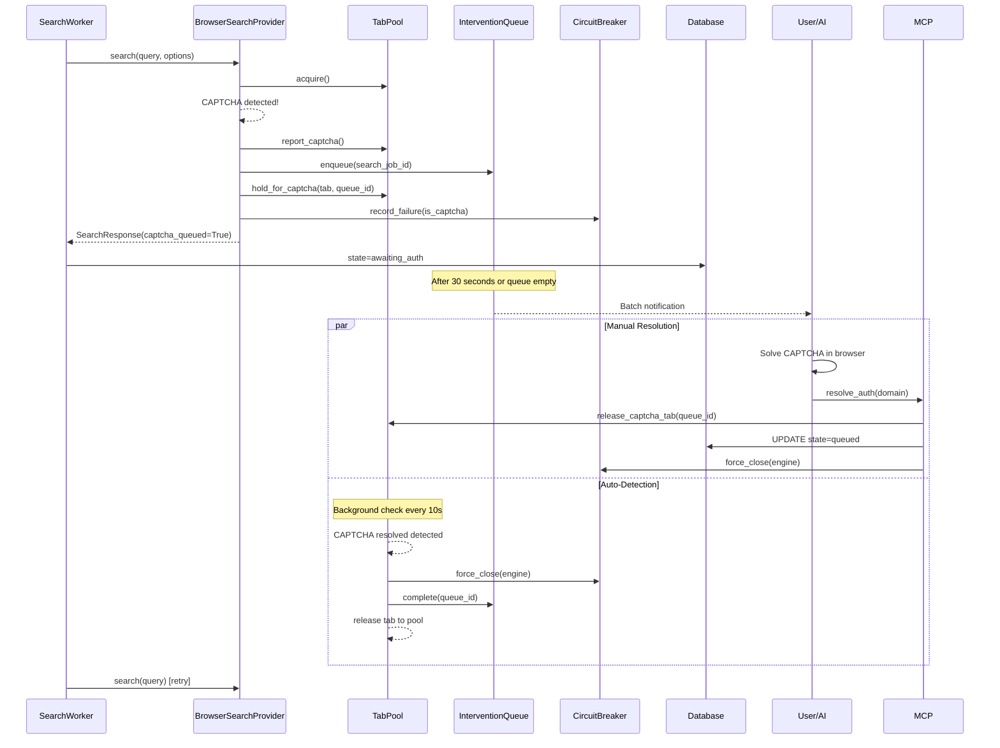
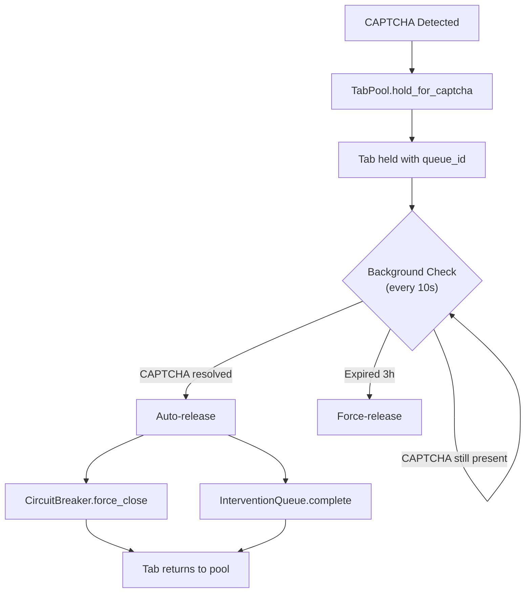

# ADR-0007: Human-in-the-Loop Authentication

## Date
2025-11-25 (Updated: 2026-01-06)

## Context

Many academic resources require authentication:

| Resource | Authentication Method | Automation Difficulty |
|----------|----------------------|----------------------|
| University Libraries | SSO/Shibboleth | Very difficult |
| IEEE/ACM | Institutional or personal auth | Difficult |
| General Websites | Cookie/Session | Moderate |
| CAPTCHA-protected Sites | Image/behavioral auth | Very difficult |

Problems with automated authentication bypass:

| Problem | Details |
|---------|---------|
| Legal Risk | Terms of service violation, unauthorized access |
| Ethical Issues | CAPTCHAs exist to verify humans |
| Technical Difficulty | Modern CAPTCHAs are hard to bypass |
| Cost | Solving services are paid (ADR-0001 violation) |

Additionally, ADR-0001 (Zero OpEx) constraints prohibit paid CAPTCHA solving services.

## Decision

**Delegate authentication to the user and reuse authenticated sessions (Human-in-the-Loop approach).**

### Architecture

### Component Integration

| Component | Role | ADR |
|-----------|------|-----|
| TabPool | Tab management, auto-backoff | ADR-0014 |
| InterventionQueue | CAPTCHA wait queue | ADR-0007 |
| CircuitBreaker | Engine availability management | - |
| BatchNotificationManager | Batch notifications | ADR-0007 |

### Authentication Queue Design

Authentication wait items are managed in the `intervention_queue` table (see `src/storage/schema.sql` for details).

**Key Columns**:

| Column | Purpose |
|--------|---------|
| `task_id` | Associated task |
| `url`, `domain` | URL/domain requiring authentication |
| `auth_type` | Challenge type (see table below) |
| `status` | `pending` → `in_progress` → `completed`/`skipped`/`expired` |
| `expires_at` | Queue item expiration |
| `search_job_id` | Related search job (auto-requeue on resolve_auth) |

**expires_at Specification**:
- Default: 3 hours after `queued_at` (configurable via `TaskLimitsConfig.auth_queue_ttl_hours`)
- Expiration handling: `cleanup_expired()` updates `status='expired'` (periodic execution not implemented; run manually as needed)

**auth_type Values**:
| Type | Description | Detection Method | Effort |
|------|-------------|------------------|--------|
| `cloudflare` | Cloudflare browser verification | `cf-browser-verification`, `_cf_chl_opt` elements | Low |
| `js_challenge` | JavaScript challenge (e.g., "Just a moment") | Title + Cloudflare combination | Low |
| `turnstile` | Cloudflare Turnstile widget | `cf-turnstile` class, Turnstile script URL | Medium |
| `captcha` | Generic CAPTCHA | `data-sitekey` attribute | High |
| `recaptcha` | Google reCAPTCHA | `g-recaptcha` class, `grecaptcha.execute` | High |
| `hcaptcha` | hCaptcha | `h-captcha` class, hCaptcha iframe | High |
| `login` | Login/authentication wall | Password field + login form context | High |
| `cookie_consent` | Cookie consent banner | Cookie consent library markers + accept button | Low |

Detection is implemented in `src/crawler/challenge_detector.py` with priority: CAPTCHA > Login > Cookie consent.

### User Workflow

1. **Search Queue Execution**: Multiple searches run in parallel in the background
2. **CAPTCHA Detection**: When CAPTCHA is detected:
   - `TabPool.report_captcha()` for auto-backoff
   - `InterventionQueue.enqueue()` to add to queue
   - Set job to `awaiting_auth` state
   - **Other domain searches continue**
3. **Batch Notification**: Notify after 30 seconds or when search queue is empty
4. **Manual Authentication**: User solves CAPTCHAs in batch
5. **resolve_auth**: When user tells AI "solved":
   - `resolve_auth(domain)` or `resolve_auth(task_id=..., target=task)` is called
   - Related jobs return to `queued` state
   - CircuitBreaker resets
6. **Automatic Retry**: SearchWorker re-executes jobs
7. **Task Stop**: When `stop_task` is called:
   - Auth wait items in `pending`/`in_progress` state for that task are automatically set to `cancelled`
   - Executed simultaneously with search job cancellation

### Notification Timing (Hybrid Approach)

| Trigger | Condition | Benefit |
|---------|-----------|---------|
| Timeout | 30 seconds after first CAPTCHA | Prevents accumulation |
| Queue Empty | Search queue becomes empty | Efficient batch processing |

Notifications are batched to avoid frequent user interruptions.

### Notification System

The notification system supports multiple platforms with automatic detection:

| Platform | Provider | Detection |
|----------|----------|-----------|
| Pure Linux | `LinuxNotifyProvider` (notify-send) | `platform.system() == "Linux"` without WSL markers |
| WSL2 | `WSLBridgeProvider` (PowerShell) | WSL markers in `/proc/version` or `platform.release()` |
| Windows | `WindowsToastProvider` | `platform.system() == "Windows"` |

WSL2 uses PowerShell bridging to display Windows notifications, ensuring visibility regardless of WSLg availability or user's active desktop.

### CAPTCHA Handling

| Situation | Response |
|-----------|----------|
| CAPTCHA Detected | Hold tab, add to queue, backoff, continue other domains |
| Repeated on Same Domain | Temporarily suspend via CircuitBreaker |
| After resolve_auth | Release held tab, automatic requeue, CircuitBreaker reset |
| User solves in browser (without resolve_auth) | Auto-detect via tab content check, auto-release |
| On stop_task | Release held tabs, update auth items to `cancelled` |

### Tab Hold for CAPTCHA Resolution

When CAPTCHA is detected during SERP search, the browser tab is held (not returned to pool) to allow user interaction:

**Key Behavior**:

| Event | Action |
|-------|--------|
| CAPTCHA detected | `hold_for_captcha(tab, queue_id, engine, task_id, expires_at)` |
| User solves manually | Background check detects, **auto-captures cookies**, CB reset, auto-releases |
| User calls `resolve_auth` | Manual release via `release_captcha_tab(queue_id)` with cookie capture |
| 3 hours expire | Force-release without CB reset or cookie capture |
| `stop_task` called | `release_held_tabs_for_task(task_id)` releases all task tabs |

This design allows:
1. User to interact with CAPTCHA page directly in browser
2. Automatic detection when CAPTCHA is resolved (no `resolve_auth` needed)
3. **Automatic session cookie capture** on resolution (same as `resolve_auth`)
4. Graceful cleanup on task stop or timeout

**Note**: Auto-detection captures cookies via `capture_auth_session_cookies()`, providing the same session persistence as explicit `resolve_auth` calls. Users can solve CAPTCHAs before notifications appear and still get full functionality.

### resolve_auth Granularity

The `resolve_auth` MCP tool supports 3 granularity levels:

| target | Required Parameter | Effect |
|--------|-------------------|--------|
| `item` | `queue_id` | Complete/skip single item |
| `domain` | `domain` | Batch process same domain across all tasks |
| `task` | `task_id` | Process only specific task's auth waits |

**Use Case Examples**:
- `target=item`: Process just one item
- `target=domain`: Batch process by domain (across multiple tasks)
- `target=task`: Process only a specific task's auth waits (e.g., skip auth waits while task continues)

## Consequences

### Positive
- **Legal Safety**: No automated bypass
- **Zero OpEx**: No paid services used
- **Reliability**: Human solving is reliable
- **Transparency**: Users know what they're accessing
- **Parallelism Maintained**: Other domains continue during CAPTCHA
- **Batch Processing**: Multiple CAPTCHAs can be solved at once

### Negative
- **Wait Time**: Domain paused until user action
- **UX Burden**: Authentication work falls on user
- **Not Fully Automated**: Human intervention required

## Alternatives Considered

| Alternative | Pros | Cons | Decision |
|-------------|------|------|----------|
| CAPTCHA Solving Service | Automated | Paid, ethical issues | Rejected |
| Headless Browser Spoofing | Partial success | Detection risk, cat-and-mouse | Rejected |
| Skip Authentication | Simple | Cannot access important resources | Rejected |
| Immediate Notification | Simple | Frequent work interruptions | Rejected |

## Related

- [ADR-0001: Local-First / Zero OpEx](0001-local-first-zero-opex.md) - Prohibits paid CAPTCHA solving services
- [ADR-0006: 8-Layer Security Model](0006-eight-layer-security-model.md) - L2 URL policy for domain handling
- [ADR-0014: Browser SERP Resource Control](0014-browser-serp-resource-control.md) - TabPool integration for CAPTCHA tab holding, auto-backoff
- `src/storage/schema.sql` - `intervention_queue` table (auth queue)
- `src/utils/intervention_queue.py` - `InterventionQueue`
- `src/utils/batch_notification.py` - `BatchNotificationManager`
- `src/utils/notification_provider.py` - Platform detection, notification providers
- `src/crawler/challenge_detector.py` - Authentication challenge detection
- `src/mcp/server.py` - `get_auth_queue`, `resolve_auth` MCP tools
- `src/search/tab_pool.py` - TabPool, auto-backoff

