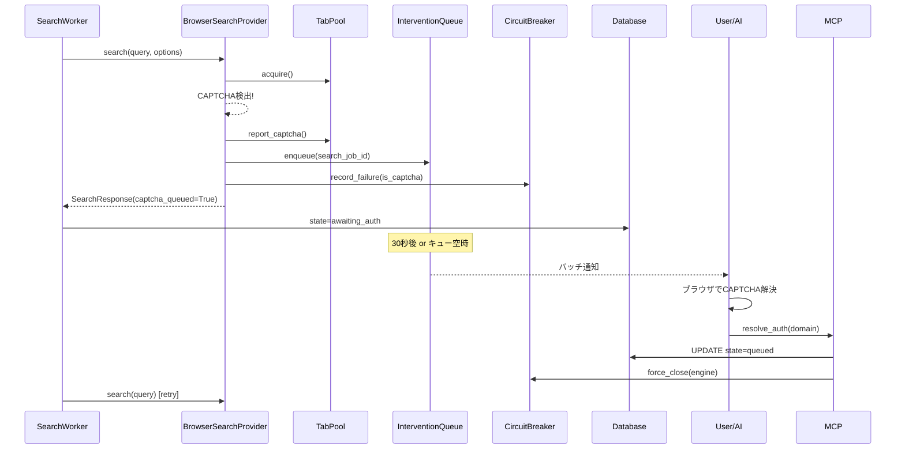

# ADR-0007: Human-in-the-Loop Authentication

## Date
2025-11-25 (Updated: 2025-12-25)

## Context

学術リソースの多くは認証が必要：

| リソース | 認証方式 | 自動化の難易度 |
|----------|----------|----------------|
| 大学図書館 | SSO/Shibboleth | 非常に困難 |
| IEEE/ACM | 機関認証 or 個人 | 困難 |
| 一般Webサイト | Cookie/Session | 中程度 |
| CAPTCHA保護サイト | 画像/行動認証 | 非常に困難 |

自動認証突破の問題点：

| 問題 | 詳細 |
|------|------|
| 法的リスク | 利用規約違反、不正アクセス |
| 倫理的問題 | CAPTCHAは人間確認が目的 |
| 技術的困難 | 最新CAPTCHAは突破困難 |
| コスト | 解決サービスは有料（ADR-0001違反） |

また、ADR-0001（Zero OpEx）の制約により、有償のCAPTCHA解決サービスは使用できない。

## Decision

**認証はユーザーに委ね、認証済みセッションを再利用する（Human-in-the-Loop方式）。**

### アーキテクチャ（Phase 4統合版）



### コンポーネント統合

| コンポーネント | 役割 | ADR |
|---------------|------|-----|
| TabPool | タブ管理、auto-backoff | ADR-0014, ADR-0015 |
| InterventionQueue | CAPTCHA待ちキュー | ADR-0007 |
| CircuitBreaker | エンジン可用性管理 | - |
| BatchNotificationManager | バッチ通知 | ADR-0007 |

### 認証キューの設計

```python
# intervention_queue テーブル
CREATE TABLE intervention_queue (
    id TEXT PRIMARY KEY,
    task_id TEXT NOT NULL,
    url TEXT NOT NULL,
    domain TEXT NOT NULL,
    auth_type TEXT NOT NULL,
    priority TEXT DEFAULT 'medium',
    status TEXT DEFAULT 'pending',
    queued_at DATETIME,
    expires_at DATETIME,  -- Queue item expiration time (default: 3 hours from queued_at)
    search_job_id TEXT,  -- 関連する検索ジョブID
    FOREIGN KEY (search_job_id) REFERENCES jobs(id)
);
```

**expires_at の仕様**:
- デフォルト値: `queued_at` から3時間後（`TaskLimitsConfig.auth_queue_ttl_hours` で設定可能）
- 期限切れ処理: `cleanup_expired()` で `status='expired'` に更新（定期実行は未実装、必要に応じて手動実行）

### ユーザーワークフロー

1. **検索キュー実行**: 複数の検索がバックグラウンドで並列実行
2. **CAPTCHA検出**: CAPTCHAを検出したら：
   - `TabPool.report_captcha()` でauto-backoff
   - `InterventionQueue.enqueue()` でキューに追加
   - ジョブを `awaiting_auth` 状態に設定
   - **他のドメインの検索は継続**
3. **バッチ通知**: 30秒経過 or 検索キュー空になったら通知
4. **手動認証**: ユーザーがまとめてCAPTCHAを解決
5. **resolve_auth**: AIに「解決した」と伝えると：
   - `resolve_auth(domain)` または `resolve_auth(task_id=..., target=task)` が呼ばれる
   - 関連ジョブが `queued` に戻る
   - CircuitBreakerがリセット
6. **自動リトライ**: SearchWorkerがジョブを再実行
7. **タスク停止時**: `stop_task` が呼ばれると：
   - そのタスクの `pending`/`in_progress` 状態の認証待ちアイテムが自動的に `cancelled` に更新される
   - 検索ジョブのキャンセルと同時に実行される

### 通知タイミング（ハイブリッド方式）

```python
# BatchNotificationManager
class BatchNotificationManager:
    BATCH_TIMEOUT_SECONDS = 30

    async def on_captcha_queued(self, queue_id, domain):
        # タイマー開始（30秒後に通知）
        ...

    async def on_search_queue_empty(self):
        # キュー空時に即座に通知
        ...
```

| トリガー | 条件 | メリット |
|---------|------|---------|
| タイムアウト | 最初のCAPTCHAから30秒後 | 溜め込み防止 |
| キュー空 | 検索キューが空になった | 効率的なバッチ処理 |

### CAPTCHAの扱い

| 状況 | 対応 |
|------|------|
| CAPTCHA検出 | キューに追加、バックオフ、他ドメイン継続 |
| 同一ドメインで繰り返し | CircuitBreakerで一時停止 |
| resolve_auth後 | 自動再キュー、CircuitBreakerリセット |
| stop_task時 | そのタスクの認証待ちアイテムを `cancelled` に更新 |

### resolve_auth の操作粒度

`resolve_auth` MCPツールは3つの操作粒度をサポート:

| target | 必須パラメータ | 効果 |
|--------|---------------|------|
| `item` | `queue_id` | 単一アイテムを complete/skip |
| `domain` | `domain` | 全タスクにまたがる同一ドメインの認証待ちを一括処理 |
| `task` | `task_id` | 特定タスクの認証待ちのみを一括処理 |

**ユースケース例**:
- `target=item`: 1件だけ処理したい場合
- `target=domain`: ドメイン単位でまとめて処理したい場合（複数タスクにまたがる）
- `target=task`: 特定タスクの認証待ちだけ処理したい場合（タスク継続中に認証待ちだけスキップなど）

### 実装ファイル

| ファイル | 変更内容 |
|---------|---------|
| `src/storage/schema.sql` | `intervention_queue.search_job_id`, `expires_at` 追加 |
| `src/scheduler/jobs.py` | `JobState.AWAITING_AUTH` 追加 |
| `src/utils/config.py` | `TaskLimitsConfig.auth_queue_ttl_hours` 追加（デフォルト3時間） |
| `src/utils/notification.py` | `BatchNotificationManager`, `enqueue()` 拡張、`skip()` に `status` パラメータ追加 |
| `src/search/browser_search_provider.py` | CAPTCHA時にキュー登録 |
| `src/scheduler/search_worker.py` | `awaiting_auth` 状態処理 |
| `src/mcp/server.py` | `resolve_auth` 自動再キュー・`target=task` 追加、`stop_task` で auth queue キャンセル、`get_status` pending_auth |
| `src/search/provider.py` | `SearchOptions.task_id/search_job_id` 追加 |

## Consequences

### Positive
- **法的安全性**: 自動突破を行わない
- **Zero OpEx**: 有償サービス不使用
- **確実性**: 人間が解決するので確実
- **透明性**: ユーザーが何にアクセスしているか把握
- **並列性維持**: CAPTCHA発生中も他ドメインは継続
- **バッチ処理**: 複数CAPTCHAをまとめて解決可能

### Negative
- **待機時間**: ユーザー操作まで該当ドメインは停止
- **UX負荷**: ユーザーに認証作業が発生
- **完全自動化不可**: 人間介入が必須

## Alternatives Considered

| Alternative | Pros | Cons | 判定 |
|-------------|------|------|------|
| CAPTCHA解決サービス | 自動化 | 有料、倫理的問題 | 却下 |
| ヘッドレスブラウザ偽装 | 一部成功 | 検出リスク、いたちごっこ | 却下 |
| 認証スキップ | シンプル | 重要リソースにアクセス不可 | 却下 |
| 即時通知 | シンプル | 作業中断が頻繁 | 却下 |

## References
- `src/storage/schema.sql` - `intervention_queue`テーブル（認証キュー）
- `src/utils/notification.py` - `InterventionQueue`, `BatchNotificationManager`
- `src/mcp/server.py` - `get_auth_queue`, `resolve_auth` MCPツール
- `src/search/tab_pool.py` - TabPool, auto-backoff
- ADR-0001: Local-First / Zero OpEx
- ADR-0006: 8-Layer Security Model
- ADR-0014: Browser SERP Resource Control
- ADR-0015: Adaptive Concurrency Control
