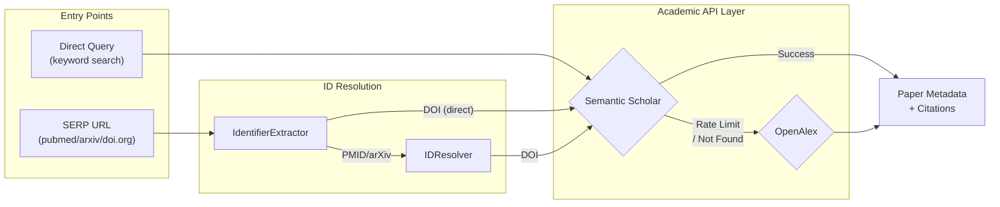
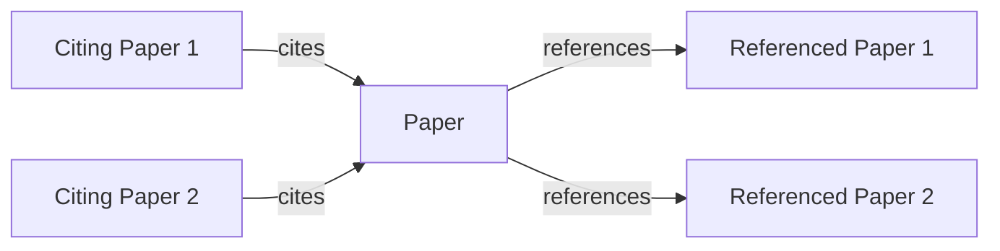

# ADR-0008: Academic Data Source Strategy

## Date
2025-11-28 (Updated: 2026-01-06)

## Context

Academic information retrieval faces these challenges:

| Challenge | Details |
|-----------|---------|
| API Limitations | Many academic DBs are paid or rate-limited |
| Coverage | Single source provides insufficient comprehensiveness |
| Reliability | Need to distinguish preprints from peer-reviewed |
| Zero OpEx | ADR-0001 prohibits paid APIs |

Comparison of major academic data sources:

| Source | Papers | API | Citation Data | Cost |
|--------|--------|-----|---------------|------|
| Semantic Scholar | 200M+ | Free (limited) | Yes | Free |
| OpenAlex | 250M+ | Free (unlimited) | Yes | Free |
| Google Scholar | Largest | None (scraping required) | Yes | Free (ToS risk) |
| Crossref | 140M+ | Free | Limited | Free |
| PubMed | 36M+ | Free | No | Free |
| Scopus/WoS | Large | Paid | Yes | Paid |

## Decision

**Adopt a 2-tier strategy with Semantic Scholar (S2) as primary and OpenAlex as secondary.**

### Data Source Hierarchy

Two entry points converge on a shared API layer:

| Entry Point | Use Case | Processing |
|-------------|----------|------------|
| Direct Query | Academic search, citation graph | Direct to S2/OpenAlex |
| SERP URL | Metadata complement for browser results | Extract ID → Resolve → API |

### Semantic Scholar (S2) Selection Reasons

| Aspect | Details |
|--------|---------|
| Citation Graph | High-quality citation/reference relationships |
| Abstract | Abstracts available for nearly all papers |
| TL;DR | AI-generated summaries included |
| API Quality | RESTful, well-documented |
| Free Tier | Rate-limited (see `config/academic_apis.yaml` for current limits) |

### Abstract-Only Strategy

Lyra retrieves abstracts rather than full text for academic papers. This is an intentional design choice:

| Reason | Details |
|--------|---------|
| Context Window Efficiency | Full papers (5-20K words) would overwhelm LLM context; abstracts provide dense signal |
| Attention Control | LLMs struggle to locate relevant passages in long documents |
| Navigation vs Reading | Researchers naturally read important papers in full; Lyra's role is discovery |
| API Availability | Abstracts are consistently available via S2/OpenAlex; full text requires publisher access |

This aligns with ADR-0002's three-layer model: Lyra discovers, AI synthesizes, humans evaluate primary sources.

### OpenAlex Complementary Reasons

| Aspect | Details |
|--------|---------|
| Coverage | Broader than S2 (250M+ works) |
| Rate Limit | Effectively unlimited (polite pool) |
| Institution Info | Rich author affiliation data |
| Open | Completely open data |

### Citation Graph Construction

Citation relationships from S2 API are integrated into the Evidence Graph (see ADR-0005).

Edges are stored in the `edges` table with type `CITES`, enabling citation relationship tracking.

### Fallback Strategy

Fallback behavior executes in the following order:

| Order | Condition | Action |
|-------|-----------|--------|
| 1 | S2 success | Return result |
| 2 | S2 rate limited | Backoff, then try OpenAlex |
| 3 | S2 not found | Try OpenAlex |
| 4 | Both not found + DOI available | Resolve via DOI URL |
| 5 | All failed | Return error |

See `src/search/academic_provider.py` for parallel search and merge logic.

### Preprint Handling

| Source | Review Status |
|--------|--------------|
| arXiv | Unreviewed |
| bioRxiv/medRxiv | Unreviewed |
| Published Journal | Peer-reviewed |

When a paper's `venue` is a preprint server (arXiv, bioRxiv, medRxiv, etc.), the metadata includes review status for display purposes. However, per ADR-0005's principle, **confidence calculation does not use venue-based weighting** to avoid bias.

### API Client Configuration

API settings are managed in `config/academic_apis.yaml`. Key configuration items:

| API | Key Settings |
|-----|--------------|
| Semantic Scholar | base_url, rate_limit, timeout, priority |
| OpenAlex | base_url, rate_limit, polite_pool User-Agent, priority |

Rate limits and retry policies follow ADR-0013 (Worker Resource Contention Control).

## Consequences

### Positive
- **Zero OpEx Maintained**: Both APIs are free
- **High Coverage**: 2 tiers cover most academic papers
- **Citation Graph**: Strengthened evidence relationships
- **Redundancy**: Operation continues if one fails

### Negative
- **API Dependency**: Affected by external service changes
- **Rate Limits**: Waiting required for bulk retrieval
- **Data Quality**: Auto-extracted data contains errors

## Alternatives Considered

| Alternative | Pros | Cons | Decision |
|-------------|------|------|----------|
| Google Scholar Scraping | Maximum coverage | ToS violation risk, unstable | Rejected |
| Crossref Only | Stable | Insufficient citation data | Rejected |
| Scopus/WoS | High quality | Paid (Zero OpEx violation) | Rejected |
| PubMed Only | Strong in medicine | Limited coverage | Rejected |

## Related

- [ADR-0005: Evidence Graph Structure](0005-evidence-graph-structure.md) - CITES edges for citation relationships
- `src/search/apis/semantic_scholar.py` - Semantic Scholar API client
- `src/search/apis/openalex.py` - OpenAlex API client
- `src/search/academic_provider.py` - Academic API integration provider
- `src/search/identifier_extractor.py` - DOI/PMID/arXiv extractor from URLs
- `src/search/id_resolver.py` - PMID/arXiv to DOI resolver
- `src/research/pipeline.py` - Search pipeline (Flow 1 implementation)
- `config/academic_apis.yaml` - API configuration
