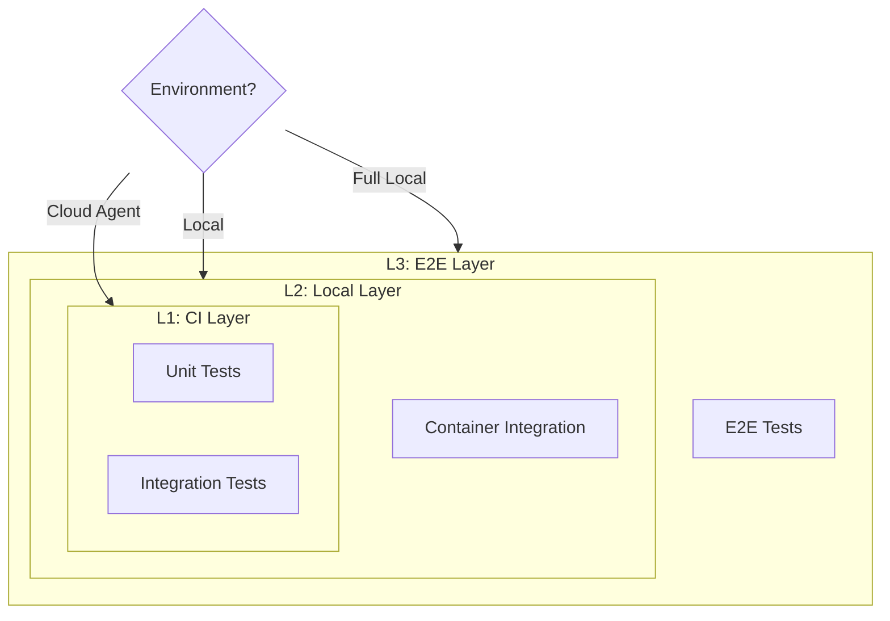

# ADR-0009: Test Layer Strategy

## Date
2025-12-05

## Context

Lyra has multiple external dependencies (Ollama, Playwright, SQLite, external Web). Integration tests including all of these:

| Problem | Details |
|---------|---------|
| Slow | Ollama startup alone takes seconds to tens of seconds |
| Unstable | Results vary with network and GPU state |
| Heavy | GPU resource consumption |
| Hard to Debug | Difficult to identify which layer failed |

On the other hand, pure unit tests alone cannot detect component integration issues.

Additionally, tests need to run in diverse environments:
- **Cloud Agents** (Cursor Cloud Agent, Claude Code, GitHub Actions): No display, Chrome, or Ollama
- **Local**: Containers available but E2E may be limited
- **Full Local**: Complete environment with Chrome CDP and GPU

## Decision

**Adopt a 3-layer test strategy with environment-aware execution and risk-based sub-markers.**

### Test Layers



| Layer | Name | Environment | External Dependencies | Speed |
|:-----:|------|-------------|----------------------|-------|
| L1 | CI | Cloud Agent / CI | All mocked | Fast |
| L2 | Local | Developer WSL2 | + Podman containers | Medium |
| L3 | E2E | Full environment | All real | Slow |

### Primary Markers

| Marker | Speed Target | External Deps | Notes |
|--------|--------------|---------------|-------|
| `@pytest.mark.unit` | <1s/test | None | Default if no marker |
| `@pytest.mark.integration` | <5s/test | Mocked but realistic | Component integration |
| `@pytest.mark.e2e` | Variable | Real Chrome, Ollama | Excluded by default |

### Dependency Scope / Risk-Based Sub-Markers (E2E Only)

For E2E tests, additional sub-markers clarify whether the test touches internet services
(IP/rate-limit risk) or only local services, and optionally the risk level:

| Sub-Marker | Risk Level | Example Services |
|------------|------------|------------------|
| `@pytest.mark.internal` | None | Local containers only (proxy/ml/ollama) |
| `@pytest.mark.external` | Moderate | Mojeek, Qwant |
| `@pytest.mark.rate_limited` | High | DuckDuckGo, Google |
| `@pytest.mark.manual` | N/A | CAPTCHA resolution |

Policy (enforced by `tests/conftest.py`):
- All `@pytest.mark.e2e` tests MUST include exactly one of: `internal` or `external`.
- `rate_limited` / `manual` are optional modifiers (typically used with `external`).

### Environment Detection

Cloud agent environments are auto-detected via environment variables:

- `CURSOR_CLOUD_AGENT`, `CURSOR_SESSION_ID`, `CURSOR_BACKGROUND`
- `CLAUDE_CODE`
- `GITHUB_ACTIONS=true`
- `GITLAB_CI`
- `CI=true`

In cloud agent environments, E2E tests are automatically skipped.

### Execution Commands

```bash
# L1: CI Layer (cloud agent safe)
pytest -m "not e2e"

# L2: Local Layer (includes container tests)
pytest -m "not e2e"

# L3: E2E Layer
pytest -m e2e

# E2E by dependency scope
pytest -m "e2e and internal"
pytest -m "e2e and external"

# E2E with specific risk level
pytest -m "e2e and external"
pytest -m "e2e and rate_limited"
```

## Consequences

### Positive
- **Fast Feedback**: L1 completes in seconds
- **Stability**: L1/L2 are deterministic without external dependencies
- **Progressive Verification**: Easy to identify problem location
- **CI Efficiency**: L3 runs only when needed
- **Cloud Agent Compatibility**: Auto-skip prevents failures in restricted environments

### Negative
- **Mock Maintenance Cost**: MockOllama etc. need updates
- **Coverage Limits**: Some bugs undetectable with mocks
- **3-Layer Management**: Need to decide which layer tests belong in

### Operational Reality (E2E-heavy debugging, test-light automation)

Lyra prioritizes **E2E scenario debugging** (especially via MCP-driven workflows) over building a large
automated E2E suite. This is intentional:

- Real-world E2E involves browser SERP, CAPTCHA flows, and external services with variable stability.
- A large automated E2E suite tends to be slow/flaky and creates noisy failures that are hard to triage.
- Therefore, automated E2E tests are kept **small and high-signal** (smoke-level), while most E2E
  validation happens through scenario-driven debugging and operational runbooks.

This ADR defines the automation policy; it does not prohibit E2E workflows. Rather, it clarifies that
automation focuses on determinism and fast feedback, and E2E coverage is primarily achieved through
MCP-oriented scenario verification.

## Alternatives Considered

| Alternative | Pros | Cons | Decision |
|-------------|------|------|----------|
| E2E Only | Realistic | Slow, unstable | Rejected |
| Unit Only | Fast | Integration issues undetected | Rejected |
| 2-Layer (Unit/E2E) | Simple | DB integration issues easily missed | Rejected |
| No Auto-Skip | Simpler logic | CI failures in cloud agents | Rejected |

## Related

- `tests/conftest.py` - pytest configuration, environment detection, marker definitions
- `scripts/test.sh` - Test runner (cloud agent compatible)
