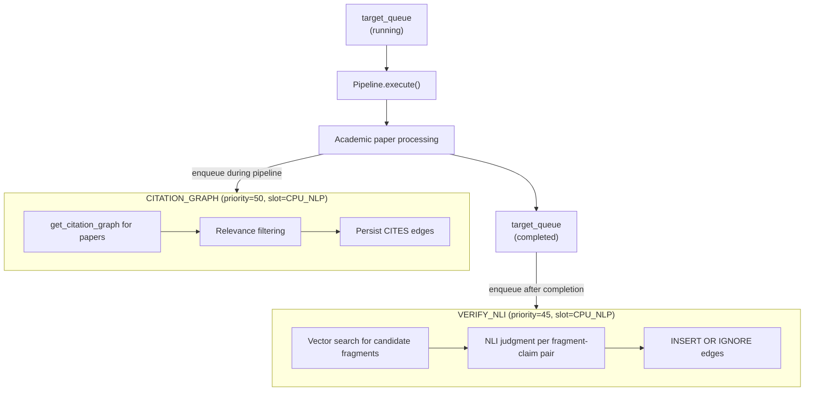

# ADR-0010: Async Target Queue Architecture

## Date
2025-12-10 (Updated: 2026-01-07)

## Context

Web search and crawling are time-consuming operations:

| Operation | Time Required |
|-----------|--------------|
| Search API call | 1-3 seconds |
| Page fetch | 2-10 seconds |
| JavaScript execution wait | 3-15 seconds |
| LLM extraction | 1-5 seconds |

Synchronous processing results in:
- 10 pages × 10 seconds = 100 seconds wait
- MCP client timeout
- Poor user experience

## Decision

**Submit search requests to a queue for asynchronous processing. Check status via polling.**

### Scheduling Policy (Ordering / Concurrency)

- **Ordering**: The worker processes jobs by **priority ASC**, then **created_at ASC** (FIFO within the same priority).
- **No cross-task fairness**: There is no round-robin or fairness logic across tasks beyond the ordering rule above.
- **No per-task sequential guarantee**: A task may have multiple searches running in parallel.
- **Priority vocabulary**: If priority is exposed, use `high | medium | low` (align with existing Lyra terminology).

### Worker Lifecycle

- All job execution is managed by the unified `JobScheduler` (`src/scheduler/jobs.py`)
- JobScheduler is started when the MCP server starts (`run_server()` startup via `get_scheduler()`)
- JobScheduler is stopped when the MCP server shuts down (`run_server()` finally block)
- TARGET_QUEUE jobs run on the `NETWORK_CLIENT` slot (default: 4 concurrent workers)
- Worker count per slot is controlled by `SLOT_LIMITS` in `jobs.py`

### Architecture

Worker runs as a coroutine within the MCP Server process. Completion notification uses an in-memory `asyncio.Event` per task (no DB polling).

### MCP Tool Design

#### queue_targets

| Parameter | Type | Description |
|-----------|------|-------------|
| `task_id` | string | Task identifier |
| `targets` | string[] | Search queries OR URLs to process |
| `options.priority` | enum | `high` / `medium` / `low` (scheduling priority) |
| `options.budget_pages` | int | Max pages per query (for query targets) |
| `options.serp_engines` | string[] | SERP engines: `duckduckgo`, `mojeek`, `google`, `brave`, `ecosia`, `startpage`, `bing`. Omit for auto-selection. |
| `options.academic_apis` | string[] | Academic APIs: `semantic_scholar`, `openalex`. Omit for default (both). |

**Target types**:
- **Query**: Plain text search query (processed through SERP + crawl + extract pipeline)
- **URL**: Direct URL starting with `http://` or `https://` (processed through fetch + extract pipeline)

**Behavior**:
- Returns immediately with `{ok, queued_count, target_ids}`
- Duplicate targets (same task, queued/running) are auto-skipped
- Jobs stored in `jobs` table with `kind='target_queue'`

#### get_status (wait / long polling)

| Parameter | Type | Description |
|-----------|------|-------------|
| `task_id` | string | Task identifier |
| `wait` | int | Seconds to wait for changes (0 = immediate return) |

**Behavior**:
- `wait=0`: Returns current status immediately
- `wait>0`: Blocks until progress change or timeout (long polling)
- Returns progress, completed searches, partial results, and errors

### Long Polling Benefits

### Worker Implementation

**Processing Loop**:
1. Dequeue next job using atomic claim semantics (CAS pattern)
2. Execute search → crawl results → extract content → store
3. Notify long polling clients on progress
4. Handle errors gracefully (partial failures don't block queue)

**Concurrency Safety**:
- Multiple workers use compare-and-swap (`UPDATE WHERE state='queued'`) to claim jobs
- Prevents duplicate processing of the same job

**Cancellation Support**:
- Running jobs are tracked by `JobScheduler._running_tasks`
- `stop_task(mode=immediate)` cancels in-flight jobs via `scheduler.cancel_running_jobs_for_task()`

### Error Handling

**Partial Failure Model**:
- Individual search/fetch errors don't fail the entire task
- Errors are recorded and reported alongside successful results
- Status shows both `progress` (successes) and `errors` (failures)

**Job States**:
| State | Description |
|-------|-------------|
| `queued` | Waiting for worker |
| `running` | Being processed |
| `completed` | Finished successfully |
| `failed` | Error during processing |
| `cancelled` | Stopped by user |
| `awaiting_auth` | Blocked by CAPTCHA (ADR-0007) |

## Consequences

### Positive
- **Non-blocking**: MCP client doesn't need to wait
- **Parallel Processing**: Multiple queries processed simultaneously
- **Timeout Avoidance**: Long processing doesn't cause MCP timeout
- **Partial Results**: Can get intermediate results before completion

### Negative
- **Complexity**: Queue management, worker management required
- **State Management**: Task state persistence required
- **Hard to Debug**: Async processing traces are complex

## Alternatives Considered

| Alternative | Pros | Cons | Decision |
|-------------|------|------|----------|
| Synchronous Processing | Simple | Timeout issues | Rejected |
| WebSocket | Real-time | Complex implementation, MCP incompatible | Rejected |
| Short Polling | Simple | Too many requests | Rejected |
| Server-Sent Events | Lightweight | MCP incompatible | Rejected |

## Design Details

### Storage Policy

- Queue items persist in `jobs` table with `kind = 'target_queue'`
- Completed items store full result JSON for auditability

### Job Chaining: target_queue → VERIFY_NLI / CITATION_GRAPH

Follow-up jobs are enqueued at different points in the target processing lifecycle:

**Enqueue timing**:
- `CITATION_GRAPH`: Enqueued **during** pipeline execution (after academic paper processing)
- `VERIFY_NLI`: Enqueued **after** target_queue job completion (by `JobScheduler._execute_target_queue_job`)

**Key behaviors**:
- Both jobs run on `CPU_NLP` slot (up to 8 parallel, don't block browser/network)
- `VERIFY_NLI`: Candidate fragments exclude claim's origin domain (no self-referencing)
- `CITATION_GRAPH`: Uses separate budget (`citation_graph_budget_pages`) per ADR-0015
- Duplicate `(fragment_id, claim_id)` pairs are skipped (DB unique index + application check)
- If follow-up jobs fail, the `target_queue` result is unaffected (fire-and-forget)

**Task status interactions**:
- `paused` tasks: Already-enqueued `VERIFY_NLI` and `CITATION_GRAPH` jobs will complete
- `stop_task(scope=all_jobs)` (default): Cancels all pending jobs including `VERIFY_NLI` and `CITATION_GRAPH`
- `stop_task(scope=target_queue_only)`: Does NOT cancel `VERIFY_NLI` or `CITATION_GRAPH` jobs
- Resuming a task with `queue_targets`: New searches may trigger additional follow-up jobs

### Target Deduplication

- `queue_targets` checks for existing `queued`/`running` jobs with same target before inserting
- Prevents redundant work from parallel workers discovering same query or URL

### stop_task Semantics

#### Scope Parameter

`stop_task` accepts a `scope` parameter to control which job kinds are cancelled:

| Scope | Cancelled Job Kinds | Unaffected Job Kinds |
|-------|---------------------|---------------------|
| `all_jobs` (default) | All kinds for this task | None |
| `target_queue_only` | `target_queue` | `verify_nli`, `citation_graph`, `embed`, `nli` |

**Rationale**: By default, stopping a task cancels all job kinds to ensure "stop means stop". Use `target_queue_only` if you want verification and citation graph jobs to complete while only stopping new target processing.

#### Mode Behavior

| Mode | Queued Items | Running Items | ML/NLI Operations |
|------|--------------|---------------|-------------------|
| `graceful` | → cancelled | Wait for completion (30s timeout) | Continue until job completes |
| `immediate` | → cancelled | Cancel via `asyncio.Task.cancel()` | May be interrupted mid-flight |
| `full` | → cancelled | Cancel via `asyncio.Task.cancel()` | Wait for drain (0.5s) |

**Note**: Mode applies only to job kinds within the specified `scope`.

**DB Impact on stop_task**:
- `tasks.status` → `paused` (task is resumable; can call queue_targets again)
- `jobs.state` → `cancelled` for jobs within scope (queued jobs in all modes, running jobs in immediate/full modes)
- `intervention_queue.status` → `cancelled` for pending auth items (always cancelled)
- Claims/fragments already persisted remain in DB for query_sql/vector_search

**Response includes**:
- `scope`: The scope that was applied
- `cancelled_counts`: Breakdown by job kind and state (queued/running)
- `unaffected_kinds`: List of job kinds that were NOT cancelled

**Reason Semantics**:
- `session_completed` (default): Session ends normally, task paused and resumable.
- `budget_exhausted`: Budget depleted, task paused and resumable after budget increase.
- `user_cancelled`: User explicitly cancelled, task paused (still resumable if desired).

**Consistency**: Job's `state = 'cancelled'` in `jobs` table is authoritative record. Partial artifacts may exist but are filterable.

### Long Polling

- Uses in-memory `asyncio.Event` per task (not DB polling)
- `get_status(wait=N)` blocks until change or timeout

### Resource Control

| Resource | Control Mechanism | ADR |
|----------|-------------------|-----|
| Browser SERP | TabPool + per-engine policy | [ADR-0014](0014-browser-serp-resource-control.md) |
| Academic APIs | Global rate limiter | [ADR-0013](0013-worker-resource-contention.md) |
| HTTP fetch | Per-domain RateLimiter | - |

## Related

- [ADR-0013: Worker Resource Contention](0013-worker-resource-contention.md) - Academic API resource control
- [ADR-0014: Browser SERP Resource Control](0014-browser-serp-resource-control.md) - TabPool for browser SERP
- `src/scheduler/jobs.py` - Unified JobScheduler (TARGET_QUEUE execution)
- `src/mcp/server.py` - MCP tool definitions
