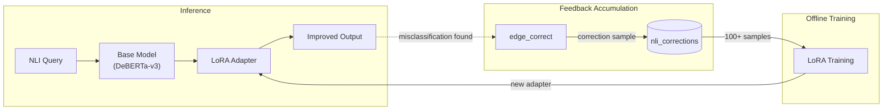
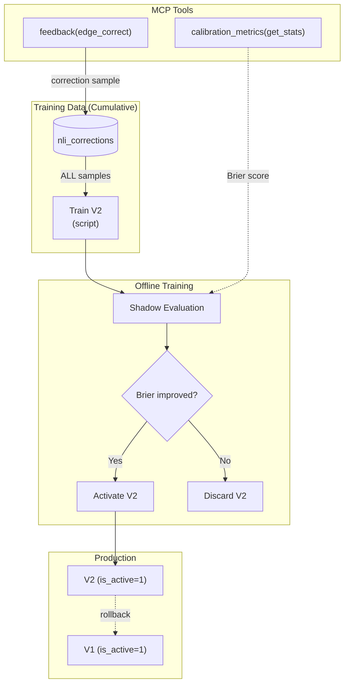

# ADR-0011: LoRA Fine-tuning Strategy

## Date
2025-12-20

## Context

The NLI models used in Lyra (DeBERTa-v3-xsmall/small) are general-purpose pre-trained models. The following challenges exist:

| Challenge | Details |
|-----------|---------|
| Domain Adaptation | Insufficient specialization for academic papers/technical documents |
| Misclassification | Errors like classifying supports as neutral |
| User-specific | Not optimized for each user's research domain |

Full fine-tuning has these problems:
- Requires tens of GB of GPU memory
- Training time of hours to days
- Entire model must be saved (several GB)

## Decision

**Adopt LoRA (Low-Rank Adaptation) for parameter-efficient fine-tuning.**

### LoRA Selection Reasons

| Aspect | LoRA | Full FT |
|--------|------|---------|
| Memory | Several GB | Tens of GB |
| Training Time | Minutes to hours | Hours to days |
| Adapter Size | Several MB | Several GB |
| Multiple Adapters | Possible | Difficult |

### Architecture



**Continuous Improvement Cycle**:
1. User finds misclassification and submits feedback via `edge_correct`
2. Correction samples accumulate in `nli_corrections` table (= user's domain-specific experience)
3. When accumulation reaches threshold (100+ samples), trigger offline LoRA training
4. New adapter improves NLI output quality

### Feedback-driven Learning

Learn LoRA adapters from user feedback (see ADR-0012):

```python
# Collect feedback data (ADR-0017: nli_hypothesis = claim_text)
feedback_data = [
    {
        "premise": "Fragment from Paper A...",
        "nli_hypothesis": "Extracted claim text...",  # ADR-0017 terminology
        "correct_label": "supports",  # User correction
        "original_label": "neutral"   # Model misclassification
    },
    ...
]

# LoRA training (effective with tens to hundreds of samples)
adapter = train_lora(
    base_model="cross-encoder/nli-deberta-v3-small",
    data=feedback_data,
    rank=8,
    alpha=16
)
```

### Training Parameters

| Parameter | Value | Reason |
|-----------|-------|--------|
| rank (r) | 8 | Balance between memory efficiency and performance |
| alpha | 16 | Recommended 2× of r |
| dropout | 0.1 | Higher regularization effective for small models (70-140M params) |
| target_modules | query, value | DeBERTa-v3 Attention layers |

### Adapter Management



**Data Strategy**:
- **Cumulative (default)**: V2 is trained on ALL `nli_corrections` (V1 data + new data)
- `trained_adapter_id` column tracks which adapter used which samples (for audit/future incremental learning)
- Future: May switch to incremental learning when samples exceed several thousand

**MCP Tools Involvement**:
- `feedback(edge_correct)`: Accumulates correction samples to `nli_corrections`
- `calibration_metrics(get_stats)`: Provides Brier score for shadow evaluation (before production deployment)

**Version Activation Flow**:
1. Train new adapter (V2) from **entire** `nli_corrections` history
2. Run shadow evaluation: compare V2 Brier score against V1
3. If improved → activate V2 (`is_active=1`), deactivate V1
4. If degraded in production → rollback to V1

The `adapters` table tracks version history. Only one adapter can be active at a time.

### MCP Tool Integration Decision

**Decision: MCP tooling rejected. Script-based operation adopted.**

#### Rejection Reasons

| Aspect | Problem |
|--------|---------|
| Processing Time | MCP timeout risk with tens of minutes to 1 hour |
| GPU Contention | Competes with ML Server during inference |
| Manual Verification | Shadow evaluation results should be human-reviewed before production |
| Iteration | Scripts more flexible for hyperparameter tuning |

#### Adopted Approach

**Script-based offline training** (not MCP tools):
- Training script reads `nli_corrections`, trains adapter, writes to `adapters/`
- User reviews shadow evaluation results before activation
- ML Server loads adapter via API call (`/nli/adapter/load`)

See **Adapter Management** section above for the complete version activation flow.

#### Relationship with calibration_metrics

- `calibration_metrics(get_stats)` / `(get_evaluations)`: **State check/history reference only** (MCP tools).
- `evaluate` / `fit` / reliability-diagram visualization:
  - Not exposed as MCP tools in the current implementation.
  - Intended to be performed by offline scripts / notebooks to avoid timeouts and to keep training/evaluation reviewable.

### Training Trigger Conditions

| Condition | Threshold | Reason |
|-----------|-----------|--------|
| Feedback Accumulation | 100+ samples | Statistical stability with ~33 samples per class for 3-class classification |
| Misclassification Rate | 10%+ | Indicates need for improvement |
| Domain Change | User-specified | New domain adaptation |

## Consequences

### Positive
- **Efficient**: Performance improvement with several MB adapters
- **Fast**: Training completes in minutes to hours
- **Reversible**: Can always rollback to original
- **Personalized**: Adapts to user's research domain

### Negative
- **Training Quality**: Depends on feedback quality
- **Complexity**: Adapter management overhead
- **Compatibility**: Depends on Ollama adapter support

## Alternatives Considered

| Alternative | Pros | Cons | Decision |
|-------------|------|------|----------|
| Full Fine-tuning | Best performance | Excessive resources | Rejected |
| Prompt Tuning | Lightweight | Limited effect | Rejected |
| Adapter Tuning | Similar to LoRA | Less efficient than LoRA | Rejected |
| QLoRA | Ultra-lightweight | Quality degradation risk | Future consideration |
| **MCP Tooling** | UI integration | Long processing, GPU contention, manual verification difficulty | **Rejected** |

## Related

- [ADR-0012: Feedback Tool Design](0012-feedback-tool-design.md) - Edge correction for LoRA training data
- `src/utils/nli_calibration.py` - Probability calibration implementation
- `src/storage/schema.sql` - `nli_corrections`, `calibration_evaluations` tables
- `src/mcp/server.py` - `calibration_metrics`, `calibration_rollback` MCP tools
