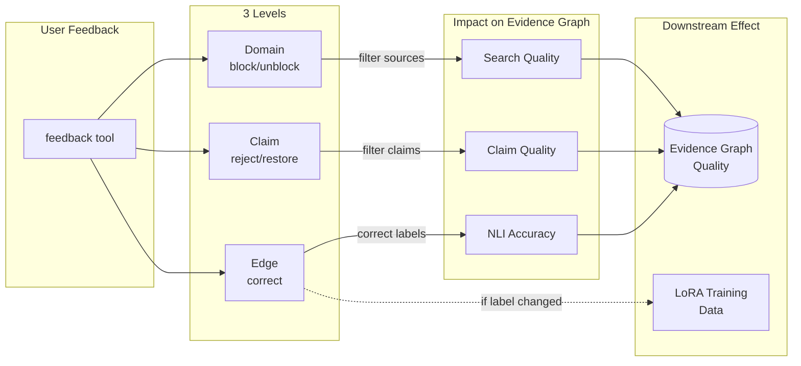
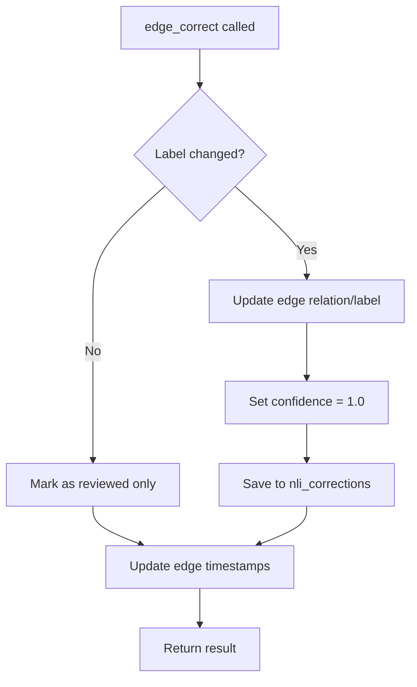

# ADR-0012: Feedback Tool Design

## Date
2025-12-23

## Context

Lyra supports academic research, but models make errors in the following situations:

| Error Type | Example |
|------------|---------|
| NLI Misclassification | Classifying supports as neutral |
| Extraction Omission | Missing important claims |
| Noise Inclusion | Judging irrelevant fragments as related |
| Citation Misidentification | Incorrectly inferring citation relationships |

A mechanism is needed to correct these errors and utilize them for model improvement.

## Decision

**Introduce a feedback tool with 3 levels and 6 action types to accept user corrections.**

### Feedback Tool Actions (3-Level Structure)



| Level | Action | Purpose | Impact |
|-------|--------|---------|--------|
| Domain | `domain_block` | Block low-quality sources | Future searches skip this domain |
| Domain | `domain_unblock` | Restore blocked domain | Re-enable source |
| Domain | `domain_clear_override` | Remove override rule | Reset to default policy |
| Claim | `claim_reject` | Mark claim as invalid | Excluded from analysis |
| Claim | `claim_restore` | Restore rejected claim | Re-include in analysis |
| Edge | `edge_correct` | Fix NLI label | Immediate graph update + LoRA training data |

### Tool Schema

```json
{
  "name": "feedback",
  "description": "Submit corrections and feedback on evidence",
  "inputSchema": {
    "type": "object",
    "properties": {
      "task_id": { "type": "string" },
      "action": {
        "type": "string",
        "enum": [
          "domain_block",
          "domain_unblock", 
          "domain_clear_override",
          "claim_reject",
          "claim_restore",
          "edge_correct"
        ]
      },
      "args": { "type": "object" }
    },
    "required": ["task_id", "action", "args"]
  }
}
```

### Action-specific Payloads

#### 1. domain_block

```json
{
  "action": "domain_block",
  "args": {
    "domain_pattern": "spam-site.com",
    "reason": "Low quality content, mostly advertisements"
  }
}
```

#### 2. domain_unblock

```json
{
  "action": "domain_unblock",
  "args": {
    "domain_pattern": "legitimate-site.com",
    "reason": "Previously blocked by mistake"
  }
}
```

#### 3. claim_reject

```json
{
  "action": "claim_reject",
  "args": {
    "claim_id": "claim_abc123",
    "reason": "Claim is too vague to verify"
  }
}
```

#### 4. edge_correct

```json
{
  "action": "edge_correct",
  "args": {
    "edge_id": "edge_xyz789",
    "correct_relation": "supports",
    "reason": "The conclusion section clearly supports the hypothesis"
  }
}
```

### Database Tables

Feedback data is persisted to the following tables (see `src/storage/schema.sql` for full schema):

| Table | Purpose | Used by |
|-------|---------|---------|
| `nli_corrections` | NLI correction samples for LoRA training | `edge_correct` |
| `domain_override_rules` | Active block/unblock rules | `domain_*` actions |
| `domain_override_events` | Audit log for domain changes | `domain_*` actions |
| `claims` | Claim adoption status | `claim_reject/restore` |
| `edges` | Human-reviewed flag and corrected labels | `edge_correct` |

### Security Constraints

TLD-level blocking is prohibited:

```python
FORBIDDEN_PATTERNS = [
    "*",           # All domains
    "*.com",       # TLD level
    "*.co.jp",
    "*.org", 
    "*.net",
    "*.gov",
    "*.edu",
    "**",          # Recursive glob
]
```

### Immediate Graph Reflection

Feedback is immediately reflected in the graph:



Key behaviors:
1. **Always**: Mark edge as human-reviewed (`edge_human_corrected = 1`)
2. **If label changed**: Update relation/label, set confidence to 1.0, persist to `nli_corrections` for LoRA training
3. **If label unchanged**: Review-only mode, no `nli_corrections` record created

### Edge Review vs Correction (Important Operational Note)

`edge_correct` is used not only for "correction" but also to mark as "**human-reviewed**."

- **Reviewed (denominator)**: `edges.edge_human_corrected = 1` and `edges.edge_corrected_at` is set
- **Corrected (numerator)**: Above plus 1 record added to `nli_corrections` (`predicted_label != correct_label`)
- **Reviewed without correction (correct)**: Review mark on `edges` side, no `nli_corrections` increase

This separation enables "explicit recording of only errors" in operation, while allowing reviewed sets to be tracked from DB for case studies.

## Consequences

### Positive
- **Continuous Improvement**: Model quality improves from user feedback
- **Transparency**: Correction history is traceable (audit log tables)
- **Immediate Effect**: Immediately reflected in graph
- **3-Level Structure**: Clear responsibility separation for Domain/Claim/Edge
- **Security**: TLD-level blocking prohibition prevents misoperation

### Negative
- **User Burden**: Effort required for feedback input
- **Quality Risk**: Incorrect feedback may be mixed in
- **Complexity**: Managing 6 action types

## Alternatives Considered

| Alternative | Pros | Cons | Decision |
|-------------|------|------|----------|
| Simple good/bad buttons | Simple | Insufficient information | Rejected |
| Free text only | Flexible | Difficult to structure | Rejected |
| External annotation tool | Feature-rich | Integration cost, Zero OpEx | Rejected |

## Related

- [ADR-0011: LoRA Fine-tuning Strategy](0011-lora-fine-tuning.md) - Uses edge corrections for adapter training
- `src/mcp/feedback_handler.py` - Feedback action handler
- `src/mcp/server.py` - Feedback tool definition
- `src/storage/schema.sql` - nli_corrections, domain_override_rules tables

