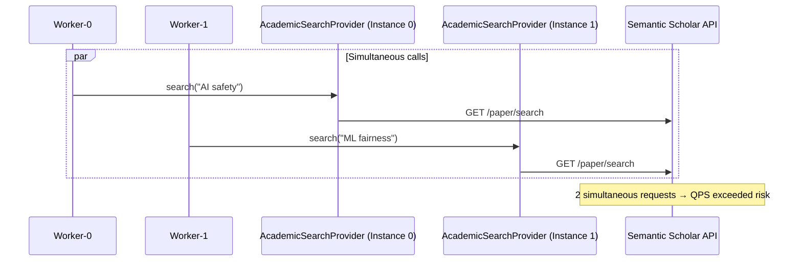

# ADR-0013: Worker Resource Contention Control

## Date
2025-12-24

## Context

ADR-0010 specifies that `SearchQueueWorker` processes searches with 2 parallel workers. However, resources used internally by search processing have **different concurrency constraints**:

| Resource | Constraint | Reason | Related ADR |
|----------|------------|--------|-------------|
| Browser SERP | TabPool(max_tabs=2) | Eliminate Page sharing contention (correctness guarantee) | **ADR-0014** |
| Semantic Scholar API | Global QPS | API terms of service, rate limits | This ADR |
| OpenAlex API | Global QPS | Same as above | This ADR |
| HTTP Fetch | Per-domain QPS | ADR-0006 stealth requirements | - |

**Note**: Browser SERP resource control is detailed in [ADR-0014](0014-browser-serp-resource-control.md). This ADR focuses on academic APIs.

### Current Problem

```
SearchPipeline._execute_unified_search():  # ADR-0016: Always execute dual-source
    academic_provider = AcademicSearchProvider()  # New instance each time
    ...
    await asyncio.gather(
        search_serp(query),           # ✅ Protected by singleton + Semaphore(1)
        academic_provider.search()    # ❌ No global limit
    )
```

**Problem Scenario:**



When 2 workers simultaneously call the same API, there's a risk of hitting rate limits because there's no global QPS control.

### Resources Without Issues Currently

1. **Browser SERP**: `get_browser_search_provider()` returns singleton
   - **Note**: Phase 4.B introduces TabPool(max_tabs=1) to first eliminate Page contention ([ADR-0014](0014-browser-serp-resource-control.md))
2. **HTTP Fetch**: `RateLimiter` acquires per-domain locks, respecting QPS limits

## Decision

**Add "cross-worker global control" to academic API clients.**

The goal is to **prevent exceeding limits** rather than "backoff after 429", for stable operation.

### Design Principles

1. **Global rate limiter, not singleton pattern**
   - Each client instance can be independent
   - Only the rate limiter is globally shared

2. **Per-provider limits**
   - Semantic Scholar and OpenAlex are separate APIs → parallel OK
   - Limit simultaneous requests to the same provider

3. **Config-driven**
   - Load QPS settings from `config/academic_apis.yaml`
   - Avoid hardcoding

4. **Control parallelism too (Important)**
   - `AcademicSearchProvider` / citation graph use `asyncio.gather()` for fan-out
   - Therefore control **max_parallel (concurrency)** as well as QPS per provider

### Implementation

#### 1. Global Rate Limiter (`src/search/apis/rate_limiter.py`)

```python
class AcademicAPIRateLimiter:
    """Global rate limiter for academic APIs.
    
    Enforces per-provider QPS limits across all worker instances.
    """
    
    def __init__(self):
        self._locks: dict[str, asyncio.Lock] = {}
        self._last_request: dict[str, float] = {}
    
    async def acquire(self, provider: str) -> None:
        """Acquire rate limit slot for a provider.
        
        Args:
            provider: API provider name (e.g., "semantic_scholar", "openalex")
        """
        if provider not in self._locks:
            self._locks[provider] = asyncio.Lock()
        
        async with self._locks[provider]:
            min_interval = self._get_min_interval(provider)
            last = self._last_request.get(provider, 0)
            wait = max(0, min_interval - (time.time() - last))
            
            if wait > 0:
                await asyncio.sleep(wait)
            
            self._last_request[provider] = time.time()
    
    def _get_min_interval(self, provider: str) -> float:
        """Get minimum interval between requests from config."""
        config = get_academic_apis_config()
        api_config = config.get_api_config(provider)
        
        if api_config.rate_limit and api_config.rate_limit.min_interval_seconds:
            return api_config.rate_limit.min_interval_seconds
        
        # Default: 0.1s (10 req/s) - conservative for most APIs
        return 0.1

# Global instance
_rate_limiter: AcademicAPIRateLimiter | None = None

def get_academic_rate_limiter() -> AcademicAPIRateLimiter:
    global _rate_limiter
    if _rate_limiter is None:
        _rate_limiter = AcademicAPIRateLimiter()
    return _rate_limiter
```

#### 2. Client Integration (`src/search/apis/base.py`)

```python
class BaseAcademicClient(ABC):
    async def search(self, query: str, limit: int = 10) -> AcademicSearchResult:
        # Acquire global limits before API call (QPS + concurrency)
        limiter = get_academic_rate_limiter()
        await limiter.acquire(self.name)
        return await self._search_impl(query, limit)
    
    @abstractmethod
    async def _search_impl(self, query: str, limit: int) -> AcademicSearchResult:
        """Actual search implementation (subclass)."""
        pass
```

### Configuration Example (`config/academic_apis.yaml`)

```yaml
apis:
  semantic_scholar:
    rate_limit:
      requests_per_interval: 100
      interval_seconds: 300  # 100 req/5min = 0.33 req/s
      min_interval_seconds: 3.0  # Conservative (override; if omitted, derive from requests/interval)
      max_parallel: 1            # Provider-level concurrency cap (global)
  
  openalex:
    rate_limit:
      requests_per_interval: 10
      interval_seconds: 1  # 10 req/s (polite pool)
      min_interval_seconds: 0.1
      max_parallel: 2
```

> Note: If only daily limits like `requests_per_day` exist,
> first set `max_parallel` low (1-2), then explicitly add `min_interval_seconds` if needed (conservative operation).

## Consequences

### Positive

1. **API Terms Compliance** - Prevents blocking from rate limit violations
2. **Scalability** - Safe even when worker count increases
3. **Config-driven** - No code changes needed when API specs change
4. **Minimal Existing Code Impact** - Only base class changes

### Negative

1. **Latency Increase** - Wait required for consecutive requests to same API
2. **Complexity Increase** - Global state management

### Neutral

1. **No Browser SERP Changes** - Already protected
2. **No HTTP Fetch Changes** - Already protected

## Alternatives Considered

### A. Client Singletonization

```python
_clients: dict[str, BaseAcademicClient] = {}

def get_academic_client(name: str) -> BaseAcademicClient:
    if name not in _clients:
        _clients[name] = create_client(name)
    return _clients[name]
```

**Rejection Reason**: HTTP session management becomes complex, testing difficult

### B. Status Quo (Rely on API-side Limits)

**Rejection Reason**: 
- Semantic Scholar is strict at 100 req/5min
- 2 workers × multiple tasks risks burst exceeding limits
- API-side blocking has long-term impact

### C. Limit Worker Count to 1

**Rejection Reason**: 
- Loses parallelism benefits
- Browser SERP and academic API can run in parallel without issues

## Related

- [ADR-0010: Async Search Queue Architecture](0010-async-search-queue.md) - Foundation for worker parallel execution
- [ADR-0014: Browser SERP Resource Control](0014-browser-serp-resource-control.md) - Browser SERP resource control (TabPool: max_tabs=2)
- [ADR-0006: 8-Layer Security Model](0006-eight-layer-security-model.md) - Stealth requirements
