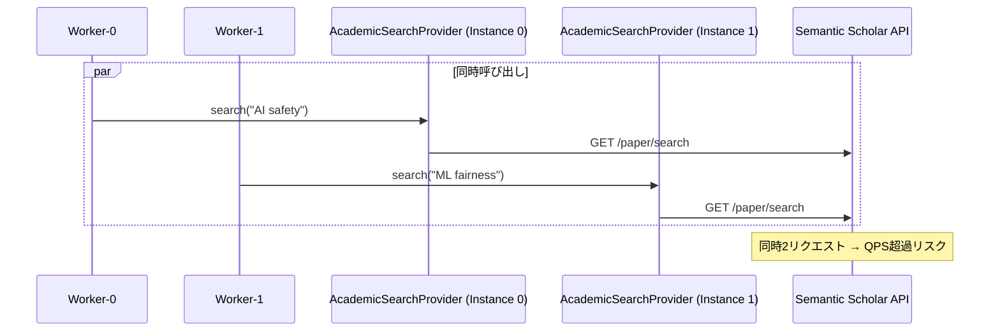

# ADR-0013: Worker Resource Contention Control

## Date
2025-12-24

## Status
Proposed

## Context

ADR-0010 により `SearchQueueWorker` が2並列で検索を処理する。しかし、検索処理が内部で使用するリソースには**異なる同時実行制約**がある：

| リソース | 制約 | 理由 | 対応ADR |
|----------|------|------|---------|
| ブラウザSERP | TabPool(max_tabs=1) | Page共有競合の排除（正しさ担保） | **ADR-0014** |
| Semantic Scholar API | グローバルQPS | API利用規約、レート制限 | 本ADR |
| OpenAlex API | グローバルQPS | 同上 | 本ADR |
| HTTPフェッチ | ドメイン別QPS | ADR-0006 ステルス要件 | - |

**Note**: ブラウザSERPリソース制御は [ADR-0014](0014-browser-serp-resource-control.md) で詳細設計。本ADRは学術APIに焦点を当てる。

### 現状の問題

```
SearchPipeline._execute_complementary_search():
    academic_provider = AcademicSearchProvider()  # 毎回新規インスタンス
    ...
    await asyncio.gather(
        search_serp(query),           # ✅ シングルトン+Semaphore(1)で保護
        academic_provider.search()    # ❌ グローバル制限なし
    )
```

**問題シナリオ:**



2ワーカーが同時に同一APIを呼び出すと、グローバルQPS制限がないためAPI側でレート制限に引っかかる可能性がある。

### 現状で問題ないリソース

1. **ブラウザSERP**: `get_browser_search_provider()` がシングルトンを返す
   - **Note**: Phase 4.B で TabPool(max_tabs=1) を導入し、まず Page競合を排除（[ADR-0014](0014-browser-serp-resource-control.md)）
2. **HTTPフェッチ**: `RateLimiter` がドメイン別にロックを取得し、QPS制限を遵守

## Decision

**学術APIクライアントに「全ワーカー横断のグローバル制御」を追加する。**

目的は「429が出てからバックオフ」ではなく、**超過を予防**して安定稼働させること。

### 設計方針

1. **シングルトンパターンではなく、グローバルレートリミッター**
   - 各クライアントインスタンスは独立して良い
   - レートリミッターのみグローバル共有

2. **プロバイダー別制限**
   - Semantic Scholar と OpenAlex は別のAPI → 並列OK
   - 同一プロバイダーへの同時リクエストを制限

3. **設定駆動**
   - `config/academic_apis.yaml` からQPS設定を読み込み
   - ハードコードを避ける

4. **並列度も制御する（重要）**
   - `AcademicSearchProvider` / citation graph で `asyncio.gather()` による fan-out が起きる
   - そのため「QPS」だけでなく **max_parallel（同時数）** も provider ごとに制御する

### 実装

#### 1. グローバルレートリミッター (`src/search/apis/rate_limiter.py`)

```python
class AcademicAPIRateLimiter:
    """Global rate limiter for academic APIs.
    
    Enforces per-provider QPS limits across all worker instances.
    """
    
    def __init__(self):
        self._locks: dict[str, asyncio.Lock] = {}
        self._last_request: dict[str, float] = {}
    
    async def acquire(self, provider: str) -> None:
        """Acquire rate limit slot for a provider.
        
        Args:
            provider: API provider name (e.g., "semantic_scholar", "openalex")
        """
        if provider not in self._locks:
            self._locks[provider] = asyncio.Lock()
        
        async with self._locks[provider]:
            min_interval = self._get_min_interval(provider)
            last = self._last_request.get(provider, 0)
            wait = max(0, min_interval - (time.time() - last))
            
            if wait > 0:
                await asyncio.sleep(wait)
            
            self._last_request[provider] = time.time()
    
    def _get_min_interval(self, provider: str) -> float:
        """Get minimum interval between requests from config."""
        config = get_academic_apis_config()
        api_config = config.get_api_config(provider)
        
        if api_config.rate_limit and api_config.rate_limit.min_interval_seconds:
            return api_config.rate_limit.min_interval_seconds
        
        # Default: 0.1s (10 req/s) - conservative for most APIs
        return 0.1

# Global instance
_rate_limiter: AcademicAPIRateLimiter | None = None

def get_academic_rate_limiter() -> AcademicAPIRateLimiter:
    global _rate_limiter
    if _rate_limiter is None:
        _rate_limiter = AcademicAPIRateLimiter()
    return _rate_limiter
```

#### 2. クライアント統合 (`src/search/apis/base.py`)

```python
class BaseAcademicClient(ABC):
    async def search(self, query: str, limit: int = 10) -> AcademicSearchResult:
        # Acquire global limits before API call (QPS + concurrency)
        limiter = get_academic_rate_limiter()
        await limiter.acquire(self.name)
        return await self._search_impl(query, limit)
    
    @abstractmethod
    async def _search_impl(self, query: str, limit: int) -> AcademicSearchResult:
        """Actual search implementation (subclass)."""
        pass
```

### 設定例 (`config/academic_apis.yaml`)

```yaml
apis:
  semantic_scholar:
    rate_limit:
      requests_per_interval: 100
      interval_seconds: 300  # 100 req/5min = 0.33 req/s
      min_interval_seconds: 3.0  # Conservative (override; if omitted, derive from requests/interval)
      max_parallel: 1            # Provider-level concurrency cap (global)
  
  openalex:
    rate_limit:
      requests_per_interval: 10
      interval_seconds: 1  # 10 req/s (polite pool)
      min_interval_seconds: 0.1
      max_parallel: 2
```

> Note: `requests_per_day` のような日次制限しかない場合は、\
> まず `max_parallel` を低め（1〜2）にし、必要なら `min_interval_seconds` を明示する（保守的運用）。

## Consequences

### Positive

1. **API利用規約遵守** - レート制限違反によるブロックを防止
2. **スケーラビリティ** - ワーカー数増加時も安全
3. **設定駆動** - API仕様変更時にコード変更不要
4. **既存コード影響最小** - 基底クラスの変更のみ

### Negative

1. **レイテンシ増加** - 同一APIへの連続リクエストに待機発生
2. **複雑性増加** - グローバル状態の管理

### Neutral

1. **ブラウザSERP変更なし** - 既に保護済み
2. **HTTPフェッチ変更なし** - 既に保護済み

## Alternatives Considered

### A. クライアントのシングルトン化

```python
_clients: dict[str, BaseAcademicClient] = {}

def get_academic_client(name: str) -> BaseAcademicClient:
    if name not in _clients:
        _clients[name] = create_client(name)
    return _clients[name]
```

**却下理由**: HTTPセッション管理が複雑化、テスト困難

### B. 現状維持（API側制限に依存）

**却下理由**: 
- Semantic Scholar は 100 req/5min と厳格
- 2ワーカー × 複数タスク でバースト時に超過リスク
- API側でブロックされると長時間影響

### C. ワーカー数を1に制限

**却下理由**: 
- 並列性の利点を失う
- ブラウザSERPと学術APIは並列で問題ない

## Implementation Status

- [ ] ADR承認
- [ ] `src/search/apis/rate_limiter.py` 実装
- [ ] `BaseAcademicClient` 統合
- [ ] テスト追加 (`tests/test_academic_api_rate_limiter.py`)
- [ ] `config/academic_apis.yaml` 更新
- [ ] シーケンス図更新

## Related

- [ADR-0010: Async Search Queue Architecture](0010-async-search-queue.md) - ワーカー並列実行の基盤
- [ADR-0014: Browser SERP Resource Control](0014-browser-serp-resource-control.md) - ブラウザSERPリソース制御（TabPool: max_tabs=1）
- [ADR-0006: 8-Layer Security Model](0006-8-layer-security-model.md) - ステルス要件
- [Q_ASYNC_ARCHITECTURE.md](../Q_ASYNC_ARCHITECTURE.md) - Phase 4 実装計画
- [R_SERP_ENHANCEMENT.md](../R_SERP_ENHANCEMENT.md) - Phase 5 ページネーション詳細設計
