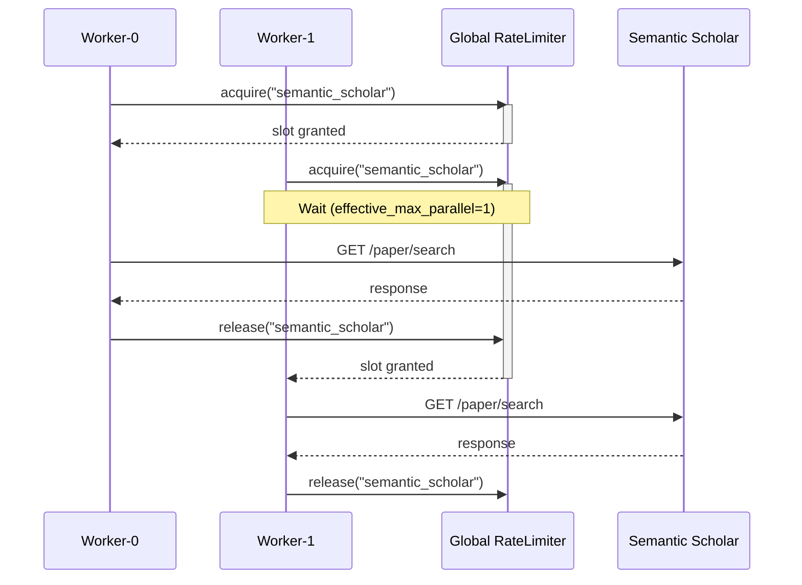

# ADR-0013: Worker Resource Contention Control

## Date
2025-12-24

## Context

ADR-0010 specifies that `SearchQueueWorker` processes searches with 2 parallel workers. However, resources used internally by search processing have **different concurrency constraints**:

| Resource | Constraint | Reason | Related ADR |
|----------|------------|--------|-------------|
| Browser SERP | TabPool | Eliminate Page sharing contention (correctness guarantee) | **ADR-0014** |
| Semantic Scholar API | Global QPS | API terms of service, rate limits | This ADR |
| OpenAlex API | Global QPS | Same as above | This ADR |
| HTTP Fetch | Per-domain QPS | ADR-0006 stealth requirements | - |

**Note**: Browser SERP resource control is detailed in [ADR-0014](0014-browser-serp-resource-control.md). This ADR focuses on academic APIs.

### Problem

Multiple workers may instantiate independent `AcademicSearchProvider` objects and call the same external API simultaneously. Without global coordination, this risks exceeding API rate limits.

### Resources Without Issues Currently

1. **Browser SERP**: TabPool provides per-worker isolation ([ADR-0014](0014-browser-serp-resource-control.md))
2. **HTTP Fetch**: `RateLimiter` acquires per-domain locks, respecting QPS limits

## Decision

**Add a global rate limiter for academic API clients.**

The goal is to **prevent exceeding limits proactively** rather than relying on "backoff after 429".

### Design Principles

1. **Global rate limiter, not singleton clients**
   - Each client instance remains independent
   - Only the rate limiter state is globally shared

2. **Per-provider limits**
   - Semantic Scholar and OpenAlex are separate APIs → can run in parallel
   - Limit simultaneous requests within the same provider

3. **Config-driven**
   - Load QPS settings from `config/academic_apis.yaml`
   - Avoid hardcoding rate limits

4. **Dual control: QPS and concurrency**
   - `min_interval_seconds`: Minimum time between consecutive requests
   - `max_parallel`: Maximum concurrent in-flight requests

### Integration Pattern



Workers compete for rate limiter slots. When `effective_max_parallel=1`, only one worker can access the API at a time; others wait until a slot is released.

> **Note**: `effective_max_parallel` may be reduced below config `max_parallel` during backoff (see "Auto-backoff on 429 Errors" section below).

## Consequences

### Positive

1. **API Terms Compliance** - Prevents blocking from rate limit violations
2. **Scalability** - Safe even when worker count increases
3. **Config-driven** - No code changes needed when API specs change
4. **Minimal Existing Code Impact** - Only base class changes

### Negative

1. **Latency Increase** - Wait required for consecutive requests to same API
2. **Complexity Increase** - Global state management

### Neutral

1. **No Browser SERP Changes** - Already protected by TabPool
2. **No HTTP Fetch Changes** - Already protected by domain-level rate limiter

## Alternatives Considered

### A. Client Singletonization

Make each academic client a singleton instead of using a shared rate limiter.

**Rejection Reason**: HTTP session lifecycle management becomes complex; testing with isolated state becomes difficult.

### B. Status Quo (Rely on API-side Limits)

Let the API reject requests when limits are exceeded.

**Rejection Reason**: 
- Semantic Scholar: 1 req/s dedicated with API key, or 1000 req/s shared globally without
- 2 workers × multiple tasks risks burst exceeding limits (especially without API key)
- API-side blocking (429 responses) has long-term account impact

### C. Limit Worker Count to 1

Reduce parallelism to avoid contention.

**Rejection Reason**: 
- Loses parallelism benefits
- Browser SERP and academic API can run in parallel without issues

## Auto-backoff on 429 Errors

When a 429 error is received, the rate limiter automatically reduces `effective_max_parallel`:

- **Decrease**: Immediately lower on 429
- **Recovery**: Auto-recover by 1 step after `recovery_stable_seconds` (default: 60s), up to config limit
- **Risk**: Low (protected by rate limiting)

**Config location**: `config/settings.yaml` → `concurrency.backoff.academic_api`

```yaml
concurrency:
  backoff:
    academic_api:
      recovery_stable_seconds: 60  # Seconds before attempting recovery
      decrease_step: 1             # Amount to decrease on 429
```

## Related

- [ADR-0006: 8-Layer Security Model](0006-eight-layer-security-model.md) - Stealth requirements for HTTP fetch
- [ADR-0010: Async Search Queue Architecture](0010-async-search-queue.md) - Foundation for worker parallel execution
- [ADR-0014: Browser SERP Resource Control](0014-browser-serp-resource-control.md) - Browser SERP resource control (TabPool)
