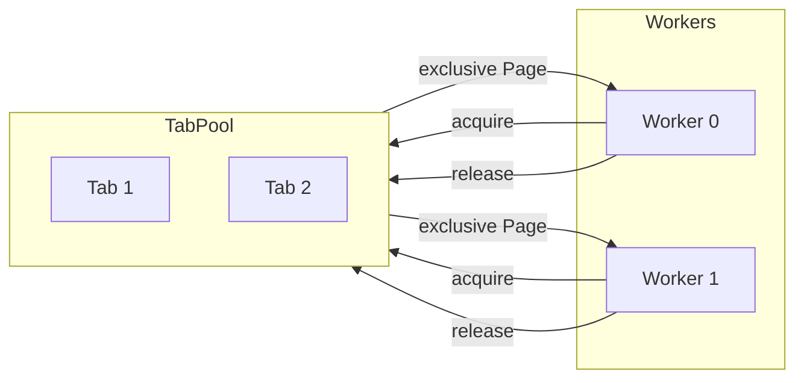
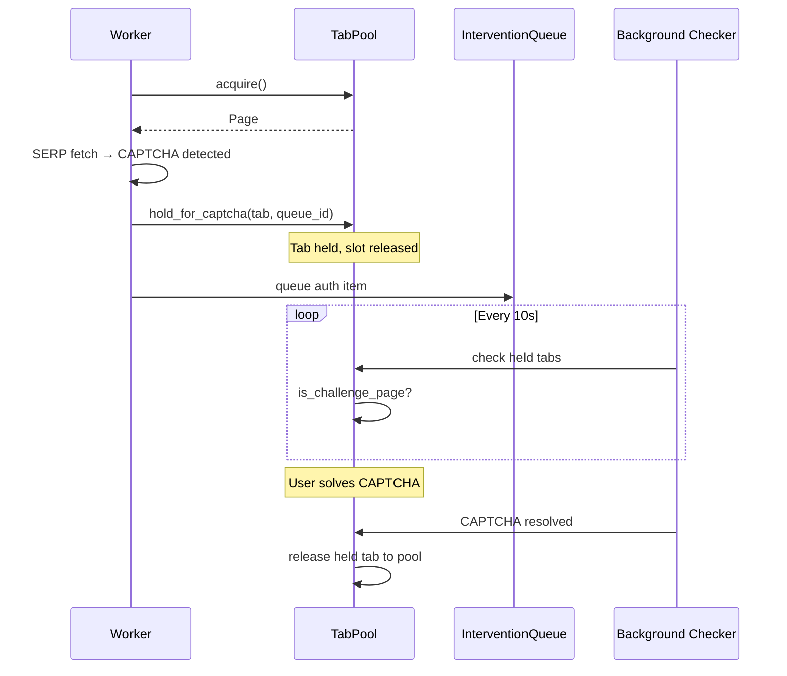
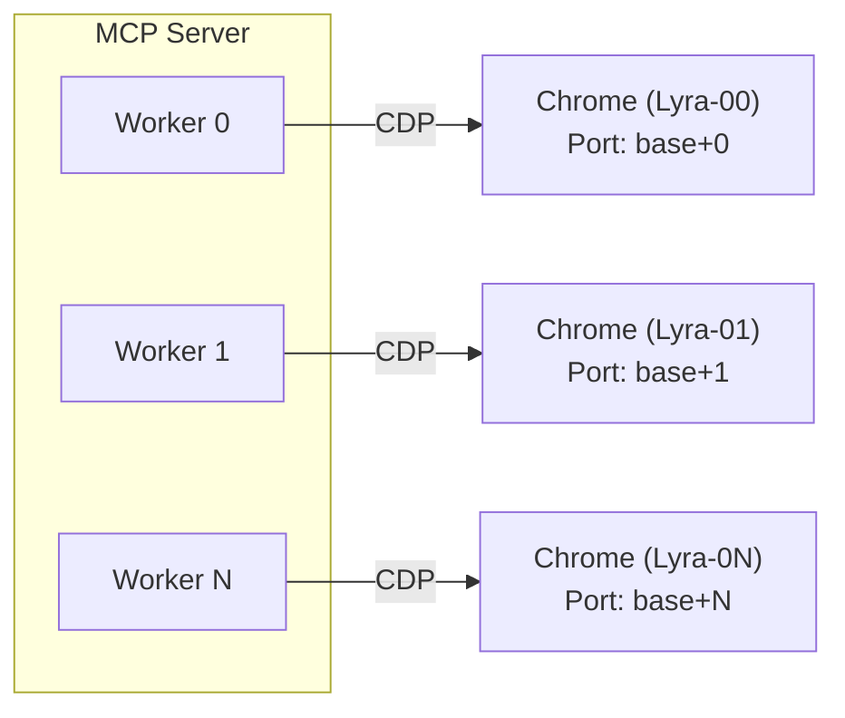

# ADR-0014: Browser SERP Resource Control

## Date
2025-12-25

## Context

ADR-0010 specifies that `TargetQueueWorker` processes targets with 2 parallel workers. Browser SERP fetching has the following **local resource contention**:

| Resource | Constraint | Reason |
|----------|------------|--------|
| CDP Profile | 1 session at a time | Playwright persistent context cannot be shared |
| Fingerprint | Consistency required | Simultaneous access with different profiles risks bot detection |
| Tabs/Memory | Finite | More tabs = more memory pressure |

### Problem with Global Semaphore

**Problems:**
1. **Excessive Restriction**: Serializes even simultaneous requests to different engines
2. **Scalability Issues**: Becomes bottleneck when implementing pagination
3. **Resource Inefficiency**: All engines processed sequentially in 1 tab

### Related ADRs

- **ADR-0013**: Global rate limits for academic APIs (Semantic Scholar, OpenAlex)
- **This ADR**: Browser SERP (local resource) contention control

Both share "resource contention control" as a theme, but resource characteristics and solutions differ, hence separate ADRs.

## Decision

**Introduce TabPool (tab management) to structurally eliminate browser operation contention (simultaneous operations on same Page).**

> **Important**: Without explicit tab management, multiple workers sharing a single Page can cause race conditions during `goto()` etc. TabPool guarantees **correctness first**.

### Design Principles

1. **Pages are not shared**: Each search operation borrows an exclusive tab (Page) from the pool
2. **TabPool centralizes limit management**: Start with `max_tabs=1` and increase gradually
3. **Per-engine rate control**: QPS (min_interval) and concurrency controlled per engine
4. **Configuration responsibility separation**:
   - **Engine QPS/parallelism**: `config/engines.yaml` (Engine policy)
   - **URL templates/selectors**: `config/search_parsers.yaml` (Parser)

### TabPool Pattern



**Effects:**
- **Correctness**: Eliminates simultaneous operations on same Page
- **Configurable**: Parallelism adjustable via `max_tabs` setting
- **Per-engine control**: QPS/concurrency per engine in `config/engines.yaml`

### CAPTCHA Tab Holding (ADR-0007 Integration)

When CAPTCHA is detected, the tab is **held** (not released) so the user can solve it in the browser:



> **Note**: Slot (`_active_count`) is released immediately on hold, allowing other workers to acquire tabs. The held tab remains outside the pool until CAPTCHA is resolved or expires (see [ADR-0007](0007-human-in-the-loop-auth.md)).

## Consequences

### Positive

1. **Correctness Guarantee**: Structurally eliminates Page sharing contention
2. **Gradual Parallelization**: Parallelism adjustable just by raising `max_tabs`
3. **Pagination Ready**: Multi-page SERP fetch won't "fully block" other jobs
4. **Config-driven**: Per-engine QPS/parallelism centrally managed in `engines.yaml`

### Negative

1. **Complexity Increase**: Tab acquisition/release logic, ensure release on exception
2. **Memory Increase**: Tab/DOM holding increases with `max_tabs>1`
3. **Bot Detection Risk**: High parallelism may trigger detection

### Neutral

1. **No Academic API Changes**: Handled separately by ADR-0013
2. **No HTTP Fetch Changes**: Already protected by existing domain-level `RateLimiter`

## Alternatives Considered

### A. Maintain Global Semaphore (Status Quo)

**Rejection Reason:**
- Bottleneck when implementing pagination
- Parallel requests to different engines impossible

### B. Full Parallelism (No Locks)

**Rejection Reason:**
- Bot detection risk from consecutive requests to same engine
- Potential QPS limit violations

### C. Tab Pool Early Implementation

**Re-evaluation (This ADR's Conclusion):**
TabPool is introduced not "for parallelization" but as "abstraction to avoid Page sharing contention."

## Design Details

### Dynamic Chrome Worker Pool

Each Worker gets **independent Chrome process, profile, and CDP port** for complete isolation:



**Principles:**
- Chrome count auto-determined from `num_workers` setting
- Port calculated as `chrome_base_port + worker_id`
- Profile naming: `{prefix}{worker_id:02d}` (e.g., `Lyra-00`)

### Chrome Lazy Startup

Chrome instances are started on-demand, not at MCP server startup:
- Auto-start checks CDP availability and starts Chrome if needed
- Global lock prevents race conditions when multiple workers attempt simultaneous start
- Re-check after acquiring lock avoids duplicate starts

**Benefits:**
- No Chrome processes until actually needed
- Faster MCP server startup
- Complete worker isolation (process, profile, fingerprint)

## Auto-backoff on CAPTCHA/403

Bot detection and CAPTCHAs cannot be prevented by rate limiting alone. The backoff strategy is conservative:

- **Decrease**: Lower `effective_max_tabs` when CAPTCHA/403 rate increases
- **Recovery**: **No auto-recovery**. Reset by MCP server restart or `TabPool.reset_backoff()` (debug)
- **Risk**: Medium to high (BAN risk from bot detection)

Unlike academic APIs where rate limits are predictable, browser SERP detection depends on engine-side heuristics that are opaque. Therefore, **auto-recovery is disabled**.

**Config location**: `config/settings.yaml` → `concurrency.backoff.browser_serp`

```yaml
concurrency:
  backoff:
    browser_serp:
      decrease_step: 1  # Amount to decrease on CAPTCHA/403
      # No auto_increase (manual only)
```

## Related

- [ADR-0007: Human-in-the-loop Auth](0007-human-in-the-loop-auth.md) - CAPTCHA tab holding integration
- [ADR-0010: Async Search Queue](0010-async-search-queue.md) - Worker parallel execution foundation
- [ADR-0013: Worker Resource Contention](0013-worker-resource-contention.md) - Academic API rate limits (complementary)
