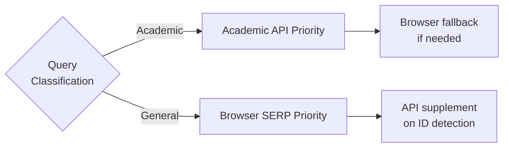
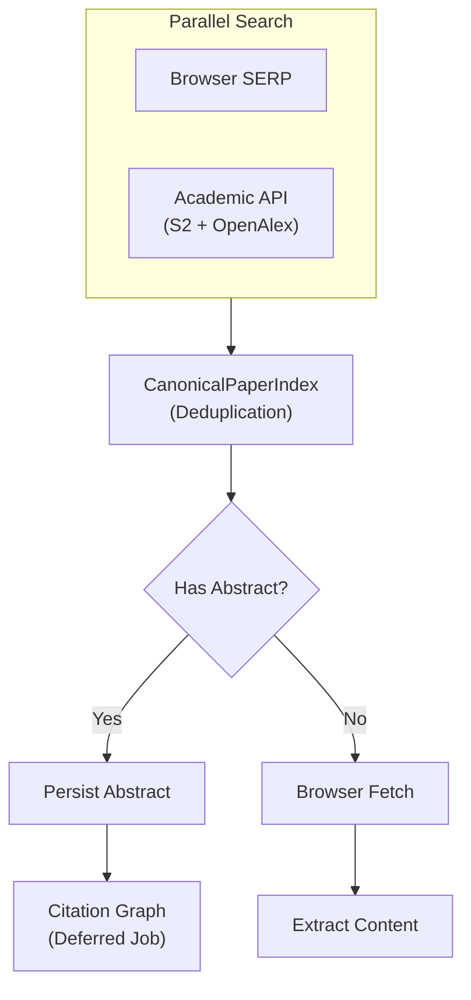
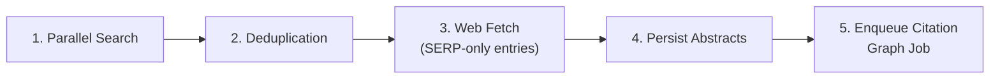
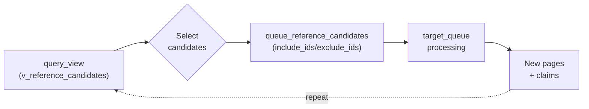

# ADR-0015: Unified Search Sources

## Date
2025-12-26 (Updated: 2026-01-06)

## Context

The previous search pipeline classified queries as "academic" or "general" and routed differently:

### Problems

| Problem | Details |
|---------|---------|
| Detection Instability | Keyword-based detection ("paper", "doi:", site:arxiv.org, etc.) produces false positives/negatives |
| Reduced Coverage | Academic queries skip SERP, general queries skip academic API, limiting coverage |
| Code Complexity | Branching logic scattered across multiple detection and expansion functions |
| Maintenance Burden | Detection condition adjustments difficult, test case combinatorial explosion |

### Insights from Measured Data

- General queries often return SERP results containing DOI/arXiv IDs
- Academic queries often have useful sources like Wikipedia/blogs in SERP
- Many papers have sufficient Abstracts, allowing Evidence without fetching

## Decision

**For all queries, always execute both Browser SERP and academic APIs (Semantic Scholar + OpenAlex) in parallel, merging and deduplicating results.**

### Unified Search Flow

### Deduplication Strategy

Uses `CanonicalPaperIndex` (introduced in ADR-0008):

1. **DOI Match**: Same DOI is merged (API metadata takes priority)
2. **Title Similarity**: Normalized titles with 90%+ similarity are merge candidates
3. **Source Attribution Preserved**: Track origin as both/api-only/serp-only

### Simplifications

This decision eliminates the following complexity:

- **Query classification logic**: Keyword-based academic/general detection removed
- **Conditional routing**: Single unified path replaces branching logic
- **Query expansion heuristics**: Academic-specific expansion patterns removed

The pipeline now follows a single, deterministic path regardless of query content.

## Consequences

### Positive

1. **Improved Coverage**: Both sources searched for all queries increases coverage
2. **Simplified Code**: No detection logic needed, improved maintainability
3. **Easier Testing**: No branching conditions, simplified test cases
4. **Consistent Behavior**: Same path regardless of query content

### Negative

1. **Increased API Consumption**: Academic API called even for general queries, more rate consumption
2. **Latency Increase**: Parallel execution still bound by slower source

### Mitigation

- **Rate Limits**: Protected by ADR-0013's global rate limiter
- **Timeouts**: Appropriate timeouts set for academic APIs
- **Fault Tolerance**: One source failure doesn't affect the other (isolated error handling)

## Alternatives Considered

### A. Improve Detection Logic

**Rejection Reason**: 
- Keyword/pattern matching limitations
- ML model introduction violates Zero OpEx (ADR-0001)
- "Search both" is more reliable than "is it academic?"

### B. User Selection

**Rejection Reason**:
- Increased UX burden (Cursor AI agent assumes automatic decisions)
- Forgetting to select reduces coverage

### C. Staged Fallback (SERP→API or API→SERP)

**Rejection Reason**:
- Ordering introduces delay
- Parallel is simpler and faster

## Execution Priority and Budget Separation

### Web Fetch First

To ensure SERP-derived web pages are fetched even when safe-stop timeout occurs, execution order prioritizes web fetching:

**Rationale**: Citation graph processing can be time-consuming. If it runs before web fetching, SERP-only results (e.g., government sites, Wikipedia) may not be fetched within the timeout budget.

### Citation Graph as Deferred Job

Citation graph processing is separated into a distinct job type with its own budget:

| Aspect | Search Job | Citation Graph Job |
|--------|------------|-------------------|
| Triggered by | User query | After search completion |
| Budget | Search page budget, idle timeout | Separate citation budget |
| Priority | Higher | Lower (runs after verification) |
| Resource Slot | Network I/O | CPU (NLP processing) |

**Key behaviors**:
- Citation graph does NOT consume search page budget
- Default `stop_task(scope=all_jobs)` DOES cancel citation graph jobs; use `scope=target_queue_only` to allow completion
- Already-enqueued citation graph jobs complete even after task is paused (if not cancelled)

### Citation Chasing (User-Controlled)

Beyond automatic citation graph building, MCP clients can explicitly chase references:

**Workflow**:
1. Query `v_reference_candidates` view to see unfetched citations for the task
2. Use `queue_reference_candidates` tool with explicit control:
   - `include_ids`: Whitelist mode — only queue specified candidates
   - `exclude_ids`: Blacklist mode — queue all EXCEPT specified candidates
   - `dry_run`: Preview without enqueuing
3. DOI fast path: URLs containing DOI are automatically routed to Academic API for abstract-only ingestion

**`v_reference_candidates` semantics**:
- Returns pages that are **cited by task's pages** but have **no claims extracted for this task**
- Includes both placeholder pages (never fetched) and pages fetched for other tasks
- Requires `task_id` parameter for task-scoping

**DOI fast path via `queue_targets`**:
- `kind='doi'` targets use Academic API (Semantic Scholar/OpenAlex) without web fetch
- Faster and more reliable for academic papers with known DOI

## Related

- [ADR-0008: Academic Data Source Strategy](0008-academic-data-source-strategy.md) - Academic API selection and CanonicalPaperIndex
- [ADR-0010: Async Search Queue Architecture](0010-async-search-queue.md) - Job queue, stop_task scope
- [ADR-0013: Worker Resource Contention Control](0013-worker-resource-contention.md) - Academic API rate limits
- [ADR-0014: Browser SERP Resource Control](0014-browser-serp-resource-control.md) - TabPool for browser SERP
- [ADR-0017: Task Hypothesis-First Architecture](0017-task-hypothesis-first.md) - Task hypothesis guides search query design