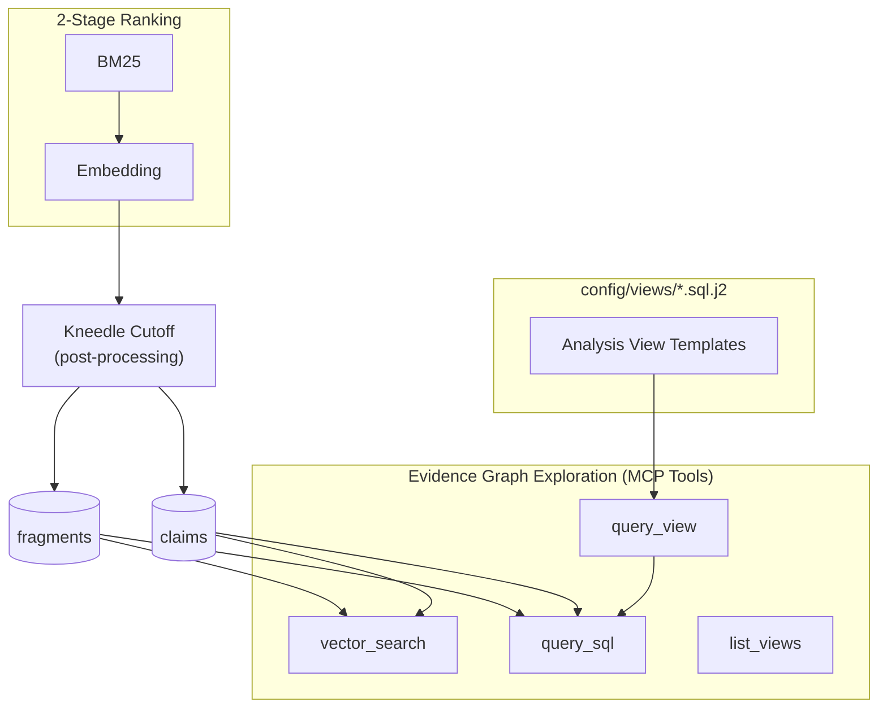

# ADR-0016: Ranking Simplification and Evidence Graph Exploration Interface

## Date
2025-12-27

## Context

The current ranking system uses a 3-stage pipeline (BM25 → Embedding → Reranker) which:
- Adds complexity and latency
- Requires GPU resources for reranking
- Uses fixed top_k cutoff, potentially including low-quality results

Additionally, the `get_materials` tool returns all evidence data at once (300-400KB), causing:
- Context overflow in AI agents
- Difficulty exploring specific aspects of the Evidence Graph
- Lack of granularity for iterative exploration

## Decision

### 1. Remove Reranker Stage

- **Remove**: `Reranker` class, ML server `/rerank` endpoint, `JobKind.RERANK`
- **Replace with**: Dynamic cutoff using Kneedle algorithm
- **Benefits**: 
  - Reduced complexity (3 stages → 2 stages)
  - Lower latency (no reranker inference)
  - Adaptive cutoff based on score distribution
  - No GPU required for reranking

### 2. Deprecate `get_materials` Tool

- **Remove**: `get_materials` MCP tool and related code
- **Replace with**: 
  - `query_sql`: Read-only SQL execution for granular exploration
  - `vector_search`: Semantic similarity search over fragments/claims
  - `get_status` extension: Add `evidence_summary` field when status=completed
- **Benefits**:
  - AI agents can explore incrementally
  - No context overflow
  - Flexible querying with SQL
  - Semantic search for discovery

### 3. Embedding Persistence

- **Remove**: `cache_embed` table (expiring cache)
- **Replace with**: `embeddings` table (persistent storage)
- **Key columns**: `target_type` (fragment/claim), `target_id`, `model_id`, `embedding_blob`
- **Benefits**:
  - No recalculation of embeddings
  - Faster vector search
  - Better for production workloads

### 4. Analysis Views

- **Add**: SQL view templates (Jinja2) in `config/views/*.sql.j2`
- **Purpose**: Predefined queries for common analysis patterns
- **Examples**: `v_contradictions`, `v_source_impact`, `v_evidence_timeline`
- **Benefits**: Guide AI agents in exploration patterns

## Architecture Overview

**Key points**:
- **2-Stage Ranking**: BM25 (lexical) → Embedding (semantic). Kneedle is post-processing cutoff, not a ranking stage.
- **MCP Tools**: `vector_search` for semantic discovery, `query_view` for predefined analysis, `query_sql` for ad-hoc queries, `list_views` to discover available views.

### Kneedle Algorithm

Detects the "knee point" in score distribution using the [kneed](https://github.com/arvkevi/kneed) library. Results below the knee point are excluded, providing adaptive quality-based cutoff instead of fixed top-k.

- **Parameters**: `min_results`, `max_results`, `sensitivity`
- **Fallback**: Returns `min_results` if library unavailable or detection fails

### Security for `query_sql`

| Measure | Description |
|---------|-------------|
| Read-only | SQLite `mode=ro` connection |
| Validation | Pattern-based forbidden keyword detection |
| Timeout | `asyncio.wait_for` protection |
| Output limit | Max 200 rows per query |

## Consequences

### Positive

- **Simpler architecture**: Fewer components to maintain
- **Better performance**: No reranker inference latency
- **Adaptive cutoff**: Quality-based rather than fixed count
- **Granular exploration**: AI agents can query specific aspects
- **No context overflow**: Incremental data retrieval

### Negative

- **Migration required**: Existing code using `get_materials` must migrate
- **No backward compatibility**: Clean break from old interface
- **DB migration**: `cache_embed` → `embeddings` (data loss acceptable in dev)

### Risks

- **SQL injection**: Mitigated by read-only connection + pattern validation
- **DoS via complex queries**: Mitigated by timeout + output limits
- **Kneedle library dependency**: Falls back gracefully if unavailable

## Alternatives Considered

### Keep Reranker, Add Tools

- **Rejected**: Adds complexity without solving context overflow

### Gradual Migration

- **Rejected**: User requested clean break, no backward compatibility

### Fixed Cutoff Instead of Kneedle

- **Rejected**: Less adaptive, may include low-quality results

## Related

- [ADR-0001: Local-First Zero-Opex Architecture](0001-local-first-zero-opex.md) - No GPU required for reranking
- [ADR-0005: Evidence Graph Structure](0005-evidence-graph-structure.md) - Graph structure for exploration
- [ADR-0017: Task Hypothesis-First Architecture](0017-task-hypothesis-first.md) - Task scoping for query_sql/vector_search

