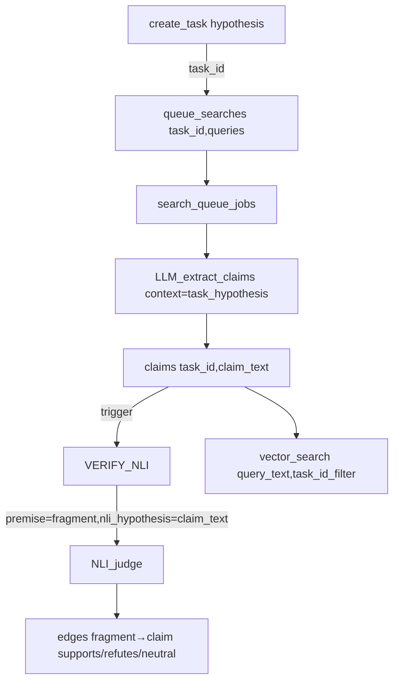

# ADR-0018: Task Hypothesis-First Architecture

## Date
2026-01-05

## Context

Lyra's `create_task` MCP tool previously accepted a `query` parameter that served dual purposes:
1. A "research question" to guide exploration
2. A "hypothesis" to verify through evidence

This conceptual ambiguity led to:
- Confusion about the relationship between task creation and search query design
- Terminology collision between task-level `query` and search-level `query_text`
- Unclear semantics for NLI's `hypothesis` parameter (which operates on claims, not tasks)

### Problem Summary

| Issue | Impact |
|-------|--------|
| Task `query` vs search `query_text` confusion | Unclear data flow in documentation and code |
| NLI `hypothesis` collides with task concept | Same term with different meanings |
| Implicit "what to verify" semantics | LLM extraction context was not explicit |

## Decision

**Adopt a "hypothesis-first" model where each task explicitly defines a central hypothesis to verify.**

### Breaking Changes (No Backward Compatibility)

1. **MCP `create_task` Input**: `query` parameter renamed to `hypothesis` (required)
2. **MCP Response Fields**: `query` → `hypothesis` in `create_task` and `get_status` responses
3. **Database Schema**: `tasks.query` column → `tasks.hypothesis`
4. **NLI API**: `hypothesis` field → `nli_hypothesis` in ML server API and `nli_corrections` table

### Terminology Standardization

| Term | Definition | Location |
|------|------------|----------|
| `task_hypothesis` | Central claim the task aims to verify (natural language) | `tasks.hypothesis` (DB), MCP tools |
| `query_text` | Search string submitted to search engines | `queries.query_text` (DB), `queue_searches` |
| `nli_hypothesis` | Hypothesis in NLI judgment (= `claim_text`) | ML server API, `nli_corrections` |

### Conceptual Model

### Usage Flow

1. **Task Creation**: `create_task(hypothesis="DPP-4 inhibitors improve HbA1c in diabetics")`
2. **Query Design**: MCP client designs search queries to find supporting/refuting evidence
3. **Search Execution**: `queue_searches(task_id, queries=["DPP-4 inhibitors meta-analysis", ...])`
4. **Claim Extraction**: LLM extracts claims using `task_hypothesis` as context (focus)
5. **NLI Verification**: `premise=fragment.text`, `nli_hypothesis=claim.claim_text`
6. **Evidence Exploration**: `vector_search(query="...", task_id=task_id)`

## Consequences

### Positive
- **Explicit Semantics**: Task purpose is clearly defined as hypothesis verification
- **Terminology Clarity**: No more collision between `query` (task), `query_text` (search), and `hypothesis` (NLI)
- **Better LLM Focus**: `task_hypothesis` provides clear context for claim extraction
- **Audit Trail**: DB stores the exact hypothesis being verified

### Negative
- **Breaking Changes**: Existing MCP clients must update to use `hypothesis`
- **DB Recreation Required**: Existing `data/lyra.db` must be regenerated
- **Extraction Bias**: Claims are extracted with task_hypothesis as focus, which may bias toward confirming the hypothesis. Mitigation: MCP client should include refutation queries.

## Alternatives Considered

| Alternative | Pros | Cons | Decision |
|-------------|------|------|----------|
| Keep `query` for task, add `hypothesis` separately | Backward compatible | Two concepts for same thing | Rejected |
| Auto-generate hypothesis from query | Simpler API | Loses explicit hypothesis semantics | Rejected |
| Rename NLI `hypothesis` to `claim_hypothesis` | Clearer | Conflicts with standard NLI terminology | Rejected |
| **Rename NLI `hypothesis` to `nli_hypothesis`** | Clear, explicit, unique | API change | **Accepted** |

## References
- ADR-0002: Thinking-Working Separation (updated: `create_task` field name)
- ADR-0005: Evidence Graph Structure (updated: NLI terminology)
- ADR-0010: Async Search Queue (updated: task/query relationship)
- ADR-0012: Feedback Tool Design (updated: `nli_corrections` schema)
- Integration Design: `docs/debug/hypothesis-first-integration.md`

