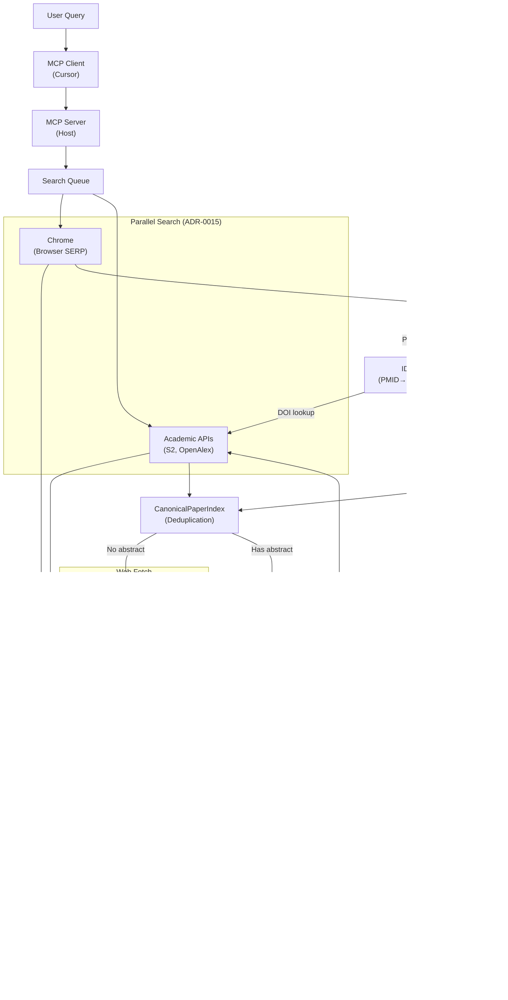

# Lyra Architecture

## Overview

Lyra is an open-source server implementing the Model Context Protocol (MCP)—a standard interface for connecting AI assistants to external tools—that enables AI assistants to conduct desktop research with structured provenance, providing accurate and auditable evidence. The software exposes research capabilities—web search, content extraction, natural language inference, and evidence graph construction—as structured tools that MCP-compatible AI clients can invoke directly.

The architecture implements a three-layer collaboration model ([ADR-0002](adr/0002-thinking-working-separation.md)):
- **Human**: Primary source reading, final judgment, domain expertise
- **AI Client (Thinking)**: Research planning, query design, synthesis
- **Lyra (Working)**: Source discovery, extraction, NLI, persistence

Lyra uses a hybrid architecture where the MCP server runs on the host (WSL2/Linux) while inference services run in network-isolated containers. Search queries are processed asynchronously via a job queue ([ADR-0010](adr/0010-async-search-queue.md)), and each task defines a central hypothesis to verify ([ADR-0017](adr/0017-task-hypothesis-first.md)).

## System Architecture

See [figures/figure1-architecture.mmd](figures/figure1-architecture.mmd) for the Mermaid source.


## Components

### Host Components

| Component | Description |
|-----------|-------------|
| **MCP Server** | Main application server (Python). Handles MCP protocol, search orchestration, evidence graph management. Runs directly on host for optimal I/O. |
| **Evidence Graph** | SQLite database storing claims, evidence, and relationships. Located at `data/lyra.db`. |
| **Chrome** | Browser automation for web scraping. Runs on host (Windows Chrome for WSL2). |

### Container Services

| Service | Container | Network | Description |
|---------|-----------|---------|-------------|
| `proxy` | `proxy` | lyra-net, lyra-internal | HTTP bridge between host MCP server and internal services |
| `ollama` | `ollama` | lyra-internal | Local LLM runtime (qwen2.5:3b). GPU-accelerated when available, network-isolated. |
| `ml` | `ml` | lyra-internal | Embedding (bge-m3) and NLI inference. GPU-accelerated when available, network-isolated. |
| `tor` | `tor` | lyra-net | SOCKS proxy for anonymous web access |

### GPU Auto-Detection

Lyra automatically detects GPU availability at startup:
- **GPU detected** (`nvidia-smi` available): GPU overlay files are applied, enabling CUDA acceleration
- **No GPU**: Runs in CPU mode with a warning logged; fully functional but slower (20-100x)

The compose scripts (`scripts/lib/compose.sh`) handle this automatically via overlay files (`podman-compose.gpu.yml` / `docker-compose.gpu.yml`).

### Networks

| Network | Type | Purpose |
|---------|------|---------|
| `lyra-net` | Bridge | External-capable. Used by proxy and tor. |
| `lyra-internal` | Internal | Isolated (no internet). Ollama and ML only communicate with proxy. Prevents data exfiltration. |

## Data Flow

Per [ADR-0015](adr/0015-unified-search-sources.md), all queries execute both Browser SERP and Academic APIs in parallel, with identifier extraction enabling cross-source enrichment.



**Key flows:**
1. **Parallel search**: Browser SERP and Academic APIs run simultaneously
2. **ID extraction**: SERP URLs are parsed for DOI/PMID/arXiv identifiers
3. **ID resolution**: Non-DOI identifiers are resolved to DOI via Semantic Scholar
4. **Academic API complement**: SERP entries with identifiers are enriched with academic metadata
5. **Deduplication**: `CanonicalPaperIndex` merges results from both sources
6. **Web Fetch First**: Entries without abstracts are fetched before citation graph processing
7. **Citation Graph**: Academic papers trigger deferred `CITATION_GRAPH` jobs

## Security Model

See [ADR-0006: 8-Layer Security Model](adr/0006-eight-layer-security-model.md) for details.

Key points:
- **Network Isolation**: Ollama/ML containers have no internet access
- **GPU Isolation**: When GPU is available, shared via CDI/runtime with no direct host access
- **Data Isolation**: Evidence graph is local-only
- **Prompt Injection Defense**: Isolated inference prevents exfiltration

## Directory Structure

```
lyra/
├── containers/           # Container definitions
│   ├── Dockerfile        # proxy container (custom)
│   ├── Dockerfile.ml     # ml container (custom)
│   ├── podman-compose.yml        # Base compose (CPU mode)
│   ├── podman-compose.gpu.yml    # GPU overlay (auto-applied when GPU detected)
│   ├── docker-compose.yml        # Base compose (CPU mode)
│   └── docker-compose.gpu.yml    # GPU overlay (auto-applied when GPU detected)
│   # Note: ollama uses ollama/ollama:latest, tor uses dperson/torproxy:latest
│   # (official images, no custom Dockerfile needed)
├── scripts/              # Shell scripts for operations
├── src/                  # Python source code
├── config/               # Configuration files
├── data/                 # SQLite database, cache
├── models/               # ML models (ollama, huggingface)
└── logs/                 # Application logs
```

## Related ADRs

Core architecture:
- [ADR-0001: Local-First Architecture / Zero OpEx](adr/0001-local-first-zero-opex.md) - All processing local, zero operational cost
- [ADR-0002: Thinking-Working Separation](adr/0002-thinking-working-separation.md) - Three-layer collaboration model
- [ADR-0003: MCP over CLI/REST](adr/0003-mcp-over-cli-rest.md) - MCP protocol selection
- [ADR-0004: Local LLM for Extraction Only](adr/0004-local-llm-extraction-only.md) - Ollama/DeBERTa task scope

Evidence processing:
- [ADR-0005: Evidence Graph Structure](adr/0005-evidence-graph-structure.md) - Bayesian confidence calculation
- [ADR-0008: Academic Data Source Strategy](adr/0008-academic-data-source-strategy.md) - S2 + OpenAlex two-pillar strategy
- [ADR-0010: Async Search Queue Architecture](adr/0010-async-search-queue.md) - Background job processing
- [ADR-0015: Unified Search Sources](adr/0015-unified-search-sources.md) - Parallel SERP + Academic API, ID extraction
- [ADR-0016: Ranking Simplification](adr/0016-ranking-simplification.md) - Evidence Graph exploration interface
- [ADR-0017: Task Hypothesis-First Architecture](adr/0017-task-hypothesis-first.md) - Hypothesis-driven exploration

Security and resources:
- [ADR-0006: 8-Layer Security Model](adr/0006-eight-layer-security-model.md) - Defense-in-depth
- [ADR-0007: Human-in-the-Loop Authentication](adr/0007-human-in-the-loop-auth.md) - CAPTCHA handling, auth queue
- [ADR-0013: Worker Resource Contention](adr/0013-worker-resource-contention.md) - Academic API rate limits
- [ADR-0014: Browser SERP Resource Control](adr/0014-browser-serp-resource-control.md) - TabPool for browser isolation

Quality improvement:
- [ADR-0011: LoRA Fine-tuning Strategy](adr/0011-lora-fine-tuning.md) - NLI model domain adaptation
- [ADR-0012: Feedback Tool Design](adr/0012-feedback-tool-design.md) - Human-in-the-loop corrections

Testing (not architectural):
- [ADR-0009: Test Layer Strategy](adr/0009-test-layer-strategy.md) - 3-layer test strategy (L1/L2/L3)

