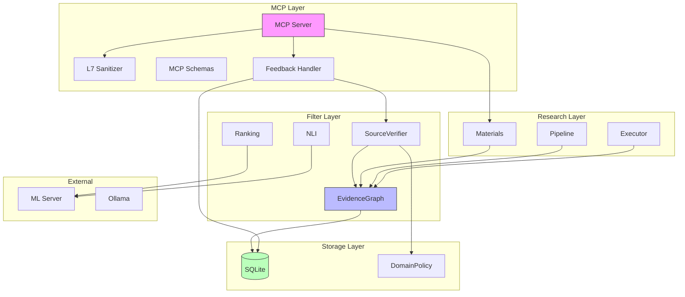

> **⚠️ ARCHIVED DOCUMENT**
>
> This document is an archived snapshot of the project's development history and is no longer maintained.
> Content reflects the state at the time of writing and may be inconsistent with the current codebase.
>
> **Archived**: 2025-12-24

# Integration Review: Evidence System

**作成日**: 2025-12-24  
**対象**: `docs/archive/P_EVIDENCE_SYSTEM.md` 実装完了後の統合レビュー  
**目的**: モジュール間連動の課題を網羅的に発見し、次Phaseに進む前に修正すべき事項を特定

---

## Executive Summary

| 優先度 | 件数 | 対応 |
|:------:|:----:|------|
| 🔴 P0 (Critical) | 1 | 次Phase前に修正必須 |
| 🟡 P1 (Medium) | 1 | 将来課題として記録 |
| ✅ 問題なし | 12 | 確認済み |

---

## 🔴 P0: Critical Issues (修正必須)

### ISSUE-001: サーバー起動時の domain_override 復元漏れ

**概要**: `load_domain_overrides_from_db()` がサーバー起動時に呼ばれていない。

**影響**:
- サーバー再起動後、DBに保存された `domain_block`/`domain_unblock` が `SourceVerifier` に反映されない
- `get_status` の応答で不整合が発生:
  - `domain_overrides`: DBから正しく読み込まれる ✅
  - `blocked_domains`: メモリが空のため不正確 ❌

**現状のコード** (`src/mcp/server.py`):

```python
async def run_server() -> None:
    """Run the MCP server."""
    logger.info("Starting Lyra MCP server (12 tools)")

    # Initialize database
    await get_database()
    # ❌ load_domain_overrides_from_db() が呼ばれていない

    try:
        async with stdio_server() as (read_stream, write_stream):
            # ...
```

**修正案**:

```python
async def run_server() -> None:
    """Run the MCP server."""
    logger.info("Starting Lyra MCP server (12 tools)")

    # Initialize database
    await get_database()
    
    # 🔧 追加: DB から domain overrides を復元
    from src.filter.source_verification import load_domain_overrides_from_db
    await load_domain_overrides_from_db()

    try:
        # ...
```

**テスト追加**:
- `test_mcp_integration.py` に起動時復元のテストを追加

---

## 🟡 P1: Medium Issues (将来課題)

### ISSUE-002: EvidenceGraph グローバルインスタンスの task_id 変更時上書き

**概要**: `get_evidence_graph(task_id)` は task_id が変わると古いインスタンスを上書きする。

**現状のコード** (`src/filter/evidence_graph.py`):

```python
# Global graph instance
_graph: EvidenceGraph | None = None

async def get_evidence_graph(task_id: str | None = None) -> EvidenceGraph:
    global _graph

    if _graph is None or _graph.task_id != task_id:
        _graph = EvidenceGraph(task_id=task_id)
        if task_id:
            await _graph.load_from_db(task_id)

    return _graph
```

**影響**:
- 単一ユーザー運用（現行設計）では問題なし
- 複数タスク同時実行には不向き

**対応方針**:
- 現時点では単一ユーザー運用のため対応不要
- 将来マルチユーザー対応時に `task_id` → `EvidenceGraph` のマップに変更

---

## ✅ 確認済み: 問題なし

### 境界一覧と検証結果

| # | 境界 | 検証内容 | 結果 |
|---|------|----------|:----:|
| 1 | `MCP Server` ↔ `L7 Sanitizer` | スキーマベースallowlistフィルタリング | ✅ |
| 2 | `ClaimConfidenceAssessment` ↔ `calculate_claim_confidence()` | Pydantic契約の整合性 | ✅ |
| 3 | `feedback_handler` ↔ `SourceVerifier` | domain_block/unblock即時反映 | ✅ |
| 4 | `executor.py` ↔ `EvidenceGraph` | add_claim_evidence 連動 | ✅ |
| 5 | `materials.py` ↔ `EvidenceGraph` | calculate_claim_confidence 連動 | ✅ |
| 6 | `SourceVerifier` ↔ `DomainPolicyManager` | get_domain_category 連動 | ✅ |
| 7 | `EvidenceGraph` ↔ Database | load_from_db / save_to_db | ✅ |
| 8 | `NLI` ↔ `ML Server` | inference 連動 | ✅ |
| 9 | `Ranking` ↔ `ML Server` | embed / rerank 連動 | ✅ |
| 10 | テストフィクスチャ | グローバルインスタンスのリセット | ✅ |
| 11 | MCP Schemas | 全12ツールに対応 | ✅ |
| 12 | `independent_sources` 計算 | FRAGMENT→CLAIM対応済み | ✅ |

---

## モジュール境界マップ



---

## 詳細検証ログ

### 1. MCP Server 起動シーケンス

**検証箇所**: `src/mcp/server.py:run_server()`

```
1. get_database() ← DB初期化 ✅
2. load_domain_overrides_from_db() ← ❌ 欠落
3. stdio_server() ← MCP開始
4. close_database() ← 終了処理 ✅
```

### 2. feedback → SourceVerifier 連動

**検証箇所**: `src/mcp/feedback_handler.py`, `tests/test_feedback_integration.py`

```
feedback(domain_block)
  → DB永続化 (domain_override_rules) ✅
  → SourceVerifier.block_domain_manual() ✅
  → _blocked_domains.add() ✅

feedback(domain_unblock)
  → DB永続化 (domain_override_rules) ✅
  → SourceVerifier.unblock_domain() ✅
  → _blocked_domains.discard() ✅
```

**テスト確認**: 206 passed (test_feedback*.py + test_source_verification.py)

### 3. calculate_claim_confidence() 返り値

**検証箇所**: `src/filter/evidence_graph.py`, `src/filter/schemas.py`

| フィールド | 型 | Pydantic契約 | 実装 |
|-----------|-----|:------------:|:----:|
| confidence | float | ✅ | ✅ |
| uncertainty | float | ✅ | ✅ |
| controversy | float | ✅ | ✅ |
| supporting_count | int | ✅ | ✅ |
| refuting_count | int | ✅ | ✅ |
| neutral_count | int | ✅ | ✅ |
| independent_sources | int | ✅ | ✅ |
| alpha | float | ✅ | ✅ |
| beta | float | ✅ | ✅ |
| evidence_count | int | ✅ | ✅ |
| evidence | list[EvidenceItem] | ✅ | ✅ |
| evidence_years | EvidenceYears | ✅ | ✅ |

### 4. independent_sources 計算ロジック

**検証箇所**: `src/filter/evidence_graph.py:calculate_claim_confidence()`

```python
# FRAGMENT→CLAIM エッジ対応済み
for category in evidence.values():
    for e in category:
        if e.get("node_type") == NodeType.PAGE.value:
            unique_sources.add(e.get("obj_id"))
        elif e.get("node_type") == NodeType.FRAGMENT.value:
            page_id = e.get("page_id")
            if page_id:
                unique_sources.add(page_id)  # ← 修正済み
            else:
                unique_sources.add(e.get("obj_id"))  # フォールバック
```

---

## 修正チェックリスト

### 🔴 必須 (次Phase前)

- [x] ISSUE-001: `run_server()` に `load_domain_overrides_from_db()` 呼び出しを追加
- [x] ISSUE-001: 起動時復元の統合テストを追加 (`TestDomainOverrideStartupRestore`)

### 🟡 将来課題

- [ ] ISSUE-002: マルチタスク対応時に EvidenceGraph のインスタンス管理を改善
> 単一ユーザーのみを想定しており、対応不要

---

## 関連ドキュメント

- `docs/archive/P_EVIDENCE_SYSTEM.md` - 設計ドキュメント（アーカイブ済み）
- `docs/adr/0005-evidence-graph-structure.md` - ADR

---

## 結論

**P_EVIDENCE_SYSTEM.md の実装は完了**していますが、**ISSUE-001（起動時の domain_override 復元漏れ）** を修正してから次Phaseに進むことを推奨します。

> 修正完了済み