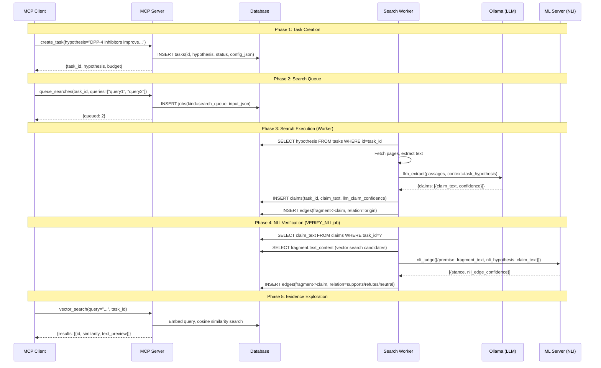

# Integration Design: Task Hypothesis-First Architecture

## Purpose

This document defines the integration design for the `task_hypothesis` and `nli_hypothesis` architecture change (ADR-0018).

## Terminology

| Term | Definition | Location |
|------|------------|----------|
| `task_hypothesis` | The central hypothesis the task aims to verify (natural language). Used as context for LLM claim extraction. | `tasks.hypothesis` (DB), MCP `create_task` input/output |
| `nli_hypothesis` | The hypothesis in NLI judgment (currently `claim_text`). premise=fragment, nli_hypothesis=claim_text. | ML server API, `nli_corrections.nli_hypothesis` (DB) |
| `claim_text` | Individual extracted claim. Becomes `nli_hypothesis` in NLI verification. | `claims.claim_text` (DB) |

## Sequence Diagram

## Propagation Table: task_hypothesis

| Layer | Received At | Stored In | Passed To | Effect |
|-------|-------------|-----------|-----------|--------|
| MCP Contract | `create_task(hypothesis=...)` | - | handler | Input validation (required, non-empty) |
| MCP Handler | `handle_create_task(args)` | `tasks.hypothesis` (DB) | response | Persisted as task definition |
| get_status | DB read | - | response `hypothesis` field | Returned to client for context |
| ExplorationState | `load_state()` | `self.task_hypothesis` (memory) | SearchExecutor | In-memory reference for extraction |
| SearchExecutor | `state.task_hypothesis` | - | `llm_extract(..., context=)` | LLM extraction focus (claim selection) |
| ResearchContext | DB read | `self._task_hypothesis` | entity extraction, template matching | Context for design support |

## Propagation Table: nli_hypothesis

| Layer | Received At | Stored In | Passed To | Effect |
|-------|-------------|-----------|-----------|--------|
| cross_verification | claim_text from DB | - | pair dict `nli_hypothesis` key | Prepared for NLI batch |
| nli.py | pair dict | - | `ml_client.nli_judge()` | Local inference or remote call |
| ml_client | pairs list | - | HTTP POST body | Remote ML server request |
| ML Server API | `NLIPair.nli_hypothesis` | - | model input | NLI model inference |
| nli.py (server) | request body | - | model tokenizer | Tokenized as `[SEP]` part |
| Result | - | - | `nli_edge_confidence` | Edge creation decision |
| nli_corrections | correction event | `nli_corrections.nli_hypothesis` | LoRA training data | Ground truth for fine-tuning |

## Files to Change

### MCP Contract (task_hypothesis)

| File | Change |
|------|--------|
| `src/mcp/server.py` | `create_task` inputSchema: `query` → `hypothesis` (required) |
| `src/mcp/schemas/create_task.json` | Output: `query` → `hypothesis` |
| `src/mcp/schemas/get_status.json` | Output: `query` → `hypothesis` |
| `src/mcp/tools/task.py` | `args["hypothesis"]`, DB insert, response field |

### DB Schema (task_hypothesis)

| File | Change |
|------|--------|
| `src/storage/schema.sql` | `tasks.query` → `tasks.hypothesis` (NOT NULL) |
| `src/storage/database.py` | `create_task(query=...)` → `create_task(hypothesis=...)` |

### Internal References (task_hypothesis)

| File | Change |
|------|--------|
| `src/research/state.py` | `original_query` → `task_hypothesis` |
| `src/research/executor.py` | `state.original_query` → `state.task_hypothesis` |
| `src/research/context.py` | `_original_query` → `_task_hypothesis`, DB read column |
| `src/report/chain_of_density.py` | `task_query` → `task_hypothesis` (parameter name) |

### NLI API (nli_hypothesis)

| File | Change |
|------|--------|
| `src/ml_server/models.py` | `NLIPair.hypothesis` → `NLIPair.nli_hypothesis` |
| `src/ml_server/schemas.py` | `hypothesis` → `nli_hypothesis` |
| `src/ml_server/nli.py` | Parameter name `hypothesis` → `nli_hypothesis` |
| `src/ml_server/main.py` | `pair.hypothesis` → `pair.nli_hypothesis` |
| `src/ml_client.py` | Payload key `hypothesis` → `nli_hypothesis` |

### NLI Callers (nli_hypothesis)

| File | Change |
|------|--------|
| `src/filter/nli.py` | `predict(premise, hypothesis)` → `predict(premise, nli_hypothesis)` |
| `src/filter/cross_verification.py` | Pair dict key `hypothesis` → `nli_hypothesis` |
| `src/research/pipeline.py` | Pair dict key `hypothesis` → `nli_hypothesis` |
| `src/research/refutation.py` | Pair dict key `hypothesis` → `nli_hypothesis` |
| `src/mcp/feedback_handler.py` | DB column reference, dict key |

### DB Schema (nli_hypothesis)

| File | Change |
|------|--------|
| `src/storage/schema.sql` | `nli_corrections.hypothesis` → `nli_corrections.nli_hypothesis` |

## Verification Points (Debug Script)

Each boundary should be verified with assertions:

1. **MCP Input → DB**: `tasks.hypothesis` contains input value
2. **DB → ExplorationState**: `state.task_hypothesis` matches DB value
3. **ExplorationState → LLM**: `llm_extract` receives correct `context` argument
4. **claim_text → NLI pair**: Dict has `nli_hypothesis` key (not `hypothesis`)
5. **NLI pair → ML Server**: HTTP payload has `nli_hypothesis` field
6. **Feedback → DB**: `nli_corrections.nli_hypothesis` column populated

## Breaking Changes Summary

| Component | Before | After | Backward Compatible |
|-----------|--------|-------|---------------------|
| MCP `create_task` input | `query` (required) | `hypothesis` (required) | No |
| MCP `create_task` output | `query` field | `hypothesis` field | No |
| MCP `get_status` output | `query` field | `hypothesis` field | No |
| DB `tasks` table | `query` column | `hypothesis` column | No (recreate) |
| ML Server NLI API | `hypothesis` field | `nli_hypothesis` field | No |
| `nli_corrections` table | `hypothesis` column | `nli_hypothesis` column | No (recreate) |
