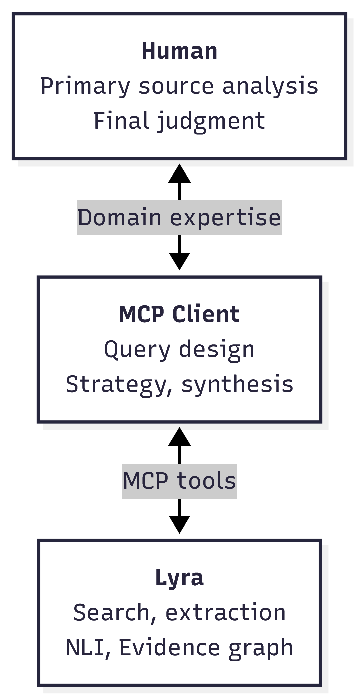
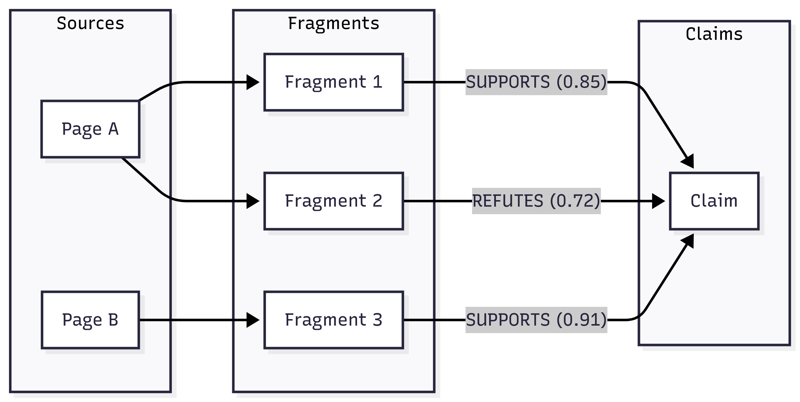

# Summary

Research demands auditable evidence chains—the ability to trace every claim back to its source. Lyra is an open-source server implementing the Model Context Protocol [MCP, @WhatModelContext]—a standard interface for connecting AI assistants to external tools—that enables AI assistants to conduct desktop research using structured provenance, providing accurate and auditable evidence. The software exposes research capabilities—web search, content extraction, natural language inference, and evidence graph construction—as structured tools that MCP-compatible AI clients can invoke directly.

I designed Lyra to separate strategic reasoning—performed by the AI assistant in the MCP client—from mechanical execution: evidence discovery, classification, and scoring (Figure 1). 

{width="100%"}

The AI assistant handles query design and synthesis, while Lyra executes search, extraction, and NLI-based stance detection. Lyra functions as a navigation tool: it discovers and organizes relevant sources, while detailed analysis of primary sources remains the researcher's responsibility (Figure 2).

{width="60%"}

The software incorporates three machine learning components for local inference: a 3B-parameter language model [Qwen2.5, @qwenQwen25TechnicalReport2025] for claim extraction, BGE-M3 embeddings [@chenM3EmbeddingMultiLingualityMultiFunctionality2024] for semantic search, and a DeBERTa-based classifier [@heDeBERTaDecodingenhancedBERT2021] for stance detection. The system automatically detects GPU availability and applies appropriate container configurations; while CPU-only operation is supported, GPU acceleration is strongly recommended due to significant performance differences. Lyra constructs an **evidence graph** linking extracted claims to source fragments with structured provenance metadata (Figure 3). 

{width="100%"}

Each claim accumulates a Bayesian confidence score calculated via Beta distribution updating [@gelmanBayesianDataAnalysis2013] over evidence edges weighted by Natural Language Inference [NLI, @bowmanLargeAnnotatedCorpus2015] judgments—automated classification of whether a text supports, refutes, or is neutral toward a claim—enabling transparent assessment of evidence quality.

# Statement of Need

Lyra targets academic researchers who require auditable evidence chains—the ability to trace claims to their sources—for verifying conclusions and enabling reproducibility. Large language models, however, are inherently probabilistic; verifying that AI-generated citations accurately reflect source materials demands substantial manual effort. Existing tools address different aspects of this challenge: cloud-based assistants [@Perplexity; @ElicitAIScientific] provide rapid retrieval with citation links; browser automation [@SeleniumHQSelenium2013; @MicrosoftPlaywright2019] offers programmatic access; RAG frameworks [@chaseLangChain2022; @liuLlamaIndex2022] specialize in document retrieval. Lyra takes a different approach, prioritizing structured provenance for auditable evidence chains.

From a context engineering perspective—designing systems that supply AI models with accurate, relevant information—Lyra constructs a transparent evidence graph that provides AI clients with traceable information. Every claim links to source fragments, which link to page URLs, creating an auditable chain from assertion to origin. The graph explicitly represents both supporting and refuting evidence, with Bayesian confidence scores quantifying the balance. Researchers can trace any claim back to its source text and evaluate the reasoning path themselves.

The software runs entirely on local hardware, eliminating dependence on external APIs and ensuring research data remains under researcher control. Multi-source search aggregates browser-based web search and academic APIs [@SemanticScholarAcademic; @priemOpenAlexFullyopenIndex2022] with Digital Object Identifier (DOI) based deduplication. A human-in-the-loop mechanism enables researchers to correct NLI judgments; these corrections are accumulated for planned domain adaptation via Low-Rank Adaptation [LoRA, @huLoRALowRankAdaptation2021] fine-tuning.

I documented design rationale in 17 Architecture Decision Records covering local-first principles, evidence graph structure, and security models.

# Acknowledgements

Lyra builds upon several open-source projects: Ollama [@OllamaOllama2023] for local language model runtime, Playwright [@MicrosoftPlaywright2019] for browser automation, Trafilatura [@barbaresiTrafilaturaWebScraping2021] for web content extraction, and Hugging Face Transformers [@wolfTransformersStateoftheArtNatural2020] for NLI and embedding models. Academic metadata is provided by the Semantic Scholar [@SemanticScholarAcademic] and OpenAlex [@priemOpenAlexFullyopenIndex2022] APIs.

# References
