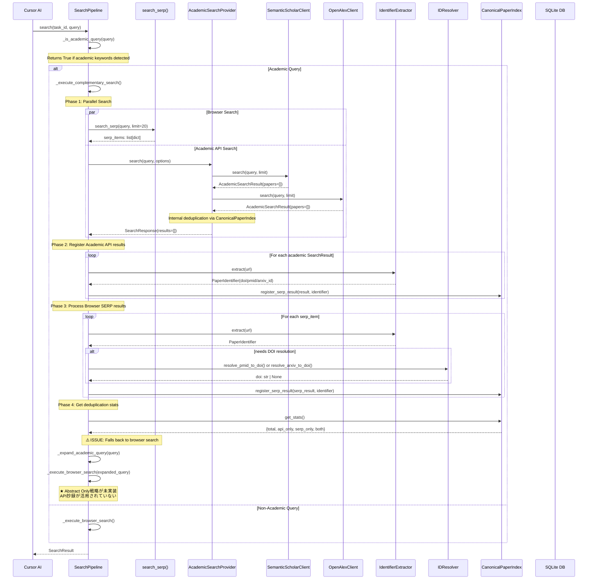
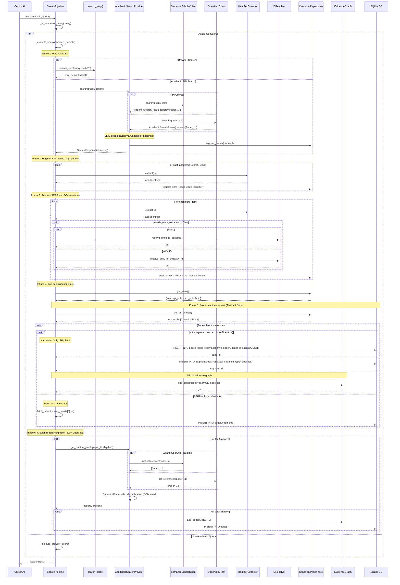

# 学術API統合フロー（J2 Academic API Integration）

## 概要

学術クエリに対して、Browser検索と学術API（Semantic Scholar, OpenAlex, Crossref, arXiv）を並列実行し、統合重複排除を行うフロー。Abstract Only戦略により、論文の抄録とメタデータを活用してfetchをスキップし、効率的な学術情報収集を実現する。

> 注意: このドキュメントは設計/デバッグの履歴を含むメモです。現行実装の正は `src/storage/schema.sql` と `docs/EVIDENCE_SYSTEM.md` を参照してください（特に `is_influential` は決定12により削除済み）。

## 仕様要件

- **§3.1.3**: 学術API統合戦略 - OpenAlex/Semantic Scholar/Crossref/arXiv APIの利用
- **§3.3.1**: エビデンスグラフ拡張 - `is_academic`属性（`is_influential` は決定12により削除）
- **§1.0.5**: Abstract Only戦略 - 抄録のみ自動取得、フルテキストは参照先提示
- **docs/J2_ACADEMIC_API_INTEGRATION.md**: 統合重複排除、CanonicalPaperIndex

## 期待される出力スキーマ

```json
{
  "ok": true,
  "search_id": "s_001",
  "query": "transformer attention mechanism",
  "status": "satisfied",
  "pages_fetched": 15,
  "useful_fragments": 28,
  "harvest_rate": 0.68,
  "claims_found": [
    {
      "id": "c_001",
      "text": "Attention mechanisms allow models to focus on relevant parts...",
      "confidence": 0.92,
      "source_url": "https://doi.org/10.1038/...",
      "is_primary_source": true
    }
  ],
  "dedup_stats": {
    "browser_count": 25,
    "academic_count": 30,
    "unique_count": 35,
    "overlap_count": 12,
    "api_only": 15,
    "serp_only": 8
  }
}
```

## デバッグ前のシーケンス図



### 問題点

1. **Abstract Only戦略の未実装**: `_execute_complementary_search()`の最終段階で`_execute_browser_search()`にフォールバックしており、API経由で取得した抄録が活用されていない
2. **Fragmentへの永続化欠如**: API経由で取得した抄録がfragmentsテーブルに保存されない
3. **エビデンスグラフ連携未実装**: `add_academic_page_with_citations()`関数が存在せず、引用グラフがエビデンスグラフに統合されていない
4. **APIクライアントのテスト未作成**: SemanticScholar, OpenAlex, Crossref, arXivの各クライアントのユニットテストがない

---

## デバッグ後のシーケンス図（設計目標版）

**実装状況**: ✅ 実装完了 - Abstract Only戦略とエビデンスグラフ連携が完成

**期待される変更点**:
- API経由の抄録をFragmentとして直接保存（fetchスキップ）
- `paper_metadata`をpagesテーブルに保存
- 引用グラフをエビデンスグラフに統合



## データ型

### Paper（Pydantic）

```python
class Paper(BaseModel):
    """Academic paper metadata."""
    id: str                          # "s2:paperId" or "openalex:Wxxxxxx"
    title: str
    abstract: str | None = None
    authors: list[Author] = []
    year: int | None = None
    doi: str | None = None
    arxiv_id: str | None = None
    venue: str | None = None
    citation_count: int = 0
    reference_count: int = 0
    is_open_access: bool = False
    oa_url: str | None = None
    pdf_url: str | None = None
    source_api: str                  # "semantic_scholar", "openalex", etc.
```

### PaperIdentifier（Pydantic）

```python
class PaperIdentifier(BaseModel):
    """Paper identifier extracted from URL."""
    doi: str | None = None           # Priority 1
    pmid: str | None = None          # Priority 2
    arxiv_id: str | None = None      # Priority 3
    crid: str | None = None          # Priority 4 (CiNii)
    url: str | None = None           # Priority 5 (fallback)
    needs_meta_extraction: bool = False
    
    def get_canonical_id(self) -> str:
        """Return canonical ID with priority: DOI > PMID > arXiv > CRID > URL."""
```

### CanonicalEntry（Pydantic）

```python
class CanonicalEntry(BaseModel):
    """Unified paper entry for deduplication."""
    canonical_id: str
    paper: Paper | None = None       # From API (structured)
    serp_results: list[SearchResult] = []  # From browser search
    source: str = "api"              # "api" | "serp" | "both"
```

### AcademicSearchResult（Pydantic）

```python
class AcademicSearchResult(BaseModel):
    """Result from academic API search."""
    papers: list[Paper]
    total_count: int
    next_cursor: str | None = None
    source_api: str
```

## 実装済みコンポーネント

| コンポーネント | ファイル | 状態 |
|---------------|----------|------|
| Paper, Author, Citation モデル | `src/utils/schemas.py` | ✅ 完了 |
| PaperIdentifier, CanonicalEntry | `src/utils/schemas.py` | ✅ 完了 |
| IdentifierExtractor | `src/search/identifier_extractor.py` | ✅ 完了 |
| IDResolver | `src/search/id_resolver.py` | ✅ 完了 |
| BaseAcademicClient | `src/search/apis/base.py` | ✅ 完了 |
| SemanticScholarClient | `src/search/apis/semantic_scholar.py` | ✅ 完了 |
| OpenAlexClient | `src/search/apis/openalex.py` | ✅ 完了 |
| CrossrefClient | `src/search/apis/crossref.py` | ✅ 完了 |
| ArxivClient | `src/search/apis/arxiv.py` | ✅ 完了 |
| CanonicalPaperIndex | `src/search/canonical_index.py` | ✅ 完了 |
| AcademicSearchProvider | `src/search/academic_provider.py` | ✅ 完了 |
| AcademicSearchProvider.get_last_index() | `src/search/academic_provider.py` | ✅ 完了 |
| _is_academic_query() | `src/research/pipeline.py` | ✅ 完了 |
| _expand_academic_query() | `src/research/pipeline.py` | ✅ 完了 |
| _execute_complementary_search() | `src/research/pipeline.py` | ✅ 完了 |
| _persist_abstract_as_fragment() | `src/research/pipeline.py` | ✅ 完了 |
| add_academic_page_with_citations() | `src/filter/evidence_graph.py` | ✅ 完了 |
| DBマイグレーション | `migrations/002_add_academic_columns.sql` | ✅ 完了 |
| is_academic属性 | `src/filter/evidence_graph.py` | ✅ 完了 |
| test_pipeline_academic.py | `tests/test_pipeline_academic.py` | ✅ 完了 |
| test_evidence_graph_academic.py | `tests/test_evidence_graph_academic.py` | ✅ 完了 |

## 未実装コンポーネント

| コンポーネント | 必要な変更 | 優先度 |
|---------------|-----------|--------|
| test_semantic_scholar.py | SemanticScholarClientのテスト | 中 |
| test_openalex.py | OpenAlexClientのテスト | 中 |
| test_crossref.py | CrossrefClientのテスト | 低 |
| test_arxiv.py | ArxivClientのテスト | 低 |

## 実装済み内容

### 1. Abstract Only戦略の実装

`src/research/pipeline.py` の `_execute_complementary_search()` にPhase 5-6を追加:
- 抄録があるPaperはfetchをスキップし、`_persist_abstract_as_fragment()`で直接DB保存
- `paper_to_page_map`でpaper_id → page_idの追跡
- SERP-onlyエントリはブラウザ検索にフォールバック

### 2. 抄録のFragment永続化

`src/research/pipeline.py` に `_persist_abstract_as_fragment()` メソッドを追加:
- pagesテーブルに`page_type='academic_paper'`として挿入
- `paper_metadata` JSONカラムに著者・引用数等を保存
- fragmentsテーブルに`fragment_type='abstract'`として抄録を保存

### 3. エビデンスグラフ連携

`src/filter/evidence_graph.py` に `add_academic_page_with_citations()` 関数を追加:
- PAGEノードに`is_academic`、`doi`、`citation_count`等の属性を追加
- 各引用関係をCITESエッジとして追加（`is_academic=True`、`source_domain_category`/`target_domain_category` など）
- edgesテーブルへの永続化

### 4. AcademicSearchProviderの拡張

`src/search/academic_provider.py` に `get_last_index()` メソッドを追加:
- 内部のCanonicalPaperIndexを外部に公開
- Paperオブジェクト（抄録含む）への直接アクセスを可能に

## 検証スクリプト

`scripts/debug_academic_search.py`

```bash
# 全テスト実行
python scripts/debug_academic_search.py --test-cases

# 特定クエリで検索
python scripts/debug_academic_search.py "transformer attention mechanism"
```

## 関連ファイル

| ファイル | 行番号 | 役割 |
|----------|--------|------|
| `src/utils/schemas.py` | L424-520 | Paper, Author, Citation, PaperIdentifier, CanonicalEntry |
| `src/search/identifier_extractor.py` | L1-136 | URL→識別子抽出 |
| `src/search/id_resolver.py` | L1-149 | PMID→DOI, arXiv→DOI変換 |
| `src/search/canonical_index.py` | L1-277 | 統合重複排除インデックス |
| `src/search/apis/base.py` | L1-92 | 基底APIクライアント |
| `src/search/apis/semantic_scholar.py` | L1-161 | Semantic Scholar API |
| `src/search/apis/openalex.py` | L1-155 | OpenAlex API |
| `src/search/apis/crossref.py` | L1-135 | Crossref API |
| `src/search/apis/arxiv.py` | L1-181 | arXiv API |
| `src/search/academic_provider.py` | L1-237 | 統合プロバイダ |
| `src/research/pipeline.py` | L272-401 | _execute_complementary_search |
| `src/research/pipeline.py` | L402-459 | _is_academic_query, _expand_academic_query |
| `src/filter/evidence_graph.py` | L1016-1058 | add_edge with is_academic |
| `migrations/002_add_academic_columns.sql` | L1-27 | DBマイグレーション |
| `tests/test_canonical_index.py` | L1-408 | CanonicalPaperIndexテスト |
| `tests/test_identifier_extractor.py` | L1-309 | IdentifierExtractorテスト |

