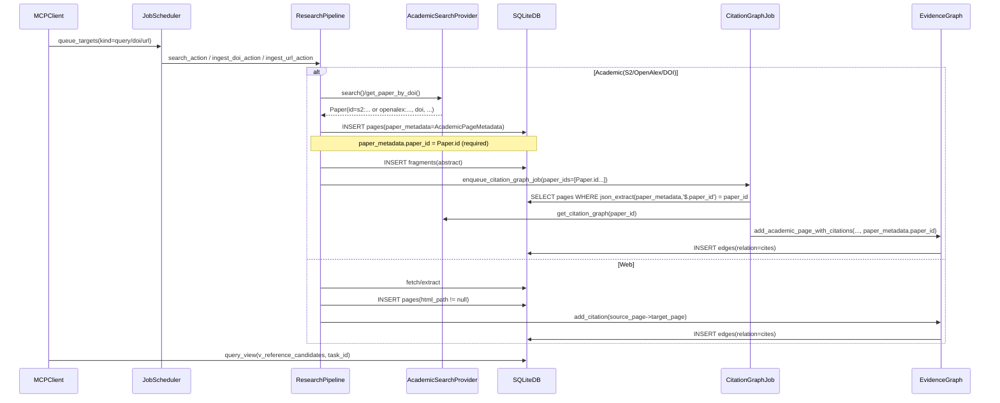

# Academic citation graph integration (paper_id contract)

This sequence diagram captures the cross-module integration between:

- Research pipeline (academic ingestion)
- Citation graph deferred job
- Evidence graph persistence (`edges.relation='cites'`)
- Citation chasing view (`v_reference_candidates`)

