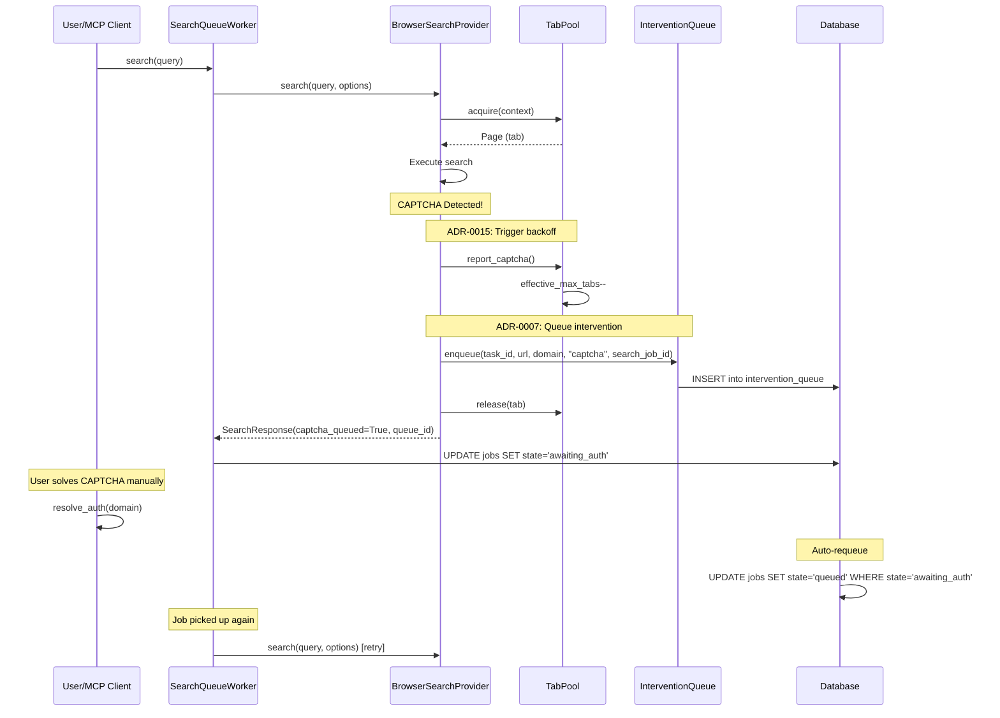

# ADR-0007 CAPTCHA Intervention Integration with Concurrency Control

> **Related ADRs**:
> - ADR-0007: Human-in-the-Loop Authentication
> - ADR-0014: Browser SERP Resource Control (TabPool)
> - ADR-0015: Adaptive Concurrency Control (Auto-Backoff)

## Executive Summary

### Integration Status: ✅ COMPLETED

| Component | Status | Notes |
|-----------|--------|-------|
| TabPool.report_captcha() | ✅ Connected | Triggers auto-backoff on CAPTCHA |
| InterventionQueue.enqueue() | ✅ Connected | CAPTCHA queued with search_job_id |
| JobState.AWAITING_AUTH | ✅ Implemented | Jobs paused until auth resolved |
| resolve_auth requeue | ✅ Implemented | Jobs auto-requeued after resolution |
| BrowserSearchProvider auto-start | ✅ Implemented | Chrome auto-started via chrome.sh |

## Implemented Flow



## Key Implementation Points

### 1. BrowserSearchProvider CAPTCHA Handling

```python
# src/search/browser_search_provider.py
if parse_result.is_captcha:
    # Trigger backoff (ADR-0015)
    self._tab_pool.report_captcha()
    
    # Queue for intervention (ADR-0007)
    queue_id = await queue.enqueue(
        task_id=options.task_id,
        url=search_url,
        domain=engine,
        auth_type=parse_result.captcha_type or "captcha",
        search_job_id=options.search_job_id,
    )
    
    return SearchResponse(captcha_queued=True, queue_id=queue_id, ...)
```

### 2. SearchQueueWorker State Transition

```python
# src/scheduler/search_worker.py
if result.get("captcha_queued"):
    await db.execute(
        "UPDATE jobs SET state = 'awaiting_auth' WHERE id = ?",
        (search_id,),
    )
```

### 3. resolve_auth Auto-Requeue

```python
# src/mcp/server.py
async def _requeue_awaiting_auth_jobs(domain: str) -> int:
    """Requeue jobs awaiting auth for resolved domain."""
    cursor = await db.execute(
        """UPDATE jobs SET state = 'queued'
           WHERE state = 'awaiting_auth'
           AND id IN (SELECT search_job_id FROM intervention_queue WHERE domain = ?)""",
        (domain,),
    )
    return cursor.rowcount
```

## Related Files

- `src/search/browser_search_provider.py` - CAPTCHA detection and queue integration
- `src/scheduler/search_worker.py` - Job state management
- `src/mcp/server.py` - resolve_auth handler with auto-requeue
- `src/utils/notification.py` - InterventionQueue
- `src/storage/schema.sql` - intervention_queue table with search_job_id
- `docs/adr/0007-human-in-the-loop-auth.md` - Original ADR

## Test Coverage

- `tests/test_captcha_intervention.py` - Unit tests for CAPTCHA intervention flow
- `tests/test_search_queue_worker.py` - Job state transition tests
- `tests/test_mcp_auth.py` - resolve_auth MCP tool tests
