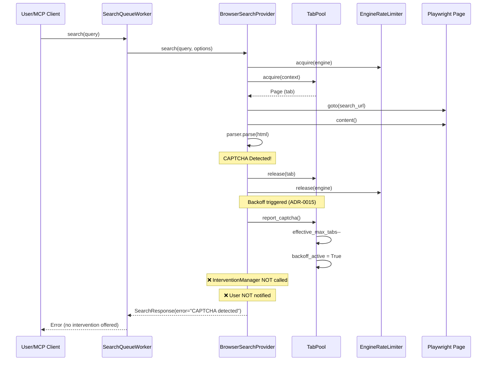
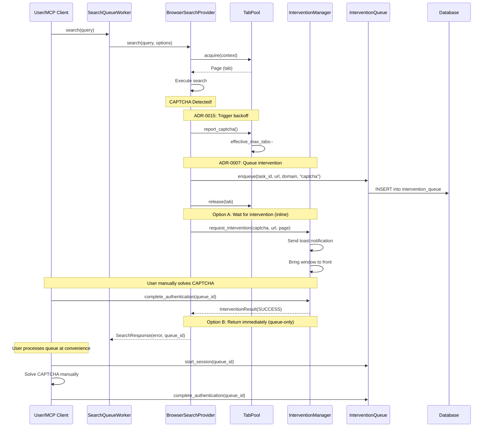

# ADR-0007 CAPTCHA Intervention Integration with Concurrency Control

> **Related ADRs**:
> - ADR-0007: Human-in-the-Loop Authentication
> - ADR-0014: Browser SERP Resource Control (TabPool)
> - ADR-0015: Adaptive Concurrency Control (Auto-Backoff)

## Executive Summary

### Integration Status: ⚠️ PARTIAL

| Component | Status | Notes |
|-----------|--------|-------|
| TabPool.report_captcha() | ✅ Connected | Triggers auto-backoff on CAPTCHA |
| InterventionManager | ❌ Dead Code | `_request_intervention` defined but never called |
| InterventionQueue | ❌ Not Used | Batch queue not integrated in browser search |
| BrowserFetcher intervention | ✅ Connected | Crawler uses InterventionManager correctly |

### Critical Gap

When CAPTCHA is detected in `BrowserSearchProvider.search()`:
1. ✅ `TabPool.report_captcha()` is called → concurrency reduced
2. ❌ `InterventionManager` is NOT called → user not notified
3. ❌ `InterventionQueue` is NOT used → no batch processing
4. ❌ Method `_request_intervention` exists but is dead code

## Current Flow (As-Is)



## Expected Flow (To-Be)



## Propagation Map

### CAPTCHA Event Flow

| Boundary | Event | Source | Sink | Status |
|----------|-------|--------|------|--------|
| Parser → Provider | `is_captcha=True` | `SearchParser.parse()` | `BrowserSearchProvider.search()` | ✅ |
| Provider → TabPool | `report_captcha()` | `BrowserSearchProvider.search()` | `TabPool._backoff_state` | ✅ |
| Provider → IM | `request_intervention()` | `BrowserSearchProvider.search()` | `InterventionManager` | ❌ Dead code |
| Provider → IQ | `enqueue()` | `BrowserSearchProvider.search()` | `InterventionQueue` → DB | ❌ Not called |
| IM → User | Toast notification | `InterventionManager.request_intervention()` | OS notification | ❌ Not called |
| User → IQ | `complete()` | MCP tool | `InterventionQueue` | ✅ Available |

### Data Contracts

```python
# src/utils/notification.py - InterventionResult (existing)
@dataclass
class InterventionResult:
    intervention_id: str
    status: InterventionStatus  # PENDING, SUCCESS, FAILED, etc.
    elapsed_seconds: float = 0.0
    should_retry: bool = False
    cooldown_until: datetime | None = None
    skip_domain_today: bool = False
    notes: str | None = None

# intervention_queue table schema (existing in schema.sql)
# - id: TEXT PRIMARY KEY
# - task_id: TEXT
# - url: TEXT
# - domain: TEXT
# - auth_type: TEXT  -- 'captcha', 'cloudflare', 'turnstile', etc.
# - status: TEXT  -- 'pending', 'in_progress', 'completed', 'skipped'
# - session_data: TEXT  -- JSON with auth cookies
```

## Comparison with BrowserFetcher

`BrowserFetcher` (crawler) correctly integrates InterventionManager:

```python
# src/crawler/fetcher.py - Lines 1381-1385 (WORKING)
elif allow_intervention:
    # Immediate intervention (legacy mode)
    intervention_result = await self._request_manual_intervention(
        url=url, domain=domain, page=page, ...
    )
```

`BrowserSearchProvider` has the method but never calls it:

```python
# src/search/browser_search_provider.py - Lines 1064-1117 (DEAD CODE)
async def _request_intervention(self, url, engine, captcha_type, page) -> bool:
    # This method is never called!
    intervention_manager = get_intervention_manager()
    result = await intervention_manager.request_intervention(...)
    return result.status == InterventionStatus.SUCCESS
```

## Recommended Fix

### Option 1: Queue-Only Mode (Conservative, Recommended)

```python
# In BrowserSearchProvider.search(), after CAPTCHA detection:

if parse_result.is_captcha:
    # 1. Trigger backoff (existing)
    self._tab_pool.report_captcha()
    
    # 2. Queue for batch processing (NEW)
    try:
        from src.utils.notification import InterventionQueue
        queue = InterventionQueue()
        queue_id = await queue.enqueue(
            task_id=task_id,  # If available
            url=search_url,
            domain=engine,
            auth_type=parse_result.captcha_type or "captcha",
            priority="medium",
        )
        logger.info("CAPTCHA queued", queue_id=queue_id, engine=engine)
    except Exception as e:
        logger.warning("Failed to queue CAPTCHA", error=str(e))
    
    # 3. Return error with queue reference
    return SearchResponse(
        results=[],
        error=f"CAPTCHA detected, queued as {queue_id}",
        ...
    )
```

### Option 2: Inline Intervention (More Complex)

Requires keeping the tab/page while waiting for user intervention.
Not recommended due to complexity of resource management.

## Verification Script

See: `tests/scripts/debug_adr0007_intervention_flow.py`

## Related Files

- `src/search/browser_search_provider.py` - Contains dead `_request_intervention` method
- `src/utils/notification.py` - InterventionManager and InterventionQueue
- `src/crawler/fetcher.py` - Working intervention example
- `src/storage/schema.sql` - `intervention_queue` table schema
- `docs/adr/0007-human-in-the-loop-auth.md` - Original ADR

## Action Items

1. [ ] Decide on integration approach (queue-only vs inline)
2. [ ] Connect `_request_intervention` or remove dead code
3. [ ] Add tests for intervention queue integration
4. [ ] Update ADR-0007 with Phase 4 concurrency notes

