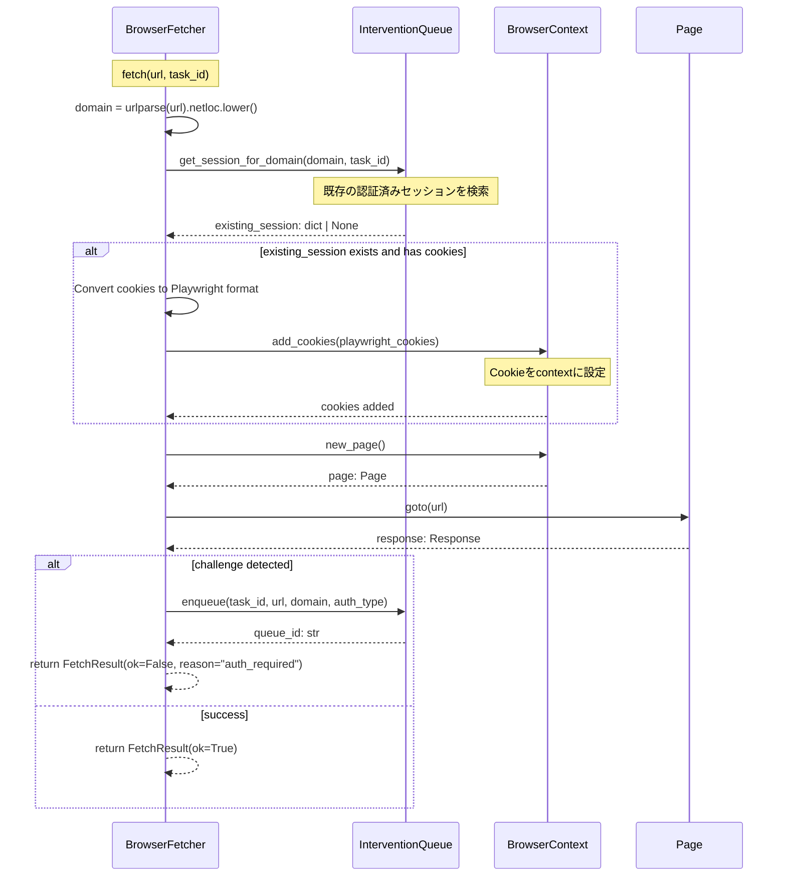
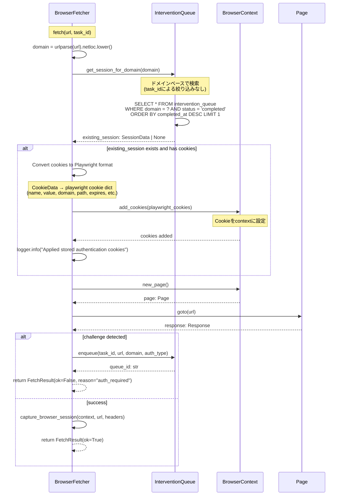

# 認証セッション再利用フロー（問題3）

## 概要

認証待ちキューで保存されたセッションを後続リクエストで再利用するフロー。

## デバッグ前のシーケンス図

## データ型

- `existing_session: dict | None`
  - `cookies: list[dict]` - Cookie情報のリスト
  - `domain: str` - ドメイン名
  - `completed_at: str` - 認証完了時刻（ISO形式）

- `playwright_cookies: list[dict]`
  - `name: str` - Cookie名
  - `value: str` - Cookie値
  - `domain: str` - ドメイン
  - `path: str` - パス（デフォルト: "/"）
  - `expires: float | None` - 有効期限（Unix timestamp）
  - `httpOnly: bool` - HttpOnlyフラグ
  - `secure: bool` - Secureフラグ
  - `sameSite: str` - SameSite属性（"Lax", "Strict", "None"）

## 非同期処理

- `get_session_for_domain()`: `async def` - データベースクエリ
- `add_cookies()`: `async def` - Playwright API呼び出し
- `goto()`: `async def` - ページナビゲーション

## エラーハンドリング

- `existing_session`が`None`の場合: Cookie設定をスキップして通常フロー継続
- Cookie変換エラー: ログ出力してスキップ、通常フロー継続
- `add_cookies()`エラー: ログ出力してスキップ、通常フロー継続

---

## デバッグ後のシーケンス図（実装完了版）

**実装状況**: ✅ 実装完了・動作確認済み

**変更点**:
- `BrowserFetcher.fetch()`内で`InterventionQueue.get_session_for_domain()`を呼び出し
- ドメインベースでセッション検索（`task_id`による絞り込みは削除）
- CookieをPlaywright形式に変換して`context.add_cookies()`で適用

**実装ファイル**:
- `src/crawler/fetcher.py`: `BrowserFetcher.fetch()` (1080-1137行)
- `src/utils/notification.py`: `InterventionQueue.get_session_for_domain()` (返却型: `SessionData`)

**検証**:
- ✅ `tests/scripts/debug_auth_session_reuse_flow.py`で動作確認済み

