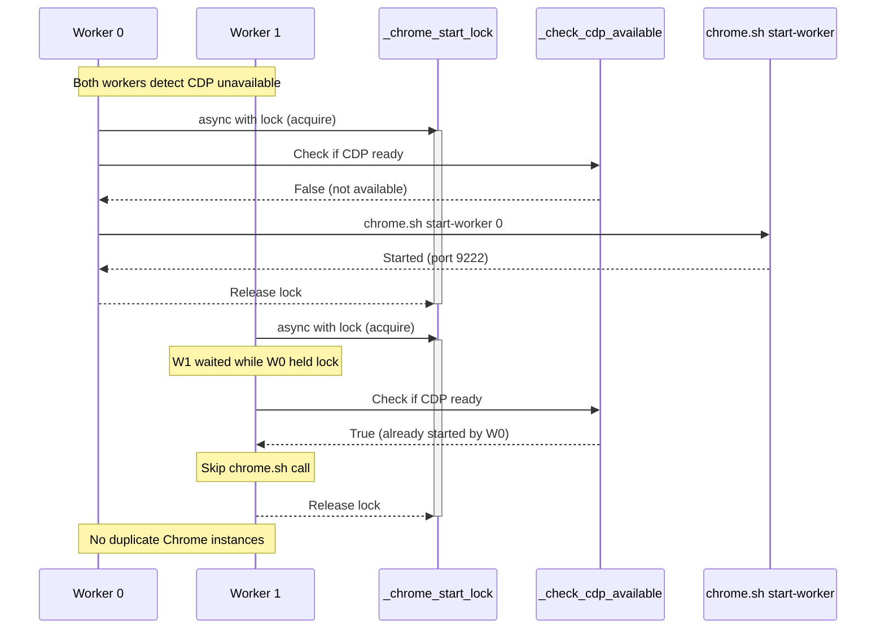

# Chrome Auto-Start Lock Sequence

This document describes the race condition prevention mechanism for Chrome CDP auto-start.

## Problem Statement

When multiple search workers start simultaneously, they may all detect that Chrome CDP is unavailable and attempt to start Chrome at the same time. This can result in:

1. Multiple Chrome instances spawning for the same worker port
2. Resource contention and port conflicts
3. Extra Chrome windows (reported as "2 windows × 3 = 6 windows")

## Solution

A global asyncio.Lock ensures only one worker can attempt Chrome auto-start at a time. After acquiring the lock, the worker re-checks CDP availability (another worker may have started Chrome while waiting).

## Sequence Diagram



## Key Components

### 1. Global Lock (`_chrome_start_lock`)

```python
# src/search/browser_search_provider.py
_chrome_start_lock: asyncio.Lock | None = None

def _get_chrome_start_lock() -> asyncio.Lock:
    global _chrome_start_lock
    if _chrome_start_lock is None:
        _chrome_start_lock = asyncio.Lock()
    return _chrome_start_lock
```

### 2. CDP Availability Check (`_check_cdp_available`)

```python
async def _check_cdp_available(host: str, port: int, timeout: float = 2.0) -> bool:
    cdp_url = f"http://{host}:{port}/json/version"
    # HTTP GET to check if Chrome CDP is responding
```

### 3. Worker-Specific Start Command

```bash
# Instead of:
chrome.sh start        # Starts ALL workers (causes duplicates)

# Now uses:
chrome.sh start-worker N  # Starts only worker N's Chrome
```

## Propagation Map

| Boundary | Source | Target | Data |
|----------|--------|--------|------|
| Worker → Lock | BrowserSearchProvider._auto_start_chrome() | _get_chrome_start_lock() | Lock acquisition |
| Worker → CDP Check | BrowserSearchProvider._auto_start_chrome() | _check_cdp_available() | host, port |
| Worker → Shell | BrowserSearchProvider._auto_start_chrome() | chrome.sh start-worker | worker_id |
| Shell → Chrome | pool.sh start_single_worker() | Chrome.exe | port, profile |

## Testing

```bash
# Run tests
pytest tests/test_chrome_auto_start.py -v

# Verify chrome.sh help shows start-worker
./scripts/chrome.sh help | grep start-worker
```

## Related

- ADR-0014: Browser SERP Resource Control (worker pool design)
- ADR-0006: 8-Layer Security Model (CDP requirements)

