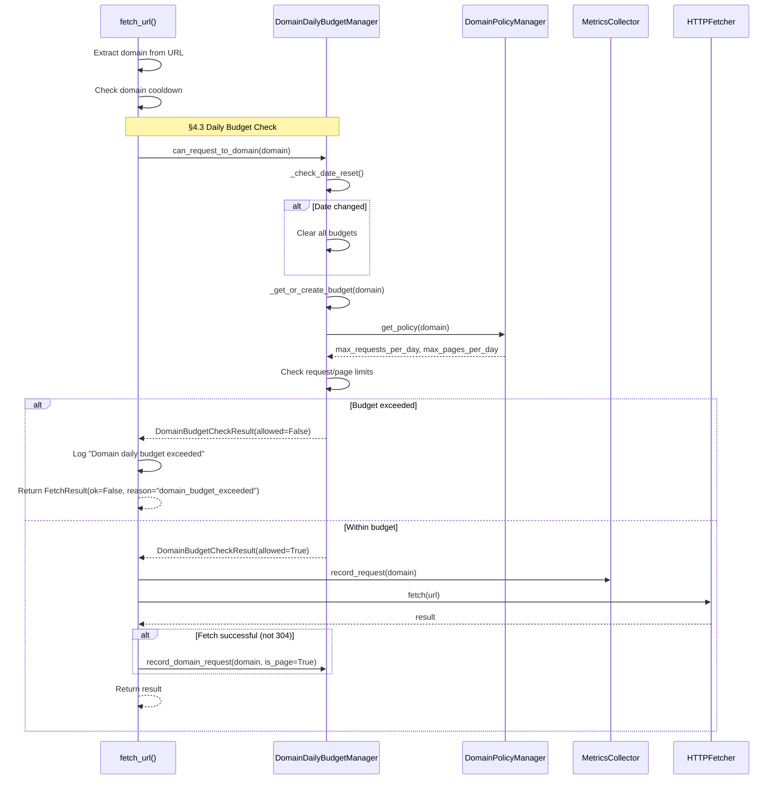

# ドメイン別日次予算チェックフロー（問題11）

## 概要

fetch_url()でリクエストを送信する前に、ドメイン別の日次リクエスト/ページ予算をチェックするフロー。
上限を超えている場合はリクエストを拒否し、IPアドレスブロックを防止する。

## 仕様要件

- **§4.3**: "ドメイン同時実行数=1、リクエスト間隔U(1.5,5.5)s、**時間帯・日次の予算上限を設定**"
- **目的**: IPアドレスブロック防止のため、ドメインごとの日次リクエスト数を制限

## 設計方針

- **時間帯別スロット**: 不要（ユーザー指示）
- **夜間/休日の保守的運用**: 不要（ユーザー指示）
- **実装スコープ**: ドメイン別日次リクエスト/ページ上限のみ

## シーケンス図



## データ型

### DomainDailyBudget（Pydantic - モジュール間データ受け渡し）

```python
class DomainDailyBudget(BaseModel):
    """Daily budget state for a domain."""
    
    domain: str = Field(..., description="Domain name (lowercase)")
    requests_today: int = Field(default=0, ge=0, description="Requests made today")
    pages_today: int = Field(default=0, ge=0, description="Pages fetched today")
    max_requests_per_day: int = Field(..., ge=0, description="Max requests (0=unlimited)")
    max_pages_per_day: int = Field(..., ge=0, description="Max pages (0=unlimited)")
    date: str = Field(..., description="Date in YYYY-MM-DD format")
    
    @property
    def requests_remaining(self) -> int:
        """Calculate remaining requests."""
        if self.max_requests_per_day == 0:
            return 2**31 - 1  # Unlimited
        return max(0, self.max_requests_per_day - self.requests_today)
    
    @property
    def pages_remaining(self) -> int:
        """Calculate remaining pages."""
        if self.max_pages_per_day == 0:
            return 2**31 - 1  # Unlimited
        return max(0, self.max_pages_per_day - self.pages_today)
```

### DomainBudgetCheckResult（Pydantic - モジュール間データ受け渡し）

```python
class DomainBudgetCheckResult(BaseModel):
    """Result of domain daily budget check."""
    
    allowed: bool = Field(..., description="Whether request is allowed")
    reason: str | None = Field(None, description="Reason for denial")
    requests_remaining: int = Field(..., ge=0, description="Remaining requests")
    pages_remaining: int = Field(..., ge=0, description="Remaining pages")
```

## 設定値

| 設定 | デフォルト | 説明 |
|-----|----------|-----|
| `default_policy.max_requests_per_day` | 200 | デフォルト日次リクエスト上限 |
| `default_policy.max_pages_per_day` | 100 | デフォルト日次ページ上限 |
| `allowlist[].max_requests_per_day` | None | ドメイン別オーバーライド |
| `allowlist[].max_pages_per_day` | None | ドメイン別オーバーライド |

### 設定例（config/domains.yaml）

```yaml
default_policy:
  qps: 0.2
  max_requests_per_day: 200  # デフォルト上限
  max_pages_per_day: 100

allowlist:
  - domain: "wikipedia.org"
    domain_category: "trusted"
    max_requests_per_day: 500  # 高信頼サイトは上限を引き上げ
    max_pages_per_day: 250
```

## 主要関数

### DomainDailyBudgetManager

```python
class DomainDailyBudgetManager:
    """Manages daily request and page budgets per domain."""
    
    def can_request_to_domain(self, domain: str) -> DomainBudgetCheckResult:
        """Check if request to domain is allowed within budget.
        
        Implements fail-open: errors allow request.
        """
    
    def record_domain_request(self, domain: str, is_page: bool = False) -> None:
        """Record a request to a domain.
        
        Args:
            domain: Domain name.
            is_page: Whether this is a page fetch (vs. API/resource).
        """
    
    def get_domain_budget(self, domain: str) -> DomainDailyBudget:
        """Get current budget state for a domain."""
```

### モジュールレベル関数

```python
def get_domain_budget_manager() -> DomainDailyBudgetManager:
    """Get singleton DomainDailyBudgetManager instance."""

def can_request_to_domain(domain: str) -> DomainBudgetCheckResult:
    """Convenience function for budget check."""

def record_domain_request(domain: str, is_page: bool = False) -> None:
    """Convenience function for recording requests."""
```

## エラーハンドリング

- **予算チェック失敗**: リクエストを許可（フェイルオープン）
- **ドメインポリシー取得失敗**: デフォルト上限を適用
- **日付変更検知**: 全ドメインのカウンターをリセット

## 日付リセット

`_check_date_reset()` が毎回の予算チェック時に呼び出され、日付変更を検知:

```python
def _check_date_reset(self) -> None:
    today = date.today().isoformat()
    if today != self._current_date:
        self._budgets.clear()
        self._current_date = today
```

---

## 実装ファイル

| ファイル | 変更内容 |
|---------|---------|
| `src/utils/schemas.py` | `DomainDailyBudget`, `DomainBudgetCheckResult` Pydanticモデル追加 |
| `src/scheduler/domain_budget.py` | `DomainDailyBudgetManager` クラス新規作成 |
| `src/utils/domain_policy.py` | `max_requests_per_day`, `max_pages_per_day` フィールド追加 |
| `config/domains.yaml` | 日次予算設定追加 |
| `src/crawler/fetcher.py` | `fetch_url()` に日次予算チェック統合 |

## テスト

- `tests/test_domain_budget.py` - ユニットテスト（34ケース）
- `tests/scripts/debug_domain_daily_budget_flow.py` - デバッグ用一直線スクリプト

## テスト観点表

| Case ID | Input / Precondition | Perspective | Expected Result |
|---------|---------------------|-------------|-----------------|
| TC-DB-N-01 | 初回リクエスト | Equivalence – normal | allowed=True, count=1 |
| TC-DB-N-02 | 予算内リクエスト | Equivalence – normal | allowed=True |
| TC-DB-B-01 | 予算上限到達 | Boundary – max | allowed=False |
| TC-DB-B-02 | 予算=0 (無制限) | Boundary – zero | always allowed |
| TC-DB-B-03 | 予算=1 | Boundary – min | 1回のみ許可 |
| TC-DB-A-01 | 日付変更後 | Equivalence – reset | カウンターリセット |
| TC-DB-N-03 | 複数ドメイン独立 | Equivalence – normal | 独立管理 |
| TC-DB-N-04 | ドメイン別上限 | Equivalence – normal | 個別設定適用 |
| TC-DB-A-02 | 設定なしドメイン | Equivalence – default | デフォルト適用 |
| TC-DB-N-05 | リクエスト記録 | Equivalence – normal | カウンター増加 |
| TC-DB-N-06 | ページ記録 | Equivalence – normal | 両カウンター増加 |
| TC-DB-E-01 | 例外処理 | Abnormal – error | fail-open (allowed) |
| TC-DB-N-07 | ページ予算到達 | Boundary – max | allowed=False (pages) |

## 関連ドキュメント

- `docs/archive/REQUIREMENTS.md` - §4.3 抗堪性とステルス性 (archived)
- `docs/archive/O6_ADDITIONAL_ISSUES.md` - 問題11 (archived)
- `docs/archive/IMPLEMENTATION_PLAN.md` - Phase O.6 (archived)
