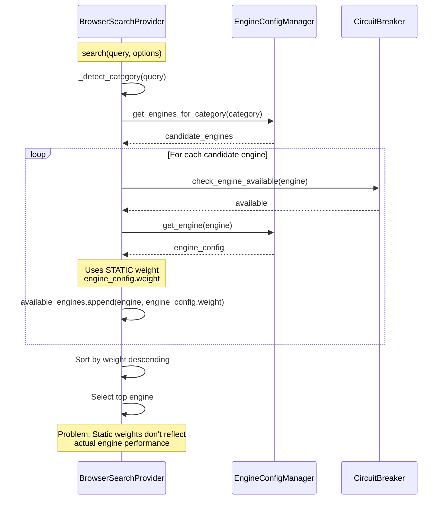
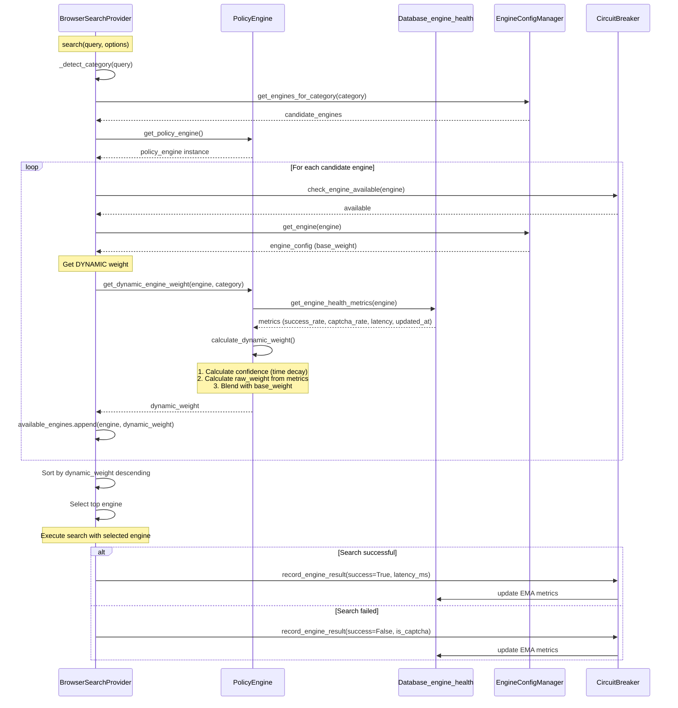

# 動的重み学習フロー（問題8）

## 概要

BrowserSearchProviderでエンジン選択時に動的重みを適用するフロー。
PolicyEngineとengine_healthテーブルを連動させ、過去の精度/失敗率/ブロック率に基づいてエンジン重みを動的に調整する。

## 仕様要件

- **§3.1.1**: "カテゴリ（ニュース/学術/政府/技術）で層別化し、過去の精度/失敗率/ブロック率で重みを学習"
- **§3.1.4**: "`engine_health`テーブルのEMA（1h/24h）を保持し、重み・QPS・探索枠を自動調整"
- **§4.6**: "イベント駆動: 各リクエスト/クエリ完了時に即時フィードバック"

## デバッグ前のシーケンス図



## 問題点

1. **静的重みのみ使用**: `config/engines.yaml`の静的な重みのみ使用
2. **パフォーマンス未反映**: 過去の成功率/CAPTCHA率/レイテンシが重みに反映されない
3. **古いメトリクス問題**: 久しぶりに使うエンジンの古いメトリクスが不適切に適用される

## 重み計算式

### 動的重み計算

```
success_factor = 0.6 * success_rate_1h + 0.4 * success_rate_24h
captcha_penalty = 1.0 - (captcha_rate * 0.5)
latency_factor = 1.0 / (1.0 + median_latency_ms / 1000.0)
raw_weight = base_weight * success_factor * captcha_penalty * latency_factor
```

### 時間減衰（48時間でデフォルト回帰）

```
confidence = max(0.1, 1.0 - (hours_since_use / 48))
final_weight = confidence * raw_weight + (1 - confidence) * base_weight
```

| 経過時間 | メトリクス反映 | デフォルト反映 |
|----------|---------------|---------------|
| 0-6時間 | 87-100% | 0-13% |
| 12時間 | 75% | 25% |
| 24時間 | 50% | 50% |
| 48時間以上 | 10% | 90% |

---

## デバッグ後のシーケンス図（実装完了版）

**実装状況**: ✅ 実装完了



## 実装ファイル

| ファイル | 役割 | 追加/変更 |
|---------|------|---------|
| `src/utils/schemas.py` | Pydanticモデル | `EngineHealthMetrics`, `DynamicWeightResult` 追加 |
| `src/storage/database.py` | メトリクス取得 | `get_engine_health_metrics()` 追加 |
| `src/utils/policy_engine.py` | 動的重み計算 | `calculate_dynamic_weight()`, `get_dynamic_engine_weight()` 追加 |
| `src/search/browser_search_provider.py` | エンジン選択 | 動的重み使用に変更 |

## データフロー

### EngineHealthMetrics (Pydantic Model)

```python
class EngineHealthMetrics(BaseModel):
    engine: str
    success_rate_1h: float  # 0.0-1.0
    success_rate_24h: float  # 0.0-1.0
    captcha_rate: float  # 0.0-1.0
    median_latency_ms: float  # >= 0
    http_error_rate: float  # 0.0-1.0
    last_used_at: datetime | None  # For time decay
```

### DynamicWeightResult (Pydantic Model)

```python
class DynamicWeightResult(BaseModel):
    engine: str
    base_weight: float  # From config
    dynamic_weight: float  # Calculated (0.1-1.0)
    confidence: float  # Time decay (0.1-1.0)
    category: str | None
    metrics_used: EngineHealthMetrics | None
```

## テスト観点

| Case ID | 入力条件 | 期待結果 |
|---------|---------|---------|
| TC-DW-N-01 | 最近使用、良好なメトリクス | weight ≈ base_weight |
| TC-DW-N-02 | 最近使用、劣化したメトリクス | weight < base_weight |
| TC-DW-B-05 | 24時間未使用、悪いメトリクス | weight closer to base_weight (50%減衰) |
| TC-DW-B-06 | 48時間未使用、悪いメトリクス | weight ≈ base_weight (90%減衰) |
| TC-DW-B-07 | 未使用 (last_used=None) | weight ≈ base_weight |
| TC-DW-A-01 | DBにエンジンなし | base_weight を返却 |

## 検証スクリプト

`tests/scripts/debug_dynamic_weight_flow.py`

```bash
python tests/scripts/debug_dynamic_weight_flow.py
```
