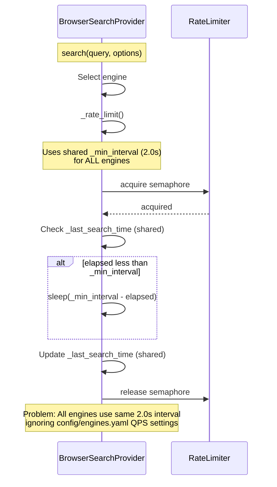
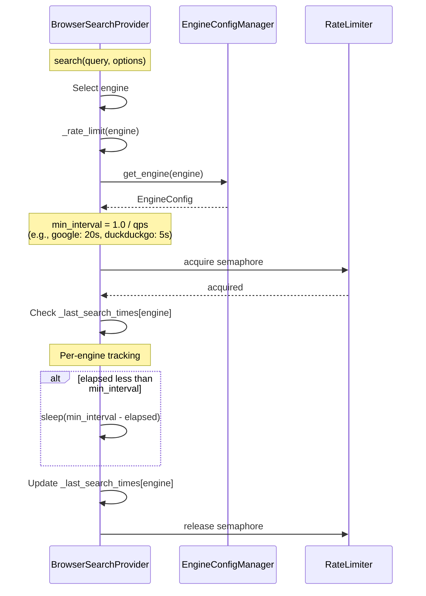

# エンジン別QPS制限フロー（問題9）

## 概要

BrowserSearchProviderでエンジン別のQPS制限を適用するフロー。
config/engines.yamlで定義されたエンジン別qps設定を使用し、各エンジンごとに適切なリクエスト間隔を適用する。

## 仕様要件

- **§3.1**: "エンジン別レート制御（並列度=1、厳格QPS）とサーキットブレーカを実装"
- **§4.3**: "エンジンQPS≤0.25（1リクエスト/4s）、ドメインQPS≤0.2、並列度=1を原則"

## デバッグ前のシーケンス図

## 問題点

1. **共通の最小間隔**: すべてのエンジンで同じ`_min_interval`(2.0秒)を使用
2. **エンジン設定のQPSが未反映**: `config/engines.yaml`で定義されたエンジン別QPS（例: DuckDuckGo=0.2, Google=0.05）が使用されていない
3. **共有の最終検索時刻**: `_last_search_time`が全エンジンで共有されている

## engines.yaml の QPS 設定

| エンジン | qps | min_interval (秒) |
|---------|-----|------------------|
| wikipedia | 0.5 | 2.0 |
| wikidata | 0.5 | 2.0 |
| mojeek | 0.25 | 4.0 |
| marginalia | 0.25 | 4.0 |
| duckduckgo | 0.2 | 5.0 |
| ecosia | 0.15 | 6.67 |
| startpage | 0.1 | 10.0 |
| brave | 0.1 | 10.0 |
| google | 0.05 | 20.0 |
| bing | 0.05 | 20.0 |

---

## デバッグ後のシーケンス図（実装完了版）

**実装状況**: ✅ 実装完了

## データ型

### 内部状態（Pydantic不要 - 内部実装のみ）

- `_last_search_times: dict[str, float]`
  - エンジン名をキー、最終検索時刻（Unix timestamp）を値とする辞書
  - 例: `{"duckduckgo": 1702800000.0, "mojeek": 1702799996.0}`

### 使用する既存データ構造

- `EngineConfig` (dataclass - `src/search/engine_config.py`)
  - `name: str` - エンジン名
  - `qps: float` - 1秒あたりのリクエスト数（0.05-0.5）
  - `min_interval: float` - 最小間隔（プロパティ、`1.0 / qps`で計算）

## 非同期処理

- `_rate_limit(engine)`: `async def` - セマフォ取得、スリープを含む
- `get_engine(engine)`: `def` - 同期関数（キャッシュ済み設定の読み込み）

## エラーハンドリング

- エンジン名がNone: デフォルト間隔（`_min_interval`）を使用
- 未知のエンジン名: デフォルト間隔にフォールバック
- 設定ファイル読み込み失敗: デフォルト間隔にフォールバック（`get_engine()`がNoneを返す場合）

---

## 実装ファイル

| ファイル | 変更内容 |
|---------|---------|
| `src/search/browser_search_provider.py` | `__init__`に`_last_search_times`追加、`_rate_limit()`拡張、`search()`で呼び出し修正 |

## 検証

- `tests/scripts/debug_engine_qps_flow.py` - デバッグ用一直線スクリプト
- `tests/test_browser_search_provider.py` - ユニットテスト
