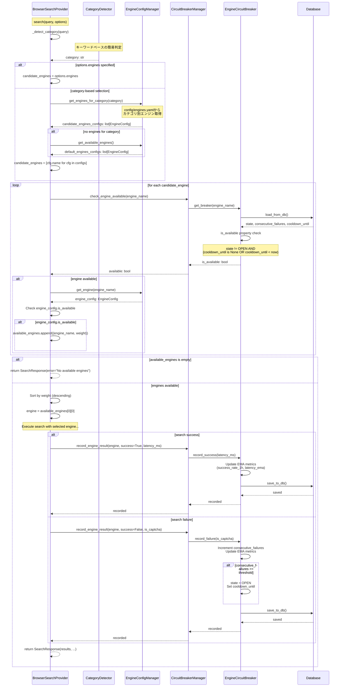

# エンジン選択フロー（問題8）

## 概要

BrowserSearchProviderで重み付け・サーキットブレーカ・カテゴリ別選択を実装するフロー。

## デバッグ前のシーケンス図

## データ型

- `category: str`
  - カテゴリ名: `"general"`, `"academic"`, `"news"`, `"government"`, `"technical"`
  - 内部実装のみ（Pydantic不要）

- `candidate_engines: list[str]`
  - エンジン名のリスト（例: `["duckduckgo", "mojeek", "marginalia"]`）
  - 内部実装のみ（Pydantic不要）

- `available_engines: list[tuple[str, float]]`
  - `(engine_name, weight)`のタプルのリスト（例: `[("duckduckgo", 0.7), ("mojeek", 0.85)]`）
  - 内部実装のみ（Pydantic不要）

- `EngineConfig` (dataclass)
  - `name: str` - エンジン名
  - `priority: int` - 優先度（1=最高）
  - `weight: float` - 重み（0.0-2.0）
  - `categories: list[str]` - カテゴリリスト
  - `qps: float` - QPS制限
  - `is_available: bool` - 利用可能フラグ（プロパティ）

- `SearchResponse` (dataclass)
  - `results: list[SearchResult]` - 検索結果
  - `query: str` - クエリ
  - `provider: str` - プロバイダー名
  - `error: str | None` - エラーメッセージ
  - `elapsed_ms: float` - 経過時間（ミリ秒）
  - モジュール間のデータ受け渡し（将来的にPydantic移行の可能性あり）

## 非同期処理

- `_detect_category()`: `def` - 同期関数（キーワードマッチング）
- `get_engines_for_category()`: `def` - 同期関数（設定ファイル読み込み）
- `check_engine_available()`: `async def` - データベースクエリ
- `record_engine_result()`: `async def` - データベース更新

## エラーハンドリング

- カテゴリ判定失敗: `"general"`をデフォルトとして使用
- カテゴリに該当エンジンなし: デフォルトエンジンリストを使用
- サーキットブレーカチェックエラー: ログ出力してスキップ、次のエンジンを試行
- 利用可能なエンジンなし: `SearchResponse(error="No available engines")`を返す
- エンジンヘルス記録エラー: ログ出力してスキップ、検索結果は正常に返す

---

## デバッグ後のシーケンス図（実装完了版）

**実装状況**: ✅ 実装完了

**変更点**:
- `BrowserSearchProvider.search()`内で`_detect_category()`を呼び出し
- `SearchEngineConfigManager.get_engines_for_category()`でカテゴリ別エンジン取得
- `check_engine_available()`でサーキットブレーカチェック
- 重み付け選択（重みの高い順）
- 検索成功/失敗/CAPTCHA時に`record_engine_result()`を呼び出し

**実装ファイル**:
- `src/search/browser_search_provider.py`: 
  - `_detect_category()`メソッド（308-370行）
  - `search()`メソッドのエンジン選択ロジック（372-420行）
  - エンジンヘルス記録（538-551行、593-604行、621-632行）

**検証**:
- ✅ `tests/test_browser_search_provider.py`にテスト追加
  - `test_category_detection()`: カテゴリ判定テスト
  - `test_engine_selection_with_category()`: カテゴリ別エンジン選択テスト
  - `test_engine_selection_with_circuit_breaker()`: サーキットブレーカ統合テスト
  - `test_engine_selection_weighted()`: 重み付け選択テスト
  - `test_engine_health_recording()`: エンジンヘルス記録テスト
  - `test_no_available_engines()`: エラーハンドリングテスト
- ✅ `tests/scripts/debug_engine_selection_flow.py`で動作確認（依存関係インストール後に実行予定）
