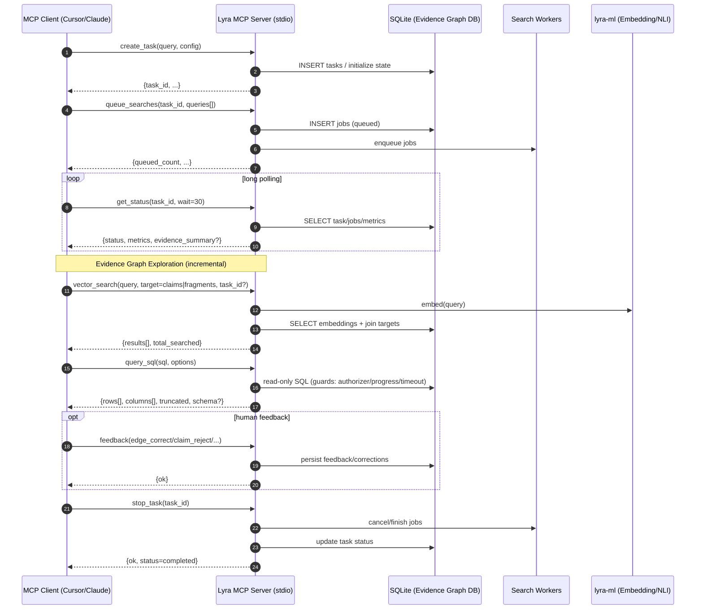

## Evidence Graph Exploration (query_sql + vector_search) — Integration Sequence

## Data contracts (shared boundaries)

- **`query_sql`**
  - Request: `{sql: str, options?: {limit, timeout_ms, max_vm_steps, include_schema}}`
  - Response: `{ok: bool, rows: object[], row_count: int, columns: str[], truncated: bool, elapsed_ms: int, schema?: {...}, error?: str}`
- **`vector_search`**
  - Request: `{query: str, target: "claims"|"fragments", task_id?: str, top_k?: int, min_similarity?: float}`
  - Response: `{ok: bool, results: [{id, similarity, text_preview?}], total_searched: int, error?: str}`

## Propagation map (checkpoints)

- **`query_sql.options.timeout_ms`**
  - Accept: `src/mcp/tools/sql.py` (`handle_query_sql`)
  - Effect: `asyncio.wait_for` timeout + SQLite progress handler deadline
  - Observable: timeout returns `ok=False` with timeout/interrupted error
- **`query_sql.options.max_vm_steps`**
  - Accept: `src/mcp/tools/sql.py`
  - Effect: SQLite progress handler interrupts when budget exceeded
  - Observable: `ok=False` with interrupted error
- **`vector_search.target/task_id`**
  - Accept: `src/mcp/tools/vector.py`
  - Forward: `src/storage/vector_store.vector_search`
  - Effect: SQL WHERE/CTE scopes target rows
  - Observable: `total_searched` and returned IDs change with task_id/target

