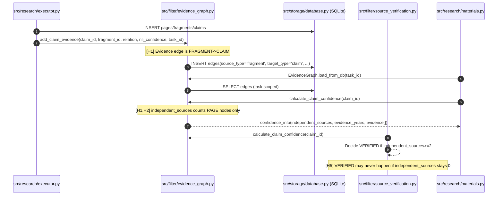

## EvidenceGraph: independent_sources 不整合（不整合 2）デバッグノート

対象: `docs/EVIDENCE_SYSTEM_CURRENT_STATUS.md` の **不整合 2**  
焦点: `EvidenceGraph.calculate_claim_confidence()` の `independent_sources` と実運用データ生成の契約不一致

---

### 仮説（3〜5本）

- **H1**: 実運用は `add_claim_evidence()` により **FRAGMENT→CLAIM** しか作らず、`calculate_claim_confidence()` は **PAGEノードのみ**を独立ソースとして数えるため `independent_sources=0` になり得る
- **H2**: PAGEノードは存在しても **CLAIMへの直接前提（predecessor）として接続されない**（例: PAGE→PAGE の CITES はあるが、PAGE→CLAIM が無い）ため、evidence収集に入らない
- **H3**: `EvidenceGraph.load_from_db(task_id=...)` のフィルタ条件により、期待する edges がロードされず evidence_count が小さく見える（wiring欠落や task_id スコープ不一致）
- **H4**: time metadata（`evidence_years`）は PAGEノードに付く前提だが、実運用パスでは year が付与されないため `evidence_years` が常に null になる
- **H5**: `SourceVerifier` は `independent_sources >= 2` を VERIFIED 条件に使うため、上記により VERIFIED が成立しない

---

### シーケンス図（実運用フローと観測点）

---

### 共有データ契約（Pydantic）

- `src/filter/schemas.py`
  - `ClaimConfidenceAssessment`
  - `EvidenceItem`
  - `EvidenceYears`

---

### 伝播（propagation）マップ

- **入口（生成）**: `src/filter/evidence_graph.py:add_claim_evidence`
  - 入力: `claim_id`, `fragment_id`, `relation`, `nli_confidence`, `task_id`
  - 永続化: `edges` テーブルに `source_type='fragment'`, `target_type='claim'`
- **変換/集計**: `src/filter/evidence_graph.py:EvidenceGraph.calculate_claim_confidence`
  - `evidence = get_all_evidence(claim_id)` は **claimへの predecessor** だけを対象
  - `independent_sources` は `node_type == 'page'` のみを unique count
- **消費（効果）**: `src/filter/source_verification.py:SourceVerifier.verify_claim`
  - `independent_sources >= 2` → VERIFIED 判定の条件
- **外部露出**: `src/research/materials.py:get_materials_action`（claims 内の `evidence_years`/`evidence`）

---

### デバッグスクリプト

- `tests/scripts/debug_evidencegraph_independent_sources_flow.py`
  - isolated DB を使い、2ページ/2フラグメント/1クレームを作成
  - 実運用と同様に **FRAGMENT→CLAIM** の edge を作って `independent_sources` を観測

