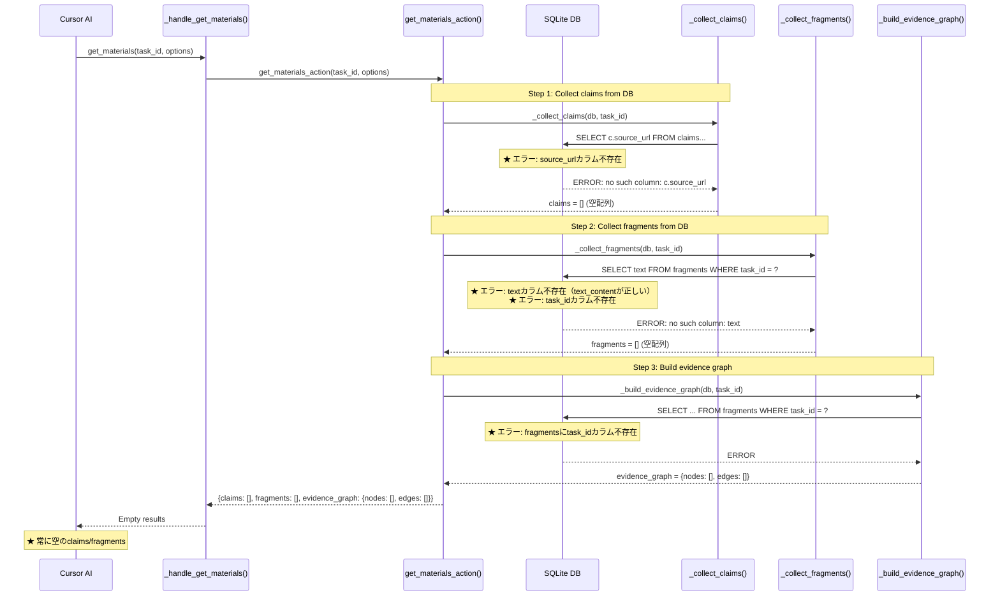
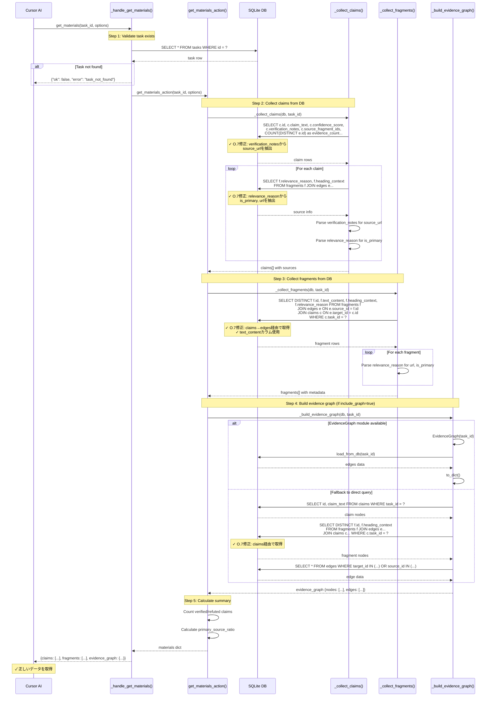

# get_materialsフロー（問題3: エビデンスグラフ構築）

## 概要

MCPツール`get_materials`がCursor AIから呼び出された際の、claims/fragments/evidence_graphを取得するフロー。

## 仕様要件

- **§3.2.1**: `get_materials(task_id, options?)` → 調査成果物の取得
- **§3.4**: エビデンスグラフ - claims↔fragments↔pagesの関連付け

## 期待される出力スキーマ

```json
{
  "ok": true,
  "task_id": "task_abc123",
  "query": "元の問い",
  "claims": [
      {
        "id": "c_001",
        "text": "主張テキスト",
        "confidence": 0.92,
        "uncertainty": 0.12,
        "controversy": 0.08,
        "evidence_count": 3,
        "has_refutation": false,
        "sources": [
          {"url": "https://...", "title": "...", "is_primary": true}
        ]
      }
  ],
  "fragments": [
    {
      "id": "f_001",
      "text": "引用可能なテキスト断片",
      "source_url": "https://...",
      "context": "見出し > サブ見出し"
    }
  ],
  "evidence_graph": {
    "nodes": [...],
    "edges": [...]
  },
  "summary": {
    "total_claims": 18,
    "verified_claims": 12,
    "refuted_claims": 2,
    "primary_source_ratio": 0.65
  }
}
```

## デバッグ前のシーケンス図



### 問題点

1. **_collect_claims() SQLエラー**: `c.source_url`カラムが存在しない（`verification_notes`に格納されている）
2. **_collect_fragments() SQLエラー**: 
   - `text`カラムが存在しない（`text_content`が正しい）
   - `task_id`カラムが存在しない（fragments → edges → claimsで辿る必要あり）
3. **_build_evidence_graph() SQLエラー**: 同様に`task_id`問題

---

## デバッグ後のシーケンス図（実装完了版）

**実装状況**: ✅ 実装完了・動作確認済み

**変更点**:
- `_collect_claims()`: `verification_notes`からsource_urlを抽出、`relevance_reason`からメタデータを抽出
- `_collect_fragments()`: `text_content`カラムを使用、claims→edges経由でfragmentsを取得
- `_build_evidence_graph()`: fallbackクエリをclaims→edges経由に変更



## 修正内容

### 1. _collect_claims() の修正

```python
# Before (問題あり)
rows = await db.fetch_all(
    """SELECT c.id, c.claim_text, c.confidence_score, c.source_url, ...
    FROM claims c WHERE c.task_id = ?"""
)
# ★ source_urlカラムが存在しない

# After (O.7修正)
rows = await db.fetch_all(
    """SELECT c.id, c.claim_text, c.confidence_score, 
       c.verification_notes, c.source_fragment_ids, ...
    FROM claims c WHERE c.task_id = ?"""
)
# verification_notesからsource_urlを抽出
if "source_url=" in verification_notes:
    source_url = verification_notes.split("source_url=")[1].split(";")[0]
```

### 2. _collect_fragments() の修正

```python
# Before (問題あり)
rows = await db.fetch_all(
    """SELECT id, text, source_url, title, ...
    FROM fragments WHERE task_id = ?"""
)
# ★ text → text_content, task_idカラム不存在

# After (O.7修正)
rows = await db.fetch_all(
    """SELECT DISTINCT f.id, f.text_content, f.heading_context, f.relevance_reason
    FROM fragments f
    JOIN edges e ON e.source_id = f.id AND e.source_type = 'fragment'
    JOIN claims c ON e.target_id = c.id AND e.target_type = 'claim'
    WHERE c.task_id = ?"""
)
# relevance_reasonからurl, is_primaryを抽出
```

### 3. _build_evidence_graph() の修正

```python
# Before (問題あり)
fragment_rows = await db.fetch_all(
    "SELECT id, 'fragment' as type, source_url as label FROM fragments WHERE task_id = ?",
)
# ★ fragmentsにtask_idカラム不存在

# After (O.7修正)
fragment_rows = await db.fetch_all(
    """SELECT DISTINCT f.id, 'fragment' as type, f.heading_context as label
    FROM fragments f
    JOIN edges e ON e.source_id = f.id AND e.source_type = 'fragment'
    JOIN claims c ON e.target_id = c.id AND e.target_type = 'claim'
    WHERE c.task_id = ?"""
)
```

## 検証スクリプト

`tests/scripts/debug_get_materials_flow.py`

## 関連ファイル

| ファイル | 行番号 | 役割 |
|----------|--------|------|
| `src/mcp/server.py` | L930-968 | MCPハンドラ |
| `src/research/materials.py` | L18-89 | get_materials_action |
| `src/research/materials.py` | L92-160 | _collect_claims (O.7修正) |
| `src/research/materials.py` | L163-216 | _collect_fragments (O.7修正) |
| `src/research/materials.py` | L219-290 | _build_evidence_graph (O.7修正) |
