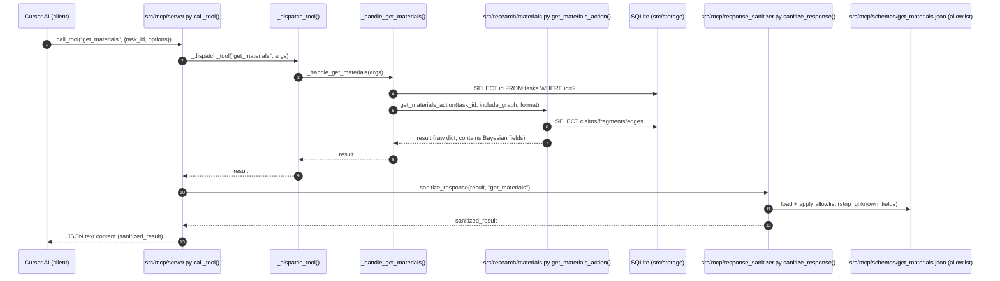

## get_materials: MCP (call_tool) → L7 Sanitization → Client contract

### Propagation map（フィールド: `uncertainty/controversy/evidence/evidence_years`）

- **Source (origin)**: `src/filter/evidence_graph.py:EvidenceGraph.calculate_claim_confidence()`
- **Assembly (pack into claims)**: `src/research/materials.py:_collect_claims()`
  - `claims[i].uncertainty`
  - `claims[i].controversy`
  - `claims[i].evidence`
  - `claims[i].evidence_years`
- **MCP handler boundary**: `src/mcp/server.py:_handle_get_materials()` → returns raw dict
- **L7 allowlist boundary (must allow!)**: `src/mcp/response_sanitizer.py:_strip_unknown_fields()` with schema `src/mcp/schemas/get_materials.json`
- **Client sink**: Cursor AI receives JSON (post-L7) and uses fields for ranking/temporal judgments

### Verification (tests)

- `tests/test_mcp_integration.py`
  - `TestGetMaterialsIntegration::test_get_materials_call_tool_preserves_bayesian_fields`
  - `TestGetMaterialsIntegration::test_get_materials_l7_strips_unknown_claim_fields_but_keeps_allowed`

