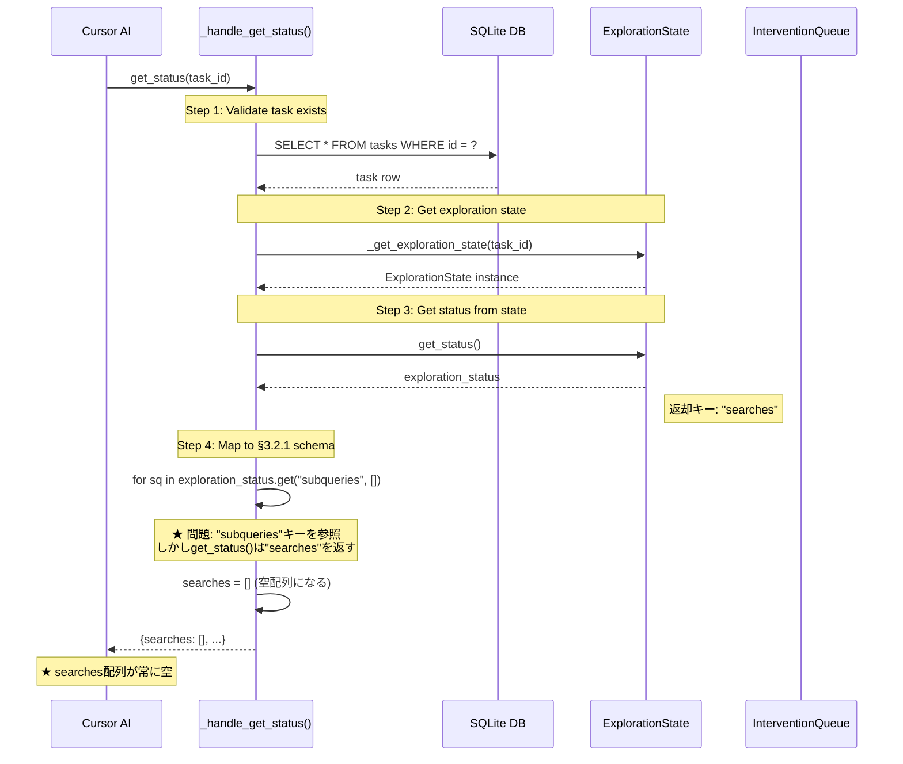
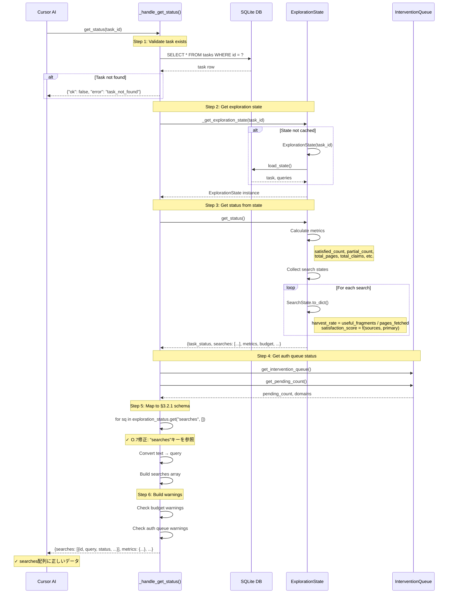

# get_statusフロー（問題2: メトリクス計算）

## 概要

MCPツール`get_status`がCursor AIから呼び出された際の、タスク状態とメトリクスを取得するフロー。

## 仕様要件

- **§3.2.1**: `get_status(task_id)` → タスクの現在状態を取得
- **§3.1.7.2-3**: 収穫率、満足度スコア、新規性スコアの計算

## 期待される出力スキーマ

```json
{
  "ok": true,
  "task_id": "task_abc123",
  "status": "exploring|paused|completed|failed",
  "query": "元の問い",
  "searches": [
    {
      "id": "s_001",
      "query": "検索クエリ",
      "status": "satisfied|partial|exhausted|running",
      "pages_fetched": 15,
      "useful_fragments": 8,
      "harvest_rate": 0.53,
      "satisfaction_score": 0.85,
      "has_primary_source": true
    }
  ],
  "metrics": {
    "total_searches": 5,
    "satisfied_count": 3,
    "total_pages": 78,
    "total_fragments": 124,
    "total_claims": 15,
    "elapsed_seconds": 480
  },
  "budget": {...},
  "auth_queue": {...},
  "warnings": [...]
}
```

## デバッグ前のシーケンス図



### 問題点

1. **キー名の不整合**: `ExplorationState.get_status()`は`"searches"`キーを返すが、`_handle_get_status()`は古い`"subqueries"`キーを参照 → searches配列が常に空

---

## デバッグ後のシーケンス図（実装完了版）

**実装状況**: ✅ 実装完了・動作確認済み

**変更点**:
- `_handle_get_status()`のキー参照を`"subqueries"`から`"searches"`に修正



## データ型

### ExplorationStatus (from state.get_status())

```python
{
    "task_id": str,
    "task_status": str,  # TaskStatus enum value
    "searches": [  # ★ キー名は "searches"
        {
            "id": str,
            "text": str,  # Note: renamed to "query" in MCP output
            "status": str,
            "pages_fetched": int,
            "useful_fragments": int,
            "harvest_rate": float,
            "satisfaction_score": float,
            "has_primary_source": bool,
        }
    ],
    "metrics": {
        "satisfied_count": int,
        "partial_count": int,
        "pending_count": int,
        "exhausted_count": int,
        "total_pages": int,
        "total_fragments": int,
        "total_claims": int,
        "elapsed_seconds": int,
    },
    "budget": {
        "pages_used": int,
        "pages_limit": int,
        "time_used_seconds": int,
        "time_limit_seconds": int,
    },
}
```

## 修正内容

### src/mcp/server.py L574

```python
# Before (問題あり)
for sq in exploration_status.get("subqueries", []):  # ← 存在しないキー
    searches.append({...})

# After (O.7修正)
for sq in exploration_status.get("searches", []):  # ← 正しいキー
    searches.append({
        "id": sq.get("id"),
        "query": sq.get("text"),  # text → query にリネーム
        "status": sq.get("status"),
        "pages_fetched": sq.get("pages_fetched", 0),
        "useful_fragments": sq.get("useful_fragments", 0),
        "harvest_rate": sq.get("harvest_rate", 0.0),
        "satisfaction_score": sq.get("satisfaction_score", 0.0),
        "has_primary_source": sq.get("has_primary_source", False),
    })
```

## 検証スクリプト

`tests/scripts/debug_get_status_flow.py`

## 関連ファイル

| ファイル | 行番号 | 役割 |
|----------|--------|------|
| `src/mcp/server.py` | L523-659 | MCPハンドラ |
| `src/mcp/server.py` | L574 | ★ 修正箇所（キー名） |
| `src/research/state.py` | get_status() | 状態取得 |
| `src/research/state.py` | SearchState | 検索状態 |
