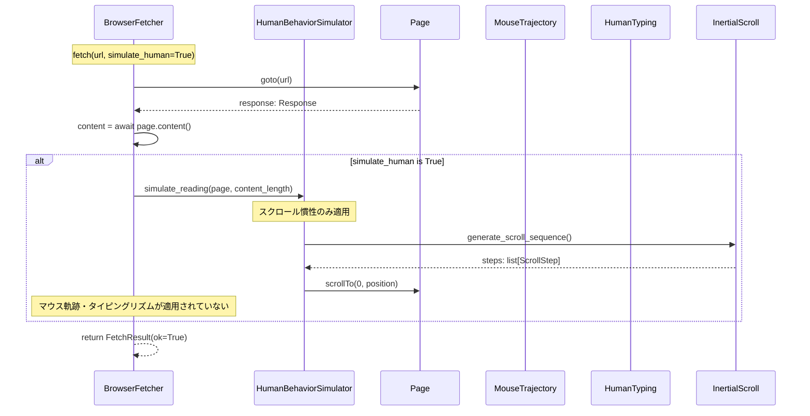
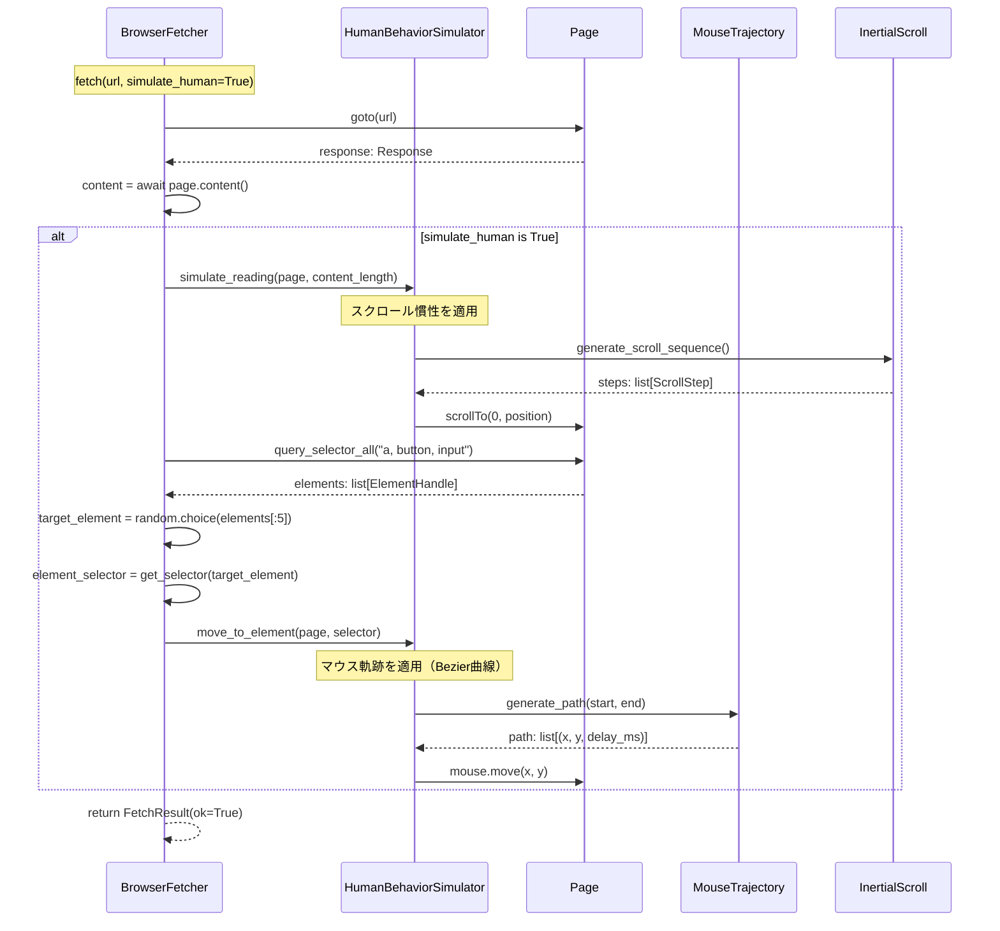
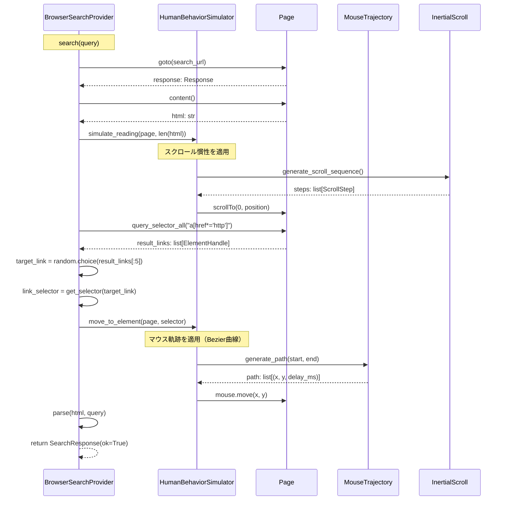

# ヒューマンライク操作の完全な適用フロー（問題15）

## 概要

ページナビゲーション時にマウス軌跡、タイピングリズム、スクロール慣性を完全に適用するフロー。

## デバッグ前のシーケンス図

## データ型

### HumanBehaviorSimulator

- `_mouse: MouseTrajectory` - マウス軌跡生成器
- `_typing: HumanTyping` - タイピングリズム生成器
- `_scroll: InertialScroll` - スクロール慣性生成器

### メソッド

- `move_mouse(page, start: tuple[float, float], end: tuple[float, float]) -> None`
  - マウスを開始位置から終了位置へ移動（Bezier曲線軌跡）
  
- `move_to_element(page, selector: str) -> bool`
  - 要素にマウスを移動（要素の位置を取得してから移動）
  
- `type_text(page, text: str, selector: str | None = None) -> None`
  - テキストをタイピング（ガウス分布ベースの遅延、句読点後の長い間、稀なタイポ模倣）
  
- `scroll_page(page, amount: int | None = None, direction: int = 1) -> None`
  - ページをスクロール（慣性付きスクロール、easing関数による自然な減速）
  
- `read_page(page, max_scrolls: int = 5) -> None`
  - ページ読み込みシミュレーション（スクロール慣性を適用）

## 非同期処理

- `move_mouse()`: `async def` - Playwright API呼び出し
- `move_to_element()`: `async def` - 要素検索とマウス移動
- `type_text()`: `async def` - キーボードイベント送信
- `scroll_page()`: `async def` - スクロール実行
- `read_page()`: `async def` - ページ読み込みシミュレーション

## エラーハンドリング

- マウス移動エラー: ログ出力してスキップ、通常フロー継続
- タイピングエラー: ログ出力してスキップ、通常フロー継続
- スクロールエラー: ログ出力してスキップ、通常フロー継続
- 要素が見つからない場合: スキップして次の操作へ

## 実装方針

### BrowserFetcher.fetch()

1. **ページナビゲーション後**:
   - スクロール慣性を適用（既存の`simulate_reading()`を使用）
   - ページ内の主要要素（リンク、ボタン）にマウスを移動
   - 検索フォームや入力欄がある場合、タイピングリズムを適用

2. **マウス軌跡の適用**:
   - ページ内の主要リンクやボタンを検索（`query_selector_all("a, button, input")`）
   - 最初の5つからランダムに選択
   - `move_to_element()`で要素にマウスを移動

3. **タイピングリズムの適用**:
   - 検索フォームや入力欄がある場合のみ適用
   - 現在の`fetch()`では通常は不要（検索フォームがないため）

### BrowserSearchProvider.search()

1. **検索実行時**:
   - 検索フォームにクエリを入力する際にタイピングリズムを適用
   - 検索結果ページでスクロール慣性を適用
   - 検索結果のリンクにマウスを移動

2. **検索フォーム入力**:
   - `type_text()`でクエリを入力（ガウス分布ベースの遅延）
   - 句読点後の長い間、稀なタイポ模倣

3. **検索結果ページ**:
   - `read_page()`でスクロール慣性を適用
   - 検索結果のリンクにマウスを移動

---

## デバッグ後のシーケンス図（実装完了版）

**実装状況**: ✅ 実装完了

**変更点**:
- `BrowserFetcher.fetch()`内で、`simulate_reading()`後にマウス軌跡を適用
- ページ内の主要要素（リンク、ボタン、入力欄）を検索し、ランダムに選択してマウスを移動
- `BrowserSearchProvider.search()`内で、検索結果ページにスクロール慣性とマウス軌跡を適用

### BrowserSearchProvider.search()のフロー

**実装ファイル**:
- `src/crawler/fetcher.py`: `BrowserFetcher.fetch()` (1360-1382行)
- `src/search/browser_search_provider.py`: `BrowserSearchProvider.search()` (385-410行)

**検証**:
- ✅ `tests/scripts/debug_human_behavior_flow.py`で動作確認可能

**注意点**:
- マウス移動エラーは非ブロッキング（ログ出力してスキップ）
- 要素が見つからない場合はスキップして次の操作へ
- タイピングリズムは検索フォームがある場合のみ適用（現在の実装では通常は不要）
