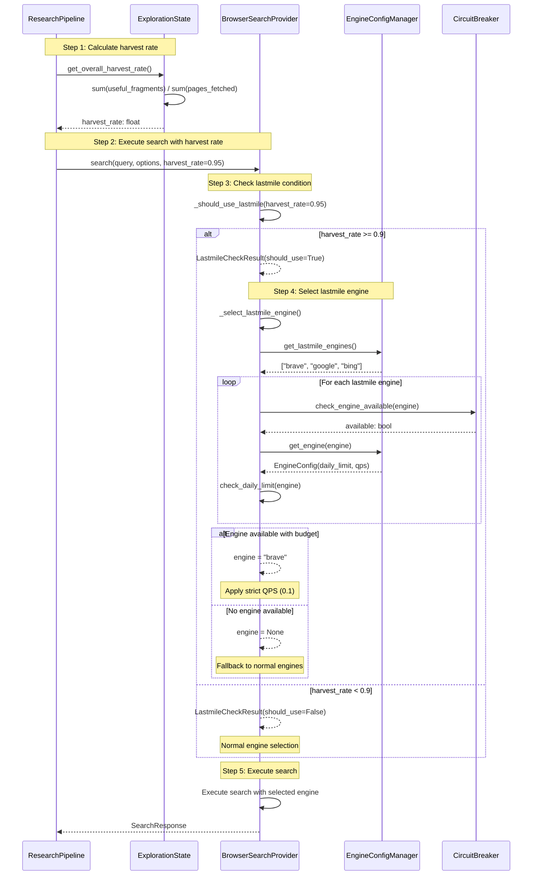

# Lastmile Slot Selection Flow

## Overview

This document describes the lastmile slot selection flow per §3.1.1:
"ラストマイル・スロット: 回収率の最後の10%を狙う限定枠としてGoogle/Braveを最小限開放（厳格なQPS・回数・時間帯制御）"

## Trigger Condition

Lastmile engines are selected when:
1. Overall harvest rate >= 0.9 (90%)
2. Normal engines have exhausted their utility
3. The task requires the final 10% of results

## Lastmile Engines (from config/engines.yaml)

- `brave`: daily_limit=50, qps=0.1
- `google`: daily_limit=10, qps=0.05
- `bing`: daily_limit=10, qps=0.05

## Sequence Diagram



## Data Flow

### Input
- `query: str` - Search query
- `options: SearchOptions` - Search options
- `harvest_rate: float | None` - Current harvest rate (0.0-1.0)

### Output
- `SearchResponse` with results from lastmile or normal engine

## Decision Logic

```python
def _should_use_lastmile(harvest_rate: float, threshold: float = 0.9) -> LastmileCheckResult:
    """
    Check if lastmile engine should be used.
    
    Per §3.1.1: Use lastmile for "回収率の最後の10%"
    """
    if harvest_rate >= threshold:
        return LastmileCheckResult(
            should_use_lastmile=True,
            reason=f"Harvest rate {harvest_rate:.2f} >= threshold {threshold}",
            harvest_rate=harvest_rate,
            threshold=threshold,
        )
    return LastmileCheckResult(
        should_use_lastmile=False,
        reason=f"Harvest rate {harvest_rate:.2f} < threshold {threshold}",
        harvest_rate=harvest_rate,
        threshold=threshold,
    )
```

## Strict Controls for Lastmile Engines

1. **Daily Limit**: Each lastmile engine has `daily_limit` in config
2. **QPS Limit**: Stricter than normal engines (google: 0.05, brave: 0.1)
3. **Circuit Breaker**: Same rules apply (consecutive failures trigger open state)

## Usage Counter Schema

```sql
-- Track daily usage of lastmile engines
CREATE TABLE IF NOT EXISTS lastmile_usage (
    id INTEGER PRIMARY KEY,
    engine TEXT NOT NULL,
    date TEXT NOT NULL,  -- YYYY-MM-DD
    usage_count INTEGER DEFAULT 0,
    UNIQUE(engine, date)
);
```

## Test Cases

| Case | Harvest Rate | Threshold | Expected | Notes |
|------|-------------|-----------|----------|-------|
| TC-LM-N-01 | 0.95 | 0.9 | Use lastmile | Above threshold |
| TC-LM-N-02 | 0.5 | 0.9 | Normal engines | Below threshold |
| TC-LM-B-01 | 0.9 | 0.9 | Use lastmile | Exact threshold |
| TC-LM-B-02 | 0.89 | 0.9 | Normal engines | Just below |
| TC-LM-B-03 | 0.0 | 0.9 | Normal engines | Zero rate |
| TC-LM-B-04 | 1.0 | 0.9 | Use lastmile | Max rate |

## Related Files

- `src/search/browser_search_provider.py`: Lastmile selection logic
- `src/research/state.py`: `get_overall_harvest_rate()` method
- `src/utils/schemas.py`: `LastmileCheckResult` model
- `config/engines.yaml`: Lastmile engine definitions
