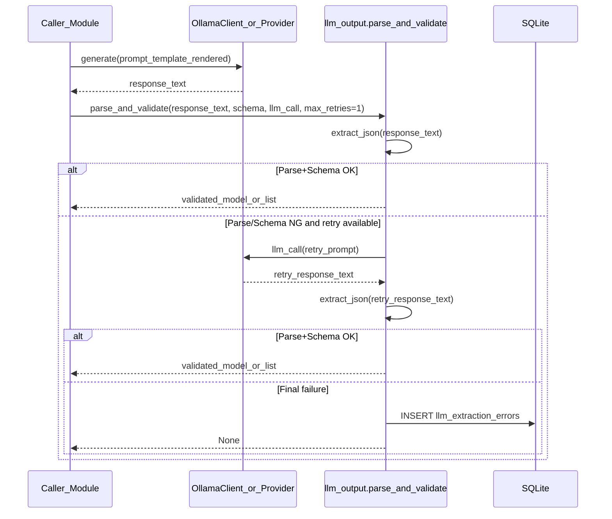

## LLM Output Type Safety (Phase 2)

This sequence describes how Lyra parses and validates structured LLM outputs with a single retry and DB error recording.

```mermaid
sequenceDiagram
    participant Caller as Caller_Module
    participant LLM as OllamaClient_or_Provider
    participant OUT as llm_output.parse_and_validate
    participant DB as SQLite

    Caller->>LLM: generate(prompt_template_rendered)
    LLM-->>Caller: response_text

    Caller->>OUT: parse_and_validate(response_text, schema, llm_call, max_retries=1)
    OUT->>OUT: extract_json(response_text)

    alt Parse+Schema OK
        OUT-->>Caller: validated_model_or_list
    else Parse/Schema NG and retry available
        OUT->>LLM: llm_call(retry_prompt)
        LLM-->>OUT: retry_response_text
        OUT->>OUT: extract_json(retry_response_text)
        alt Parse+Schema OK
            OUT-->>Caller: validated_model_or_list
        else Final failure
            OUT->>DB: INSERT llm_extraction_errors
            OUT-->>Caller: None
        end
    end
```

