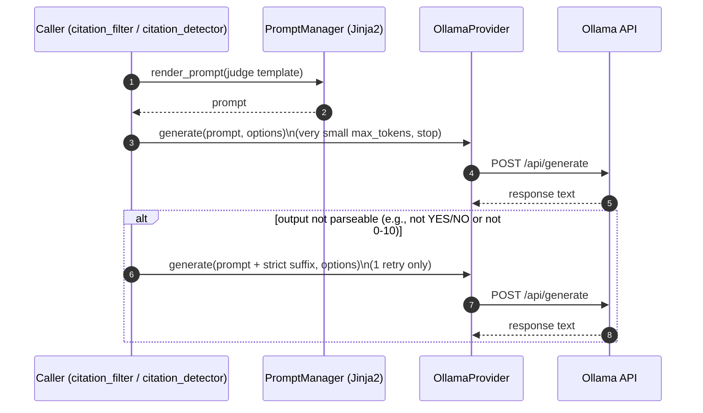

## LLM response_format + Retry propagation (Integration)

```mermaid
sequenceDiagram
  autonumber
  participant Caller as Caller (e.g., llm_extract / CoD / quality_analyzer)
  participant PM as PromptManager (Jinja2)
  participant Opt as LLMOptions (dataclass)
  participant Prov as OllamaProvider
  participant Ollama as Ollama API (/api/generate)
  participant Parse as parse_and_validate()
  participant DB as SQLite (llm_extraction_errors)

  Caller->>PM: render_prompt(template, vars)
  PM-->>Caller: prompt (string)
  Caller->>Opt: build options\n(response_format="json", stop, temperature, max_tokens)
  Caller->>Prov: generate(prompt, options)
  Prov->>Ollama: POST /api/generate\n{ model, prompt, format?, options{...} }
  alt server rejects format (non-200)
    Ollama-->>Prov: HTTP error (e.g., 400 "unknown field: format")
    Prov->>Ollama: Retry once without "format"
    Ollama-->>Prov: 200 {response: "..."}
  else ok
    Ollama-->>Prov: 200 {response: "..."}
  end
  Prov-->>Caller: LLMResponse.text

  alt structured output expected
    Caller->>Parse: parse_and_validate(response_text, schema, max_retries=1, llm_call)
    alt parse/validation fails and llm_call exists
      Parse->>Ollama: Retry call (format-fix prompt)
      Ollama-->>Parse: new response text
    end
    alt final failure
      Parse->>DB: INSERT llm_extraction_errors\n(retry_count = retries_attempted)
    else success
      Parse-->>Caller: validated Pydantic model(s)
    end
  end
```




