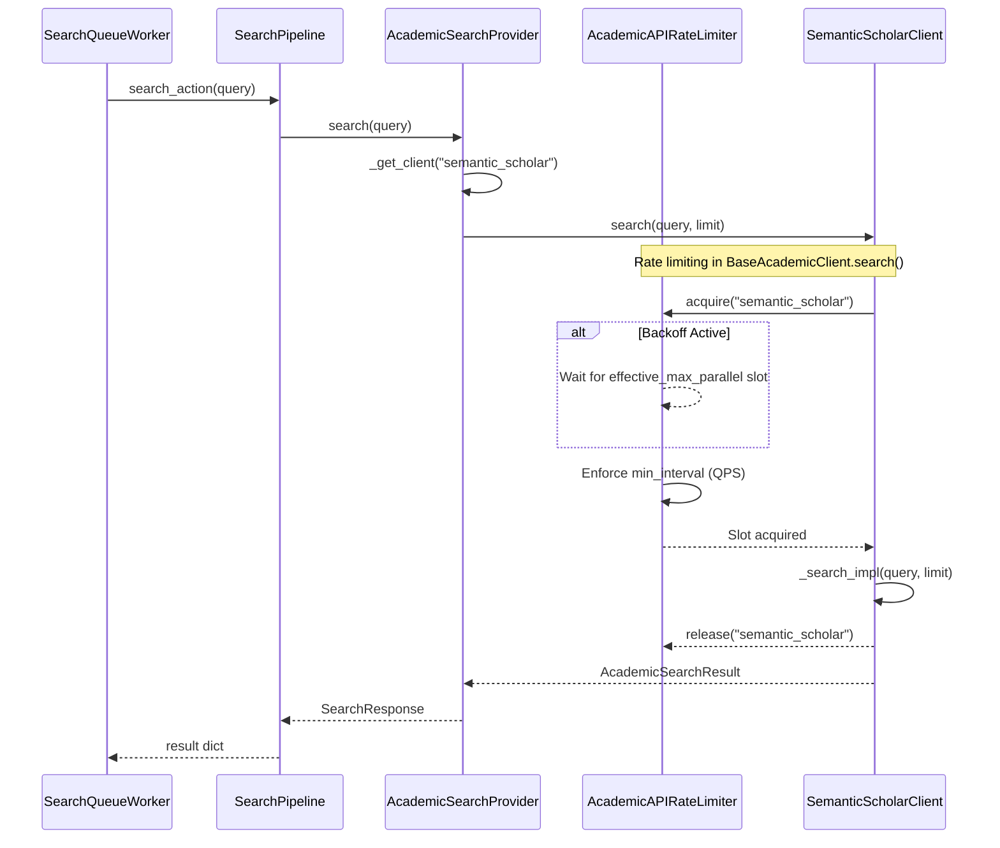
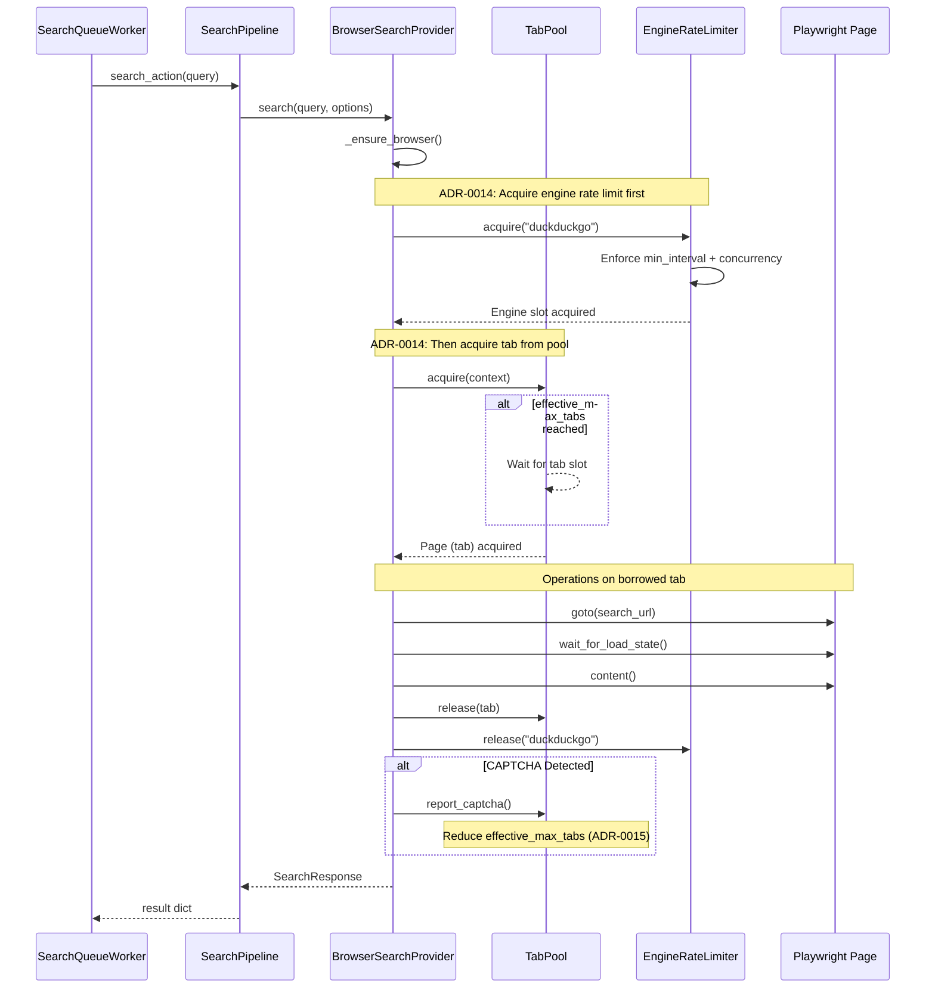
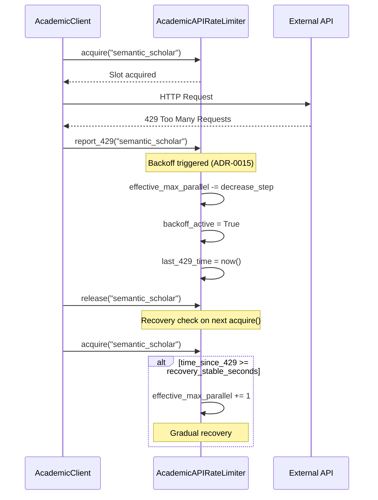
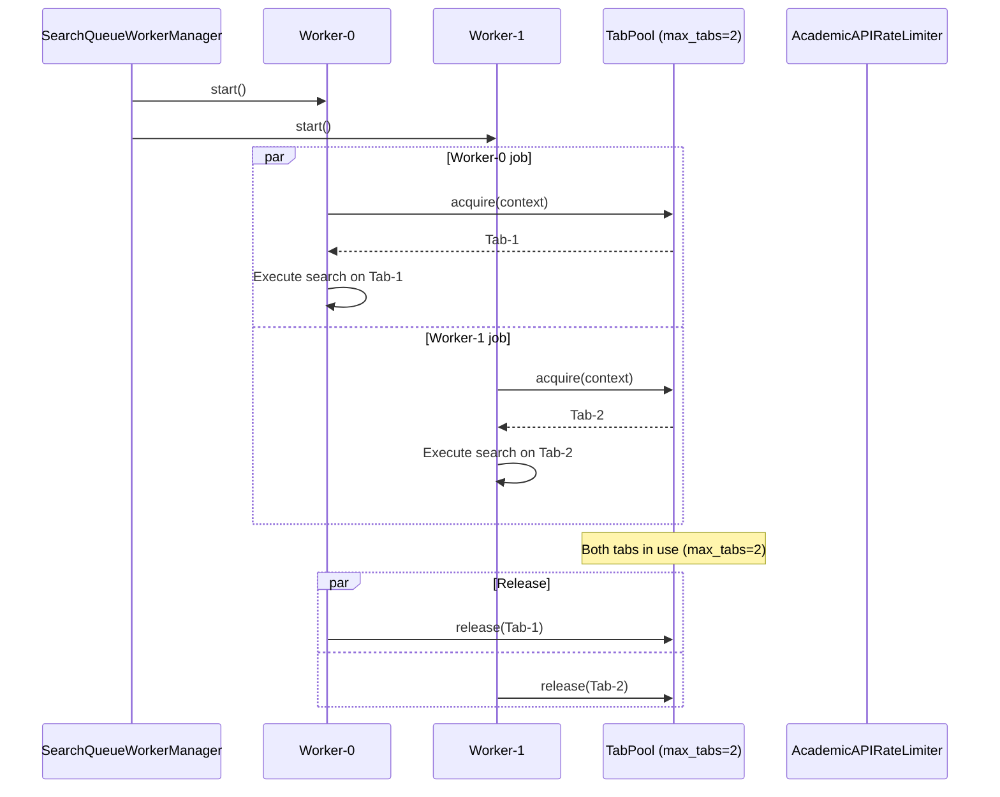

# Phase 4: Search Resource Control - Sequence Diagram

> **Related ADRs**: 
> - ADR-0013: Worker Resource Contention Control (Academic APIs)
> - ADR-0014: Browser SERP Resource Control (TabPool)
> - ADR-0015: Adaptive Concurrency Control (Auto-Backoff)

## Overview

Phase 4 implements resource control for parallel search execution:
1. **AcademicAPIRateLimiter**: Global QPS/concurrency limits for academic APIs
2. **TabPool**: Browser tab management to prevent Page sharing
3. **EngineRateLimiter**: Per-engine QPS/concurrency limits for browser SERP
4. **Auto-Backoff**: Automatic concurrency reduction on errors (429, CAPTCHA, 403)

## Propagation Map

### Concurrency Settings Flow

| Boundary | Parameter | Source | Sink |
|----------|-----------|--------|------|
| Config → Worker | `concurrency.search_queue.num_workers` | `config/settings.yaml` | `SearchQueueWorkerManager.start()` |
| Config → TabPool | `concurrency.browser_serp.max_tabs` | `config/settings.yaml` | `TabPool.__init__()` |
| Config → Backoff | `concurrency.backoff.academic_api.*` | `config/settings.yaml` | `AcademicAPIRateLimiter.report_429()` |
| Config → Backoff | `concurrency.backoff.browser_serp.*` | `config/settings.yaml` | `TabPool.report_captcha()` |

### Academic API Rate Limit Flow

| Boundary | Parameter | Source | Sink |
|----------|-----------|--------|------|
| Config → Limiter | `rate_limit.min_interval_seconds` | `config/academic_apis.yaml` | `AcademicAPIRateLimiter.acquire()` |
| Config → Limiter | `rate_limit.max_parallel` | `config/academic_apis.yaml` | `AcademicAPIRateLimiter.acquire()` |
| Limiter → Client | acquire/release | `BaseAcademicClient.search()` | `SemanticScholarClient._search_impl()` |

### Browser SERP Resource Flow

| Boundary | Parameter | Source | Sink |
|----------|-----------|--------|------|
| Config → Engine | `min_interval`, `concurrency` | `config/engines.yaml` | `EngineRateLimiter._get_engine_config()` |
| Pool → Provider | `TabPool.acquire()` | `BrowserSearchProvider.search()` | Playwright `Page` operations |

## Sequence Diagrams

### 1. Academic API Search with Rate Limiting



### 2. Browser SERP Search with TabPool



### 3. Auto-Backoff on 429 Error



### 4. Parallel Workers with Resource Control



## Integration Points

### Config-Driven Concurrency (ADR-0015)

```yaml
# config/settings.yaml
concurrency:
  search_queue:
    num_workers: 2        # Loaded by SearchQueueWorkerManager
  browser_serp:
    max_tabs: 2           # Loaded by get_tab_pool()
  backoff:
    academic_api:
      recovery_stable_seconds: 60
      decrease_step: 1
    browser_serp:
      decrease_step: 1
```

### Code Integration Points

| Component | File | Integration |
|-----------|------|-------------|
| Worker Manager | `src/scheduler/search_worker.py` | Reads `num_workers` from config |
| TabPool | `src/search/tab_pool.py` | Reads `max_tabs` from config |
| Academic Rate Limiter | `src/search/apis/rate_limiter.py` | Reads from `config/academic_apis.yaml` |
| Engine Rate Limiter | `src/search/tab_pool.py` | Reads from `config/engines.yaml` |
| Browser Provider | `src/search/browser_search_provider.py` | Uses TabPool + EngineRateLimiter |
| Academic Provider | `src/search/academic_provider.py` | Uses AcademicAPIRateLimiter (via base class) |

## Verification Checklist

- [x] Config loaded correctly (`get_settings().concurrency`)
- [x] Worker count matches config
- [x] TabPool max_tabs matches config
- [x] Academic API rate limiting enforced
- [x] Browser SERP uses TabPool (not shared page)
- [x] Auto-backoff triggers on 429/CAPTCHA/403
- [x] Recovery works after stable period

## Related Files

- `tests/test_tab_pool.py` - TabPool unit tests
- `tests/test_concurrency_config.py` - Concurrency config tests
- `tests/test_concurrency_wiring.py` - Concurrency wiring tests
- `docs/adr/0013-worker-resource-contention.md`
- `docs/adr/0014-browser-serp-resource-control.md`
- `docs/adr/0015-adaptive-concurrency-control.md`

